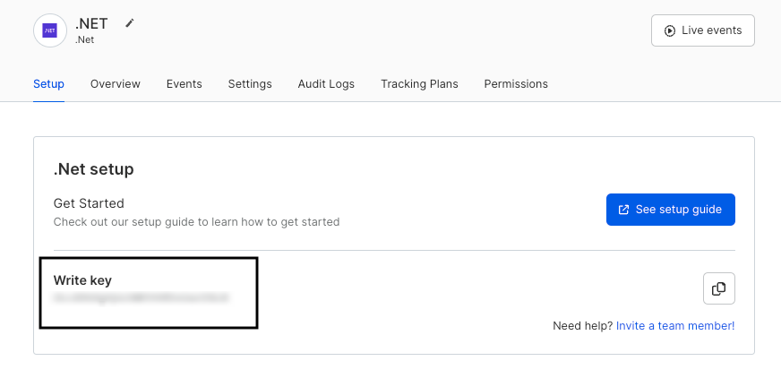

RudderStack's .NET SDK lets you track your customer event data from your .NET applications and send it to your specified destinations via RudderStack.

<div class="infoBlock">
Refer to the SDK's <a href="https://github.com/rudderlabs/rudder-sdk-.net">GitHub codebase</a> for the implementation-specific details.
</div>

<GhBadge
  url={'https://www.nuget.org/packages/RudderAnalytics/'}
  repo={'nuget/v/RudderAnalytics'}
  style={'flat'}
/>

## SDK setup requirements

1. Sign up to [RudderStack Cloud](https://app.rudderstack.com/signup).
2. <Link to="/dashboard-guides/sources/#adding-a-source">Set up a .NET source</Link> in your dashboard. You should be able to see a <strong>write key</strong> for this source, as shown:



You will also need a data plane URL. Refer to the <Link to="/dashboard-guides/overview/#data-plane-url">Dashboard Overview</Link> guide for more information on the data plane URL and where to find it.

## Installing the .NET SDK

You can use [NuGet](https://docs.microsoft.com/en-us/nuget/consume-packages/install-use-packages-powershell) to install the .NET SDK into your project.

```csharp
Install-Package RudderAnalytics -Version 2.0.0
```

<div class="infoBlock">
The SDK uses the <a href="https://www.newtonsoft.com/json">Newton.JSON</a> library for JSON processing.
</div>

## Initializing the SDK

To initialize the SDK, run the following code snippet:

```csharp
using RudderStack;

RudderAnalytics.Initialize(
    WRITE_KEY,
    new RudderConfig(dataPlaneUrl: DATA_PLANE_URL)
);
```

## Gzipping requests

<div class="successBlock">
The Gzip feature is enabled by default in the .NET SDK from version `2.0.0`.
</div>

The .NET SDK automatically gzips requests. However, you can disable this by setting the `gzip` parameter of `RudderConfig` to `false` while initializing the SDK, as shown:

```csharp
using RudderStack;

RudderAnalytics.Initialize(
    WRITE_KEY,
    new RudderConfig(dataPlaneUrl: DATA_PLANE_URL, gzip: false)
);
```

<div class="warningBlock">
Gzip requires <a href="https://github.com/rudderlabs/rudder-server">rudder-server</a> <strong>v1.4 or higher</strong>. Otherwise, your events might fail.
</div>

## Sending events

<div class="warningBlock">
<strong>RudderStack does not store or persist the user state in any of the server-side SDKs</strong>. <br /><br />Unlike the client-side SDKs that deal with only a single user at a given time, the server-side SDKs deal with multiple users simultaneously. Therefore, you must specify either the <code class="inline-code">userId</code> or <code class="inline-code">anonymousId</code> <strong>every time</strong> while making any API calls supported by the .NET SDK.
</div>

## Identify

The <Link to="/event-spec/standard-events/identify/">`identify`</Link> call lets you identify a visiting user and associate them to their actions. It also lets you record the traits about them like their name, email address, etc.

A sample `identify` call made using the .NET SDK is shown below:

```csharp
RudderAnalytics.Client.Identify(
    "1hKOmRA4GRlm",
    new Dictionary<string, object> { {"subscription", "inactive"}, }
);
```

The `identify` method parameters are as described below:

| **Field**      | **Type** |  **Description**     |
| :------------- | :------- |  :---------------- |
| `userId` <br/> <span style="color: #4D4DFF;font-size:12px;">Required, if <strong>anonymousId</strong> is absent.</span>     | String   | Unique identifier for a user in your database.      |
| `traits`       | Object   | An optional dictionary of the user's traits like `name` or `email`.     |
| `options`   | Object   |  Object containing `anonymousId`, `integrations`, `timestamp`, and `context`. |

<div class="infoBlock">
Refer to the <a href="#options-parameter">options parameter</a> section below for more information on the <code class="inline-code">options</code> object and its fields.
</div>

## Track

The <Link to="/event-spec/standard-events/track/">`track`</Link> call lets you record the user actions along with their associated properties. Each user action is called an **event**.

A sample `track` call is shown below:

```csharp
RudderAnalytics.Client.Track(
    "1hKOmRA4GRlm",
    "CTA Clicked",
    new Dictionary<string, object> {  {"plan", "premium"}, }
);
```

The `track` method parameters are as described below:

| **Field**      | **Type** |  **Description**     |
| :------------- | :------- |  :---------------- |
| `userId` <br/> <span style="color: #4D4DFF;font-size:12px;">Required, if <strong>anonymousId</strong> is absent.</span>     | String   | Unique identifier for a user in your database.      |
| `event`  <br/> <span style="color: #4D4DFF;font-size:12px;">Required</span>      | String | Name of the event.           |
| `properties`   | Object | An optional dictionary of the properties associated with the event.   |
| `options`   | Object   |  Object containing `anonymousId`, `integrations`, `timestamp`, and `context`. |

<div class="infoBlock">
Refer to the <a href="#options-parameter">options parameter</a> section below for more information on the <code class="inline-code">options</code> object and its fields.
</div>

## Page

The <Link to="/event-spec/standard-events/page/">`page`</Link> call lets you record the page views on your application along with the other relevant information about the page.

A sample `page` call is as shown:

```csharp
RudderAnalytics.Client.Page(
    "1hKOmRA4GRlm",
    "Sign Up",
    new Dictionary<string, object> { {"url", "https://wwww.example.com/sign-up"}, }
);
```

The `page` method parameters are as described below:

| **Field**      | **Type** |  **Description**     |
| :------------- | :------- |  :---------------- |
| `userId` <br/> <span style="color: #4D4DFF;font-size:12px;">Required, if <strong>anonymousId</strong> is absent.</span>     | String   | Unique identifier for a user in your database.      |
| `name`  <br/> <span style="color: #4D4DFF;font-size:12px;">Required</span>      | String | Name of the viewed page.           |
| `category` | String | Category of the viewed page. |
| `properties`   | Object | An optional dictionary of the properties associated with the viewed page, like `url` or `referrer`.   |
| `options`   | Object   |  Object containing `anonymousId`, `integrations`, `timestamp`, and `context`. |

<div class="infoBlock">
Refer to the <a href="#options-parameter">options parameter</a> section below for more information on the <code class="inline-code">options</code> object and its fields.
</div>

## Screen

The <Link to="/event-spec/standard-events/screen/">`screen`</Link> call is the mobile equivalent of the <Link to="/event-spec/standard-events/page/">`page`</Link> call. It lets you record the screen views on your mobile app along with other relevant information about the screen.

A sample `screen` call is as shown:

```csharp
RudderAnalytics.Client.Screen(
    "1hKOmRA4GRlm",
    "Dashboard",
    new Dictionary<string, object> { {"name", "Paid Dashboard"}, }
);
```

The `screen` method parameters are as described below:

| **Field**      | **Type** |  **Description**     |
| :------------- | :------- |  :---------------- |
| `userId` <br/> <span style="color: #4D4DFF;font-size:12px;">Required, if <strong>anonymousId</strong> is absent.</span>     | String   | Unique identifier for a user in your database.      |
| `name`  <br/> <span style="color: #4D4DFF;font-size:12px;">Required</span>      | String | Name of the viewed screen.           |
| `category` | String | Category of the viewed screen. |
| `properties`   | Object | An optional dictionary of the properties associated with the viewed screen, like `url` or `referrer`.   |
| `options`   | Object   |  Object containing `anonymousId`, `integrations`, `timestamp`, and `context`. |

<div class="infoBlock">
Refer to the <a href="#options-parameter">options parameter</a> section below for more information on the <code class="inline-code">options</code> object and its fields.
</div>

## Group

The <Link to="/event-spec/standard-events/group/">`group`</Link> call lets you link an identified user with a group, such as a company, organization, or an account. It also lets you record any custom traits or properties associated with that group.

A sample `group` call made using the .NET SDK is shown below:

```csharp
RudderAnalytics.Client.Group(
    "1hKOmRA4GRlm",
    "12",
    new Dictionary<string, object> { {"role", "Owner"}, }
);
```

The `group` method parameters are as follows:

| **Field**      | **Type** |  **Description**     |
| :------------- | :------- |  :---------------- |
| `userId` <br/> <span style="color: #4D4DFF;font-size:12px;">Required, if <strong>anonymousId</strong> is absent.</span>     | String   | Unique identifier for a user in your database.      |
| `groupId`<br/> <span style="color: #4D4DFF;font-size:12px;">Required</span>    | String   | Unique identifier of the group in your database.    |
| `traits`       | Object   | An optional dictionary of the group's traits like `name`or `email`.     |
| `options`   | Object   |  Object containing `anonymousId`, `integrations`, `timestamp`, and `context`. |

<div class="infoBlock">
Refer to the <a href="#options-parameter">options parameter</a> section below for more information on the <code class="inline-code">options</code> object and its fields.
</div>

## Alias

The <Link to="/event-spec/standard-events/alias/">`alias`</Link> call lets you merge different identities of a known user. It is an advanced method that lets you change the tracked user's ID explicitly. You can use `alias` for managing the user's identity in some of the downstream destinations.

<div class="warningBlock">
RudderStack supports sending <code class="inline-code">alias</code> events only to select downstream destinations. Refer to the <Link to="/destinations/streaming-destinations/">destination-specific documentation</Link> for more details.
</div>

A sample `alias` call is as shown:

```csharp
RudderAnalytics.Client.Alias("1hKOmRA4GRlm", "12345");
```

The `alias` method parameters are as mentioned below:

| **Field**      | **Type** |  **Description**     |
| :------------- | :------- |  :---------------- |
| `previousId` <br/> <span style="color: #4D4DFF;font-size:12px;">Required</span>  | String   | The previous unique identifier of the user.        |
| `userId`<br/> <span style="color: #4D4DFF;font-size:12px;">Required, if <strong>anonymousId</strong> is absent.</span>     | String   | Unique identifier for a user in your database.      |
| `options`   | Object   |  Object containing `anonymousId`, `integrations`, `timestamp`, and `context`. |

<div class="infoBlock">
Refer to the <a href="#options-parameter">options parameter</a> section below for more information on the <code class="inline-code">options</code> object and its fields.
</div>

## `options` parameter

| **Field**      | **Type** |  **Description**     |
| :------------- | :------- |  :---------------- |
| `anonymousId`  <br/> <span style="color: #4D4DFF;font-size:12px;">Required, if <strong>userId</strong> is absent.</span> | String   |  The SDK automatically sets this identifier in cases where there is no unique identifier for the user. |
| `integrations` | Object | An optional dictionary containing the destinations to be either enabled or disabled. |
| `timestamp`    | Timestamp in ISO 8601 format     | The timestamp of the event's arrival.                |
| `context`      | Object   |  An optional dictionary of information that provides context about the event. It is not directly related to the API call.      |

## Flushing events

To make sure no events are left in the queue, you can flush the events explicitly by using the SDK's `flush()` method.

```csharp
RudderAnalytics.Client.Flush();
```

<div class="warningBlock">
You cannot call the <code class="inline-code">flush()</code> method again until all the messages are flushed from the queue.
</div>

## Logging

The .NET SDK supports detailed logging. You can enable this feature as shown:

```csharp
using RudderStack;

Logger.Handlers += LoggingHandler;

static void LoggingHandler(Logger.Level level, string message, IDictionary<string, object> args)
{
    if (args != null)
    {
        foreach (string key in args.Keys)
        {
            message += String.Format(" {0}: {1},", "" + key, "" + args[key]);
        }
    }
    Console.WriteLine(String.Format("[RudderAnalytics] [{0}] {1}", level, message));
}
```

<div class="infoBlock">
The logger must be on a minimum version of .NET Core 2.1.
</div>

<br />