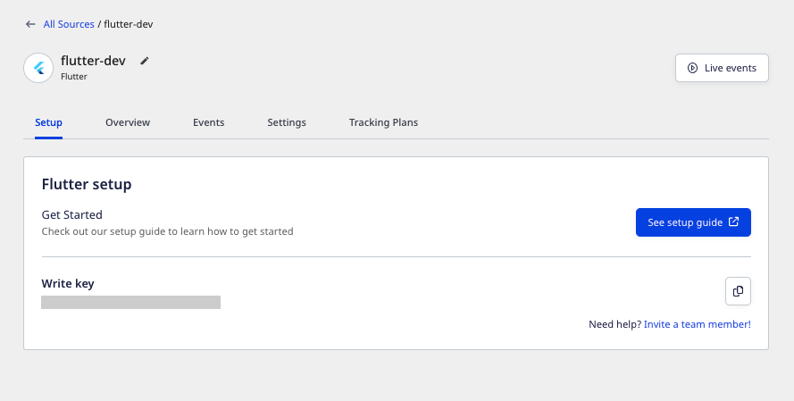

RudderStack's Flutter SDK lets you track and send the events from your Flutter apps to the specified destinations.

<GhBadge
  url={'https://pub.dev/packages/rudder_sdk_flutter'}
  label={'pub'}
  message={'v2.1.0'}
  color={'blue'}
  style={'flat'}
/>

<GhBadge
  url={'https://pub.dev/packages/rudder_sdk_flutter'}
  label={'stability'}
  message={'beta'}
  color={'blue'}
/>

Refer to the Flutter SDK's <a href="https://github.com/rudderlabs/rudder-sdk-flutter">GitHub Repository</a> for the implementation-specific details.

## SDK setup requirements

1. It is recommended to set up the [Flutter development environment](https://flutter.dev/docs/get-started/install) in your system.
2. Sign up to [RudderStack Cloud](https://app.rudderstack.com/signup).
3. <Link to="/dashboard-guides/sources/#adding-a-source">Set up a Flutter source</Link> in the dashboard. You should be able to see the <strong>write key</strong> for this source, as shown:



You will also need the data plane URL. Refer to the <Link to="/dashboard-guides/overview/#data-plane-url">Dashboard Overview</Link> guide for more information on the data plane URL and where to find it.

## Installing the RudderStack Flutter SDK

<div class="infoBlock">
Starting from v1.0.2, the RudderStack Flutter SDK is migrated to Null Safety.
</div>

The recommended way to install the Flutter SDK is through [`pub`](https://pub.dev/packages/rudder_sdk_flutter). Follow these steps to add the SDK as a dependency:

1. Open `pubspec.yaml` and add `rudder_sdk_flutter` under `dependencies` section, as shown:

```yaml
dependencies:
  rudder_sdk_flutter: ^2.0.1
```

2. Navigate to your application's root folder and install all the required dependencies with the following command:

```bash
flutter pub get
```

### Installing the SDK for the web

To install and use the Flutter SDK in your web app, follow the above steps to add the Flutter SDK. Additionally, you need to <Link to="/sources/event-streams/sdks/rudderstack-javascript-sdk/quick-start-guide/#step-1-install-javascript-sdk">install the RudderStack script</Link> in the `<head>` section of your web page.

Not all the Flutter SDK API are applicable for the web. Calling the following API on your web app will have **no effect**:

- [`optOut`](#enablingdisabling-user-tracking-gdpr-support)
- [`putDeviceToken`](#setting-the-device-token)
- [`putAdvertisingId`](#setting-the-advertisement-id)

## Initializing the RudderStack client

After adding the SDK as a dependency, you need to set up the SDK.

1. To import the SDK, use the following snippet:

```dart
import 'package:rudder_sdk_flutter_platform_interface/platform.dart';
import 'package:rudder_sdk_flutter/RudderController.dart';
```

2. Then, add the following code snippet in your application:

```dart
final RudderController rudderClient = RudderController.instance;
RudderLogger.init(RudderLogger.VERBOSE);
RudderConfigBuilder builder = RudderConfigBuilder();
builder.withDataPlaneUrl(<DATA_PLANE_URL>);
builder.withTrackLifecycleEvents(true);
rudderClient.initialize(<WRITE_KEY>,config: builder.build());
```

The `initialize` method has the following signature:

| Name       | Type      | Presence | Description                                   |
| :--------- | :------------- | :------- | :-------------------------------------------- |
| `writeKey` | String       | Required      | Your Flutter source write key.                       |
| `config`   | `RudderConfig` | Optional       | Contains the RudderStack client configuration. |

## Self-hosted control plane

For the <Link to="/destinations/rudderstack-connection-modes/#device-mode">device mode</Link>-supported destinations, the Flutter SDK needs to fetch the required configuration from the control plane. 

If you are self-hosting RudderStack and using the <a href="https://www.rudderstack.com/docs/rudderstack-open-source/control-plane-lite/">Control Plane Lite</a> utility to host your own control plane, then follow the steps in [this section](https://www.rudderstack.com/docs/rudderstack-open-source/control-plane-lite/#using-sdk-sources-set-up-in-self-hosted-control-plane) and specify `controlPlaneUrl` in your [`RudderConfig.Builder`](#sdk-initialization-options) that points to the hosted source configuration file.

<div class="dangerBlock">
You should not pass the <code class="inline-code">controlPlaneUrl</code> parameter during SDK initialization if you are using <a href="https://app.rudderstack.com">RudderStack Cloud</a>. This parameter is supported <strong>only</strong> if you are using the open source <a href="https://www.rudderstack.com/docs/rudderstack-open-source/control-plane-lite/">Control Plane Lite</a> utility to set up your own control plane.
</div>

## SDK initialization options

You can configure your client based on the following parameters by passing them in the `RudderConfigBuilder` object of your `rudderClient.initialize()` call.

| Parameter  | Type      | Description      | Default value   |
| :---------- | :-------- | :--------- | :----------------- |
| `dataPlaneUrl`           | String  | Your data plane URL.     | `https://hosted.rudderlabs.com` |
| `flushQueueSize`        | Integer     | Number of events in a batch request to the server.    | `30`                                                     |
| `isDebug` | Boolean | When enabled, sets the log level as `debug`. For more information, refer to the [Debugging](#debugging) section below.  | `false`  |
| `logLevel`  | Integer     | Controls the logs you want to see from the Flutter SDK.        | `RudderLogger.RudderLogLevel.NONE`                       |
| `mobileConfig` | Object | Refer to the [`mobileConfig` parameters](#mobileconfig-parameters) section below. | - |
| `webConfig` | Object | Refer to the [`webConfig` parameters](#webconfig-parameters) section below. | - |
| `controlPlaneUrl`       | String | This parameter should be changed **only if** you are self-hosting the control plane. Refer to the [Self-hosted control plane](#self-hosted-control-plane) section for more information. The SDK will add `/sourceConfig` along with this URL to fetch the configuration. | `https://api.rudderlabs.com` |

### mobileConfig parameters

`mobileConfig` contains only the mobile-specific configuration parameters for the Flutter SDK.

| Parameter               | Type      | Description     | Default value                                            |
| :------------------| :-------- | :------------ | :--------------------------------------- |
| `dbThresholdCount`  | Integer    | Number of events to be saved in the SQLite database. Once this limit is reached, the older events are deleted from the database.            | `10000`                                        |
| `sleepTimeout`          | Integer     | Minimum waiting time to flush the events to the server.          | `10 seconds`                      |
| `configRefreshInterval` | Integer     | Fetches the config from the dashboard after this specified time.                              | `2`                                                      |
| `trackLifecycleEvents`  | Boolean | Determines if the SDK will capture application life cycle events automatically.                   | `true`                                                   |
| `autoCollectAdvertId` | Boolean | Determines if the SDK will collect the advertisement ID. | `false` |
| `recordScreenViews` | Boolean | When enabled, the SDK automatically records the screens viewed by the user. | `false` |

### webConfig parameters

`webConfig` holds the configuration parameters for using the SDK in the Flutter web applications.

| Parameter               | Type      | Description     | Default value                                            |
| :------------------| :-------- | :------------ | :--------------------------------------- |
| `destSDKBaseURL` | String | The SDK loads the integration from this path. |  |
| `useBeacon` | Boolean | If enabled, the SDK sends the event payloads via the `navigator.sendBeacon()` utility | `False` |
| `secureCookie` | Boolean | If enabled, the SDK sends the cookie to the storage backend via HTTPS. | `False` |
| `loadIntegration` | Boolean | If disabled, the destination SDKs are not fetched by the SDK. | `True` |
| `cookieConsentManagers` | Object | Refer to the <Link to="/sources/event-streams/sdks/rudderstack-javascript-sdk/load-js-sdk/#cookieconsentmanager">cookieConsentManager</Link> section for more information. | - |
| `beaconFlushQueueInterval` | Integer | The SDK flushes the queue after this time interval (in milliseconds). | 600000 | 
| `maxBeaconItems` | Integer | The SDK flushes the queue when this number of events is reached. | 10 |
| `maxItems` | Integer | Maximum number of events kept in the storage. | 100 |
| `maxAttempts` | Integer | Maximum number of attempts the SDK makes to send the event to the destination. | 10 |
| `backoffFactor` | Integer | Refers to the exponential base. | 2 |
| `minRetryDelay` | Integer | The minimum delay expected before the SDK retries sending an event (in ms) | 1000 |
| `maxRetryDelay` | Integer | The upper limit on the maximum delay for retrying an event (in ms) | 360000 |

## Identify

The <Link to="/event-spec/standard-events/identify/">`identify`</Link> call lets you identify a visiting user and associate them to their actions. It also lets you record the traits about them like their name, email address, etc.

For unidentified users, RudderStack captures the `deviceId` and uses that as the `anonymousId` for identification. This way, you can track the users across the application installation. To attach more information to the user, you can use the `identify` method.

### How RudderStack sets `deviceId` on Android and iOS

- On the Android devices, the `deviceId` is assigned during the first boot. It remains consistent across the applications and installs. This can be changed **only** after factory resetting the device.
- According to the <a href="https://developer.apple.com/documentation/uikit/uidevice/1620059-identifierforvendor">Apple documentation</a>, if the iOS device has multiple apps from the same vendor, all the apps are assigned the same `deviceId`. If all the applications from a vendor are uninstalled and then reinstalled, then they are assigned a new `deviceId`.

Once a user is identified, RudderStack persists all the user information and passes it to the successive  `track` or `screen` calls. To reset the user identification, you can use the `reset` method.

A sample `identify` event is as shown:

```dart
RudderTraits traits = RudderTraits();
traits.putBirthdayDate(new DateTime.now());
traits.putEmail("alex@example.com");
traits.putFirstName("Alex");
traits.putLastName("Keener");
traits.putGender("Male");
traits.putPhone("5555555555");

Address address = Address();
address.putCity("City");
address.putCountry("USA");
traits.putAddress(address);

traits.put("boolean", true);
traits.put("integer", 50);
traits.put("float", 120.4);
traits.put("long", 1234);
traits.put("string", "hello");
traits.put("date", new DateTime.now().millisecondsSinceEpoch);

rudderClient.identify("1hKOmRA4GRlm", traits: traits, options: null);
```

The `identify` method has the following signature:

| Name      | Data Type      | Presence | Description                                     |
| :-------- | :------------- | :------- | :---------------------------------------------- |
| `userId`  | String      | Required      | Includes the developer identity for the user.    |
| `traits`  | `RudderTraits` | Optional       | Contains information related to the user traits. |
| `options` | `RudderOption` | Optional       | Extra options for the `identify` event.         |

### Obtaining user traits after making an `identify` call

You can obtain the user traits after making an `identify` call as shown:

```dart
Map context = await rudderClient.getRudderContext();
print(context["traits"]);
```

For the web apps, the `getRudderContext` API returns the user's `traits` and the `anonymousId` only.

## Track

The <Link to="/event-spec/standard-events/track/">`track`</Link> call lets you track the user actions along with any properties associated with them.

A sample `track` event is shown below:

```dart
RudderProperty property = RudderProperty();
property.put("test_key_1", "test_key_1");
RudderProperty childProperty = RudderProperty();
childProperty.put("test_child_key_1", "test_child_value_1");
property.put("test_key_2",childProperty);
rudderClient.track("test_track_event", properties: property);
```

The `track` method has the following signature:

| Name         | Type        | Presence | Description        |
| :----------- | :--------------- | :------- | :----------------------------------------------------------------------- |
| `name`       | String        | Required      | Contains the name of the event you want to track.                         |
| `properties` | `RudderProperty` | Optional       | Contains the extra properties you want to send along with the event. |
| `options`    | `RudderOption`   | Optional       | Contains the extra event options.                                        |

### Tracking lifecycle events

RudderStack automatically tracks the following (optional) lifecycle events:

- <Link to="/event-spec/standard-events/application-lifecycle-events-spec/#application-installed">Application Installed</Link>
- <Link to="/event-spec/standard-events/application-lifecycle-events-spec/#application-updated">Application Updated</Link>
- <Link to="/event-spec/standard-events/application-lifecycle-events-spec/#application-opened">Application Opened</Link>
- <Link to="/event-spec/standard-events/application-lifecycle-events-spec/#application-backgrounded">Application Backgrounded</Link>

You can disable these events by calling `withTrackLifeCycleEvents(false)` in the `RudderConfigBuilder` object while initializing the SDK. However, it is **highly recommended** to keep them enabled.

## Screen

The <Link to="/event-spec/standard-events/screen/">`screen`</Link> call is the mobile equivalent of the <Link to="/event-spec/standard-events/page/">`page`</Link> call. It lets you record the screen views on your mobile app along with other relevant information about the screen.

For the web apps, the SDK internally calls the <Link to="/event-spec/standard-events/page/">`page`</Link> API with the provided parameters.

A sample `screen` event is as shown:

```dart
RudderProperty screenProperty = RudderProperty();
  screenProperty.put("browser", "Chrome");
  screenProperty.put("device", "Macbook Pro");
  rudderClient.screen("Walmart Cart",
      category: "home",
      properties: screenProperty,
      options: null);
```

The `screen` method has the following signature:

| Name         | Type        | Presence | Description                                                               |
| :----------- | :--------------- | :------- | :------------------------------------------------------------------------ |
| `screenName` | String        | Required      | Name of the screen viewed by the user.                                                |
| `category` | String | Optional | Defines the page(web) or screen(mobile) category. |
| `properties` | `RudderProperty` | Optional       | Extra property object that you want to pass along with the `screen` call. |
| `options`    | `RudderOption`   | Optional       | Extra options to be passed along with `screen` event.                     |

### Automatic screen recording

<div class="infoBlock">
The <code class="inline-code">recordScreenViews</code> parameter records the screen views of the native <a href="https://developer.android.com/guide/components/activities/intro-activities">Android activities</a> or the <a href="https://developer.apple.com/documentation/uikit/view_controllers">iOS view controllers</a> only, and <strong>not</strong> of the Flutter screen views.
</div>

To track the screen views of your Flutter app screens, follow these steps:

1. Define the `routes` with their names to the `Material App` constructor of the entry widget.
2. Register an instance of the custom navigation observer to the `Material App` constructor of the entry widget.

The following snippet includes the code for the above two steps:

```dart
import 'package:flutter/material.dart';
import 'home_screen.dart';
import 'screen2.dart';
import 'screen3.dart';
import 'my_route_observer.dart';

class MyApp extends StatelessWidget {
  const MyApp({Key? key}) : super(key: key);

  @override
  Widget build(BuildContext context) {
    return MaterialApp(
      theme: ThemeData(
        primarySwatch: Colors.blue,
      ),
// Step 2. Registering an instance of our custom navigation observer.
      navigatorObservers: [
        MyRouteObserver(),
      ],
      home: const HomeScreen(),
// Step 1. Defining the named routes
      routes: {
        'screen2': (context) => const Screen2(),
        'screen3': (context) => const Screen3(),
      },
    );
  }
}

Future<void> main() async {
  runApp(const MyApp());
}
```

3. Finally, add the below code for the custom navigation observer used above:

```dart
import 'package:flutter/material.dart';
import 'package:rudder_sdk_flutter/RudderController.dart';

class MyRouteObserver extends RouteObserver<PageRoute<dynamic>> {
  @override
  void didPush(Route<dynamic> route, Route<dynamic>? previousRoute) {
    super.didPush(route, previousRoute);
    if (route is PageRoute && route.settings.name != null) {
      RudderController.instance.screen(route.settings.name!);
    }
  }

  @override
  void didPop(Route<dynamic> route, Route<dynamic>? previousRoute) {
    super.didPop(route, previousRoute);
    if (previousRoute is PageRoute && route is PageRoute) {
      RudderController.instance.screen(previousRoute.settings.name!);
    }
  }
}
```

## Group

The <Link to="/event-spec/standard-events/group/">`group`</Link> call lets you link an identified user with a group, such as a company, organization, or an account. It also lets you record any custom traits or properties associated with that group.

<div class="infoBlock">
RudderStack does not persist the group traits across the sessions.
</div>

A sample `group` event is shown below:

```dart
RudderTraits groupTraits = RudderTraits();
groupTraits.put("foo", "bar");
groupTraits.put("foo1", "bar1");
rudderClient.group("sample_group_id",
    groupTraits: groupTraits, options: null);
```

The `group` method has the following signature:

| Name          | Type      | Presence | Description         |
| :------------ | :------------- | :------- | :------------------------- |
| `groupId`     | String      | Required      | The ID of the organization with which you want to associate your user.               |
| `groupTraits` | `RudderTraits` | Optional       | Any other organization traits you want to pass along with the `group` call. |
| `options`     | `RudderOption` | Optional       | Extra options to be passed along with `group` event.                               |

## Alias

The <Link to="/event-spec/standard-events/alias/">`alias`</Link> call lets you merge different identities of a known user. It is an advanced method that lets you change the tracked user's ID explicitly. You can use `alias` for managing the user's identity in some of the downstream destinations.

When you make an `alias` call, RudderStack replaces the old user ID with the new user ID and persists this identification across the sessions.

<div class="warningBlock">
RudderStack supports sending <code class="inline-code">alias</code> events only to select downstream destinations. Refer to the <Link to="/destinations/streaming-destinations/">destination-specific documentation</Link> for more details.
</div>

A sample `alias` call is as shown:

```dart
rudderClient.alias("new_user_id", options: null);
```

The `alias` method has the following signature:

| Name      | Type      | Presence | Description                                          |
| :-------- | :------------- | :------- | :--------------------------------------------------- |
| `newId`   | String      | Required      | The new `userId` you want to assign to the user.      |
| `options` | `RudderOption` | Optional       | Extra options to be passed along with `alias` event. |

## Reset

You can use the `reset` method to clear the persisted `traits` for the `identify` call. This is required for scenarios where the user logs out of a session.

```dart
rudderClient.reset();
```

## Enabling/disabling user tracking (GDPR support)

<div class="warningBlock">
This functionality is not available for the web.
</div>

RudderStack gives the users \(for example, an EU user\) the ability to opt out of tracking any user activity until the user gives their consent. You can do this by leveraging RudderStack's `optOut` API.

The `optOut` API takes `true` or `false` as a Boolean value to enable or disable tracking user activities. This flag persists across device reboots.

<div class="infoBlock">
The <code class="inline-code">optOut</code> API is available in the Flutter SDK starting from version `1.0.6`.
</div>

The following snippet highlights the use of the `optOut` API to disable user tracking:

```dart
rudderClient.optOut(true);
```

Once the user grants their consent, you can enable user tracking once again by using the `optOut` API with `false` as a parameter sent to it, as shown:

```dart
rudderClient.optOut(false);
```

## Filtering events

When sending events to a destination via the <Link to="/destinations/rudderstack-connection-modes/#device-mode">device mode</Link>, you can explicitly specify the events to be discarded or allowed to flow through by allowlisting or denylisting them.

Refer to the <Link to="/sources/event-streams/sdks/event-filtering/">Client-side Event Filtering</Link> guide for more information on this feature.

## Enabling/disabling events for specific destinations

The Flutter SDK lets you enable or disable sending events to a specific destination or all the destinations connected to a source. You can specify these destinations by creating an object as shown in the following snippet:

```dart
RudderOption options = new RudderOption();
// default value for `All` is true
options.putIntegration("All", false);
// specifying destination by its display name
options.putIntegration("Mixpanel", false);
// specifying destination by its Factory object
options.putIntegrationWithFactory(Appcenter(), true);
```

In the above snippet, the keyword `All` represents all the destinations connected to a source. By default, its value is set to `true`.

<div class="warningBlock">
Make sure the destination names that you pass while specifying the destinations <strong>match exactly</strong> with  the names listed in the <a href="https://app.rudderstack.com/directory">RudderStack dashboard</a>.
</div>

You can pass the destinations to the SDK in the following two ways:

#### Method 1. Passing destinations while initializing the SDK

This is helpful when you want to enable/disable sending the events across all the event calls made using the SDK to the specified destination\(s\).

```dart
rudderClient.initialize(<WRITE_KEY>,
                    config: builder.build(),options: options);
```

#### Method 2. Passing destinations while making event calls

This approach is helpful when you want to enable/disable sending only a particular event to the specified destination\(s\) or if you want to override the specified destinations passed with the SDK initialization for a particular event.

```dart
RudderProperty property = RudderProperty();
property.put("test_key_1", "test_key_1");
rudderClient.track("test_track_event", properties: property, options: options);
```

<div class="infoBlock">
If you specify the destinations both while initializing the SDK and while making an event call, then the SDK considers only the destinations specified at the event level.
</div>

## External ID

You can pass your custom `userId` along with the standard `userId` in your `identify` calls. RudderStack adds those values under `context.externalId`. 

The following code snippet highlights how to add `externalId` to your `identify` event:

```dart
RudderOption option = RudderOption();
option.putExternalId("externalId", "some_external_id_1");
rudderClient.identify("testUserId", options: option);
```

## Setting your own `anonymousId` using `putAnonymousId`

By default, RudderStack uses the `deviceId` as the user's `anonymousId`. Use the following method to override and set your own `anonymousId` with the SDK:

```dart
rudderClient.putAnonymousId(<ANONYMOUS_ID>);
```

## Setting the advertisement ID

<div class="warningBlock">
This functionality is not available for the web.
</div>

RudderStack collects the advertisement ID **only** if `autoCollectAdvertId` is set to `true` during the [SDK initialization](#initializing-the-rudderstack-client), as shown:

```dart
final RudderController rudderClient = RudderController.instance;
MobileConfig mobileConfig = MobileConfig(autoCollectAdvertId: true);
RudderLogger.init(RudderLogger.VERBOSE);
RudderConfigBuilder builder = RudderConfigBuilder();
builder.withDataPlaneUrl(<DATA_PLANE_URL>);
builder.withTrackLifecycleEvents(true);
rudderClient.initialize(<WRITE_KEY>,config: builder.build());
```

You can use the `putAdvertisingId` method to pass your Android and iOS AAID and IDFA respectively. The `putAdvertisingId` method accepts a string argument as described below:

- `id` : Your Android `advertisingId` \(AAID\) \(or\) your iOS `advertisingId` \(IDFA\).

An example of how to use `putAdvertisingId` is as shown:

```dart
rudderClient.putAdvertisingId(<ADVERTISING_ID>);
```

<div class="infoBlock">
The <code class="inline-code">id</code> parameter that you pass in the <code class="inline-code">putAdvertisingId</code> method is assigned as the AAID if you are on an Android device, and as the IDFA if you are on an iOS device.
</div>

## Setting the device token

<div class="warningBlock">
This functionality is not available for the web.
</div>

You can use your device token to pass push notifications to the destinations that support them. RudderStack sets this token under `context.device.token`. To set a custom device token, the SDK supports the `putDeviceToken` method.

An example of setting a custom device token is shown below:

```dart
rudderClient.putDeviceToken(<DEVICE_TOKEN>);
```

## Debugging

If you run into any issues when using the Flutter SDK, you can turn on the `VERBOSE` or `DEBUG` logging to determine the issue. To do so, follow these steps:

1. First, make sure you import `RudderLogger` by running the following command:

```dart
import 'package:rudder_sdk_flutter/RudderLogger.dart';
```

2. Then, turn on the logging by changing your `rudderClient` initialization as shown:

```dart
RudderConfigBuilder builder = RudderConfigBuilder();
builder.withDataPlaneUrl(DATA_PLANE_URL);
builder.withLogLevel(RudderLogger.VERBOSE);
rudderClient.initialize(WRITE_KEY,
                          config: builder.build());
```

You can set the log level to one of the following values:

- `NONE`
- `ERROR`
- `WARN`
- `INFO`
- `DEBUG`
- `VERBOSE`

## FAQ

### How do I get the user `traits` after making an `identify` call?

You can get the user traits after making an `identify` call in the following way:

```dart
Map context = await rudderClient.getRudderContext();
print(context["traits"]);
```

For web apps, the `getRudderContext`API returns the user traits and anonymous ID only.

<br />
