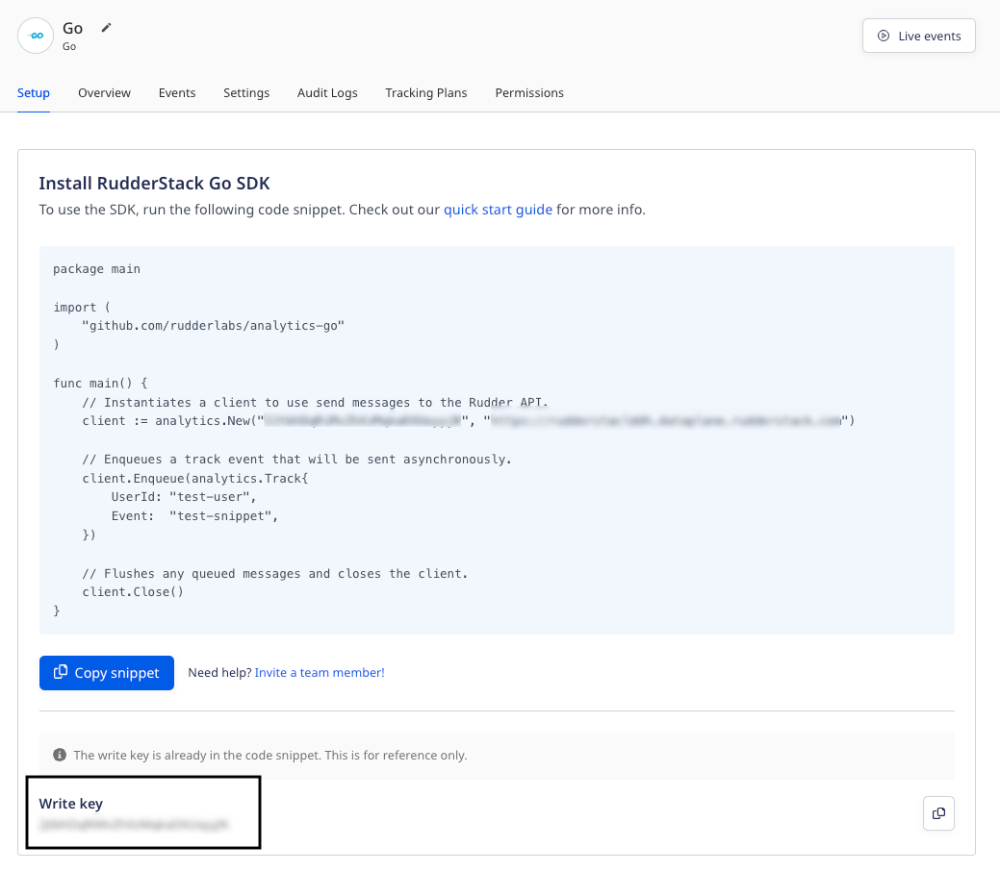

RudderStack's Go SDK lets you track and send the events from your Go applications to the specified destinations.

<div class="infoBlock">
Refer to the SDK's <a href="https://github.com/rudderlabs/analytics-go">GitHub codebase</a> for the implementation-specific details.
</div>

<GhBadge
  url={'https://github.com/rudderlabs/analytics-go'}
  repo={'github/v/release/rudderlabs/analytics-go.svg?label=Github'}
/>

## SDK setup requirements

1. Sign up to [RudderStack Cloud](https://app.rudderstack.com/signup).
2. <Link to="/dashboard-guides/sources/#adding-a-source">Set up a Go source</Link> in your dashboard. You should be able to see a <strong>write key</strong> for this source, as shown:



You will also need a data plane URL. Refer to the <Link to="/dashboard-guides/overview/#data-plane-url">Dashboard Overview</Link> guide for more information on the data plane URL and where to find it.

<div class="successBlock">
The <strong>Setup</strong> tab in the RudderStack dashboard (seen above) has an SDK installation snippet containing both the write key and the data plane URL. You can use it to integrate the Go SDK into your application.
</div>

## Installing the Go SDK

To install the Go SDK in the `GOPATH`, run the following command:

```go
go get github.com/rudderlabs/analytics-go
```

## Initializing the SDK

Run the following code snippet to initialize the Go SDK:

```go
package main

import (
    "github.com/rudderlabs/analytics-go/v4"
)

func main() {
    // Instantiates a client to use send messages to the RudderStack API.
    
    // Use your write key in the below placeholder:
    
    client := analytics.New(<WRITE_KEY>, <DATA_PLANE_URL>)

    // Enqueues a track event that will be sent asynchronously.
    client.Enqueue(analytics.Track{
        UserId: "1hKOmRA4GRlm",
        Event:  "Test Event",
    })

    // Flushes any queued messages and closes the client.
    client.Close()
}
```

Alternatively, you can run the following snippet:

```go
package main

import (
    "github.com/rudderlabs/analytics-go/v4"
)

func main() {
    // Instantiates a client to use send messages to the RudderStack API.
    
    // Enter your write key in the below placeholder:
    
    client, _ := analytics.NewWithConfig(WRITE_KEY,
		analytics.Config{
			DataPlaneUrl: DATA_PLANE_URL,
			Interval:     30 * time.Second,
			BatchSize:    100,
			Verbose:      true,
			Gzip:         0,  // Enables Gzip compression - set to 1 to disable Gzip.
		})

    // Enqueues a track event that will be sent asynchronously.
    
    client.Enqueue(analytics.Track{
        UserId: "1hKOmRA4GRlm",
        Event:  "Test Event",
    })

    // Flushes any queued messages and closes the client.
    
    client.Close()
}
```

### SDK initialization options

The RudderStack Go SDK provides the following initialization options:

| **Field**      | **Type**      | **Description**        |
| :---------------------- | :------------ |:---------------- |
| `Interval`   | Time (in sec) | The SDK sends the messages when this flushing interval time has elapsed.       |
| `BatchSize`       | Integer           | Total number of messages to be sent in a single batch.  Default value is 100.     |
| `Verbose`  | Boolean  | When set to `true`, the client sends more frequent and detailed messages to the logger.  |
| `RetryAfter`    | Time (in sec) |  Determines how long the SDK should wait to retry sending the failed messages. |
| `Gzip` | Integer   | Enables Gzip compression of the requests. By default, this is enabled (value set to `0`). To disable gzip, set this parameter to `1`.          |
| `NoProxySupport`        | Boolean          | Setting this variable to `true` if you do not use a proxy to send the events.    |

<div class="infoBlock">
Setting <code class="inline-code">NoProxySupport</code> to <code class="inline-code">true</code> will avoid RudderStack making calls to the proxy for fetching the total number of nodes in case of a multi-node setup.
</div>

## Gzipping requests

<div class="successBlock">
The Gzip feature is enabled by default in the Go SDK version 4.0.0.
</div>

The Go SDK automatically gzips requests. However, you can disable this by setting the `Gzip` parameter to `1` while initializing the SDK, as shown:

```go
client, _ := analytics.NewWithConfig(WRITE_KEY,
		analytics.Config{
			DataPlaneUrl: DATA_PLANE_URL,
			Interval:     30 * time.Second,
			BatchSize:    100,
			Verbose:      true,
			Gzip:         1   // Disables Gzip compression
		})
```

<div class="warningBlock">
Gzip requires <a href="https://github.com/rudderlabs/rudder-server">rudder-server</a> <strong>v1.4 or higher</strong>. Otherwise, your events might fail.
</div>

## Sending events

<div class="warningBlock">
<strong>RudderStack does not store or persist the user state in any of the server-side SDKs</strong>. <br /><br />Unlike the client-side SDKs that deal with only a single user at a given time, the server-side SDKs deal with multiple users simultaneously. Therefore, you must specify either the <code class="inline-code">userId</code> or <code class="inline-code">anonymousId</code> <strong>every time</strong> while making any API calls supported by the Go SDK.
</div>

### Identify

The <Link to="/event-spec/standard-events/identify/">`identify`</Link> call lets you identify a visiting user and associate them to their actions. It also lets you record the traits about them like their name, email address, etc.

A sample `identify` call made using the Go SDK is shown below:

```go
client.Enqueue(analytics.Identify{
  UserId: "1hKOmRA4GRlm",
  Traits: analytics.NewTraits().
    SetName("Alex Keener").
    SetEmail("alex@example.com").
    Set("plan", "Free").
    Set("manager", 12),
})
```

The `identify` method parameters are as described below:

| **Field**      | **Type** |  **Description**     |
| :------------- | :------- |  :---------------- |
| `userId` <br/> <span style="color: #4D4DFF;font-size:12px;">Required, if <strong>anonymousId</strong> is absent.</span>     | String   | Unique identifier for a user in your database.      |
| `anonymousId`  <br/> <span style="color: #4D4DFF;font-size:12px;">Required, if <strong>userId</strong> is absent.</span> | String   |  The SDK automatically sets this identifier in cases where there is no unique identifier for the user. |
| `traits`       | Object   | An optional dictionary of the user's traits like `name` or `email`.     |
| `context`      | Object   |  An optional dictionary of information that provides context about the event. It is not directly related to the API call.      |
| `integrations` | Object   | An optional dictionary containing the destinations to be enabled or disabled.            |
| `timestamp`    | Timestamp in ISO 8601 format     | The timestamp of the event's arrival.                |

### Track

The <Link to="/event-spec/standard-events/track/">`track`</Link> call lets you record the user actions along with their associated properties. Each user action is called an **event**.

A sample `track` call is shown below:

```go
client.Enqueue(analytics.Track{
  UserId: "1hKOmRA4GRlm",
  Event:  "Signed Up",
  Properties: analytics.NewProperties().
    Set("plan", "Free"),
})
```

The `track` method parameters are as described below:

| **Field**      | **Type** |  **Description**     |
| :------------- | :------- |  :---------------- |
| `userId` <br/> <span style="color: #4D4DFF;font-size:12px;">Required, if <strong>anonymousId</strong> is absent.</span>     | String   | Unique identifier for a user in your database.      |
| `anonymousId`  <br/> <span style="color: #4D4DFF;font-size:12px;">Required, if <strong>userId</strong> is absent.</span> | String   |  The SDK automatically sets this identifier in cases where there is no unique identifier for the user. |
| `event`  <br/> <span style="color: #4D4DFF;font-size:12px;">Required</span>      | String | Name of the event.           |
| `properties`   | Object | An optional dictionary of the properties associated with the event.   |
| `context`      | Object | An optional dictionary of information that provides context about the event. It is not directly related to the API call.      |
| `integrations` | Object   | An optional dictionary containing the destinations to be enabled or disabled.            |
| `timestamp`    | Timestamp in ISO 8601 format     | The timestamp of the event's arrival.  |

### Page

The <Link to="/event-spec/standard-events/page/">`page`</Link> call lets you record the page views on your application along with the other relevant information about the page.

A sample `page` call is as shown:

```go
client.Enqueue(analytics.Page{
  UserId: "12345",
  Name:   "Pizza",
  Properties: analytics.NewProperties().
    SetURL("https://dominos.com"),
})
```

The `page` method parameters are as described below:

| **Field**      | **Type** |  **Description**     |
| :------------- | :------- |  :---------------- |
| `userId` <br/> <span style="color: #4D4DFF;font-size:12px;">Required, if <strong>anonymousId</strong> is absent.</span>     | String   | Unique identifier for a user in your database.      |
| `anonymousId`  <br/> <span style="color: #4D4DFF;font-size:12px;">Required, if <strong>userId</strong> is absent.</span> | String   |  The SDK automatically sets this identifier in cases where there is no unique identifier for the user. |
| `name`  <br/> <span style="color: #4D4DFF;font-size:12px;">Required</span>      | String | Name of the viewed page.           |
| `properties`   | Object | An optional dictionary of the properties associated with the viewed page, like `url` or `referrer`.   |
| `context`      | Object | An optional dictionary of information that provides context about the event. It is not directly related to the API call.      |
| `integrations` | Object   | An optional dictionary containing the destinations to be enabled or disabled.            |
| `timestamp`    | Timestamp in ISO 8601 format     | The timestamp of the event's arrival.  |

### Screen

The <Link to="/event-spec/standard-events/screen/">`screen`</Link> call is the mobile equivalent of the <Link to="/event-spec/standard-events/page/">`page`</Link> call. It lets you record the screen views on your mobile app along with other relevant information about the screen.

A sample `screen` call is as shown:

```go
client.Enqueue(analytics.Screen{
  UserId: "1hKOmRA4GRlm",
  Name:   "Pizza",
  Properties: analytics.NewProperties().
    SetURL("https://dominos.com"),
})
```

The `screen` method parameters are as described below:

| **Field**      | **Type** |  **Description**     |
| :------------- | :------- |  :---------------- |
| `userId` <br/> <span style="color: #4D4DFF;font-size:12px;">Required, if <strong>anonymousId</strong> is absent.</span>     | String   | Unique identifier for a user in your database.      |
| `anonymousId`  <br/> <span style="color: #4D4DFF;font-size:12px;">Required, if <strong>userId</strong> is absent.</span> | String   |  The SDK automatically sets this identifier in cases where there is no unique identifier for the user. |
| `name`  <br/> <span style="color: #4D4DFF;font-size:12px;">Required</span>      | String | Name of the viewed screen.           |
| `properties`   | Object | An optional dictionary of the properties associated with the viewed screen, like `url` or `referrer`.   |
| `context`      | Object | An optional dictionary of information that provides context about the event. It is not directly related to the API call.      |
| `integrations` | Object   | An optional dictionary containing the destinations to be enabled or disabled.            |
| `timestamp`    | Timestamp in ISO 8601 format     | The timestamp of the event's arrival.  |

### Group

The <Link to="/event-spec/standard-events/group/">`group`</Link> call lets you link an identified user with a group, such as a company, organization, or an account. It also lets you record any custom traits or properties associated with that group.

A sample `group` call made using the Go SDK is shown below:

```go
client.Enqueue(analytics.Group{
  UserId:  "1hKOmRA4GRlm",
  GroupId: "1",
  Traits: map[string]interface{}{
    "name": "Company",
    "description": "Facebook",
  },
})
```

The `group` method parameters are as follows:

| **Field**      | **Type** |  **Description**     |
| :------------- | :------- |  :---------------- |
| `userId` <br/> <span style="color: #4D4DFF;font-size:12px;">Required, if <strong>anonymousId</strong> is absent.</span>     | String   | Unique identifier for a user in your database.      |
| `anonymousId`  <br/> <span style="color: #4D4DFF;font-size:12px;">Required, if <strong>userId</strong> is absent.</span> | String   |  The SDK automatically sets this identifier in cases where there is no unique identifier for the user. |
| `groupId`  <br/> <span style="color: #4D4DFF;font-size:12px;">Required</span>    | String   | Unique identifier of the group in your database.    |
| `traits`       | Object   | An optional dictionary of the group's traits like `name`or `email`.     |
| `context`      | Object   |  An optional dictionary of information that provides context about the event. It is not directly related to the API call.      |
| `integrations` | Object   | An optional dictionary containing the destinations to be enabled or disabled.            |
| `timestamp`    | Timestamp in ISO 8601 format     | The timestamp of the event's arrival.                |

### Alias

The <Link to="/event-spec/standard-events/alias/">`alias`</Link> call lets you merge different identities of a known user. It is an advanced method that lets you change the tracked user's ID explicitly. You can use `alias` for managing the user's identity in some of the downstream destinations.

<div class="warningBlock">
RudderStack supports sending <code class="inline-code">alias</code> events only to select downstream destinations. Refer to the <Link to="/destinations/streaming-destinations/">destination-specific documentation</Link> for more details.
</div>

A sample `alias` call is as shown:

```go
client.Enqueue(analytics.Alias{
  PreviousId: "12345",
  UserId:     "1hKOmRA4GRlm",
})
```

The `alias` method parameters are as mentioned below:

| **Field**      | **Type** |  **Description**     |
| :------------- | :------- |  :---------------- |
| `userId` <br/> <span style="color: #4D4DFF;font-size:12px;">Required, if <strong>anonymousId</strong> is absent.</span>     | String   | Unique identifier for a user in your database.      |
| `anonymousId`  <br/> <span style="color: #4D4DFF;font-size:12px;">Required, if <strong>userId</strong> is absent.</span> | String   |  The SDK automatically sets this identifier in cases where there is no unique identifier for the user. |
| `previousId` <br/> <span style="color: #4D4DFF;font-size:12px;">Required</span>  | String   | The previous unique identifier of the user.        |
| `traits`       | Object   | An optional dictionary of the user's traits like `name` or `email`.     |
| `context`      | Object   |  An optional dictionary of information that provides context about the event. It is not directly related to the API call.      |
| `integrations` | Object   | An optional dictionary containing the destinations to be enabled or disabled.            |
| `timestamp`    | Timestamp in ISO 8601 format     | The timestamp of the event's arrival.     |

<br />