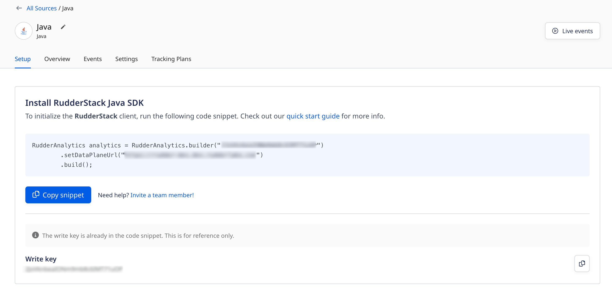

RudderStack’s Java SDK lets you track and send the events from your Java apps to your specified destinations.

<div class="infoBlock">
Refer to the SDK's <a href="https://github.com/rudderlabs/rudder-sdk-java">GitHub codebase</a> for the implementation-specific details.
</div>

<GhBadge
  url={'https://search.maven.org/search?q=a:rudderanalytics-client'}
  repo={'maven-metadata/v.svg?label=Maven%20Central&metadataUrl=https%3A%2F%2Frepo1.maven.org%2Fmaven2%2Fcom%2Frudderstack%2Fsdk%2Fjava%2Frudderanalytics-client%2Fmaven-metadata.xml'}
/>

## SDK setup requirements

1. Sign up to [RudderStack Cloud](https://app.rudderstack.com/signup).
2. <Link to="/dashboard-guides/sources/#adding-a-source">Set up a Java source</Link> in your dashboard. You should be able to see a <strong>write key</strong> for this source, as shown:



You will also need a data plane URL. Refer to the <Link to="/dashboard-guides/overview/#data-plane-url">Dashboard Overview</Link> guide for more information on the data plane URL and where to find it.

<div class="successBlock">
The <strong>Setup</strong> tab in the RudderStack dashboard (seen above) has the SDK installation snippet containing both the write key and the data plane URL. Copy it to integrate the Java SDK into your application.
</div>

## Installing the Java SDK

<div class="warningBlock">
As Bintray has sunset from 1st May, 2021, the Java SDK is now moved to <a href="https://search.maven.org">Maven Central</a>. All the versions from 1.0.1 will now be available in Maven Central only.
</div>

It is highly recommended to use the Maven build system to add the SDK to your project.

To install the RudderStack Java SDK, add the following lines of code to `pom.xml`:

```markup
<dependency>
   <groupId>com.rudderstack.sdk.java.analytics</groupId>
     <artifactId>analytics</artifactId>
   <version>3.0.0</version>
</dependency>
```

If you're using **Gradle**, add the following line to your dependencies:

```markup
implementation 'com.rudderstack.sdk.java.analytics:analytics:3.0.0'
``` 

## Initializing the RudderStack client

After installing the SDK, run the following code snippet to initialize the RudderStack client:

```java
RudderAnalytics analytics = RudderAnalytics
         .builder("<WRITE_KEY>")
         .setDataPlaneUrl("<DATA_PLANE_URL>")
         .build();
```

## Migrating from v2 to v3

To migrate to the Java SDK v3.0.0, set the data plane URL using `setDataPlaneUrl("<DATA_PLANE_URL>")` (as seen in the above section) instead of passing it as an argument.

## Sending events

<div class="warningBlock">
<strong>RudderStack does not store or persist the user state in any of the server-side SDKs</strong>. <br /><br />Unlike the client-side SDKs that deal with only a single user at a given time, the server-side SDKs deal with multiple users simultaneously. Therefore, you must specify either the <code class="inline-code">userId</code> or <code class="inline-code">anonymousId</code> <strong>every time</strong> while making any API calls supported by the Java SDK.
</div>

### Identify

The <Link to="/event-spec/standard-events/identify/">`identify`</Link> call lets you identify a visiting user and associate them to their actions. It also lets you record the traits about them like their name, email address, etc.

A sample `identify` call made using the Java SDK is shown below:

```java
analytics.enqueue(IdentifyMessage.builder()
    .userId("1hKOmRA4GRlm")
    .traits(ImmutableMap.builder()
        .put("name", "Alex Keener")
        .put("email", "alex@example.com")
        .build()
    )
);
```

The `identify` method parameters are as described below:

| **Field**      | **Type** |  **Description**     |
| :------------- | :------- |  :---------------- |
| `userId` <br/> <span style="color: #4D4DFF;font-size:12px;">Required, if <strong>anonymousId</strong> is absent.</span>     | String   | Unique identifier for a user in your database.      |
| `anonymousId`  <br/> <span style="color: #4D4DFF;font-size:12px;">Required, if <strong>userId</strong> is absent.</span> | String   |  The SDK automatically sets this identifier in cases where there is no unique identifier for the user. |
| `context`      | Object   |  An optional dictionary of information that provides context about the event. It is not directly related to the API call.      |
| `integrations` | Object   | An optional dictionary containing the destinations to be enabled or disabled.            |
| `timestamp`    | Timestamp in ISO 8601 format     | The timestamp of the event's arrival.                |
| `traits`       | Object   | An optional dictionary of the user's traits like `name` or `email`.     |

### Track

The <Link to="/event-spec/standard-events/track/">`track`</Link> call lets you record the user actions along with their associated properties. Each user action is called an **event**.

A sample `track` call is shown below:

```java
Map<String, Object> properties = new LinkedHashMap<>();
    properties.put("key1", "value1");
    properties.put("key2", "value2");
    analytics.enqueue(
       TrackMessage.builder("Java Test")
           .properties(properties)
           .anonymousId(anonymousId)
           .userId(userId)
);
```

The `track` method parameters are as described below:

| **Field**      | **Type** |  **Description**     |
| :------------- | :------- |  :---------------- |
| `userId` <br/> <span style="color: #4D4DFF;font-size:12px;">Required, if <strong>anonymousId</strong> is absent.</span>     | String   | Unique identifier for a user in your database.      |
| `anonymousId`  <br/> <span style="color: #4D4DFF;font-size:12px;">Required, if <strong>userId</strong> is absent.</span> | String   |  The SDK automatically sets this identifier in cases where there is no unique identifier for the user. |
| `event`  <br/> <span style="color: #4D4DFF;font-size:12px;">Required</span>      | String | Name of the event.           |
| `properties`   | Object | An optional dictionary of the properties associated with the event.   |
| `context`      | Object | An optional dictionary of information that provides context about the event. It is not directly related to the API call.      |
| `integrations` | Object   | An optional dictionary containing the destinations to be enabled or disabled.            |
| `timestamp`    | Timestamp in ISO 8601 format     | The timestamp of the event's arrival.  |

### Page

The <Link to="/event-spec/standard-events/page/">`page`</Link> call allows you to record the page views on your application, along with the other relevant information about the page.

A sample `page` call is as shown:

```java
analytics.enqueue(PageMessage.builder("Schedule")
    .userId("1hKOmRA4GRlm")
    .properties(ImmutableMap.builder()
        .put("category", "Cultural")
        .put("path", "/a/b")
        .build()
    )
);
```

The `page` method parameters are as described below:

| **Field**      | **Type** |  **Description**     |
| :------------- | :------- |  :---------------- |
| `userId` <br/> <span style="color: #4D4DFF;font-size:12px;">Required, if <strong>anonymousId</strong> is absent.</span>     | String   | Unique identifier for a user in your database.      |
| `anonymousId`  <br/> <span style="color: #4D4DFF;font-size:12px;">Required, if <strong>userId</strong> is absent.</span> | String   |  The SDK automatically sets this identifier in cases where there is no unique identifier for the user. |
| `name`  <br/> <span style="color: #4D4DFF;font-size:12px;">Required</span>      | String | Name of the viewed page.           |
| `properties`   | Object | An optional dictionary of the properties associated with the viewed page, like `url` or `referrer`.   |
| `context`      | Object | An optional dictionary of information that provides context about the event. It is not directly related to the API call.      |
| `integrations` | Object   | An optional dictionary containing the destinations to be enabled or disabled.            |
| `timestamp`    | Timestamp in ISO 8601 format     | The timestamp of the event's arrival.  |

### Screen

The <Link to="/event-spec/standard-events/screen/">`screen`</Link> call is the mobile equivalent of the <Link to="/event-spec/standard-events/page/">`page`</Link> call. It lets you record the screen views on your mobile app along with other relevant information about the screen.

A sample `screen` call is as shown:

```java
analytics.enqueue(ScreenMessage.builder("Schedule")
    .userId("1hKOmRA4GRlm")
    .properties(ImmutableMap.builder()
        .put("category", "Sports")
        .put("path", "/sports/schedule")
        .build()
    )
);
```

The `screen` method parameters are as described below:

| **Field**      | **Type** |  **Description**     |
| :------------- | :------- |  :---------------- |
| `userId` <br/> <span style="color: #4D4DFF;font-size:12px;">Required, if <strong>anonymousId</strong> is absent.</span>     | String   | Unique identifier for a user in your database.      |
| `anonymousId`  <br/> <span style="color: #4D4DFF;font-size:12px;">Required, if <strong>userId</strong> is absent.</span> | String   |  The SDK automatically sets this identifier in cases where there is no unique identifier for the user. |
| `name`  <br/> <span style="color: #4D4DFF;font-size:12px;">Required</span>      | String | Name of the viewed screen.           |
| `properties`   | Object | An optional dictionary of the properties associated with the screen, like `url` or `referrer`.   |
| `context`      | Object | An optional dictionary of information that provides context about the event. It is not directly related to the API call.      |
| `integrations` | Object   | An optional dictionary containing the destinations to be enabled or disabled.            |
| `timestamp`    | Timestamp in ISO 8601 format     | The timestamp of the event's arrival.  |

### Group

The <Link to="/event-spec/standard-events/group/">`group`</Link> call lets you link an identified user with a group, such as a company, organization, or an account. It also lets you record any custom traits or properties associated with that group.

A sample `group` call made using the Java SDK is shown below:

```python
analytics.enqueue(GroupMessage.builder("group123")
    .userId("1hKOmRA4GRlm")
    .traits(ImmutableMap.builder()
        .put("name", "Rudder")
        .put("size", 19)
        .build()
    )
);
```

The `group` method parameters are as follows:

| **Field**      | **Type** |  **Description**     |
| :------------- | :------- |  :---------------- |
| `userId` <br/> <span style="color: #4D4DFF;font-size:12px;">Required, if <strong>anonymousId</strong> is absent.</span>     | String   | Unique identifier for a user in your database.      |
| `anonymousId`  <br/> <span style="color: #4D4DFF;font-size:12px;">Required, if <strong>userId</strong> is absent.</span> | String   |  The SDK automatically sets this identifier in cases where there is no unique identifier for the user. |
| `groupId`  <br/> <span style="color: #4D4DFF;font-size:12px;">Required</span>    | String   | Unique identifier of the group in your database.    |
| `traits`       | Object   | An optional dictionary of the group's traits like `name`or `email`.     |
| `context`      | Object   |  An optional dictionary of information that provides context about the event. It is not directly related to the API call.      |
| `integrations` | Object   | An optional dictionary containing the destinations to be enabled or disabled.            |
| `timestamp`    | Timestamp in ISO 8601 format     | The timestamp of the event's arrival.                |

### Alias

The <Link to="/event-spec/standard-events/alias/">`alias`</Link> call lets you merge different identities of a known user. It is an advanced method that lets you change the tracked user's ID explicitly. You can use `alias` for managing the user's identity in some of the downstream destinations.

<div class="warningBlock">
RudderStack supports sending <code class="inline-code">alias</code> events only to select downstream destinations. Refer to the <Link to="/destinations/streaming-destinations/">destination-specific documentation</Link> for more details.
</div>

A sample `alias` call is as shown:

```java
analytics.enqueue(AliasMessage.builder("previousId")
    .userId("newId")
);
```

The `alias` method parameters are as mentioned below:

| **Field**      | **Type** |  **Description**     |
| :------------- | :------- |  :---------------- |
| `userId` <br/> <span style="color: #4D4DFF;font-size:12px;">Required, if <strong>anonymousId</strong> is absent.</span>     | String   | Unique identifier for a user in your database.      |
| `anonymousId`  <br/> <span style="color: #4D4DFF;font-size:12px;">Required, if <strong>userId</strong> is absent.</span> | String   |  The SDK automatically sets this identifier in cases where there is no unique identifier for the user. |
| `previousId` <br/> <span style="color: #4D4DFF;font-size:12px;">Required</span>  | String   | The previous unique identifier of the user.        |
| `traits`       | Object   | An optional dictionary of the group's traits like `name` or `email`.     |
| `context`      | Object   |  An optional dictionary of information that provides context about the event. It is not directly related to the API call.      |
| `integrations` | Object   | An optional dictionary containing the destinations to be enabled or disabled.            |
| `timestamp`    | Timestamp in ISO 8601 format     | The timestamp of the event's arrival.     |

## Filtering destinations

The Java SDK lets you enable or disable sending events to specifc destinations connected to the source. You can do so by passing the `integrations` object in your API calls, as shown:

```java
analytics.enqueue(TrackMessage.builder("Button Clicked")
    .userId("1hKOmRA4GRlm")
    .enableIntegration("All", false)
    .enableIntegration("Amplitude", true)
);
```

The above snippet disables sending the event `Button Clicked` to any destination except Amplitude.

<div class="warningBlock">
<strong>The destination flags are case sensitive.</strong> They should match the destination's name as specified in the <a href="https://app.rudderstack.com/directory">RudderStack dashboard</a>. 
</div>

## Context

With the Java SDK, you can send contextual information about the event using the `context` object, as shown:

```java
analytics.enqueue(TrackMessage.builder("Button Clicked")
    .userId("1hKOmRA4GRlm")
    .context(ImmutableMap.builder()
        .put("ip", "1.23.45.67")
        .put("language", "en-uk")
        .build()
    )
);
```

The Java SDK also adds the information present in `context.library` with every message like `name`, `version`, etc. 

A sample `context` object containing the `library` information is shown below:

```java
"context": {
	"library": {
		"name": "analytics-java",
		"version": "x.x.x"
	}
}
```

If you pass any custom information in the `context` object, the SDK automatically merges it with the existing context, except the information contained in `library`. 

## Batching events

The RudderStack SDKs are built to support high performance environments. It is safe to use the Java SDK on a web server serving hundreds of requests per second.

Every SDK API you call <strong>does not</strong> result in a HTTP request but it is queued in the memory instead. RudderStack flushes the events in batches in the background, allowing faster operations.

**The Java SDK has a maximum size limit of 500KB per batch request and 32KB per call.**

<div class="warningBlock">
The <Link to="/api/http-api/">RudderStack HTTP Tracking API</Link> accepts batch requests upto 500KB. To avoid any errors while sending the event requests, make sure the single event payload size is <strong>below</strong> 32KB.
</div>

## Flushing events

To flush your events, the Java SDK supports the `flush` method. It notifies the RudderStack client to upload the events and make sure no events are left in the queue at any given point.

A sample snippet highlighting the use of the `flush` method is shown below:

```java
analytics.flush()
```

### Blocking flush

By default, the Java SDK does not support blocking flush implicitly. You need to create a `BlockingFlush` class (handles a maximum of 65535 parallel calls to flush) or a `TierBlockingFlush` class (no limit on parallel calls) depending on your requirement.

<div class="warningBlock">
Both <code class="inline-code">BlockingFlush</code> and <code class="inline-code">TierBlockingFlush</code> classes are <strong>not</strong> a part of the core Java SDK.
</div>

A sample snippet highlighting the use of `BlockingFlush` is shown below:

```java
final BlockingFlush blockingFlush = BlockingFlush.create();

RudderAnalytics analytics = RudderAnalytics
         .builder("<WRITE_KEY>")
		 .plugin(blockingFlush.plugin())
         .setDataPlaneUrl("<DATA_PLANE_URL>")
         .build();

// ...YOUR CODE...

analytics.flush(); // Triggers a flush.
blockingFlush.block();
analytics.shutdown(); // Shuts down after the flush is complete.
```

A detailed implementation of the `BlockingFlush` class is shown below. Note that this is just a sample code snippet and you can modify it as per your use case.

```java
package sample;

import com.rudderstack.sdk.java.analytics.RudderAnalytics;
import com.rudderstack.sdk.java.analytics.Callback;
import com.rudderstack.sdk.java.analytics.MessageTransformer;
import com.rudderstack.sdk.java.analytics.Plugin;
import com.rudderstack.sdk.java.analytics.messages.Message;
import com.rudderstack.sdk.java.analytics.messages.MessageBuilder;
import java.util.concurrent.Phaser;

/*
 * The {@link RudderAnalytics} class doesn't come with a blocking {@link RudderAnalytics#flush()} implementation
 * out of the box. It's trivial to build one using a {@link Phaser} that monitors requests and is
 * able to block until they're uploaded.
 */
public class BlockingFlush {

  public static BlockingFlush create() {
    return new BlockingFlush();
  }

  BlockingFlush() {
    this.phaser = new Phaser(1);
  }

  final Phaser phaser;

  public Plugin plugin() {
    return builder -> {
      builder.messageTransformer(
              builder1 -> {
                phaser.register();
                return true;
              });

      builder.callback(
          new Callback() {
            @Override
            public void success(Message message) {
              phaser.arrive();
            }

            @Override
            public void failure(Message message, Throwable throwable) {
              phaser.arrive();
            }
          });
    };
  }

  public void block() {
    phaser.arriveAndAwaitAdvance();
  }
}
```

<div class="warningBlock">
The above implementation restricts the maximum number of parties to 65535. If you try to create and use more parties, <strong>this class throws an error</strong>. To remove this limitation and use more parties, refer to the <Link to="#tierblockingflush"><code class="inline-code">TierBlockingFlush</code></Link> section below.
</div>

### `TierBlockingFlush`

To remove the limitations on the maximum number of supported parties, you can use the `TierBlockingFlush` class.

The following snippet highlights its use:

```java
final TierBlockingFlush blockingFlush = TierBlockingFlush.create();

RudderAnalytics analytics = RudderAnalytics
         .builder("<WRITE_KEY>")
		 .plugin(blockingFlush.plugin())
         .setDataPlaneUrl("<DATA_PLANE_URL>")
         .build();

// ...YOUR CODE...

analytics.flush(); // Trigger a flush.
blockingFlush.block();
analytics.shutdown(); // Shut down after the flush is complete.
```

The following snippet highlights a detailed implementation of the `TierBlockingFlush` class with support for more than 65535 parties. Note that this is just a sample code snippet and you can modify it as per your use case.

```java
package sample;

import com.rudderstack.sdk.java.analytics.Callback;
import com.rudderstack.sdk.java.analytics.Plugin;
import com.rudderstack.sdk.java.analytics.messages.Message;

import java.util.concurrent.Phaser;

/**
 * Blocking flush implementor for cases where parties exceed 65535
 */
public class TierBlockingFlush {

    private static final int MAX_PARTIES_PER_PHASER = (1 << 16) - 2; // max a phaser can accommodate

    public static TierBlockingFlush create() {
        return new TierBlockingFlush(MAX_PARTIES_PER_PHASER);
    }

    private TierBlockingFlush(int maxPartiesPerPhaser) {
        this.currentPhaser = new Phaser(1);
        this.maxPartiesPerPhaser = maxPartiesPerPhaser;
    }

    private Phaser currentPhaser;
    private final int maxPartiesPerPhaser;

    public Plugin plugin() {
        return builder -> {
            builder.messageTransformer(
                    messageTransformationBuilder -> {
                        currentPhaser = currentPhaser.getRegisteredParties() == maxPartiesPerPhaser ? new Phaser(currentPhaser) : currentPhaser;
                        currentPhaser.register();
                        return true;
                    });

            builder.callback(
                    new Callback() {
                        @Override
                        public void success(Message message) {
                            onResult();
                        }

                        @Override
                        public void failure(Message message, Throwable throwable) {
                            onResult();
                        }

                        private void onResult() {
                            if (currentPhaser.getUnarrivedParties() == 0) {
                                currentPhaser = currentPhaser.getParent();
                            }
                            currentPhaser.arrive();
                        }
                    });
        };
    }

    public void block() {
        currentPhaser.arriveAndAwaitAdvance();
    }
}
```

## Logging

To see the data that is sent over HTTP when debugging any issues, enable the SDK's verbose logging feature. 

- Refer to the <a href="https://github.com/rudderlabs/rudder-sdk-java/blob/master/analytics-sample/src/main/java/sample/LoggingPlugin.java">sample snippet</a> for more information on setting the logs using the Java SDK.
- Refer to the <a href="https://github.com/rudderlabs/rudder-sdk-java/blob/master/analytics-sample/src/main/java/sample/Main.java">sample app</a> for more information on using the logging plugin during the SDK initialization.

## Gzipping requests

<div class="successBlock">
The Gzip feature is enabled by default in the Java SDK version 3.0.0.
</div>

The Java SDK automatically gzips requests. It also lets you do so using interceptors in [OkHttp](https://github.com/square/okhttp#rewriting-requests). 

<div class="infoBlock">
Refer to the <a href="https://github.com/rudderlabs/rudder-sdk-java/blob/master/analytics-sample/src/main/java/sample/Main.java">sample app</a> in the Java SDK repository for a working example.
</div>

To disable the Gzip feature using the `setGZIP` API while initializing the SDK, run the following snippet:

```java
RudderAnalytics analytics = RudderAnalytics
         .builder("<WRITE_KEY>")
         .setDataPlaneUrl("<DATA_PLANE_URL>")
		 .setGZIP(false)
         .build();
```

Note that if you <a href="https://github.com/rudderlabs/rudder-sdk-java/blob/c0de9e6de6d8fdde43df418edd33a7e6cc720680/analytics-sample/src/main/java/sample/Main.java#L95">pass the OkHttp client</a> using the `client` API while initializing your SDK, then it is preferred over the default Gzip behavior. It means that even if you use the `setGZIP` API to enable/disable Gzip requests, the behavior will be determined based on the interceptor passed in the OkHttp client.

<div class="warningBlock">
To gzip requests on a self-hosted data plane, make sure your <a href="https://github.com/rudderlabs/rudder-server">rudder-server</a> version is <strong>1.4 or higher</strong>. Otherwise, your events might fail.
</div>

## FAQ

### Can I use the `ImmutableMap` class?

Yes, you can use the `ImmutableMap` class via the <a href="https://guava.dev/">Guava library</a> or use the Java maps.

### How do I flush events on demand?

To flush your events on demand, call the `flush` method as shown:

```java
analytics.flush()
```

<br />