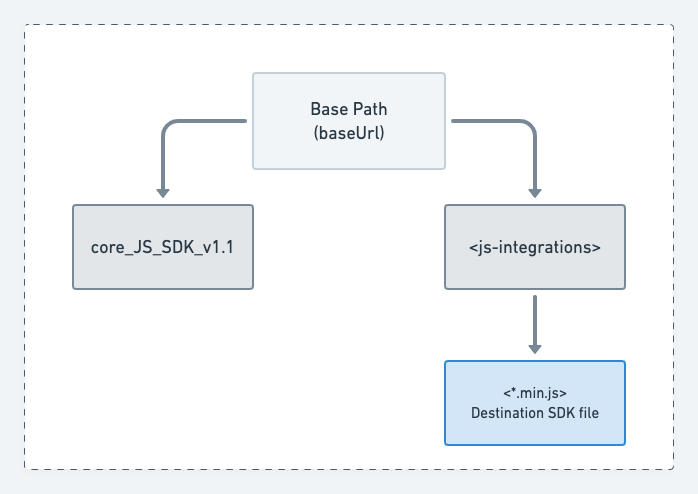

The latest **JavaScript SDK (v1.1)** is the lightweight, efficient, and optimized version of the SDK with a size reduction of approximately 70%, thereby increasing its loading speed considerably.

Another significant improvement in the latest version (v1.1) is that the <Link to="/destinations/rudderstack-connection-modes/#device-mode">device mode</Link> destinations are published as individual plugins and loaded dynamically as per the dashboard configurations. In v1, the device mode destinations were bundled with the core SDK.


The below section covers the detailed steps to migrate to JavaScript SDK v1.1 depending on your JavaScript SDK v1 installation.

## Case 1: Loading the SDK from RudderStack CDN

Update the script tag in your website as shown:

From **v1**:

```html
<script src="https://cdn.rudderlabs.com/v1/rudder-analytics.min.js" />
```

To **v1.1**:

```html
<script src="https://cdn.rudderlabs.com/v1.1/rudder-analytics.min.js" />
```

## Case 2: Forwarding/proxying the RudderStack CDN

1. Log into your CDN provider account.
2. Go to the distribution and set the origin to RudderStack's CDN. Ensure that the entire domain (`https://cdn.rudderlabs.com`) is set as the origin.

<div class="infoBlock">
It is highly recommended to forward the entire CDN path <code class="inline-code">https://cdn.rudderlabs.com</code> so that you don't miss any files/directories that might be added in the future.
</div>

<div class="successBlock">
Refer to the <Link to="/user-guides/how-to-guides/custom-domains/">How to Use Custom Domains</Link> guide for more information on CDN forwarding/proxying.
</div>

3.  Go to **Behaviors** and verify that the sub-path `/v1.1/*` is **not configured to be blocked** in any way. This is required to ensure that both the core SDK and destination SDKs are forwarded properly.
4. Finally, update the script tag in your website as shown:

From **v1**:

```html
<script src="https://<subdomain>.<yourdomain>.com/v1/rudder-analytics.min.js" />
```

To **v1.1**:

```html
<script src="https://<subdomain>.<yourdomain>.com/v1.1/rudder-analytics.min.js" />
```

## Case 3: Self-hosting RudderStack's CDN

If you have cloned RudderStack's JavaScript SDK and are self-hosting it via your own CDN, follow the steps below:

1. Download the core [JavaScript SDK v1.1](https://cdn.rudderlabs.com/v1.1/rudder-analytics.min.js).
2. Download the required destination SDKs.
3. Move all the downloaded files to your preferred location.

It is recommended to maintain the following structure:



4. Check the core SDK's file name:
- If it is **not** `rudder-analytics.min.js`, update the script tag in your website, as shown:

```html
<script>
// rudderanalytics object initialization
// ...
// ...
// provide the location of the destination SDKs in the load options
rudderanalytics.load(WRITE_KEY, DATA_PLANE_URL, {
    destSDKBaseURL: "https://cdn.<yourdomain>.com/js-integrations"
});
// ...
// ...
</script>

<script src="https://cdn.<yourdomain>.com/<your-custom-analytics-file>.js"></script>
```

- If it **is** `rudder-analytics.min.js` and:
  - The destination SDKs are located next to the core SDK file under the `js-integrations` directory, update the script tag as shown:

    ```html
    <script src="https://cdn.<yourdomain>.com/rudder-analytics.min.js"></script>
    ```

  - The destination SDKs are **not** located next to the core SDK file under the `js-integrations` directory, update the script tag as shown:

      ```html
      <script>
      // rudderanalytics object initialization
      // ...
      // ...
      // provide the location of the destination SDKs in the load options
      rudderanalytics.load(WRITE_KEY, DATA_PLANE_URL, {
          destSDKBaseURL: "https://cdn.<yourdomain>.com/custom-js-integrations"
      });
      // ...
      // ...
      </script>

      <script src="https://cdn.<yourdomain>.com/rudder-analytics.min.js"></script>
      ```

## Case 4: Migrating version using NPM

The latest NPM package is based on JavaScript SDK v1.1 architecture and is released with the 2.x.x version.

To update the SDK package using NPM, use any of the following options:

* Upgrade `rudder-sdk-js` package to the latest version using the below command:

```javascript
npm install rudder-sdk-js@latest
```

* Upgrade `rudder-sdk-js` package to a specific version using the below command:

```javascript
npm install rudder-sdk-js@2.x.x
```

* Manually modify the **package.json** file like below and run `npm install`:

```javascript
"dependencies": {
  "rudder-sdk-js": "^2.x.x"
}
```
## Loading device mode destinations

By default, the device mode destinations are loaded from https://cdn.rudderlabs.com/v1.1/js-integrations/ in 2.x.x, depending on the dashboard settings. The name of the destination is appended to the URL as:
https://cdn.rudderlabs.com/v1.1/js-integrations/{dest-name.min.js}

For example, the path for HubSpot is: https://cdn.rudderlabs.com/v1.1/js-integrations/HubSpot.min.js, and Google Analytics is: https://cdn.rudderlabs.com/v1.1/js-integrations/GA.min.js, etc.

If you are loading the device mode destinations from a custom path, use any of the below-mentioned ways depending on your case: 

### Forwarded/proxied RudderStack CDN

Follow the  <Link to="#case-2-forwardingproxying-the-rudderstack-cdn">steps 1, 2 and 3</Link> and finally use the `destSDKBaseURL` option in the SDK's `load()` call, as shown:

```javascript
rudderanalytics.load(WRITE_KEY, DATA_PLANE_URL, {
    destSDKBaseURL: "<custom-path-for-device-mode-destination>", // ex: "https://cdn.<yourdomain>.com/js-integrations"
    ...otherOptions
});
```

### Self-hosted RudderStack CDN

Follow the <Link to="#case-3-self-hosting-rudderstacks-cdn">steps 2 and 3</Link> and finally use the `destSDKBaseURL` option in the SDK's `load()` call, as shown:

```javascript
rudderanalytics.load(WRITE_KEY, DATA_PLANE_URL, {
    destSDKBaseURL: "<custom-path-for-device-mode-destination>", // ex: "https://cdn.<yourdomain>.com/js-integrations"
    ...otherOptions
});
```


<div class="infoBlock">
Replace <Link to="/resources/glossary/#write-key"><code class="inline-code">WRITE_KEY</code></Link> and <Link to="/dashboard-guides/overview/#data-plane-url"><code class="inline-code">DATA_PLANE_URL</code></Link> in the above snippet with the actual values.
</div>

## FAQ

### How are the destination SDKs loaded in v1.1?

In v1.1, the core JavaScript SDK does not contain any destination-specific SDKs by default. It fetches them dynamically from the <Link to="/sources/event-streams/sdks/rudderstack-javascript-sdk/version-migration-guide/#loading-device-mode-destinations">hosted location</Link>, depending on the device mode destinations configured in your dashboard (control plane).

### How does RudderStack determine the root location of the destination SDK?

RudderStack follows the below precedence order while determining the root location of the destination SDK:

1. It refers to the `destSDKBaseURL` value in the `options` parameter of the `load` API call.
2. If absent, it checks the `src` attribute of the `<script>` tag (that adds the core JavaScript SDK to your website) if `/js-integrations` is automatically appended to the root location.
3. If none of the above options are applicable, it uses the default CDN URL: https://cdn.rudderlabs.com/v1.1/js-integrations/.
