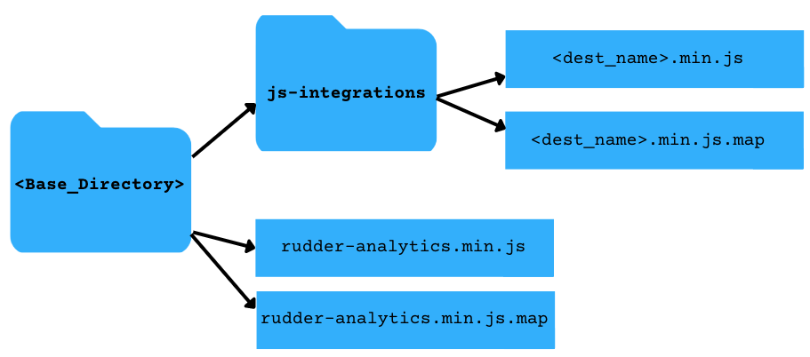

The latest **JavaScript SDK (v1.1)** is the lightweight, efficient, and optimized version of the SDK with a size reduction of approximately 70%, thereby increasing its loading speed considerably.

Another significant improvement in the latest version (v1.1) is that the <Link to="/destinations/rudderstack-connection-modes/#device-mode">device mode</Link> destinations are published as individual plugins and loaded dynamically as per the dashboard configurations. In v1, the device mode destinations were bundled with the core SDK.

## Migrating to JavaScript SDK v1.1

If you have installed the JavaScript SDK v1 from RudderStack CDN, you can simply upgrade it to v1.1 by updating the script tag in your website as shown:

From **v1**:

```html
<script src="https://cdn.rudderlabs.com/v1/rudder-analytics.min.js" />
```

To **v1.1**:

```html
<script src="https://cdn.rudderlabs.com/v1.1/rudder-analytics.min.js" />
```

## Migrating steps for different scenarios

The below section covers detailed steps to migrate to JavaScript SDK v1.1 depending on how you installed JavaScript SDK v1.

### Forwarded/proxied RudderStack CDN

<div class="successBlock">
Refer to the <Link to="/user-guides/how-to-guides/custom-domains/#setup-for-serving-the-sdk">Custom Domains</Link> guide to use a custom domain to forward or proxy the JavaScript SDK hosted on RudderStack CDN.
</div>

The following steps assume that you are using AWS CloudFront to forward or proxy the RudderStack CDN:

1.  Go to **Behaviors** and verify that the sub-path `/v1.1/*` is **not configured to be blocked** in any way. This is required to ensure that both the core SDK and destination SDKs are forwarded properly.
2. Update the script tag in your website as shown:

From **v1**:

```html
<script src="https://<subdomain>.<yourdomain>.com/v1/rudder-analytics.min.js" />
```

To **v1.1**:

```html
<script src="https://<subdomain>.<yourdomain>.com/v1.1/rudder-analytics.min.js" />
```

### Self-hosted JavaScript SDK

<div class="successBlock">
Refer to the <Link to="/user-guides/how-to-guides/self-hosting-js-sdk/">How to host JavaScript SDK on your CDN/Storage</Link> guide for detailed steps on self hosting the JavaScript SDK on your CDN or storage.
</div>

To migrate the self-hosted JavaScript SDK to v1.1, follow any of the three options based on your folder structure:

- If you have self-hosted the JavaScript SDK in the below recommended structure:

  

  <br/>

  Meaning, the file name for the JavaScript SDK is `rudder-analytics.min.js`, and the device mode destination SDKs are located next to the core SDK file under the `js-integrations` directory, update the script tag in your website as shown:

    ```html
    <script src="https://<subdomain>.<yourdomain>.com/<path-to-sdk-base-directory>/rudder-analytics.min.js"></script>
    ```

  - If the file name of your self-hosted JavaScript SDK is `rudder-analytics.min.js`, but the destination SDKs are **not** located next to the core SDK file under the `js-integrations` directory, update the script tag in your website as shown:

      ```html
      <script>
      // rudderanalytics object initialization
      // provide the location of the destination SDKs in the load options
      rudderanalytics.load(WRITE_KEY, DATA_PLANE_URL, {
          destSDKBaseURL: "https://<subdomain>.<yourdomain>.com/<path-to-integration-sdks>"
      });
      // ...
      </script>
      <script src="https://<subdomain>.<yourdomain>.com/<path-to-sdk-base-directory>rudder-analytics.min.js"></script>
      ```

- If your JavaScript SDK file name is **not** `rudder-analytics.min.js`, and the destination SDKs are **not** located under the `js-integrations` directory, update the script tag in your website, as shown:

  ```html
  <script> 
  // rudderanalytics object initialization
  // provide the location of the destination SDKs in the load options
  rudderanalytics.load(WRITE_KEY, DATA_PLANE_URL, {
      destSDKBaseURL: "https://<subdomain>.<yourdomain>.com/<path-to-integration-sdks>"
  });
  // ...
  </script>
  <script src="https://<subdomain>.<yourdomain>.com/<path-to-custom-analytics-file>/<custom-analytics-file.js>"></script>
  ```


### Using NPM

The latest NPM package is based on JavaScript SDK v1.1 architecture and is released with the 2.x.x version.

To update the SDK package using NPM, use any of the following options:

* Upgrade `rudder-sdk-js` package to v1.1 using the below command:

```javascript
npm install rudder-sdk-js@2.x.x
```

* Manually modify the **package.json** file like below and run `npm install`:

```javascript
"dependencies": {
  "rudder-sdk-js": "^2.x.x"
}
```
## Loading device mode destinations

Depending on the dashboard settings, all the destination SDKs are loaded from https://cdn.rudderlabs.com/v1.1/js-integrations/ by default. A specific destination SDK can be located at:
https://cdn.rudderlabs.com/v1.1/js-integrations/&lt;destination_name&gt;.min.js

For example, the path for HubSpot is: https://cdn.rudderlabs.com/v1.1/js-integrations/HubSpot.min.js, and Google Analytics is: https://cdn.rudderlabs.com/v1.1/js-integrations/GA.min.js, etc.

However, if you are loading the device mode destinations from a custom path using any of the below methods:

- <Link to="#forwardedproxied-rudderstack-cdn">Forwarded/proxied RudderStack CDN</Link>
- <Link to="#self-hosted-javascript-sdk">Self-hosted JavaScript SDK</Link>

Then, pass the custom path for the required device mode destination in the `destSDKBaseURL` option in the SDK's `load()` call, as shown:

```javascript
rudderanalytics.load(WRITE_KEY, DATA_PLANE_URL, {
    destSDKBaseURL: "<custom-path-for-device-mode-destination>", // ex: "https://cdn.<yourdomain>.com/js-integrations"
    ...otherOptions
});
```

<div class="infoBlock">
Replace <Link to="/resources/glossary/#write-key"><code class="inline-code">WRITE_KEY</code></Link> and <Link to="/dashboard-guides/overview/#data-plane-url"><code class="inline-code">DATA_PLANE_URL</code></Link> in the above snippet with the actual values.
</div>

## FAQ

### How are the destination SDKs loaded in v1.1?

In v1.1, the core JavaScript SDK does not contain any destination-specific SDKs by default. It fetches them dynamically from the <Link to="/sources/event-streams/sdks/rudderstack-javascript-sdk/version-migration-guide/#loading-device-mode-destinations">hosted location</Link>, depending on the device mode destinations configured in your dashboard (control plane).

### How does RudderStack determine the root location of the destination SDK?

RudderStack follows the below precedence order while determining the root location of the destination SDK:

1. It refers to the `destSDKBaseURL` value in the `options` parameter of the `load` API call.
2. If absent, it checks the `src` attribute of the `<script>` tag (that adds the core JavaScript SDK to your website) if `/js-integrations` is automatically appended to the root location.
3. If none of the above options are applicable, it uses the default CDN URL: https://cdn.rudderlabs.com/v1.1/js-integrations/.
