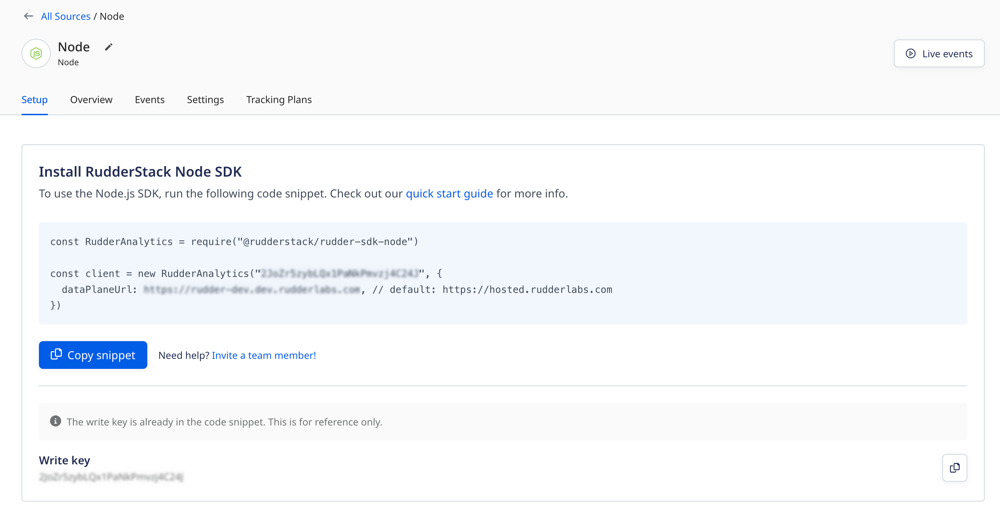

RudderStack's Node SDK lets you track and send the events from your Node.js applications to the specified destinations.

<div class="infoBlock">
Refer to the Node SDK's <a href="https://github.com/rudderlabs/rudder-sdk-node">GitHub codebase</a> for the implementation-specific details.
</div>

<GhBadge
  url={'https://www.npmjs.com/package/@rudderstack/rudder-sdk-node/'}
  repo={'npm/v/@rudderstack/rudder-sdk-node'}
  style={'flat'}
/>

## SDK setup requirements

1. Sign up to [RudderStack Cloud](https://app.rudderstack.com/signup).
2. <Link to="/dashboard-guides/sources/#adding-a-source">Set up a Node source</Link> in the dashboard. You should be able to see the <strong>write key</strong> for this source, as shown:



You will also need the data plane URL. Refer to the <Link to="/dashboard-guides/overview/#data-plane-url">Dashboard Overview</Link> guide for more information on the data plane URL and where to find it.

<div class="successBlock">
The <strong>Setup</strong> tab in the RudderStack dashboard (seen above) has the SDK installation snippet containing both the write key and the data plane URL. Copy it to integrate the Node SDK into your application.
</div>

## Installing the Node.js SDK

To install the RudderStack Node SDK using [npm](https://www.npmjs.com/), run the following command:

```bash
npm install @rudderstack/rudder-sdk-node
```

## Using the SDK

Run the following snippet to use the Node.js SDK. It creates a global RudderStack client object that can be used for all the subsequent event requests.

<Tabs>
  <TabList>
    <Tab>Below v2.0.0</Tab>
    <Tab>v2.0.0 and above</Tab>
  </TabList>
    <TabPanels>
      <TabPanel>
<span>

```javascript
const Analytics = require("@rudderstack/rudder-sdk-node")

// RudderStack requires the batch endpoint of the server you are running
const client = new Analytics(WRITE_KEY, DATA_PLANE_URL / v1 / batch)
```

</span>
      </TabPanel>
      <TabPanel>
<span>

```javascript
const Analytics = require('@rudderstack/rudder-sdk-node');

const client = new Analytics(WRITE_KEY, {
  dataPlaneUrl: DATA_PLANE_URL, // default: https://hosted.rudderlabs.com
});
```
</span>
      </TabPanel>
    </TabPanels>
</Tabs>


## SDK initialization options

The RudderStack Node SDK provides the following parameters which you can pass during the SDK initialization:

| Parameter                   | Data type     | Default value    | Description         |
| :--------------------- | :------- | :------------------------------ | :------------------ |
| `flushAt`              | Integer   | 20                              | Number of events to be flushed when reached this limit.   |
| `flushInterval`        | Integer   | 10000                           |  Maximum timespan (in milliseconds) after which the events from the in-memory queue are flushed. |
| `maxInternalQueueSize` | Integer   | 20000                           |  Maximum length of the in-memory queue.     |
| `logLevel`             | String   | 'info'                          | Log level. For example: `debug`, `error`, etc.     |

The following initialization parameters are only available for RudderStack Node.js SDK **v2.x.x and above**:

| Parameter                   | Data type     | Default value    | Description         |
| :--------------------- | :------- | :------------------------------ | :------------------ |
| `dataPlaneUrl`         | String   | `https://hosted.rudderlabs.com` | Data plane URL.        |
| `path`                 | String   | `/v1/batch`                     | Path to the `batch` endpoint.          |
| `maxQueueSize`         | Integer   | 460800 (500KB)                   | Maximum payload size of a `batch` request.   |
| `axiosConfig`          | Object   | N/A                             | Axios configuration.            |
| `axiosInstance`        | Object   | N/A                             | Axios instance.              |
| `axiosRetryConfig`     | Object   | N/A                             | Axios retry configuration.          |
| `retryCount`           | Integer   | 3                               | Number of times a request is retried by Axios in case of failure.  |
| `errorHandler`         | Function | N/A                             | Function that is called if the request to server fails. |
| `gzip`                 | Boolean  | true                            | Determines whether to compress the request with gzip or not.  |

## Sending events

<div class="warningBlock">
<strong>RudderStack does not store or persist the user state in any of the server-side SDKs</strong>. <br /><br />Unlike the client-side SDKs that deal with a single user at a given time, the server-side SDKs deal with multiple users simultaneously. Therefore, you must specify either the <code class="inline-code">userId</code> or <code class="inline-code">anonymousId</code> <strong>every time</strong> while making any API calls supported by the Node.js SDK.
</div>

## Identify

The <Link to="/event-spec/standard-events/identify/">`identify`</Link> call lets you identify a visiting user and associate them to their actions. It also lets you record the traits about them like their name, email address, etc.

A sample `identify` call is as shown:

```javascript
client.identify({
  userId: "1hKOmRA4GRlm",
  traits: {
    name: "Alex Keener",
    email: "alex@example.com",
    plan: "Free",
    friends: 21,
  },
})
```

The `identify` parameters are as described below:

| **Field**       | **Type** |  **Description**           |
| :------------ | :------- | :------------------- |
| `userId`  <br/> <span style="color: #4D4DFF;font-size:12px;">Required, if <strong>anonymousId</strong> is absent.</span>    | String   | Unique identifier for a user in your database.      |
| `anonymousId` <br/> <span style="color: #4D4DFF;font-size:12px;">Required, if <strong>userId</strong> is absent.</span>       | String    | The SDK automatically sets this identifier in cases where there is no unique identifier for the user.|  
| `context`    | Object   |  An optional dictionary of information that provides context about a message. It is not directly related to the API call. |
| `integrations`     | Object   | An optional dictionary containing the destinations to be either enabled or disabled.                               |
| `timestamp`  | Date     | The timestamp of the message's arrival.                                                                                    |
| [`traits`](https://rudderstack.com/docs/event-spec/standard-events/identify/#identify-traits) | Object   | Dictionary of the user's traits like `name` or `email`.  |

## Track

The <Link to="/event-spec/standard-events/track/">`track`</Link> call lets you track the user actions along with any properties associated with them.

A sample `track` call is shown below:

```javascript
client.track({
  userId: "1hKOmRA4GRlm",
  event: "Item Viewed",
  properties: {
    revenue: 19.95,
    shippingMethod: "Premium",
  },
})
```

The `track` method parameters are as described below:

| **Field**       | **Type** |  **Description**           |
| :------------ | :------- | :------------------- |
| `userId` <br/> <span style="color: #4D4DFF;font-size:12px;">Required, if <strong>anonymousId</strong> is absent.</span>       | String | Unique identifier for a user in your database.                                            |
| `anonymousId` <br/> <span style="color: #4D4DFF;font-size:12px;">Required, if <strong>userId</strong> is absent.</span>   | String | The SDK automatically sets this identifier in cases where there is no unique identifier for the user.|
| `event`  <br/> <span style="color: #4D4DFF;font-size:12px;">Required</span>         | String | Name of the event.    |
| `properties`   | Object |  An optional dictionary of the properties associated with the event.  |
| `context`      | Object | An optional dictionary of information that provides context about a message. It is not directly related to the API call. |
| `timestamp`    | Date   |  The timestamp of the message's arrival.    |
| `integrations` | Object |  An optional dictionary containing the destinations to be either enabled or disabled.   |

## Page

The <Link to="/event-spec/standard-events/page/">`page`</Link> call allows you to record the page views on your application, along with the other relevant information about the page.

A sample `page` call is as shown:

```javascript
client.page({
  userId: "1hKOmRA4GRlm",
  category: "Food",
  name: "Pizza",
  properties: {
    url: "https://example.com",
    title: "Pizza",
    referrer: "https://google.com",
  },
})
```

The `page` method parameters are as described below:

| **Field**       | **Type** |  **Description**           |
| :------------ | :------- | :------------------- |
| `userId` <br/> <span style="color: #4D4DFF;font-size:12px;">Required, if <strong>anonymousId</strong> is absent.</span>       | String | Unique identifier for a user in your database.                                            |
| `anonymousId` <br/> <span style="color: #4D4DFF;font-size:12px;">Required, if <strong>userId</strong> is absent.</span>   | String | The SDK automatically sets this identifier in cases where there is no unique identifier for the user.|
| `name` <br/> <span style="color: #4D4DFF;font-size:12px;">Required</span> | String | Name of the viewed page. |
| `context`      | Object | An optional dictionary of information that provides context about a message. It is not directly related to the API call. |
| `timestamp`    | Date   |  The timestamp of the message's arrival.    |
| `integrations` | Object |  An optional dictionary containing the destinations to be either enabled or disabled.   |
| `properties`   | Object |  An optional dictionary of the properties associated with the viewed page, like `url` and `referrer`.   |

## Screen

The <Link to="/event-spec/standard-events/screen/">`screen`</Link> call is the mobile equivalent of the <Link to="/event-spec/standard-events/page/">`page`</Link> call. It lets you record the screen views on your mobile app along with other relevant information about the screen.

A sample `screen` call is as shown:

```javascript
client.screen({
  userId: "12345",
  category: "Food",
  name: "Pizza",
  properties: {
    screenSize: 10,
    title: "Pizza",
    referrer: "https://google.com",
  },
})
```

The `screen` method parameters are as described below:

| **Field**       | **Type** |  **Description**           |
| :------------ | :------- | :------------------- |
| `userId` <br/> <span style="color: #4D4DFF;font-size:12px;">Required, if <strong>anonymousId</strong> is absent.</span>       | String | Unique identifier for a user in your database.                                            |
| `anonymousId` <br/> <span style="color: #4D4DFF;font-size:12px;">Required, if <strong>userId</strong> is absent.</span>   | String | The SDK automatically sets this identifier in cases where there is no unique identifier for the user.|
| `name` <br/> <span style="color: #4D4DFF;font-size:12px;">Required</span> | String | Name of the viewed page. |
| `context`      | Object | An optional dictionary of information that provides context about a message. It is not directly related to the API call. |
| `timestamp`    | Date   |  The timestamp of the message's arrival.    |
| `integrations` | Object |  An optional dictionary containing the destinations to be either enabled or disabled.   |
| `properties`   | Object   | An optional dictionary of the properties associated with the screen, like `url` or `referrer`.                  |

## Group

The <Link to="/event-spec/standard-events/group/">`group`</Link> call lets you link an identified user with a group, such as a company, organization, or an account. It also lets you record any custom traits or properties associated with that group.

A sample `group` call is as shown:

```javascript
client.group({
  userId: "12345",
  groupId: "1",
  traits: {
    name: "Company",
    description: "Google",
  },
})
```

The `group` method parameters are as follows:

| **Field**       | **Type** |  **Description**           |
| :------------ | :------- | :------------------- |
| `userId` <br/> <span style="color: #4D4DFF;font-size:12px;">Required, if <strong>anonymousId</strong> is absent.</span>       | String | Unique identifier for a user in your database.                                            |
| `anonymousId` <br/> <span style="color: #4D4DFF;font-size:12px;">Required, if <strong>userId</strong> is absent.</span>   | String | The SDK automatically sets this identifier in cases where there is no unique identifier for the user.|
| `groupId` <br/> <span style="color: #4D4DFF;font-size:12px;">Required</span>     | String   | Unique identifier for the group present in your database.        |
| `context`      | Object   | An optional dictionary of information that provides context about a message. It is not directly related to the API call. |
| `integrations` | Object   | An optional dictionary containing the destinations to be either enabled or disabled.  |
| `traits`       | Object   |  An optional dictionary of the group's traits like `name`or `email`.            |
| `timestamp`    | Date     | The timestamp of the message's arrival. |

## Alias

The <Link to="/event-spec/standard-events/alias/">`alias`</Link> call lets you merge different identities of a known user. It is an advanced method that lets you change the tracked user's ID explicitly. You can use `alias` for managing the user's identity in some of the downstream destinations.

<div class="warningBlock">
RudderStack supports sending <code class="inline-code">alias</code> events only to select downstream destinations. Refer to the <Link to="/destinations/streaming-destinations/">destination-specific documentation</Link> for more details.
</div>

A sample `alias` call is as shown:

```javascript
client.alias({
  previousId: "old_id",
  userId: "new_id",
})
```

The `alias` method parameters are as mentioned below:

| **Field**       | **Type** |  **Description**           |
| :------------ | :------- | :------------------- |
| `userId` <br/> <span style="color: #4D4DFF;font-size:12px;">Required</span>       | String | Unique identifier for a user in your database.                                            |
| `anonymousId`   | String | The SDK automatically sets this identifier in cases where there is no unique identifier for the user.|
| `previousId` <br/> <span style="color: #4D4DFF;font-size:12px;">Required</span>  | String   | The previous unique identifier of the user.       |
| `context`      | Object   | An optional dictionary of information that provides context about a message. It is not directly related to the API call.  |
| `integrations` | Object   |  An optional dictionary containing the destinations to be either enabled or disabled.   |
| `traits`       | Object   | An optional dictionary of the user's traits like `name` or `email`.     |
| `timestamp`    | Date     | The timestamp of the message's arrival.   |

## Data persistence

<div class="warningBlock">
This is a beta feature. Contact the RudderStack team on <a href="https://rudderstack.com/join-rudderstack-slack-community">Slack</a> if you face any issues.
</div>

If the Node SDK fails to deliver the events to RudderStack in the first attempt, it retries the event delivery. However, if RudderStack is unavailable for a longer duration, there is a possibility of data loss. To prevent this scenario, the SDK has the data persistence feature where the event data is persisted in **Redis**, guaranteeing event delivery. Simultaneously, the SDK can retry multiple times as the queue is maintained in a different process space (Redis).

<div class="infoBlock">
To use this feature, you will need to host a Redis server to use it as the intermediary data storage queue. RudderStack uses <a href="https://github.com/OptimalBits/bull">Bull</a> as the interface layer between the Node SDK and Redis.
</div>

To achieve data persistence, you need to call the `createPersistenceQueue` method which takes two parameters - `queueOpts` and `callback`. It initializes the persistent queue. A sample SDK initialization is shown below:

<Tabs>
  <TabList>
    <Tab>Below v2.0.0</Tab>
    <Tab>v2.0.0 and above</Tab>
  </TabList>
    <TabPanels>
      <TabPanel>
<span>

```jsx
const client = new Analytics("write_key","DATA_PLANE_URL/v1/batch",{
    flushAt: <number> = 20,
    flushInterval: <ms> = 20000
    // the max number of elements that the SDK can hold in memory,
    // this is different than the Redis list created when persistence is enabled.
    // This restricts the data in-memory when Redis is down, unreachable etc.
    maxInternalQueueSize: <number> = 20000
});

client.createPersistenceQueue({ redisOpts: { host: "localhost" } }, err => {})
```

</span>
      </TabPanel>
      <TabPanel>
<span>

```jsx
const client = new Analytics("WRITE_KEY", {
    dataPlaneUrl: DATA_PLANE_URL // default: https://hosted.rudderlabs.com with default path set to /v1/batch
    flushAt: <number> = 20,
    flushInterval: <ms> = 20000
    // the max number of elements that the SDK can hold in memory,
    // this is different than the Redis list created when persistence is enabled.
    // This restricts the data in-memory when Redis is down, unreachable etc.
    maxInternalQueueSize: <number> = 20000
});

client.createPersistenceQueue({ redisOpts: { host: "localhost" } }, err => {})
```
</span>
      </TabPanel>
    </TabPanels>
</Tabs>

<div class="warningBlock">
If the <code class="inline-code">createPersistenceQueue</code> method is not called after initializing the SDK, the SDK will work without any persistence.
</div>

### `queueOpts`

The syntax for `createPersistenceQueue` method is as follows:

`client.createPersistenceQueue(QueueOpts, callback)`

A sample `queueOpts` initialization is shown below:

```javascript
queueOpts {
    queueName ?: string = rudderEventsQueue,
    isMultiProcessor ? : boolean = false
    // pass a value without the {}, this will used as prefix to Redis keys,
    // needed to support Redis cluster slots.
    prefix ? : string = {rudder},
    redisOpts : RedisOpts,
    jobOpts ?: JobOpts
}
```

The specification of the different `queueOpts` parameters is listed in the following table:

| **Parameter** | **Description** | **Default Value** |
| :--- | :--- | :--- |
| `queueName` | Name of the queue. | `20` |
| `isMultiProcessor` | Determines whether to handle previously active jobs. If set to `false`, the previously active job will be picked up first by the processor. Otherwise, Bull moves this job to the back of the Redis queue to be picked up after the already pushed event. | `false` |
| `prefix` | Used as the prefix to the Redis keys needed to support the Redis cluster slots. | `20000` |
| `redisOpts` | Refer to the <Link to="#redisopts">`RedisOpts`</Link> section below. | `RedisOpts` |
| `jobOpts` | Refer to the <Link to="#jobopts">`JobOpts`</Link> section below. | `JobOpts` |

For more information on these parameters, refer to the [Bull docs](https://github.com/OptimalBits/bull/blob/develop/REFERENCE.md#queue).

<div class="warningBlock">
If the same queue (RudderStack SDK initialized with the same queue name) is used in case of multiple servers (server-side SDKs), set the value of <code class="inline-code">isMultiProcessor</code> to <code class="inline-code">true</code> as event ordering is not applicable in this case.
</div>

#### `RedisOpts`

```jsx
RedisOpts {
    port?: number = 6379;
    host?: string = localhost;
    db?: number = 0;
    password?: string;
}
```

#### `JobOpts`

```javascript
JobOpts {
    maxAttempts ? : number = 10
}
```

### `callback`

In case of an error, the `createPersistenceQueue` method returns a callback. You should retry sending the events in this scenario.

```jsx
// createPersistenceQueue calls this with error or nothing(in case of success), // user should retry in case of error
callback: function(error) || function()
```

Calling the `createPersistenceQueue` method initializes a Redis list by calling the [Bull's](https://github.com/OptimalBits/bull) utility methods. It also adds a **single** job processor for the processing (making requests to RudderStack) jobs that are pushed into the list. Any error encountered while doing this leads to a callback with the error.

<div class="infoBlock">
If the callback returns with an error, RudderStack recommends retry calling <code class="inline-code">createPersistenceQueue</code> with a backoff.
</div>

###  Event flow

- Calling the SDK methods like `track`, `page`, `identify`, etc. pushes the events to an in-memory array.
- The events from the array are flushed as a `batch` to the Redis persistence based on the `flushAt` and `flushInterval` settings. The in-memory array has a maximum size of `maxInternalQueueSize`. **Once this size limit is reached,** __**the events won't be accepted if not drained to the other side \(cases where Redis connection is slow or the Redis server is not reachable\).**
- The processor will take the batch from the Redis list and make a request to RudderStack. In case of an error, the processor will retry sending the data again if the error can be retried \(errors with status code `5xx and 429`\). **The retry will go up to `JobOpts.maxAttempts` with an** **exponential backoff of power 2 with max backoff of 30 seconds**.
- If the job fails even after `JobOpts.maxAttempts`, it will not be retried again and pushed to a `failed queue`. **You can retry them later manually using Bull’s utility methods** [**listed here**](https://github.com/OptimalBits/bull/blob/develop/REFERENCE.md#queuegetfailed) **or get them from Redis directly**.
- There might be a scenario where the node process dies with the jobs still in active state \(not completed nor failed but in the process of sending/retrying\). Since the RudderStack SDK has only **1 processor for sending events** \(this count should always be **1**\), the next time the SDK is initialized and `createPersistenceQueue` is called, **the jobs will be picked up first by the processor to get processed to maintain event ordering based on the value of `QueueOpts.isMultiProcessor`**.
- For multiple servers \(SDK\) connecting to the same queue \(`QueueOpts.queueName`\), there will be multiple processors fetching events from the same queue and event ordering won’t be implemented. Hence, `QueueOpts.isMultiProcessor` should be set to **`true`.**