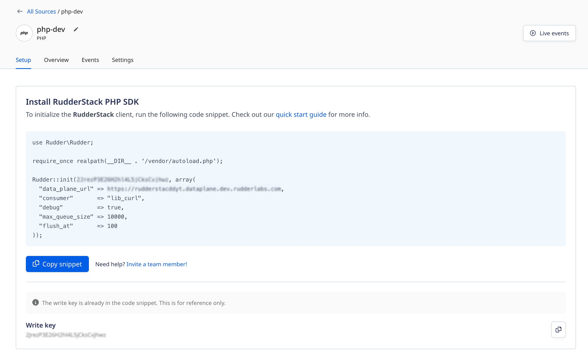

RudderStack's PHP SDK lets you track and send the events from your PHP applications to the specified destinations.

<div class="infoBlock">
RudderStack's PHP SDK supports PHP version 7.4 and above. Refer to the PHP SDK's <a href="https://github.com/rudderlabs/rudder-php-sdk">GitHub codebase</a> for the implementation-specific details.
</div>

<GhBadge
  url={'https://packagist.org/packages/rudderstack/rudder-php-sdk'}
  repo={'packagist/v/rudderstack/rudder-php-sdk'}
  style={'flat'}
/>

## SDK setup requirements

1. Sign up to [RudderStack Cloud](https://app.rudderstack.com/signup).
2. <Link to="/dashboard-guides/sources/#adding-a-source">Set up a PHP source</Link> in your dashboard. You should be able to see the <strong>write key</strong> for this source, as shown:



You will also need the data plane URL. Refer to the <Link to="/dashboard-guides/overview/#data-plane-url">Dashboard Overview</Link> guide for more information on the data plane URL and where to find it.

<div class="successBlock">
The <strong>Setup</strong> tab in the RudderStack dashboard (seen above) has the SDK installation snippet containing both the write key and the data plane URL. Copy it to integrate the PHP SDK into your application.
</div>

## Installing the PHP SDK

Install the RudderStack PHP SDK using the [**composer**](https://packagist.org/packages/rudderstack/rudder-php-sdk). You can also do so by running the following command:

```bash
git clone https://github.com/rudderlabs/rudder-php-sdk /my/app/folders/
```

Then, use the composer to install the PHP SDK by running the following command:

```bash
composer require rudderstack/rudder-php-sdk
```

## Initializing the RudderStack client

To initialize the RudderStack client, run the following code snippet:

```php
use Rudder\Rudder;

require_once realpath(__DIR__ . '/vendor/autoload.php');

Rudder::init(WRITE_KEY, array(
  "data_plane_url" => DATA_PLANE_URL,
  "consumer"       => "lib_curl",
  "debug"          => false,
  "max_queue_size" => 10000,
  "flush_at"       => 100,
  "ssl"            => true
));
```

<div class="infoBlock">
RudderStack accepts the <code class="inline-code">DATA_PLANE_URL</code> with or without the protocol. If the protocol is missing, RudderStack automatically prepends it to the URL based on whether the <code class="inline-code">ssl</code> option is set to <code class="inline-code">true</code> or <code class="inline-code">false</code>.
</div>

RudderStack accepts the following data plane URL formats:

| **SSL** | **Data Plane URL**              |
| :------ | :------------------------------ |
| `true`  | `https://example.dataplane.com` |
| `true`  | `example.dataplane.com`         |
| `false` | `http://example.dataplane.com`  |
| `false` | `example.dataplane.com`         |

<div class="warningBlock">
While initializing the RudderStack client, the <code class="inline-code">ssl</code> field is optional if you are using the HTTPS protocol. If included, its value must be set to <code class="inline-code">true</code>. In case of the HTTP protocol, <code class="inline-code">ssl</code> is a required field and must always be set to <code class="inline-code">false</code>.
</div>

### SDK initialization options

The RudderStack PHP SDK provides the following initialization options:

| Option        | Data type         | Description     |
| :----------- | :--------------- | :----------|
|  `consumer`           | String      | Explicitly marks which consumer to use. The default value is `lib_curl`. Refer to the <Link to="#consumers">Consumers</Link> section for more information. |
|  `data_plane_url `       | String | Explicitly sets the data plane URL. The default value is `hosted.rudderlabs.com`.  |
|  `debug`          | Boolean  |  Determines whether to log messages and wait for a response. The default value is `false`. It makes the queuing consumers non-async and blocks the library until a response is received from the API. Hence it is **not recommended** for production use.  |
|  `ssl`           | Boolean      | Determines whether to use TLS instead of SSL for the socket connection. The default value is `false`. |
|  `error_handler`       | Function | Function to handle errors and is particularly useful for debugging. Note that if the debug mode is not specified, then the `error_handler` is only called on connection level errors and timeouts. For example, `function ($code, $message) {}`.   |
|  `max_queue_size`           | Integer      | Max size of the queue. The default value is 10000 items. |
|  `batch_size`       | Integer | Items to be sent in a single curl request. The default value is 100. It is recommended to use `flush_at` instead of `batch_size` as this option is deprecated.   |
|  `flush_at`           | Integer      | Items to be sent in a single curl request. The default value is 100. |
|  `timeout `       | Integer | Number of seconds to wait for the socket request to time out. The default value is 0.5.  |
|  `filename`           | String      |Location to write the log file. The default value is `/tmp/analytics.log` when the file consumer is selected. |
|  `compress_request`       | Boolean | Determines whether to use gzipped request payloads. The default value is `true`. It is supported for <a href="https://github.com/rudderlabs/rudder-server">RudderStack server</a> v1.4.0 and above.  |
|  `flush_interval`           | Integer      | Frequency in milliseconds to send data using flush method execution. The default value is 10000 miliseconds. |
|  `curl_timeout `       | Integer | Timeout for the curl connections. The default value is 0, meaning infinite. |
|  `curl_connecttimeout`           | Integer      | Connect timeout for the curl connections. The default value is 300. |
|  `max_item_size_bytes`       | Integer | Maximum message item size. The default value is 32000 bytes (32KB). |
|  `max_queue_size_bytes`           | Integer      | Maximum batch size. The default value is 512000 bytes (512KB).   |
|  `filepermissions `       | String | File permissions for file consumer. The default value is 0644.   |

## Migrating from v1 to v2

To migrate to PHP SDK v2, make sure the following conditions are met:

- Your PHP version should be v7.4 or above.
- If you are using self-hosted <a href="https://github.com/rudderlabs/rudder-server">rudder-server</a>, either upgrade it to v1.4.0 or above, or disable the gzipped request payloads  (by setting `compress_request` to `false`).

## Sending events from the RudderStack client

<div class="warningBlock">
<strong>RudderStack does not store or persist the user state in any of the server-side SDKs</strong>. <br /><br />Unlike the client-side SDKs that deal with a single user at a given time, the server-side SDKs deal with multiple users simultaneously. Therefore, you must specify either the <code class="inline-code">userId</code> or <code class="inline-code">anonymousId</code> <strong>every time</strong> while making any API calls supported by the PHP SDK.
</div>

## Identify

The <Link to="/event-spec/standard-events/identify/">`identify`</Link> call lets you identify a visiting user and associate them to their actions. It also lets you record the traits about them like their name, email address, etc.

A sample `identify` call made using the PHP SDK is shown below:

```php
Rudder::identify(array(
  "userId" => "1hKOmRA4GRlm",
  "traits" => array(
    "email" => "alex@example.com",
    "name" => "Alex Keener",
    "friends" => 25
  )
));
```

The `identify` method parameters are as described below:

| **Field**      | **Type** | **Description**        |
| :------------- | :------- | :------------- |
| `anonymousId` <br/> <span style="color: #4D4DFF;font-size:12px;">Required, if <strong>userId</strong> is absent.</span> | String   | The SDK automatically sets this identifier in cases where there is no unique identifier for the user. |
| `userId` <br/> <span style="color: #4D4DFF;font-size:12px;">Required, if <strong>anonymousId</strong> is absent.</span>      | String   |  Unique identifier for a particular user in your database.                                                                  |
| `context`      | Object   |  An optional dictionary of information that provides context about a message. It is not directly related to the API call.      |
| `integrations` | Object   |  An optional dictionary containing the destinations to be either enabled or disabled.     |
| `timestamp`    | Date     | The timestamp of the message's arrival.        |
| `traits`       | Object   | Dictionary of the user's traits like `name` or `email`.    |

## Track

The <Link to="/event-spec/standard-events/track/">`track`</Link> call lets you record the user actions along with their associated properties. Each user action is called an **event**.

A sample `track` call is shown below:

```php
Rudder::track(array(
  "userId" => "f4ca124298",
  "event" => "Article Bookmarked",
  "properties" => array(
    "title" => "Snow Fall",
    "subtitle" => "The Avalanche at Tunnel Creek",
    "author" => "John Branch"
  )
));
```

The `track` method parameters are as described below:

| Name           | Type   | Description     |
| :------------- | :----- | :------------------------------- |
| `user_id` <br/> <span style="color: #4D4DFF;font-size:12px;">Required, if <strong>anomymousId</strong> is absent.</span>     | String |  Unique identifier for a user in your database.   |
| `anonymous_id` <br/> <span style="color: #4D4DFF;font-size:12px;">Required, if <strong>userId</strong> is absent.</span>| String |  The SDK automatically sets this identifier in cases where there is no unique identifier for the user.  |
| `event` <br/> <span style="color: #4D4DFF;font-size:12px;">Required</span>        | String | Name of the event.                                                                    |
| `properties`   | Object |  An optional dictionary of information that provides context about the message. It is not directly related to the API call.  |
| `context`      | Object |  Dictionary of information that provides context about a message. However, it is not directly related to the API call.      |
| `timestamp`    | Date   |  The timestamp of the message's arrival.                                                                                    |
| `integrations` | Object |   An optional dictionary containing the destinations to be enabled or disabled.                                    |

## Page

The <Link to="/event-spec/standard-events/page/">`page`</Link> call allows you to record the page views on your application, along with the other relevant information about the page.

A sample `page` call is as shown:

```php
Rudder::page(array(
  "userId" => "f4ca124298",
  "category" => "Docs",
  "name" => "PHP library",
  "properties" => array(
    "url" => "https://rudderstack.com/libraries/php/"
  )
));
```

The `page` method parameters are as described below:

| **Field**      | **Type** | **Description**                  |
| :------------- | :------- | :-------------------------------- |
| `userId`   <br/> <span style="color: #4D4DFF;font-size:12px;">Required, if <strong>anonymousId</strong> is absent.</span>    | String   |Unique identifier for a user in your database.      |
| `anonymousId` <br/> <span style="color: #4D4DFF;font-size:12px;">Required, if <strong>userId</strong> is absent.</span> | String   |  The SDK automatically sets this identifier in cases where there is no unique identifier for the user.  |
| `context`      | Object   |  An optional dictionary of information that provides context about the event. It is not directly related to the API call.     |
| `integrations` | Object   |  An optional dictionary containing the destinations to be enabled or disabled.                           |
| `name`  <br/> <span style="color: #4D4DFF;font-size:12px;">Required</span>        | String         |  Name of the viewed page.                  |
| `properties`   | Object   |  An optional dictionary of the properties associated with the viewed page, like `url` and `referrer`.      |
| `timestamp`    | Date     |  The timestamp of the message's arrival.                    |

## Screen

The <Link to="/event-spec/standard-events/screen/">`screen`</Link> call is the mobile equivalent of the <Link to="/event-spec/standard-events/page/">`page`</Link> call. It lets you record the screen views on your mobile app along with other relevant information about the screen.

A sample `screen` call is as shown:

```php
Rudder::screen(array(
  "userId" => "f4ca124298",
  "category" => "Docs",
  "name" => "PHP library",
  "properties" => array(
    "name" => "HomeScreen"
  )
));
```

The `screen` method parameters are as described below:

| **Field**      | **Type** | **Description**                 |
| :------------- | :------- |  :---------------------------- |
| `userId`  <span style="color: #4D4DFF;font-size:12px;">Required, if <strong>anonymousId</strong> is absent.</span>     | String   | Unique identifier for a user in your database.            |
| `anonymousId` <span style="color: #4D4DFF;font-size:12px;">Required, if <strong>userId</strong> is absent.</span> | String   | The SDK automatically sets this identifier in cases where there is no unique identifier for the user. |
| `context`      | Object   |  An optional dictionary of information that provides context about the event. It is not directly related to the API call.  |
| `integrations` | Object   | An optional dictionary containing the destinations to be enabled or disabled.                                   |
| `name` <span style="color: #4D4DFF;font-size:12px;">Required, if <strong>userId</strong> is absent.</span>        | String                                  | Name of the viewed screen.                         |
| `properties`   | Object   | An optional dictionary of the properties associated with the screen, like `url` and `referrer`.      |
| `timestamp`    | Date     |  The timestamp of the message's arrival.                                                                                    |

## Group

The <Link to="/event-spec/standard-events/group/">`group`</Link> call lets you link an identified user with a group, such as a company, organization, or an account. It also lets you record any custom traits or properties associated with that group.
A sample `group` call is as shown:

```php
Rudder::group(array(
  "userId" => "2sfjej334",
  "groupId" => "2sfjej334erresd",
  "traits" => array(
    "email" => "alex@example.com",
    "name" => "Alex Keener",
    "friends" => 25
  )
));
```

The `group` method parameters are as follows:

| **Field**      | **Type** | **Description**      |
| :------------- | :------- | :--------------------------------- |
| `userId` <br/> <span style="color: #4D4DFF;font-size:12px;">Required, if <strong>anonymousId</strong> is absent.</span>       | String   |  Unique identifier for a user in your database.                                     |
| `anonymousId` <br/> <span style="color: #4D4DFF;font-size:12px;">Required, if <strong>userId</strong> is absent.</span>  | String   |   The SDK automatically sets this identifier in cases where there is no unique identifier for the user. |
| `context`      | Object   | An optional dictionary of information that provides context about the event. It is not directly related to the API call. |
| `integrations` | Object   |  An optional dictionary containing the destinations to be enabled or disabled.                     |
| `groupId` <br/> <span style="color: #4D4DFF;font-size:12px;">Required</span>     | String   | Unique identifier of the group, as present in your database.                                                               |
| `traits`       | Object   |  Dictionary of the user's traits like `name` or `email`.                      |
| `timestamp`    | Date     | The timestamp of the message's arrival.                                                                                    |

## Alias

The <Link to="/event-spec/standard-events/alias/">`alias`</Link> call lets you merge different identities of a known user. It is an advanced method that lets you change the tracked user's ID explicitly. You can use `alias` for managing the user's identity in some of the downstream destinations.

<div class="warningBlock">
RudderStack supports sending <code class="inline-code">alias</code> events only to select downstream destinations. Refer to the <Link to="/destinations/streaming-destinations/">destination-specific documentation</Link> for more details.
</div>

A sample `alias` call is as shown:

```php
Rudder::alias(array(
  "previousId" => "previousId",
  "userId" => "2sfjej334",
));
```

The `alias` method parameters are as mentioned below:

| **Field**      | **Type** | **Description**          |
| :------------- | :------- | :--------------------------- |
| `userId`  <br/> <span style="color: #4D4DFF;font-size:12px;">Required, if <strong>anonymousId</strong> is absent.</span>     | String   |  Unique identifier for a user in your database.                           |
| `previousId` <br/> <span style="color: #4D4DFF;font-size:12px;">Required</span>  | String    | The previous unique identifier of the user.                     |
| `context`      | Object   | An optional dictionary of information that provides context about the event. It is not directly related to the API call.  |
| `integrations` | Object   |  An optional dictionary containing the destinations to be enabled or disabled.                 |
| `traits`       | Object   | Dictionary of the properties or traits associated with the group, such as `email` or `name`.                          |
| `timestamp`    | Date     | The timestamp of the message's arrival.                                                                               |

<div class="infoBlock">
For a detailed explanation of the <code class="inline-code">alias</code> call, refer to our <a href="https://rudderstack.com/docs/event-spec/standard-events/alias">RudderStack API Specification</a> guide.
</div>

## Consumers

You can specify the following consumers to make requests to RudderStack:

### Lib-Curl Consumer

The [lib-curl consumer](https://github.com/rudderlabs/rudder-php-sdk/blob/develop/lib/Consumer/LibCurl.php) is RudderStack's default PHP library. You can use it for faster response during lighter loads. It runs synchronously, queuing and sending calls in batches to RudderStack. 

### Fork-Curl Consumer

The [fork-curl consumer](https://github.com/rudderlabs/rudder-php-sdk/blob/develop/lib/Consumer/ForkCurl.php) can be used when you can't use persistent sockets or want to ensure quick response for lighter loads. It creates an in-memory queue which buffers the `identify` and `track` calls. The queue is flushed by forking an async `curl` process that sends a batch request. It happens after every `100` calls or at the end of serving the page, by default. 

### Socket Consumer

You can use the [socket consumer](https://github.com/rudderlabs/rudder-php-sdk/blob/develop/lib/Consumer/Socket.php) which lets you make requests to RudderStack when you can't spawn other processes from your PHP scripts. It initiates  a socket request to RudderStack servers each time an `identify` or `track` call is made. The socket request writes the event data and closes the connection before waiting for a response. It is recommended to use some other consumer if your servers are dealing with hundreds of requests per second or cannot use a persistent connection.

### File Consumer

You can also use the [file consumer](https://github.com/rudderlabs/rudder-php-sdk/blob/develop/lib/Consumer/File.php) for making requests to RudderStack. It records each `identify` or `track` call you make to a log file. Further, it uploads the log file by running the `file.php` file in RudderStack's [github repository](https://github.com/rudderlabs/rudder-php-sdk/blob/develop/lib/Consumer/File.php).

You can run the `examples/SendBatchFromFile.php` file to upload your log file to RudderStack, as shown:

```bash
php examples/SendBatchFromFile.php --secret YOUR_WRITE_KEY --file /tmp/analytics.log
```

<div class="infoBlock">
It is recommended to run this command as a cron job after every few minutes so that your log files are created in manageable sizes. Every time you run the command, it removes the old log files once they are processed successfully.
</div>

You can create a new cron job to upload your log files, as shown in the following snippet:

```bash
$ # create a cron job that runs as www-data every minute
$ echo '*/1 * * * * www-data php /my/path/to/analytics-php/SendBatchFromFile.php > /dev/null' | sudo tee /etc/cron.d/analytics
$ sudo service cron reload    # reload the cron daemon
```