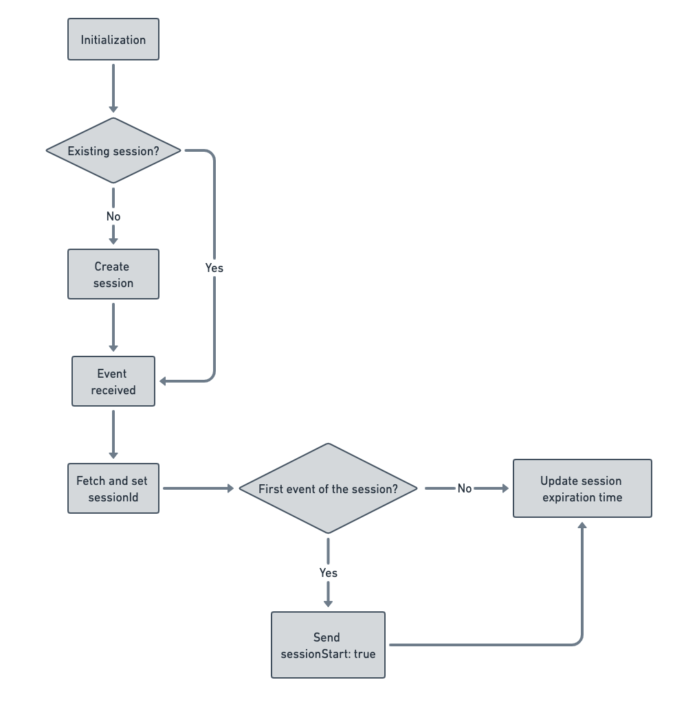
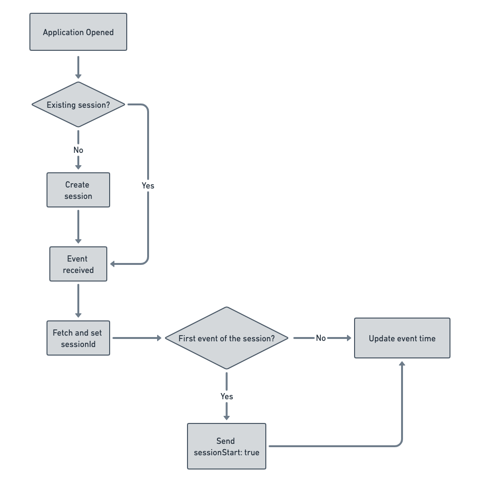

## What is a session?

A session is a group of user interactions with your website or mobile app within a given time frame. It is usually triggered when a user opens a mobile app or a website in their browser and ends after a particular period of inactivity.

<div class="infoBlock">
A single session can contain multiple page views or screen views, events, social interactions, and e-commerce transactions.
</div>

## Session tracking in RudderStack

You can use RudderStack's session tracking feature to determine the average time users spend on an app and how they engage with it. By combining the session metadata with the usage data like event tracking, you can better understand the user's product journey and analyze their behavior effectively. You can also use the resulting insights to identify problems and optimization opportunities in your product workflow.

<div class="infoBlock">
The following RudderStack SDKs support the session tracking feature:
<ul>
<li><Link to="/sources/event-streams/sdks/rudderstack-javascript-sdk/">JavaScript</Link></li>
<li><Link to="/sources/event-streams/sdks/rudderstack-android-sdk/">Android</Link></li>
<li><Link to="/sources/event-streams/sdks/rudderstack-ios-sdk/">iOS</Link></li>
</ul>
</div>

If the session tracking feature is enabled, you can expect the following properties in your event's `context` object:

- `sessionId` (Number): The unique session ID.
- `sessionStart` (Boolean): Present in the first event, indicating the start of the session.

<div class="warningBlock">
The session tracking feature overrides any <code class="inline-code">sessionId</code> set in the event's <code class="inline-code">context</code> object. Hence, it is strongly recommended to send any session-related information in the event's traits or properties.
</div>

## Automatic session tracking

**By default, the above-mentioned RudderStack SDKs automatically track the user sessions**. This means that RudderStack automatically determines the start and end of a session depending on the inactivity time configured in the SDK.

<div class="infoBlock">
RudderStack also lets you start and end user sessions manually. Refer to the <Link to="#manual-session-tracking">Manual session tracking</Link> section below for more information.
</div>

### JavaScript SDK

In case of the JavaScript SDK, RudderStack considers the <Link to="/sources/event-streams/sdks/rudderstack-javascript-sdk/load-js-sdk/">SDK initialization</Link> as the start of a user session.

To disable automatic session tracking, you can set the load option `autoTrack` to `false`, as shown:

```javascript
rudderanalytics.load(WRITE_KEY, DATA_PLANE_URL, {
  sessions: {
    autoTrack: false,  // Set to false to disable automatic session tracking
  },
  ...<otherLoadOptions>
});
```

By default, a session is active until **30 minutes of inactivity** have elapsed since the last received event. However, you can adjust this limit using the `timeout` load option, as shown:

```javascript
rudderanalytics.load(WRITE_KEY, DATA_PLANE_URL, {
  sessions: {
    autoTrack: true,
    timeout: 10 * 60 * 1000,  // 10 min in milliseconds
  },
  ...<otherLoadOptions>
});
```

Every time a new event is generated (`track`, `page`, `identify`, etc.), the SDK resets the session expiration time by adding the configured `timeout` (default **30 minutes**) to the last received event's <Link to="/event-spec/standard-events/common-fields/#clock-skew-considerations">`timestamp`</Link>.

<div class="infoBlock">
For more information on how session tracking works in the JavaScript SDK, refer to the <Link to="#session-tracking-flow">Session tracking flow</Link> section below.
</div>

### Mobile SDKs

<div class="warningBlock">
To automatically track sessions in the Android and iOS SDK, <code class="inline-code">withTrackLifecycleEvents</code> should also be set to true. This is because RudderStack considers the <Link to="/event-spec/standard-events/application-lifecycle-events-spec/#application-opened">Application Opened</Link>, <Link to="/event-spec/standard-events/application-lifecycle-events-spec/#application-installed">Application Installed</Link>, or <Link to="/event-spec/standard-events/application-lifecycle-events-spec/#application-updated">Application Updated</Link> events as the start of a new session.
</div>

#### Android

By default, automatic session tracking is enabled in the <Link to="/sources/event-streams/sdks/rudderstack-android-sdk/">Android</Link> SDK, as shown:

<Tabs>
  <TabList>
    <Tab>Kotlin</Tab>
    <Tab>Java</Tab>
  </TabList>
    <TabPanels>
      <TabPanel>
<span>

```kotlin
val rudderClient = RudderClient.getInstance(
    this,
    WRITE_KEY,
    RudderConfig.Builder()
        .withDataPlaneUrl(DATA_PLANE_URL)
        .withAutoSessionTracking(true)  // Set to false to disable automatic session tracking
        .withSessionTimeoutMillis(5*60*1000)
        .build()
)
```
</span>
      </TabPanel>
      <TabPanel>
<span>

```java
RudderClient rudderClient = RudderClient.getInstance(
    this,
    WRITE_KEY,
    new RudderConfig.Builder()
        .withDataPlaneUrl(DATA_PLANE_URL)
        .withAutoSessionTracking(true) // Set to false to disable automatic session tracking
        .withSessionTimeoutMillis(5*60*1000)
        .build()
);
```
</span>
      </TabPanel>
    </TabPanels>
</Tabs>

To disable automatic session tracking, set `withAutoSessionTracking` to `false`.

#### iOS

By default, automatic session tracking is enabled in the <Link to="/sources/event-streams/sdks/rudderstack-ios-sdk/">iOS</Link> SDK, as shown:

<Tabs>
  <TabList>
    <Tab>Objective-C</Tab>
    <Tab>Swift</Tab>
  </TabList>
    <TabPanels>
      <TabPanel>
<span>

```objectivec
RSConfigBuilder *builder = [[RSConfigBuilder alloc] init];
[builder withDataPlaneUrl:DATA_PLANE_URL];
[builder withAutoSessionTracking:YES];  // Set to No to disable automatic session tracking
[builder withSessionTimeoutMillis:(5*60*1000)];
[RSClient getInstance:WRITE_KEY config:[builder build]];
```
</span>
      </TabPanel>
      <TabPanel>
<span>

```swift
let builder: RSConfigBuilder = RSConfigBuilder()
            .withDataPlaneUrl(DATA_PLANE_URL)
            .withAutoSessionTracking(true)  // Set to false to disable automatic session tracking
            .withSessionTimeoutMillis(5*60*1000)
RSClient.getInstance(WRITE_KEY, config: builder.build())
```
</span>
      </TabPanel>
    </TabPanels>
</Tabs>

To disable automatic session tracking, set `withAutoSessionTracking` to `false`.

#### Session expiration in mobile SDKs

By default, a session is active until **5 minutes of inactivity** have elapsed. However, you can adjust this limit using the `sessionTimeoutMillis` load option, as seen in the above snippets.

If the duration between the last received event and the next `Application Opened` event is more than `sessionTimeoutMillis`, RudderStack starts a new session. Otherwise, it continues the previous session.

<div class="infoBlock">
For more information on how session tracking works in the mobile SDKs, refer to the <Link to="#session-tracking-flow">Session tracking flow</Link> section below.
</div>

## Manual session tracking

<div class="infoBlock">
This section is applicable for all the supported RudderStack SDKs (<Link to="/sources/event-streams/sdks/rudderstack-javascript-sdk/">JavaScript</Link>, <Link to="/sources/event-streams/sdks/rudderstack-android-sdk/">Android</Link>, and <Link to="/sources/event-streams/sdks/rudderstack-ios-sdk/">iOS</Link>).
</div>

RudderStack also supports manual session tracking using the following methods that indicate the start and end of a user session:

| Method | Parameters | Description |
| :----| :----| :---- |
| `startSession()` | - | RudderStack creates a new session and passes the event's `timestamp` as the <Link to="/sources/event-streams/sdks/session-tracking/faq/#how-does-rudderstack-determine-the-sessionid">`sessionId`</Link>. |
| `startSession()` | `sessionId` (**Long** integer with minimum length of 10 characters). **It is recommended to use a decimal number**. | You can pass a custom `sessionId` and trigger a new user session. |
| `endSession()` | - | RudderStack clears the `sessionId` and ends the session. |

<div class="warningBlock">
Note that manual session tracking overrides automatic session tracking. If <Link to="#automatic-session-tracking">automatic session tracking</Link> is enabled and you call the <code class="inline-code">startSession()</code> API, then RudderStack will disable automatic session tracking <strong>until the app is closed completely</strong>. For more information, refer to the <Link to="/sources/event-streams/sdks/session-tracking/faq/#manual-session-tracking-persistence">FAQ</Link> section.
</div>

## Session tracking flow

The following sections describe how the session tracking works in the RudderStack SDKs.

### JavaScript SDK

If session tracking is enabled in the JavaScript SDK, the flow is as explained below:

1. During the initialization, the SDK checks for an existing user session. If no valid session exists, it creates a new session. Otherwise, the SDK proceeds with the existing session.
2. Upon receiving an event, the SDK fetches the `sessionId`. If no valid `sessionId` is found, it creates a new session and returns the `sessionId`. 
    - If this is the first event of the session, the SDK also sends another parameter in the context called `sessionStart: true`.

<div class="infoBlock">
For more information on how RudderStack calculates <code class="inline-code">sessionId</code>, refer to the <Link to="/sources/event-streams/sdks/session-tracking/faq/#how-does-rudderstack-determine-the-sessionid">FAQ</Link> guide. 
</div>

3. Finally, the SDK updates the session expiration time, that is, the last event's <Link to="/event-spec/standard-events/common-fields/#clock-skew-considerations">`timestamp`</Link> + `timeout` (default **30 minutes**).

The following diagram summarizes the workflow:



### Mobile SDKs

If session tracking is enabled in the mobile SDKs, the flow is as explained below:

1. RudderStack starts the session once it receives the <Link to="/event-spec/standard-events/application-lifecycle-events-spec/#application-opened">`Application Opened`</Link>, <Link to="/event-spec/standard-events/application-lifecycle-events-spec/#application-installed">`Application Installed`</Link>, or <Link to="/event-spec/standard-events/application-lifecycle-events-spec/#application-updated">`Application Updated`</Link> event.
2. The SDK then generates a `sessionId`.

<div class="infoBlock">
For more information on how RudderStack calculates <code class="inline-code">sessionId</code>, refer to the <Link to="/sources/event-streams/sdks/session-tracking/faq/#how-does-rudderstack-determine-the-sessionid">FAQ</Link> guide. 
</div>

3. The SDK records the user events and the session is active until more than `sessionTimeoutMillis` (default **5 minutes**) of inactivity have elapsed since the last received event.

<div class="infoBlock">
For more information, refer to the <Link to="#session-expiration-in-mobile-sdks">Session expiration in the mobile SDKs</Link> section above.
</div>

The following diagram summarizes the workflow:



## Supported downstream tools

RudderStack supports forwarding the `sessionId` and `sessionStart` fields to the following downstream destinations:

<table style="table-layout: fixed; width: 100%;" >
<tr>
  <td style="width:40%;"><strong>Destination</strong></td>
  <td style="width:60%;"><strong>Notes</strong></td>
</tr>
<tr>
  <td><Link to="/destinations/streaming-destinations/amplitude/">Amplitude</Link></td>
  <td><a href="https://www.docs.developers.amplitude.com/analytics/apis/http-v2-api/">Reference</a></td>
</tr>
<tr>
  <td><Link to="/destinations/streaming-destinations/mixpanel/">Mixpanel</Link></td>
  <td><ul><li>RudderStack passes <code class="inline-code">$session_id</code> under the event properties.</li><li>Mixpanel doesn't have any specific field for <code class="inline-code">$session_id</code> but you can use this field in the reports.</li></ul></td>
</tr>
</table>

It is important to note the following:
- RudderStack passes the `sessionId` to the subsequent events in the `context.sessionId` field.
- RudderStack sets the `context.sessionStart` field to `true` in the first event to indicate the start of the session.

## FAQ

Refer to the <Link to="/sources/event-streams/sdks/session-tracking/faq/">Session Tracking FAQ</Link> guide for a comprehensive list of questions on session tracking.