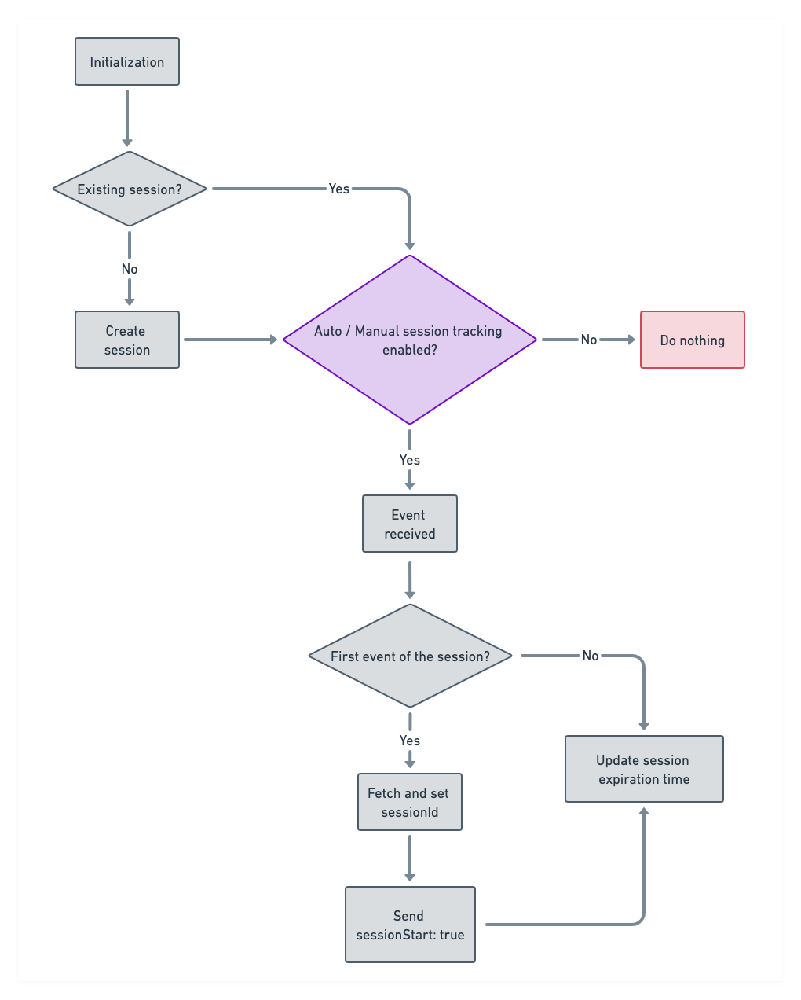

## What is a session?

A session is a group of user interactions with your website or mobile app within a given time frame. It is usually triggered when a user opens a mobile app or a website in their browser and ends after a particular period of inactivity.

You can use a session to determine the average time users spend on an app and how they engage with it. By combining the session metadata with the usage data like event tracking, you can better understand the user's product journey and analyze their behavior effectively. You can use the resulting insights to identify problems in your app or product workflow or unlock potential opportunities for optimization and improved performance.

<div class="infoBlock">
A single session can contain multiple page views or screen views, events, social interactions, and e-commerce transactions.
</div>

The following RudderStack SDKs support the session tracking feature:

- <Link to="/sources/event-streams/sdks/rudderstack-javascript-sdk/">JavaScript</Link>
- <Link to="/sources/event-streams/sdks/rudderstack-android-sdk/">Android</Link>
- <Link to="/sources/event-streams/sdks/rudderstack-ios-sdk/">iOS</Link>

## Automatic session tracking

By default, RudderStack automatically tracks the user sessions. This means that RudderStack automatically determines the start and end of a session depending on the inactivity time configured in the SDK, without any manual intervention.

To disable automatic session tracking, refer to the following SDK-specific snippets:

- In case of the <Link to="/sources/event-streams/sdks/rudderstack-javascript-sdk/">JavaScript SDK</Link>:

```javascript
rudderanalytics.load(WRITE_KEY, DATA_PLANE_URL, {
  sessions: {
    autoTrack: false,
  },
  ...<otherLoadOptions>
});
```

- In case of the <Link to="/sources/event-streams/sdks/rudderstack-android-sdk/">Android SDK</Link>

```kotlin
val rudderClient = RudderClient.getInstance(
    this,
    WRITE_KEY,
    RudderConfig.Builder()
        .withDataPlaneUrl(DATA_PLANE_URL)
        .withTrackLifecycleEvents(true)
        .withAutoSessionTracking(false)
        .withRecordScreenViews(true)
        .build()
)
```

- For <Link to="/sources/event-streams/sdks/rudderstack-ios-sdk/">iOS SDK</Link>

```objectivec
RudderConfig config = new RudderConfig.Builder()
  .withDataPlaneUrl(DATA_PLANE_URL)
  .withTrackLifecycleEvents(true)
  .withRecordScreenViews(true)
  .withAutomaticSessionTracking(false)
  .build();
```

## Manual session tracking

RudderStack also supports manual session tracking using the following methods that indicate the start and end of a user session:

| Method | Description |
| :----| :----|
| `startSession()` | RudderStack creates a new session and passes the event's `timestamp` (in ms) as the `sessionId`. |
| `startSession(String sessionId)` | You can pass a string as the custom `sessionId` using this method. |
| `endSession()` | RudderStack clears the `sessionId` and ends the session. |

<div class="warningBlock">
Note that manual session tracking overrides automatic session tracking. If <Link to="#automatic-session-tracking">automatic session tracking</Link> is enabled and you call the <code class="inline-code">startSession()</code> API, then RudderStack will disable automatic session tracking.
</div>

## Session tracking in mobile SDKs

If session tracking is enabled in the mobile SDKs, the flow is as explained below:

1. RudderStack starts the session once it receives the <Link to="/event-spec/standard-events/application-lifecycle-events-spec/#application-opened">`Application Opened`</Link> event.
2. The SDK then generates a `sessionId`.

<div class="infoBlock">
For more information, refer to the <Link to="#how-rudderstack-calculates-sessionid"> How RudderStack calculates the <code class="inline-code">sessionId</code></Link> section below. 
</div>

3. The SDK records the user events until the application is backgrounded. Upon every <Link to="/event-spec/standard-events/application-lifecycle-events-spec/#application-backgrounded">`Application Backgrounded`</Link> event, RudderStack automatically invalidates this `sessionId` and ends the session.

<div class="infoBlock">
RudderStack also ends the previous session in case of more than <strong>5 minutes</strong> of inactivity.
</div>

## Session tracking in JavaScript SDK

RudderStack considers the <Link to="/sources/event-streams/sdks/rudderstack-javascript-sdk/load-js-sdk/">SDK initialization</Link> to be the start of the session.

By default, a session is active until **30 minutes of inactivity** have elapsed. However, you can adjust this limit using the `timeout` load option, as shown in the following snippet:

```javascript
rudderanalytics.load(WRITE_KEY, DATA_PLANE_URL, {
  sessions: {
    timeout: 10 * 60 * 1000,  // 10 min in milliseconds
  },
  ...otherLoadOptions
});
```

Every time the user interacts with the website, the SDK triggers a new event (`track`, `page`, `identify`, etc.), and resets the expiration time by adding an additional 30 minutes from the time of the last interaction.

### Flow

1. During the initialization, the SDK checks for an existing user session. If no valid session exists, it creates a new session. Otherwise, the SDK proceeds with the existing session.
2. After receiving an event, the SDK checks if the automatic/manual session tracking is enabled. If no, the flow ends, otherwise it proceeds to the next step.
  1. The SDK fetches the `sessionId`. If no valid `sessionId` is found, it creates a new session and returns the `sessionId`.
  2. If this is the first event of the session, the SDK also sends another parameter in the context called `sessionStart: true`. 
  3. Finally, the SDK updates the session expiration time (current `timestamp` + `timeout`).

The following diagram summarizes the workflow:



## How RudderStack calculates `sessionId`

RudderStack passes the event's `timestamp` (in milliseconds) as the `sessionId`. It **does not** attach any user information to this `sessionId` so that they cannot be traced back or identified only with the `sessionId`.

## Supported downstream tools

RudderStack supports forwarding the `sessionId` and `sessionStart` fields to the following downstream destinations:

| Destination | Notes |
| :-------| :------|
| <Link to="/destinations/streaming-destinations/google-analytics-ga/">Google Analytics</Link> | <a href="https://developers.google.com/analytics/devguides/collection/protocol/v1/parameters#sc">Reference</a> |
| <Link to="/destinations/streaming-destinations/google-analytics-4/">Google Analytics 4</Link> | <a href="https://developers.google.com/analytics/devguides/collection/protocol/ga4/sending-events?client_type=gtag">Reference</a> |
| <Link to="/destinations/streaming-destinations/amplitude/">Amplitude</Link> | <a href="https://www.docs.developers.amplitude.com/analytics/apis/http-v2-api/">Reference</a> |
| <Link to="/destinations/streaming-destinations/mixpanel/">Mixpanel</Link> | <ul><li>RudderStack passes `$session_id` under the event properties.</li><li>Mixpanel doesn't have any specific field for `sessionId` but you can use this field in the reports. </li></ul> |

It is important to note the following:
- RudderStack passes the `sessionId` to the subsequent events in the `context.sessionId` field.
- RudderStack sets the `context.sessionStart` field to `true` in the first event to indicate the start of the session.

## FAQ

Refer to the <Link to="">Session Tracking FAQ</Link> guide for a comprehensive list of questions on session tracking.