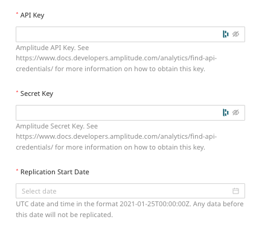

[Amplitude](https://amplitude.com/) is a comprehensive product analytics platform for the web as well as mobile platforms. It helps you get useful marketing insights that drive product strategy, customer conversion, and retention.

This document guides you in setting up Amplitude as a source in RudderStack. Once configured, RudderStack automatically ingests your Amplitude data and routes it to your specified data warehouse destination.

All the Cloud Extract sources support sending data only to a <Link to="/destinations/warehouse-destinations/">data warehouse destination</Link>.

<GhBadge
  label={'Stability'}
  message={'Beta'}
  color={'blueviolet'}
/>

## Getting started

To set up Amplitude as a source in RudderStack, follow these steps:

1. Log into your [RudderStack dashboard](https://app.rudderstack.com/).
2. Go to **Sources** > **New source** > **Cloud Extract** and select **Amplitude** from the list of sources.
3. Assign a name to your source and click on **Next**.

### Connection settings

Enter the following connection settings to set up the Amplitude source:

The connection settings are described below:

- **API Key** : Enter your Amplitude project's API key. You can find it in your Amplitude dashboard by going to **Settings** > **Projects** > Your project name > **General**.
- **Secret Key**: Enter your project's secret key.

For more information on the Amplitude API key and secret key, refer to the <a href="https://help.amplitude.com/hc/en-us/articles/360058073772-Create-and-manage-organizations-and-projects#view-and-edit-your-project-information">Amplitude support guide</a>.

- **Replication Start Date**: Select the date from when RudderStack ingests your Amplitude data.

RudderStack will <strong>not replicate</strong> any data before this date.

### Destination settings

The following settings specify how RudderStack sends the data ingested from Amplitude to the connected warehouse destination:

- **Table prefix**: RudderStack uses this prefix to create a table in your data warehouse and loads all your Amplitude data into it.
- **Schedule Settings**: RudderStack gives you three options to ingest the data from Amplitude:
    - **Basic**: Runs the syncs at the specified time interval. 
    - **CRON**: Runs the syncs based on the user-defined CRON expression.
    - **Manual**: You are required to run the syncs manually.

For more information on the schedule types, refer to the <Link to="/sources/extract/common-settings/">Common Settings</Link> guide.

### Selecting the data to import

You can choose the Amplitude data you want to ingest by selecting the required resources:

The below table mentions the syncs and [API endpoints](https://www.docs.developers.amplitude.com/analytics/#api-references) supported by these resources from Amplitude to your warehouse destination:

| Resource | Full Refresh sync | Incremental sync | Primary key | Amplitude API endpoint |
| :---| :---- | :---- | :---- | :---- |
| `events` |  Yes | Yes | `uuid` |  `export` |
| `cohorts` | Yes | No | `id` | `cohorts` |
| `average_session_length` | No | Yes | `date` | `dashboard` |
| `annotations` | Yes | No | `id` | `annotations` |
| `active_users` | No | Yes |  `date` | `dashboard` |

For more information on the <strong>Full Refresh</strong> and <strong>Incremental</strong> sync modes, refer to the <Link to="/sources/extract/common-settings/#sync-modes">Common Settings</Link> guide.

Amplitude is now configured as a source. RudderStack will start ingesting data from Amplitude as per your specified schedule and frequency.

You can further connect this source to your data warehouse by clicking on **Add Destination**, as shown:

Use the <strong>Use Existing Destination</strong> option if you have an already-configured data warehouse destination in RudderStack. To configure a data warehouse destination from scratch, select the <strong>Create New Destination</strong> button.

## FAQ

### Can I connect my Amplitude source to multiple data warehouse destinations?

You can connect <strong>only one data warehouse destination</strong> per Cloud Extract source. If you wish to send data to multiple warehouses, you can configure multiple Cloud Extract sources with the same settings and connect them to each data warehouse.

### Is it possible to have multiple Cloud Extract sources writing to the same schema?

Yes, it is.

RudderStack associates a table prefix for every Cloud Extract source writing to a warehouse schema. This way, multiple Cloud Extract sources can write to the same schema with different table prefixes.