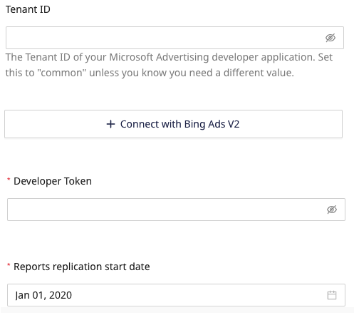
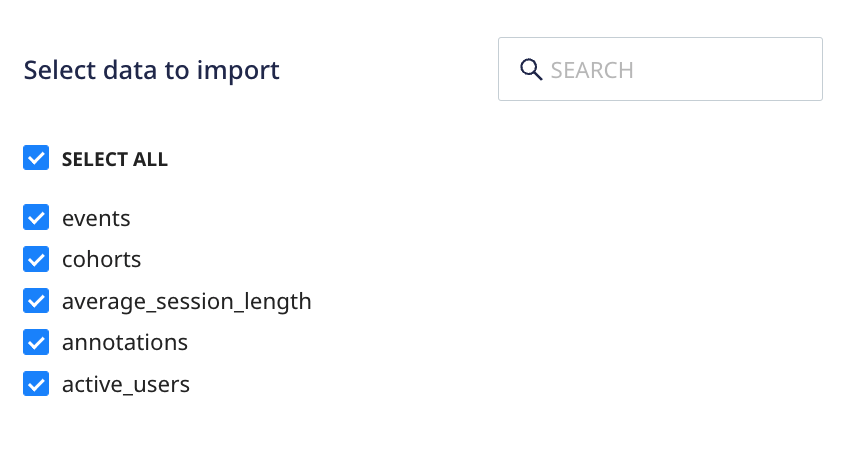

[Bing Ads](https://ads.microsoft.com/) is a pay per click (PPC) advertising platform that works on both Bing and Yahoo search engines. It allows marketers to track and monitor their ad campaigns, resulting clicks, CTRs, and more.

This document guides you in setting up Bing Ads as a source in RudderStack. Once configured, RudderStack automatically ingests your specified Bing Ads data, which can then be routed to your data warehouse destination via RudderStack.

All the Cloud Extract sources support sending data only to a <Link to="/destinations/warehouse-destinations/">data warehouse destination</Link>.

<GhBadge
  label={'Stability'}
  message={'Beta'}
  color={'blueviolet'}
  logo={'github'}
/>

## Getting Started

1. Log into your [RudderStack dashboard](https://app.rudderstack.com/).
2. Go to **Sources** > **New source** > **Cloud Extract** and select **Bing Ads** from the list of sources.
3. Assign a name to your source and click **Continue**.

### Connection settings

- **Tenant ID**: Enter the Tenant ID of your Microsoft Advertising developer application.
- **Connect with Bing Ads V2**: Click this button to give RudderStack the required permissions to access your Bing Ads account.
- **Developer Token**: Enter the developer token. Refer to the [Microsoft documentation](https://learn.microsoft.com/en-us/advertising/guides/get-started?view=bingads-13#get-developer-token) for more information on obtaining the developer token.
- **Reports replication start date**: Select the date from when RudderStack ingests your Bing Ads data. RudderStack will <strong>not replicate</strong> any data before this date.

### Destination settings

The following settings specify how RudderStack sends the data ingested from Amplitude to the connected warehouse destination:

- **Table prefix**: RudderStack uses this prefix to create a table in your data warehouse and loads all your Amplitude data into it.
- **Schedule Settings**: RudderStack gives you three options to ingest the data from Amplitude:
    - **Basic**: Runs the syncs at the specified time interval. 
    - **CRON**: Runs the syncs based on the user-defined CRON expression.
    - **Manual**: You are required to run the syncs manually.

For more information on the schedule types, refer to the <Link to="/sources/extract/common-settings/">Common Settings</Link> guide.

### Selecting the data to import

You can choose the Amplitude data you want to ingest by selecting the required resources:

The below table mentions the syncs and [API endpoints](https://www.docs.developers.amplitude.com/analytics/#api-references) supported by these resources from Amplitude to your warehouse destination:

| Resource | Full Refresh sync | Incremental sync | Primary key | Amplitude API endpoint |
| :---| :---- | :---- | :---- | :---- |
| `events` |  Yes | Yes | `uuid` |  `/export` |
| `cohorts` | Yes | No | `id` | `/cohorts` |
| `average_session_length` | No | Yes | `date` | `/dashboard` |
| `annotations` | Yes | No | `id` | `/annotations` |
| `active_users` | No | Yes |  `date` | `/dashboard` |

For more information on the <strong>Full Refresh</strong> and <strong>Incremental</strong> sync modes, refer to the <Link to="/sources/extract/common-settings/#sync-modes">Common Settings</Link> guide.

Amplitude is now configured as a source. RudderStack will start ingesting data from Amplitude as per your specified schedule and frequency.

You can further connect this source to your data warehouse by clicking on **Add Destination**, as shown:

Use the <strong>Use Existing Destination</strong> option if you have an already-configured data warehouse destination in RudderStack. To configure a data warehouse destination from scratch, select the <strong>Create New Destination</strong> button.

## FAQ

#### Is it possible to have multiple Cloud Extract sources writing to the same schema?

Yes, it is.

We have implemented a feature wherein RudderStack associates a table prefix for every Cloud Extract source writing to a warehouse schema. This way, multiple Cloud Extract sources can write to the same schema with different table prefixes.