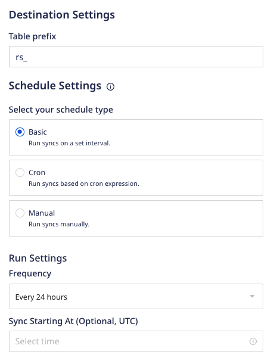
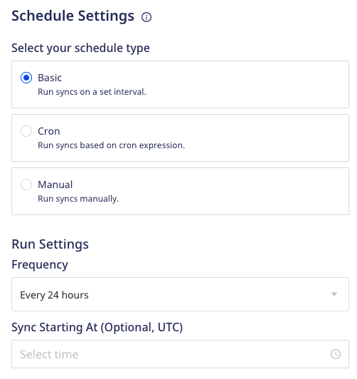
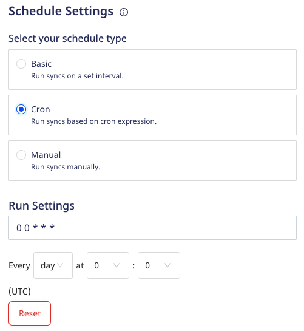
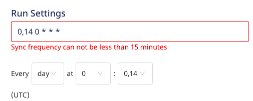
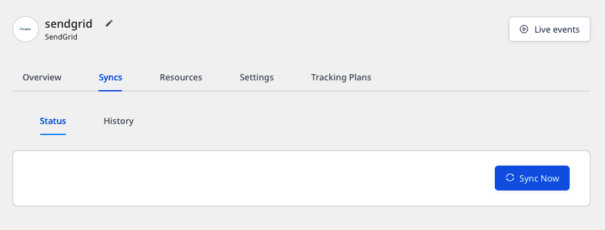
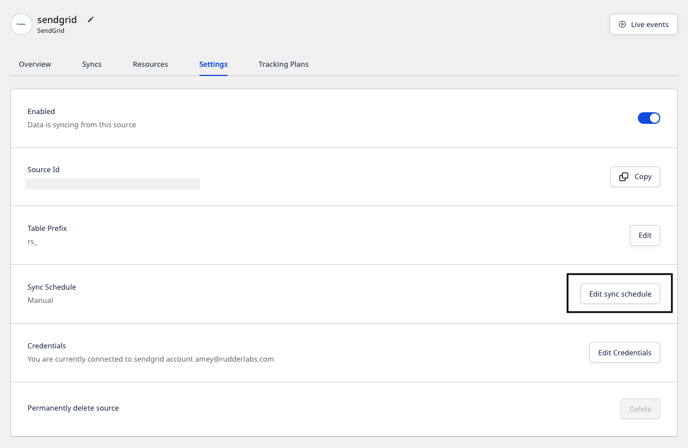

This guide details the common destination-specific settings to be configured while setting up your Cloud Extract sources.

These settings are:

- Table prefix
- Schedule settings

## Table prefix

RudderStack uses your specified table prefix to create a table named `prefix_table_name` in your data warehouse and load all the imported source data into it.

If you do not specify a prefix, RudderStack creates a table in your warehouse as <code class="inline-code">table_name</code>, where <code class="inline-code">table_name</code> refers to the resource you are importing.

For example, if you set the prefix to `rs_` and the resource you are importing is named `valid_emails`, then RudderStack creates the table `rs_valid_emails` in the warehouse.

## Schedule settings

RudderStack lets you set a schedule for importing data from your Cloud Extract sources while setting them up in your dashboard. It lets you specify the schedule type that defines how and when the syncs will run.

RudderStack supports the following three schedule types:

| Schedule type      | Description                                               |
| :------------------| :---------------------------------------------------------|
| Basic              | Run syncs at a given time interval and specified time.    |
| CRON               | Run syncs based on a CRON expression defined by the user. |
| Manual             | Run syncs manually.                                       |

### Basic

This schedule type lets you run the data syncs at a set interval. You can specify the sync frequency as well as the time(in UTC) when you want the sync to start.

- **Frequency**: You can choose the data sync frequency from the following options:
  - 30 minutes
  - 1 hour
  - 3 hours
  - 6 hours
  - 12 hours
  - 24 hours

- **Sync Starting At**: Specify the time at which the data sync should start.

### CRON 

This schedule type lets you define a custom CRON expression and runs the data syncs based on this setting. 

You can use the <a href="https://crontab.guru/">CRON scheduler utility</a> to specify your sync schedule.

The sync frequency specified under <strong>Run Settings</strong> needs to be greater than or equal to 15 minutes. Otherwise, you will encounter an error as shown below:

### Manual 

This schedule type lets you run your data syncs manually. RudderStack won't sync the data until you explicitly trigger it.

To trigger a sync manually, go to the **Syncs** tab in your Cloud Extract source details page and click on **Sync Now**, as shown:

## Sync modes

A sync mode determines how RudderStack reads the data from a source and writes to a warehouse destination. RudderStack supports the following sync modes:

### Full Refresh

In this mode, RudderStack retrieves **all** the available information from the source, **regardless** of whether it has been synced previously.

In this mode, RudderStack replaces all the existing data with the new data.

### Incremental

In this mode, RudderStack syncs or replicates only the **new** or **modified** data starting from the date specified in the **Start Date** RudderStack dashboard setting. It does not replicate the data that has been already synced before.

During the incremental syncs, RudderStack only updates the the existing rows that have been modified as opposed to adding a new version of the row with the updated data.

Any resource that supports the <strong>Incremental</strong> sync mode also supports <strong>Full Refresh</strong>, by default. You can <a href="mailto:support@rudderstack.com">contact the RudderStack team</a> to sync your data using the <strong>Full Refresh</strong> mode in case your destination's data gets corrupted or you want to sync your data all over again.

### Semi-Incremental

This sync mode is a combination of **Full Refresh** and **Incremental** sync modes. RudderStack reads all the data from the source and filters it to sync only the new or modified data starting from the date specified in the **Start Date** RudderStack dashboard setting.

The data synced in the <strong>Semi-Incremental</strong> mode is exactly the same as in the <strong>Incremental mode</strong>. The only difference is that in the <strong>Semi-Incremental</strong> mode, RudderStack internally filters the data to be synced instead of the source API.

## FAQ

### Can I change my sync schedule type?

Yes, you can. 

1. Go to the **Settings** tab in your Cloud Extract source details page and click on **Edit sync schedule** option, as shown:

2. Then, select your new sync schedule type.

### What happens if I don't set the Sync Starting At time?

RudderStack considers strict time windows to schedule syncs if you do not explicitly set the time under **Sync Starting At**.

Suppose you create a source at 12:30 hrs UTC, specify the **Frequency** as 3 hours, and do not specify any time under **Sync Starting At**. In this case, as the time falls in the 12:00-13:00 time window, RudderStack will run the next sync at 15:00 hrs UTC (12:00 + 03:00 = 15:00 hrs).