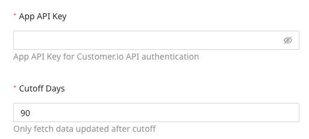
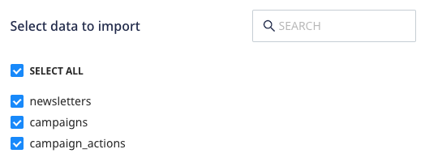

[Customer.io](https://www.Customer.io.com/) is a popular marketing platform for sending targeted emails and push and SMS notifications to improve customer engagement and thereby the overall conversion rate.

This document guides you in setting up Customer.io as a source in RudderStack. Once configured, RudderStack automatically ingests your Customer.io data and routes it to your specified data warehouse destination.

All the Cloud Extract sources support sending data only to a <Link to="/destinations/warehouse-destinations/">data warehouse destination</Link>.

## Getting started

To set up Customer.io as a source in RudderStack, follow these steps:

1. Log into your [RudderStack dashboard](https://app.rudderstack.com/).
2. Go to **Sources** > **New source** > **Cloud Extract** and select **Customer.io** from the list of sources.
3. Assign a name to your source and click **Continue**.

### Connection settings

To set up Customer.io as a Cloud Extract source, you need to configure the following settings:

- **App API Key**: Enter your Customer.io API key which can be obtained in the [Customer.io dashboard](https://fly.customer.io/login) by navigating to **Settings** > **Account Settings** > **API Credentials**.
- **Cutoff Days**: Enter the number of days after which the updated data should be fetched.

### Destination settings

The following settings specify how RudderStack sends the data ingested from Customer.io to the connected warehouse destination:

- **Table prefix**: RudderStack uses this prefix to create a table in your data warehouse and loads all your Customer.io data into it.
- **Schedule Settings**: RudderStack gives you three options to ingest the data from Customer.io:
    - **Basic**: Runs the syncs at the specified time interval. 
    - **CRON**: Runs the syncs based on the user-defined CRON expression.
    - **Manual**: You are required to run the syncs manually.

For more information on the schedule types, refer to the <Link to="/sources/extract/common-settings/">Common Settings</Link> guide.

### Selecting the data to import

You can choose the Customer.io data you want to ingest by selecting the required resources:

The below table lists the syncs supported by the Customer.io resources to your warehouse destination:

| Resource | Full Refresh sync | Incremental sync | 
| :---| :---- | :---- | 
| `newsletters` |  Yes | Yes | 
| `campaigns` | Yes | Yes |  
| `campaign_actions` | Yes | Yes |  

For more information on the <strong>Full Refresh</strong> and <strong>Incremental</strong> sync modes, refer to the <Link to="/sources/extract/common-settings/#sync-modes">Common Settings</Link> guide.

RudderStack ingests the Customer.io data using the <a href="https://customer.io/docs/api/#tag/appOverview">Customer.io Beta API</a> which limits the API requests by 10 requests per second.

Customer.io is now configured as a source. RudderStack will start ingesting data from Customer.io as per your specified schedule and frequency.

You can further connect this source to your data warehouse by clicking on **Add Destination**, as shown:

Use the <strong>Use Existing Destination</strong> option if you have an already-configured data warehouse destination in RudderStack. To configure a data warehouse destination from scratch, select the <strong>Create New Destination</strong> button.

## FAQ

### Is it possible to have multiple Cloud Extract sources writing to the same schema?

Yes, it is.

RudderStack associates a table prefix for every Cloud Extract source writing to a warehouse schema. This way, multiple Cloud Extract sources can write to the same schema with different table prefixes.
