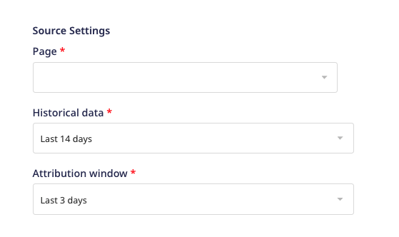

# Facebook Ads

[Facebook Ads](https://www.facebook.com/business/ads) is an online advertising platform that lets you create and run cross-device marketing campaigns and track their performance with easy to read reports.

This document guides you in setting up Facebook Ads as a source in RudderStack. Once configured, RudderStack automatically ingests your specified Facebook Ads data and routes it to your data warehouse.

All the Cloud Extract sources support sending data only to a <Link to="/data-warehouse-integrations/">data warehouse destination</Link>.

## Getting started

To set up Facebook Ads as a source in RudderStack, follow these steps:

1. Log into your [RudderStack dashboard](https://app.rudderstack.com/).
2. Go to **Sources** > **New source** > **Cloud Extract** and select **Facebook Ads** from the list.
3. Assign a name to your source and click on **Continue**.

### Connection settings

1. Click **Connect with Facebook Ads** and grant RudderStack the necessary permissions to access your Facebook Ads data.

Your Facebook Ads account and the related details will then automatically appear under <strong>Choose an account</strong>.

2. In the **Source Settings**, configure the following settings:

- **Page**: Enter the name of the Facebook page from where you want to ingest the Ads data.
- **Historical data**: Specify the timeframe for which RudderStack should fetch the historical data during the first sync.
- **Attribution window**: Specify the [attribution window](https://www.facebook.com/business/help/2198119873776795?id=768381033531365), that is, the number of days between a person viewing/clicking your ad and subsequently taking an action. Facebook measures the ad actions based on the clicks and views of your ad.

RudderStack will not sync the data older than the selected timeframe for the historical data.

### Destination settings

The following settings specify how RudderStack sends the ingested data from Facebook Ads to the warehouse destination:

- **Table prefix**: RudderStack uses this prefix to create a table in your data warehouse and loads all your Facebook Ads data into it.
- **Schedule Settings**: RudderStack gives you three options to ingest the data from Facebook Ads:
    - **Basic**: Runs the syncs at the specified time interval. 
    - **CRON**: Runs the syncs based on the user-defined CRON expression.
    - **Manual**: You are required to run the syncs manually.

For more information on the schedule types, refer to the <a href="https://www.rudderstack.com/docs/cloud-extract-sources/common-settings/">Common Settings</a> guide.

### Selecting the data to import

Choose the Facebook Ads data that you wish to ingest via RudderStack. You can either select all the data or choose specific Facebook Ads data attributes as per your requirement.

Facebook Ads is now configured as a source. RudderStack will start ingesting data from Facebook Ads as per your specified schedule and frequency.

You can further connect this source to your data warehouse by clicking on **Add Destination**, as shown:

Use the <strong>Use Existing Destination</strong> option if you have an already-configured data warehouse destination in RudderStack. To configure a data warehouse destination from scratch, select the <strong>Create New Destination</strong> button.

## FAQ

### Is it possible to have multiple Cloud Extract sources writing to the same schema?

Yes, it is.

RudderStack associates a table prefix for every Cloud Extract source writing to a warehouse schema. This way, multiple Cloud Extract sources can write to the same schema with different table prefixes.

### What Facebook Ads data does RudderStack import?

| Property         | Table name         | Description    |
| :------------ | :------------- | :------------------ |
| **Account Insights** | **`account_insights`** | This table contains insights, aggregated for the whole account. Insights include total impressions, CPP, CPC, Reach, and CPM.                                                 |
| **Campaigns**        | **`campaigns`**        | This table holds information about your campaigns. The columns of this table include: `name`, `objective`, `account_id`, and`status`.                             |
| **AdSets**           | **`adsets`**           | This tables has information about your Ad Sets. The columns of this table are: `bid_amount`,`updated_time`,`campaign_id`,`daily_budget`,`lifetime_budget`, and `pacing_type`. |
| **Ads**              | **`ads`**              | This table contains information about your Facebook Ads.                                                                                                                      |
| **Ad Creatives**     | **`ad_creatives`**     | This table contains the creative content for your Facebook Ads account that you can use in your ads.                                                                          |

## Contact us

If you come across any issues while configuring Facebook Ads as a source in RudderStack, you can [contact us](mailto:%20docs@rudderstack.com) or start a conversation in our [Slack](https://rudderstack.com/join-rudderstack-slack-community) community.
