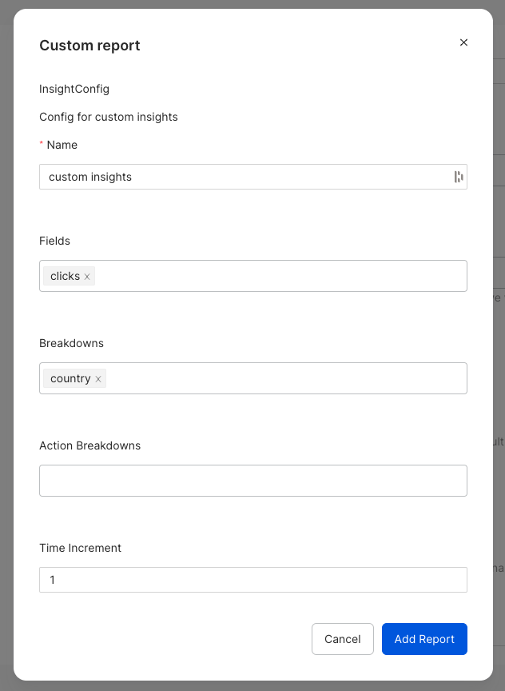
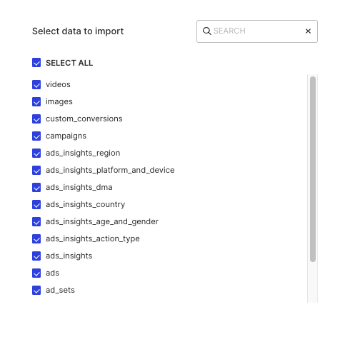

[Facebook Marketing](https://developers.facebook.com/docs/marketing-apis/overview) is a HTTP-based API that lets you programmatically query your data, create and manage your ads, and perform many other tasks.

All the Cloud Extract sources support sending data only to a <Link to="/destinations/warehouse-destinations/">data warehouse destination</Link>.

<GhBadge
  label={'Stability'}
  message={'Beta'}
  color={'blueviolet'}
/>

## Getting started

To set up Facebook Marketing as a source in RudderStack, follow these steps:

1. Log into your [RudderStack dashboard](https://app.rudderstack.com/).
2. Go to **Sources** > **New source** > **Cloud Extract** and select **Facebook Marketing** from the list of sources.
3. Assign a name to your source and click **Continue**.

### Connection settings

1. Click **Connect with Facebook Marketing** and grant RudderStack the necessary permissions to access your Facebook Marketing data.

Your Facebook account and the related details will then automatically appear under <strong>Choose an account</strong>.

2. Then, configure the following settings:

- **Account ID**: Enter the Facebook Ads account ID that RudderStack uses to pull the data from the Marketing API.
- **Start Date**: Specify the date from which RudderStack should replicate the data for all the incremental streams. RudderStack will **not** sync any historical data generated before this date.
- **End Date**: RudderStack syncs all the data generated between **Start Date** and this date. If you do not specify this date, RudderStack will sync all the latest available data.
- **Include Deleted**: Enable this setting to include the data from all the deleted campaigns, ads, and ad sets.
- **Fetch Thumbnail Images**: Enable this setting to fetch and store the thumbnail data for each [Ad Creative](https://developers.facebook.com/docs/marketing-api/creative/).
- **Custom Insights**: This setting lets you add a list containing the ad insights entries. You can specify the following configuration settings by clicking the **Add Item** button:

- **Page Size of Requests**: Use this option to specify the number of records per page when the Marketing API response has pagination.

It is not recommended to set this field unless you want to fine-tune the connection for addressing specific issues or use cases.

- **Insights Lookback Window**: Specify the number of days in the attribution window.
- **Maximum Size of Batched Requests**: Specify the maximum batch size to use when sending batch requests to the Marketing API.

It is not recommended to set this field unless you want to fine-tune the connection for addressing specific issues or use cases.

- **Allow Empty Action Breakdowns**: Enable this setting to allow action breakdowns to be an empty list.

### Destination settings

The following settings specify how RudderStack sends the data ingested from Facebook Marketing to the connected warehouse destination:

- **Table prefix**: RudderStack uses this prefix to create a table in your data warehouse and loads all your Facebook Marketing data into it.
- **Schedule Settings**: RudderStack gives you three options to ingest the data from Facebook Marketing:
    - **Basic**: Runs the syncs at the specified time interval. 
    - **CRON**: Runs the syncs based on the user-defined CRON expression.
    - **Manual**: You are required to run the syncs manually.

For more information on the schedule types, refer to the <Link to="/sources/extract/common-settings/">Common Settings</Link> guide.

### Selecting the data to import

You can choose the Facebook Marketing data you want to ingest by selecting the required resources:

The below table mentions the syncs supported by these resources from Facebook Marketing to your warehouse destination:  

| Resource | Sync type | Facebook Marketing API endpoint |
| :---| :--- | :--- |
| `activities` | Incremental | [`ad_activity`](https://developers.facebook.com/docs/marketing-api/reference/ad-activity) |
| `ad_account` |  Full Refresh | [`adaccount`](https://developers.facebook.com/docs/marketing-api/reference/v16.0) |
| `ad_creatives` | Full Refresh | [`ad-creative`](https://developers.facebook.com/docs/marketing-api/reference/ad-creative) |
| `ad_sets` | Incremental | [`ad-campaign`](https://developers.facebook.com/docs/marketing-api/reference/ad-campaign) |
| `ads` |  Incremental | [`ad-group`](https://developers.facebook.com/docs/marketing-api/reference/adgroup) |
| `ads_insights` | Incremental | [`insights`](https://developers.facebook.com/docs/marketing-api/reference/adgroup/insights/) |
| `campaigns` | Incremental |  [`campaigns`](https://developers.facebook.com/docs/marketing-api/reference/ad-account/campaigns/) |
| `custom_conversions` | Incremental | [`customconversions`](https://developers.facebook.com/docs/marketing-api/reference/custom-conversion) |
| `images` | Incremental | [`ad-image`](https://developers.facebook.com/docs/marketing-api/reference/ad-image) |
| `videos` | Incremental |  [`videos`](https://developers.facebook.com/docs/graph-api/reference/video/video_insights/) |

For more information on the <strong>Full Refresh</strong> and <strong>Incremental</strong> sync modes, refer to the <Link to="/sources/extract/common-settings/#sync-modes">Common Settings</Link> guide.

Facebook Marketing is now configured as a source. RudderStack will start ingesting data from Facebook Marketing as per your specified schedule and frequency.

You can further connect this source to your data warehouse by clicking on **Add Destination**, as shown:

Use the <strong>Use Existing Destination</strong> option if you have an already-configured data warehouse destination in RudderStack. To configure a data warehouse destination from scratch, select the <strong>Create New Destination</strong> button.

## FAQ

#### Is it possible to have multiple Cloud Extract sources writing to the same schema?

Yes - RudderStack implements a feature wherein it associates a table prefix for every Cloud Extract source writing to a warehouse schema. This way, multiple Cloud Extract sources can write to the same schema with different table prefixes.