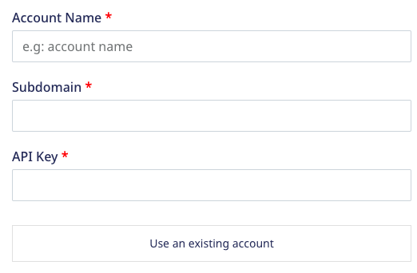
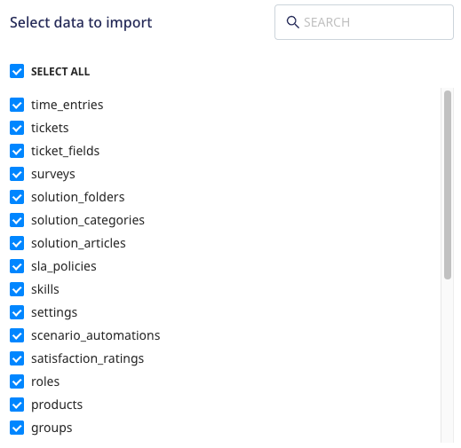

[Freshdesk](https://freshdesk.com/) is a popular customer support software which provides cutting-edge, cross-channel customer support features including bots and various other self-service solutions.

This document guides you in setting up Freshdesk as a source in RudderStack. Once configured, RudderStack automatically ingests your specified Freshdesk data, which can then be routed to your RudderStack-supported data warehouse destination.

All the Cloud Extract sources support sending data only to a <Link to="/destinations/warehouse-destinations/">data warehouse destination</Link>.

## Getting Started

To set up Freshdesk as a source in RudderStack, follow these steps:

1. Log into your [RudderStack dashboard](https://app.rudderstack.com/).
2. Go to **Sources** > **New source** > **Cloud Extract** and select **Freshdesk V2** from the list of sources.
3. Assign a name to your source and click **Continue**.

### Connection settings

To set up Freshdesk as a Cloud Extract source, you need to configure the following settings:

- **Domain**: Enter your Freshdesk domain from the URL (for example, `test.freshdesk.com`).
- **API Key**: Enter your Freshdesk API key. Refer to the <Link to="#faq">FAQ</Link> section for more information on obtaining the API key.
- **Requests per minute**: Enter the number of requests that Freshdesk can use per minute. The rate limit **does not allow** more than 50 requests per minute per app per Freshdesk account.
- **Start Date**: Enter the date from which RudderStack should import your historical Freshdesk data.

### Destination settings

The following settings specify how RudderStack sends the data ingested from Freshdesk to the connected warehouse destination:

- **Table prefix**: RudderStack uses this prefix to create a table in your data warehouse and loads all your Freshdesk data into it.
- **Schedule Settings**: RudderStack gives you three options to ingest the data from Freshdesk:
    - **Basic**: Runs the syncs at the specified time interval. 
    - **CRON**: Runs the syncs based on the user-defined CRON expression.
    - **Manual**: You are required to run the syncs manually.

For more information on the schedule types, refer to the <Link to="/sources/extract/common-settings/">Common Settings</Link> guide.

### Selecting the data to import

You can choose the Freshdesk data you want to ingest by selecting the required resources:

The below table mentions the syncs and API endpoints supported by these resources from Freshdesk to your warehouse destination:

| Resource | Supported sync mode | Primary key | Freshdesk API endpoint |
| :---| :---- | :---- | :---- | :---- |
|	`time_entries`	| Full Refresh  | `id` | `/time_entries` |
|	`tickets`	| Incremental | `id` | `/tickets` |
|	`ticket_fields`	| Full Refresh  | `id` | `/ticket_fields` |
|	`surveys`	| Full Refresh  | `id` | `/surveys` |
|	`solution_folders`	| Full Refresh  | `id` | `/solutions/categories/[id]/folders` |
|	`solution_categories`	| Full Refresh  | `id` | `/solutions/categories` |
|	`solution_articles`	| Full Refresh  | `id` | `/solutions/folders/[id]/articles` |
|	`sla_policies`	| Full Refresh  | `id` | `/sla_policies` |
|	`skills`	| Full Refresh  | `id` | `/skills` |
|	`settings`	| Full Refresh  | `primary_language` | `/settings/helpdesk` |
|	`scenario_automations`	| Full Refresh  | `id` | `/scenario_automations` |
|	`satisfaction_ratings`	| Incremental  | `id` | `/surveys/satisfaction_ratings` |
|	`roles`	| Full Refresh  | `id` | `/roles` |
|	`products`	| Full Refresh  | `id` | `/products` |
|	`groups`	| Full Refresh  | `id` | `/groups` |
|	`email_mailboxes`	| Full Refresh  | `id` | `/email/mailboxes` |
|	`email_configs`	| Full Refresh  | `id` | `/email_configs` |
|	`discussion_topics`	| Full Refresh  | `id` | `/discussions/forums/[id]/topics` |
|	`discussion_forums`	| Full Refresh  | `id` | `/discussions/categories/[category_id]/forums` |
|	`discussion_comments`	| Full Refresh  | `id` | `/discussions/topics/[id]/comments` |
|	`discussion_categories`	| Full Refresh  | `id` | `/discussions/categories` |
|	`conversations`	| Semi-Incremental | `id` | `/tickets/{stream_slice['id']}/conversations` |
|	`contacts`	| Incremental | `id` | `/contacts` |
|	`companies`	| Full Refresh  | `id` | `/companies` |
|	`canned_responses`	| Full Refresh  | `id` | `/canned_response_folders/[id]/responses` |
|	`canned_response_folders`	| Full Refresh  | `id` | `/canned_response_folders` |
|	`business_hours	`	| Full Refresh  | `id` | `/business_hours` |
|	`agents	`	| Full Refresh  | `id` | `/agents` |

The above-mentioned resources supporting the <strong>Incremental</strong> sync mode also support the <strong>Full Refresh</strong> sync mode by default but RudderStack syncs the data using the <strong>Incremental</strong> mode for such resources. If you want to use the <strong>Full Refresh</strong> sync mode for such resources, <a href="mailto:%20support@rudderstack.com">contact the RudderStack team</a>. For more information on the <strong>Full Refresh</strong> and <strong>Incremental</strong> sync modes, refer to the <Link to="/sources/extract/common-settings/#sync-modes">Common Settings</Link> guide. 

Freshdesk is now configured as a source. RudderStack will start ingesting data from Freshdesk as per your specified schedule and frequency.

You can further connect this source to your data warehouse by clicking on **Add Destination**, as shown:

Use the <strong>Use Existing Destination</strong> option if you have an already-configured data warehouse destination in RudderStack. To configure a data warehouse destination from scratch, select the <strong>Create New Destination</strong> button.

## FAQ

### Where can I find the Freshdesk API Key?

To get your Freshdesk API key, follow these steps:

1. Log into your [Freshdesk account](https://freshdesk.com/login).
2. Click on your profile in the top right section of the dashboard and go to **Profile Settings**.
3. You can find the Freshdesk API key in the right sidebar, as shown:

### Is it possible to have multiple Cloud Extract sources writing to the same schema?

Yes, it is.

RudderStack associates a table prefix for every Cloud Extract source writing to a warehouse schema. This way, multiple Cloud Extract sources can write to the same schema with different table prefixes.