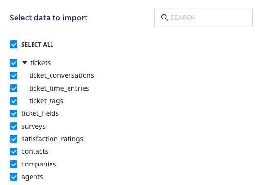
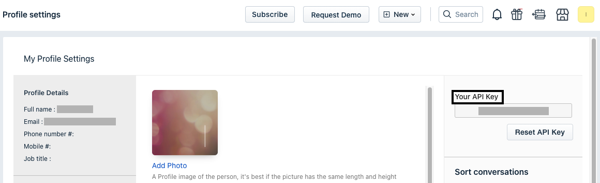

[Freshdesk](https://freshdesk.com/) is a popular customer support software which provides cutting-edge, cross-channel customer support features including bots and various other self-service solutions.

This document guides you in setting up Freshdesk as a source in RudderStack. Once configured, RudderStack automatically ingests your specified Freshdesk data, which can then be routed to your RudderStack-supported data warehouse destination.

All the Cloud Extract sources support sending data only to a <Link to="/destinations/warehouse-destinations/">data warehouse destination</Link>.

## Getting Started

To set up Freshdesk as a source in RudderStack, follow these steps:

1. Log into your [RudderStack dashboard](https://app.rudderstack.com/).
2. Go to **Sources** > **New source** > **Cloud Extract** and select **Freshdesk** from the list of sources.
3. Assign a name to your source and click on **Continue**.

### Connection settings

1. Click on **Create Credentials from Scratch**. You will then see the following screen:

2. Enter the following connection credentials to authenticate your Freshdesk account with RudderStack:
  - **Account Name**: Enter your Freshdesk account name. This should be the email you used to sign up for Freshdesk.
  - **Subdomain**: Enter your Freshdesk subdomain (portion of the URL before `.freshdesk.com/`)
  - **API Key**: Enter your Freshdesk API key which can be obtained by logging into your Freshdesk account, clicking on your profile and navigating to the **Profile Settings**.

Refer to the <a href="#faq">FAQ</a> section for more information on obtaining the Freshdesk API key.

### Destination settings

The following settings specify how RudderStack sends the data ingested from Freshdesk to the connected warehouse destination:

- **Table prefix**: RudderStack uses this prefix to create a table in your data warehouse and loads all your Freshdesk data into it.
- **Schedule Settings**: RudderStack gives you three options to ingest the data from Freshdesk:
    - **Basic**: Runs the syncs at the specified time interval. 
    - **CRON**: Runs the syncs based on the user-defined CRON expression.
    - **Manual**: You are required to run the syncs manually.

For more information on the schedule types, refer to the <Link to="/sources/extract/common-settings/">Common Settings</Link> guide.

### Selecting the data to import

Choose the Freshdesk data that you wish to ingest via RudderStack. You can either select all the data or choose specific Freshdesk data attributes as per your requirement.

Freshdesk is now configured as a source. RudderStack will start ingesting data from Freshdesk as per your specified schedule and frequency.

You can further connect this source to your data warehouse by clicking on **Add Destination**, as shown:

Use the <strong>Use Existing Destination</strong> option if you have an already-configured data warehouse destination in RudderStack. To configure a data warehouse destination from scratch, select the <strong>Create New Destination</strong> button.

## FAQ

### Where do I find the Freshdesk API Key?

To get your Freshdesk API key, follow these steps:

1. Log into your [Freshdesk account](https://freshdesk.com/login).
2. Click on your profile in the top right section of the dashboard and go to **Profile Settings**.
3. You can find the Freshdesk API key in the right sidebar, as shown:

### Is it possible to have multiple Cloud Extract sources writing to the same schema?

Yes, it is.

We have implemented a feature wherein RudderStack associates a table prefix for every Cloud Extract source writing to a warehouse schema. This way, multiple Cloud Extract sources can write to the same schema with different table prefixes.

## Contact us

For queries on any of the sections in this guide, you can [contact us](mailto:%20docs@rudderstack.com) or start a conversation in our [Slack](https://rudderstack.com/join-rudderstack-slack-community) community.
