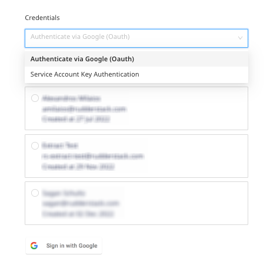
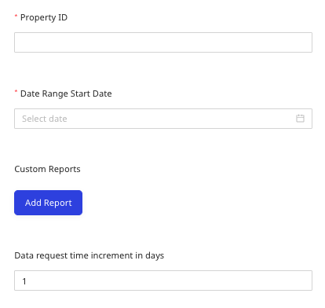
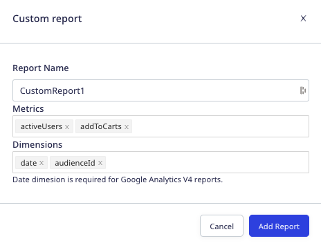
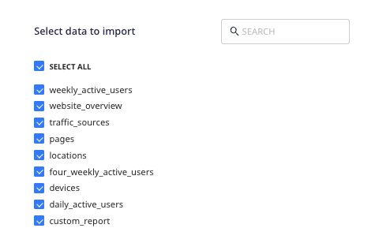

[Google Analytics 4](https://analytics.google.com/) is an analytics service that enables you to measure traffic and engagement across your websites and apps.

This document guides you in setting up Google Analytics 4 as a source in RudderStack. Once configured, RudderStack automatically ingests your Google Analytics 4 data and routes it to your specified data warehouse destination.

All the Cloud Extract sources support sending data only to a <Link to="/destinations/warehouse-destinations/">data warehouse destination</Link>.

<GhBadge
  label={'Stability'}
  message={'Beta'}
  color={'blueviolet'}
/>

## Getting started

To set up Google Analytics 4 as a source in RudderStack, follow these steps:

1. Log into your [RudderStack dashboard](https://app.rudderstack.com/).
2. Go to **Sources** > **New source** > **Cloud Extract** and select **Google Analytics 4** from the list of sources.
3. Assign a name to your source and click **Next**.

### Connection settings

Next, configure the following dashboard settings:

- **Credentials**: From the dropdown, select the authentication mechanism for RudderStack to connect to the Google Analytics 4 API.
    - **Authenticate via Google (OAuth)**: To authenticate via OAuth, click the **Sign in with Google** button, select your Google account, and give RudderStack the required permissions.
    - **Service Account Key Authentication**: Enter your <a href="https://cloud.google.com/iam/docs/creating-managing-service-account-keys#creating">service account</a> JSON credentials in the **Service Account Information** field.

The other settings are as follows:

- **Property ID**: Specify the <a href="https://developers.google.com/analytics/devguides/reporting/data/v1/property-id">Google Analytics 4 property identifier</a> whose events are tracked.
- **Date Range Start Date**: Choose the start date from which you want RudderStack to ingest the Google Analytics 4 data. RudderStack will not replicate any data before this date.
- **Custom Reports**: Use this setting to sync your custom <a href="https://support.google.com/analytics/answer/10445879?hl=en">Google Analytics 4 reports</a>. You can sync multiple reports. To add a custom report, click **Add Report** and specify the **Report Name**, **Metrics**, and **Dimensions**, as shown:

- **Data request time increment in days**: Enter the number of days after which RudderStack requests data from the Google Analytics 4 API. The minimum and maximum allowed values for this field are 1 and 364 respectively.

It is highly recommended to set this value to 1. A higher value will lead to faster syncs, but it is more likely to apply sampling on your data, causing potential inaccuracies in the results.

### Destination settings

The following settings specify how RudderStack sends the data ingested from Google Analytics 4 to the connected warehouse destination:

- **Table prefix**: RudderStack uses this prefix to create a table in your data warehouse and loads all your Google Analytics 4 data into it.
- **Schedule Settings**: RudderStack gives you three options to ingest the data from Google Analytics 4:
    - **Basic**: Runs the syncs at the specified time interval. 
    - **CRON**: Runs the syncs based on the user-defined CRON expression.
    - **Manual**: You are required to run the syncs manually.

For more information on the schedule types, refer to the <Link to="/sources/extract/common-settings/">Common Settings</Link> guide.

### Selecting the data to import

You can choose the predefined Google Analytics 4 reports from which you want to ingest the data by selecting them in this window:

Any custom reports configured using the <strong>Custom Reports</strong> dashboard setting will also be shown here.

The below table mentions the sync types supported by the Google Analytics 4 resources while syncing data to your warehouse destination:

| Resource | Sync type | Primary key |
| :---| :--- | :----| 
| `daily_active_users` | Incremental | `uuid` |
| `devices` | Incremental | `uuid` |
| `four_weekly_active_users` | Incremental | `uuid` |
| `locations` | Incremental | `uuid` |
| `pages` | Incremental | `uuid` |
| `traffic_sources` | Incremental | `uuid` |
| `website_overview` | Incremental | `uuid` |
| `weekly_active_users` | Incremental | `uuid` |

For syncing all the reports, RudderStack uses the `analyticsdata.googleapis.com/v1beta/{property_id}/runReport` API.

This source only supports <strong>Incremental</strong> reports with <strong>date</strong> as dimensions.

For more information on the <strong>Incremental</strong> sync mode, refer to the <Link to="/sources/extract/common-settings/#sync-modes">Common Settings</Link> guide.

Google Analytics 4 is now configured as a source. RudderStack will start ingesting data from Google Analytics 4 as per your specified schedule and frequency.

You can further connect this source to your data warehouse by clicking the **Add Destination** button, as shown:

Use the <strong>Use Existing Destination</strong> option if you have an already-configured data warehouse destination in RudderStack. To configure a data warehouse destination from scratch, select the <strong>Create New Destination</strong> button.

## FAQ

### Is it possible to have multiple Cloud Extract sources writing to the same schema?

Yes, it is.

RudderStack associates a table prefix for every Cloud Extract source writing to a warehouse schema. This way, multiple Cloud Extract sources can write to the same schema with different table prefixes.

 