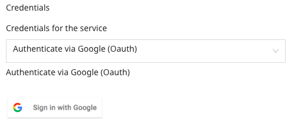
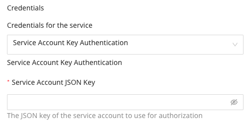
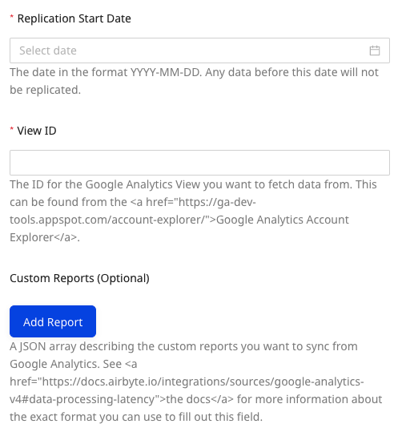
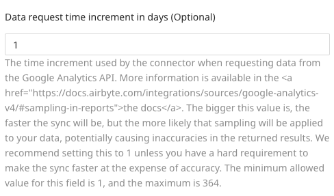
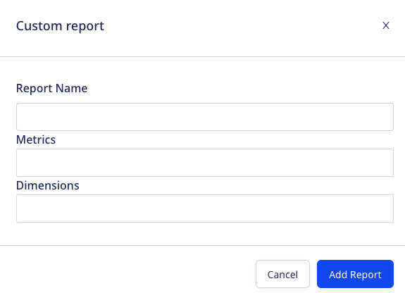
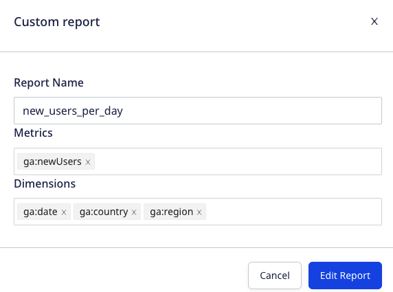
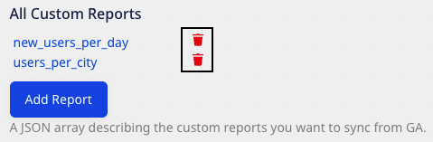
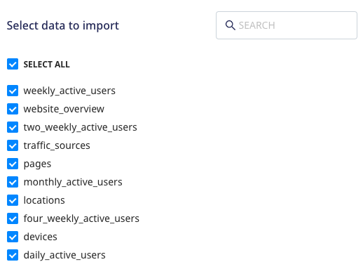

[Google Analytics](https://analytics.google.com/analytics/web/#/) is one of the popular analytics service that allows you to track and report your website traffic across a variety of sources.

This document guides you in setting up Google Analytics as a source in RudderStack. Once configured, RudderStack automatically ingests your Google Analytics data and routes it to your specified data warehouse destination.

All the Cloud Extract sources support sending data only to a <Link to="/destinations/warehouse-destinations/">data warehouse destination</Link>.

<GhBadge
  label={'Stability'}
  message={'Beta'}
  color={'blueviolet'}
  logo={'github'}
/>

## Getting started

To set up Google Analytics as a Cloud Extract source in RudderStack, follow these steps:

1. Log into your [RudderStack dashboard](https://app.rudderstack.com/).
2. Go to **Sources** > **New source** > **Cloud Extract** and select **Google Analytics V2** from the list of sources.
3. Assign a name to your source and click **Continue**.

### Connection settings

Next, configure the following dashboard settings:

- **Credentials**: Choose from the two authentication types as explained below:

    - **Authenticate via Google (Oauth)**: Authenticate your Google Analytics account via Google (Oauth) by clicking
    **Sign in with Google** and granting the required permissions.

    

    - **Service Account Key Authentication**: Enter the service account key in JSON format in the **Service Account JSON Key field**. Refer to the [Google documentation](https://cloud.google.com/iam/docs/creating-managing-service-account-keys#creating_service_account_keys) for more information on obtaining the service account key.

    

The rest of the settings are as follows:

- **Replication Start Date**: Choose the start date from which you want RudderStack to ingest the Google Analytics data. RudderStack will not replicate any data before this date.
- **View ID**: Enter the ID of the Google Analytics View you want to fetch the data from. Refer to this [documentation](https://docs.acquia.com/customer-data-platform/connectors/web-analytics-provider/google-analytics-profileid/) for more information on obtaining the View ID.
- **Custom Reports (Optional)**: Use this field to sync your [custom reports](https://support.google.com/analytics/answer/1033013?hl=en) from Google Analytics. You can sync multiple reports.

  To add a custom report, click **Add Report** and enter the **Report Name**, **Metrics**, and **Dimensions** as shown:

  

  You can also edit/delete an existing report, as shown:

  
   
  

- **Data request time increment in days (Optional)**: Enter the number of days after which RudderStack should request data from the Google Analytics API. It is recommended to set this value to 1 to avoid getting the [sampled data](https://support.google.com/analytics/answer/2637192#zippy=%2Cin-this-article). The minimum and maximum allowed values for this field are 1 and 364 respectively.

### Destination settings

The following settings specify how RudderStack sends the data ingested from Google Analytics to the connected warehouse destination:

- **Table prefix**: RudderStack uses this prefix to create a table in your data warehouse and loads all your Google Analytics data into it.
- **Schedule Settings**: RudderStack gives you three options to ingest the data from Google Analytics:
    - **Basic**: Runs the syncs at the specified time interval. 
    - **CRON**: Runs the syncs based on the user-defined CRON expression.
    - **Manual**: You are required to run the syncs manually.

For more information on the schedule types, refer to the <Link to="/sources/extract/common-settings/">Common Settings</Link> guide.

### Selecting the data to import

You can choose the predefined reports from which you want to ingest the data from Google Analytics by selecting them here:

The below table mentions the syncs supported by these resources from Google Analytics to your warehouse destination:

| Resource | Full Refresh sync | Incremental sync | 
| :---| :---- | :---- | 
| `weekly_active_users`     |  Yes | Yes |
| `website_overview`|  Yes | Yes |
| `two_weekly_active_users`|  Yes | Yes |
| `traffic_sources`|  Yes | Yes |
| `pages`|  Yes | Yes |
| `monthly_active_users`|  Yes | Yes |
| `locations`|  Yes | Yes |
| `four_weekly_active_users`|  Yes | Yes |
| `devices`|  Yes | Yes |
| `daily_active_users`| Yes | Yes |

For more information on the <strong>Full Refresh</strong> and <strong>Incremental</strong> sync modes, refer to the <Link to="/sources/extract/common-settings/#sync-modes">Common Settings</Link> guide.

To sync the data in incremental mode, you must include the <code class="inline-code">ga:date</code> dimension in your report. Otherwise, RudderStack will sync the data in full refresh mode.

Google Analytics is now configured as a source. RudderStack will start ingesting data from Google Analytics as per your specified schedule and frequency.

You can further connect this source to your data warehouse by clicking on **Add Destination**, as shown:

Use the <strong>Use Existing Destination</strong> option if you have an already-configured data warehouse destination in RudderStack. To configure a data warehouse destination from scratch, select the <strong>Create New Destination</strong> button.

## FAQ

### Is it possible to have multiple Cloud Extract sources writing to the same schema?

Yes, it is.

RudderStack associates a table prefix for every Cloud Extract source writing to a warehouse schema. This way, multiple Cloud Extract sources can write to the same schema with different table prefixes.