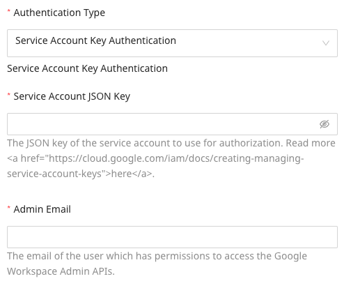

[Google Search Console](https://search.google.com/search-console/about) is Google's web service that allows webmasters to check the indexing status of the websites and optimize their visibility. It offers tools and reports to measure and optimize your website's search traffic, performance, content, and fix issues.

This document guides you in setting up Google Search Console as a source in RudderStack. Once configured, RudderStack automatically ingests your Google Search Console data and routes it to your specified data warehouse destination.

All the Cloud Extract sources support sending data only to a <Link to="/destinations/warehouse-destinations/">data warehouse destination</Link>.

## Getting Started

To set up Google Search Console as a source in RudderStack, follow these steps:

1. Log into your [RudderStack dashboard](https://app.rudderstack.com/).
2. Go to **Sources** > **New source** > **Cloud Extract** and select **Google Search Console V2** from the list of sources.
3. Assign a name to your source and click **Continue**.

### Connection settings

Next, configure the following dashboard settings:

- **Authentication Type**: Choose one of the following authentication types:

    - **Oauth**: Authenticate your Google Search Console account via Google (OAuth) by clicking
    **Sign in with Google** and granting the required permissions.

    

    - **Service Account Key Authentication**: Enter the service account key in JSON format in the **Service Account JSON Key field**. Refer to the [Google documentation](https://cloud.google.com/iam/docs/creating-managing-service-account-keys#creating_service_account_keys) for more information on obtaining the service account key.

    

The rest of the settings are as follows:

- **Website URL Property**: Enter the URL of the site you want to fetch data for. Examples: 
http://www.example.com/ (for a URL-prefix property)
sc-domain:example.com (for a Domain property)
- **Start Date**: Enter the date from which RudderStack should import your Google Search Console data.
- **End Date**: Specify the end date for the replication window.

RudderStack will not replicate any data <strong>after</strong> this date. Do not set this field if you want RudderStack to sync the most Google Search Console data.

- **Custom Reports (Optional)**: Use this field to sync your [custom reports](https://support.google.com/analytics/answer/1033013?hl=en) from Google Search Console. You can sync multiple reports.

  To add a custom report, click **Add Report** and enter the **Report Name**, **Metrics**, and **Dimensions** as shown:

  

  You can also edit/delete an existing report, as shown:

  
   
  

### Destination settings

The following settings specify how RudderStack sends the data ingested from Google Search Console to the connected warehouse destination:

- **Table prefix**: RudderStack uses this prefix to create a table in your data warehouse and loads all your Google Search Console data into it.
- **Schedule Settings**: RudderStack gives you three options to ingest the data from Google Search Console:
    - **Basic**: Runs the syncs at the specified time interval. 
    - **CRON**: Runs the syncs based on the user-defined CRON expression.
    - **Manual**: You are required to run the syncs manually.

For more information on the schedule types, refer to the <Link to="/sources/extract/common-settings/">Common Settings</Link> guide.

### Selecting the data to import

You can choose the Google Search Console data you want to ingest by selecting the required resources:

The below table mentions the syncs and API endpoints supported by these resources from Google Search Console to your warehouse destination:

| Resource | Full Refresh sync | Incremental sync | Google Search Console API endpoint |
| :---| :---- | :---- | :---- |
| `revenue` |  Yes | Yes | `/engage` |
| `funnels` | Yes | Yes |  `/funnels` |
| `export` | Yes | Yes |  `/export`|
| `engage` | Yes | No |  `/engage` |
| `cohorts` | Yes | Yes |  `/cohorts/list`|
| `cohort_members` | Yes | No | `/engage` |
| `annotations` | Yes | No |  `/annotations`|

For more information on the <strong>Full Refresh</strong> and <strong>Incremental</strong> sync modes, refer to the <Link to="/sources/extract/common-settings/#sync-modes">Common Settings</Link> guide.

Google Search Console is now configured as a source. RudderStack will start ingesting data from Google Search Console as per your specified schedule and frequency.

You can further connect this source to your data warehouse by clicking on **Add Destination**, as shown:

Use the <strong>Use Existing Destination</strong> option if you have an already-configured data warehouse destination in RudderStack. To configure a data warehouse destination from scratch, select the <strong>Create New Destination</strong> button.

## FAQ

### Is it possible to have multiple Cloud Extract sources writing to the same schema?

Yes, it is.

RudderStack associates a table prefix for every Cloud Extract source writing to a warehouse schema. This way, multiple Cloud Extract sources can write to the same schema with different table prefixes.