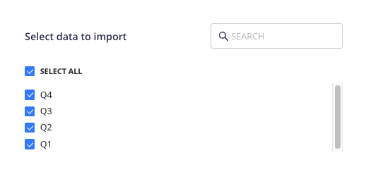

[Google Sheets](https://www.google.com/sheets/about/) is a popular spreadsheet program that lets you create spreadsheets which are updated and saved automatically.

This document guides you in setting up Google Sheets as a source in RudderStack. Once configured, RudderStack automatically ingests your Google Sheets data and routes it to your specified data warehouse destination.

All the Cloud Extract sources support sending data only to a <Link to="/destinations/warehouse-destinations/">data warehouse destination</Link>.

<GhBadge
  label={'Stability'}
  message={'Beta'}
  color={'blueviolet'}
/>

## Getting started

To set up Google Sheets as a source in RudderStack, follow these steps:

1. Log into your [RudderStack dashboard](https://app.rudderstack.com/).
2. Go to **Sources** > **New source** > **Cloud Extract** and select **Google Sheets V2** from the list of sources.
3. Assign a name to your source and click **Next**.

### Connection settings

Next, configure the following dashboard settings:

- **Authentication**: From the dropdown, select the authentication mechanism for RudderStack to connect to the Google Sheets API.
    - **Authenticate via Google (OAuth)**: To authenticate via OAuth, click the **Sign in with Google** button, select your Google account, and give RudderStack the required permissions.
    - **Service Account Key Authentication**: Enter your <a href="https://cloud.google.com/iam/docs/creating-managing-service-account-keys#creating">service account</a> JSON credentials in the **Service Account Information** field.
- **Spreadsheet Link**: From the dropdown, select the spread from which RudderStack ingests and syncs the data.
- **Row Batch Size**: Enter the number of rows to be fetched from the spreadsheet while syncing the data. If not specified, RudderStack sets this value to **200**.

### Destination settings

The following settings specify how RudderStack sends the data ingested from Google Sheets to the connected warehouse destination:

- **Table prefix**: RudderStack uses this prefix to create a table in your data warehouse and loads all your Google Sheets data into it.
- **Schedule Settings**: RudderStack gives you three options to ingest the data from Google Sheets:
    - **Basic**: Runs the syncs at the specified time interval. 
    - **CRON**: Runs the syncs based on the user-defined CRON expression.
    - **Manual**: You are required to run the syncs manually.

For more information on the schedule types, refer to the <Link to="/sources/extract/common-settings/">Common Settings</Link> guide.

### Selecting the data to import

You can specify the Google Sheets data that you want to sync by selecting the required sheet. You can also sync data from multiple sheets within the spreadsheet, as shown:

Google Sheets is now configured as a source. RudderStack will start ingesting data from Google Sheets as per your specified schedule and frequency.

You can further connect this source to your data warehouse by clicking the **Add Destination** button, as shown:

Use the <strong>Use Existing Destination</strong> option if you have an already-configured data warehouse destination in RudderStack. To configure a data warehouse destination from scratch, select the <strong>Create New Destination</strong> button.

## FAQ

### Is it possible to have multiple Cloud Extract sources writing to the same schema?

Yes, it is.

RudderStack associates a table prefix for every Cloud Extract source writing to a warehouse schema. This way, multiple Cloud Extract sources can write to the same schema with different table prefixes.

 