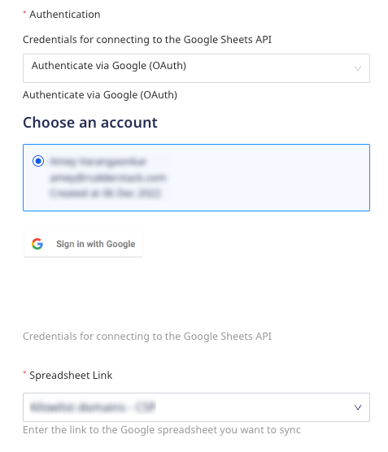
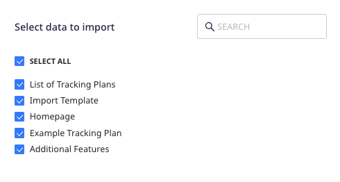
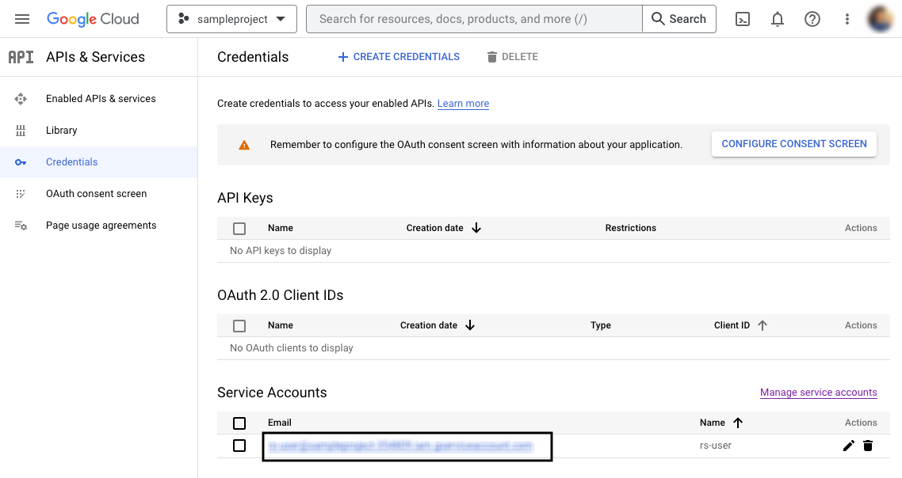
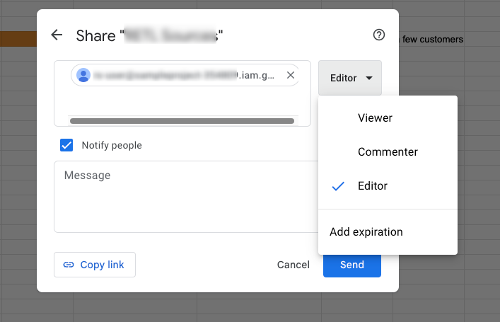

[Google Sheets](https://www.google.com/sheets/about/) is a popular spreadsheet program that lets you create and manage your spreadsheets.

This document guides you in setting up Google Sheets as a source in RudderStack. Once configured, RudderStack automatically ingests your Google Sheets data and routes it to your specified data warehouse destination.

All the Cloud Extract sources support sending data only to a <Link to="/destinations/warehouse-destinations/">data warehouse destination</Link>.

<GhBadge
  label={'Stability'}
  message={'Beta'}
  color={'blueviolet'}
/>

## Getting started

To set up Google Sheets as a source in RudderStack, follow these steps:

1. Log into your [RudderStack dashboard](https://app.rudderstack.com/).
2. Go to **Sources** > **New source** > **Cloud Extract** and select **Google Sheets** from the list of sources.
3. Assign a name to your source and click **Continue**.

### Connection settings

Next, configure the following dashboard settings:

- **Authentication**: From the dropdown, select the authentication mechanism for RudderStack to connect to the Google Sheets API.
    - **Authenticate via Google (OAuth)**: To authenticate via OAuth, click the **Sign in with Google** button, select your Google account, and give RudderStack the required permissions.
    - **Service Account Key Authentication**: Enter your <a href="https://cloud.google.com/iam/docs/creating-managing-service-account-keys#creating">service account</a> JSON credentials in the **Service Account Information** field.
- **Spreadsheet Link**: From the dropdown, select the spreadsheet from which RudderStack should ingest and sync the data.

<ul>
  <li>For the <strong>Authenticate via Google (OAuth)</strong> authentication option, RudderStack will automatically populate all the spreadsheets associated with the account.</li>
  <li>For the <strong>Service Account Key Authentication</strong> option, you need to first provide access to the required spreadsheet. <strong>Only the spreadsheets for which you provide the access will be listed in the dropdown</strong>. For more information, refer to the <Link to="#faq">FAQ</Link> section below.</li>
</ul>

### Destination settings

The following settings specify how RudderStack sends the data ingested from Google Sheets to the connected warehouse destination:

- **Table prefix**: RudderStack uses this prefix to create a table in your data warehouse and loads all your Google Sheets data into it.
- **Schedule Settings**: RudderStack gives you three options to ingest the data from Google Sheets:
    - **Basic**: Runs the syncs at the specified time interval. 
    - **CRON**: Runs the syncs based on the user-defined CRON expression.
    - **Manual**: You are required to run the syncs manually.

For more information on the schedule types, refer to the <Link to="/sources/extract/common-settings/">Common Settings</Link> guide.

### Selecting the data to import

You can specify the Google Sheets data you want to sync by selecting the required sheet. You can also sync data from multiple sheets within the spreadsheet, as shown:

RudderStack considers the first row of each sheet as the header. Empty sheets or sheets with an empty header will <strong>not</strong> be reflected in the <strong>Select data to import</strong> window.

Google Sheets is now configured as a source. RudderStack will start ingesting data from Google Sheets as per your specified schedule and frequency.

You can further connect this source to your data warehouse by clicking the **Add Destination** button, as shown:

Use the <strong>Use Existing Destination</strong> option if you have an already-configured data warehouse destination in RudderStack. To configure a data warehouse destination from scratch, select the <strong>Create New Destination</strong> button.

## How RudderStack syncs data to the warehouse

If you select multiple sheets in the **Select data to import** window, RudderStack creates multiple tables (corresponding to each sheet) in the warehouse.

In the above example, RudderStack creates a table corresponding to each sheet (`List of Tracking Plans`, `Import Template`, and so on) in the warehouse.

While syncing data to the warehouse, RudderStack creates columns only for the headers (first rows in the sheet) which also have data present in the second row (mandatory) and beyond (optional).

The mere presence of a header <strong>does not</strong> create a column in the destination.

## FAQ

### How do I provide service account access to a Google sheet?

If you're using a <a href="https://cloud.google.com/iam/docs/creating-managing-service-account-keys#creating">service account</a> to authenticate RudderStack to sync your Google Sheets data, you must also give the required access to the service account to access the required spreadsheet. Follow these steps to provide access to the required spreadsheet:

1. In your [Google Cloud console](https://console.cloud.google.com/), go to **APIs & Services** > **Credentials**.
2. Under **Service Accounts**, copy the email address listed under **Email**.

3. Go to the spreadsheet, click the **Share** button and paste the email copied above. Specify the permission you want to assign to this email. 

4. Finally, click the **Send** button.

If you get the <strong>Share outside of organization</strong> popup, click <strong>Share anyway</strong>.

The Google sheet will now be accessible in the dropdown. RudderStack can now access the sheet and sync the data from it.

### Is it possible to have multiple Cloud Extract sources writing to the same schema?

Yes, it is.

RudderStack associates a table prefix for every Cloud Extract source writing to a warehouse schema. This way, multiple Cloud Extract sources can write to the same schema with different table prefixes.

 