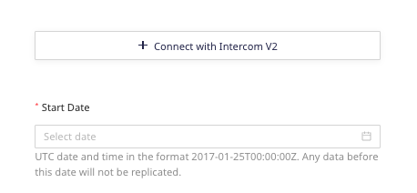
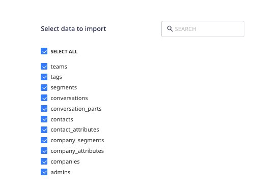
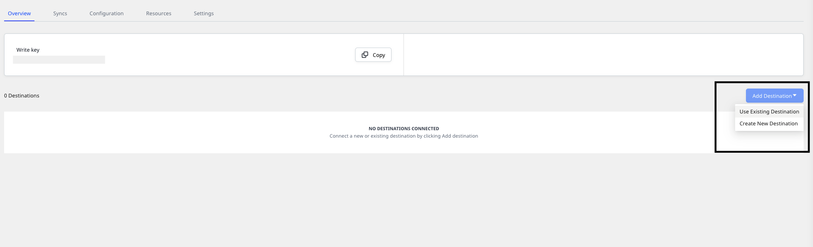
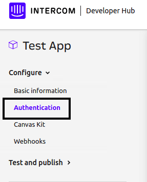

[Intercom](https://www.intercom.com/) is an industry-leading, real-time business messaging platform, that allows you to bring together and manage all your customer life cycle activities on a single platform.

This document guides you in setting up Intercom as a source in RudderStack. Once configured, RudderStack automatically ingests your Intercom data and routes it to your specified data warehouse destination.

This source supports <strong>Intercom API v2.1 and above</strong>.

All the Cloud Extract sources support sending data only to a <Link to="/destinations/warehouse-destinations/">data warehouse destination</Link>.

<GhBadge
  label={'Stability'}
  message={'Beta'}
  color={'blueviolet'}
  style={'for-the-badge'}
  logo={'github'}
/>

## Getting started

To set up Intercom as a source in RudderStack, follow these steps:

1. Log into your [RudderStack dashboard](https://app.rudderstack.com/).
2. Go to **Sources** > **New source** > **Cloud Extract** and select **Intercom V2** from the list of sources.
3. Assign a name to your source and click **Next**.

### Configuring the source

1. Authenticate RudderStack with Intercom by entering the Intercom access token under the **access_token** section.

Refer to the <Link to="#faq">FAQ</Link> section below for more information on getting your Intercom access token.

2. You will also need to enter the **Start date** from which you want RudderStack to ingest the Intercom data. RudderStack will not replicate any data before this date.

### Destination settings

The following settings specify how RudderStack sends the data ingested from Intercom to the connected warehouse destination:

- **Table prefix**: RudderStack uses this prefix to create a table in your data warehouse and loads all your Intercom data into it.
- **Schedule Settings**: RudderStack gives you three options to ingest the data from Intercom:
    - **Basic**: Runs the syncs at the specified time interval. 
    - **CRON**: Runs the syncs based on the user-defined CRON expression.
    - **Manual**: You are required to run the syncs manually.

For more information on the schedule types, refer to the <Link to="/sources/extract/common-settings/">Common Settings</Link> guide.

### Selecting the data to import

You can choose the Intercom data that you want to ingest by selecting the required resources.

The below table mentions the sync types supported by the Intercom resources while syncing data to your warehouse destination:

| Resource | Full Refresh sync | Incremental sync | 
| :---| :---| :----|
| `admins` | Yes | No |
| `companies` | Yes | Yes |
| `company segments` | Yes | Yes |
| `company attributes` | Yes | No |
| `conversations` | Yes | Yes |
| `conversation parts` |  Yes | Yes |
| `contacts` | Yes | Yes |
| `contact attributes` |Yes | No |
| `segments` | Yes | Yes |
| `tags` | Yes | No |
| `teams` | Yes | No |

For more information on the <strong>Full Refresh</strong> and <strong>Incremental</strong> sync modes, refer to the <Link to="/sources/extract/common-settings/#sync-modes">Common Settings</Link> guide.

Intercom is now configured as a source. RudderStack will start ingesting data from Intercom as per your specified schedule and frequency.

You can further connect this source to your data warehouse by clicking the **Add Destination** button, as shown:

Use the <strong>Use Existing Destination</strong> option if you have an already-configured data warehouse destination in RudderStack. To configure a data warehouse destination from scratch, select the <strong>Create New Destination</strong> button.

## Troubleshooting

### Sync errors for older Intercom API versions

For Intercom versions less than **2.1**, data syncs to the warehouse destination will fail and throw an error. This is because many Intercom resources are not supported by the older API versions.

In such a scenario, it is highly recommended to updated your Intercom API.

For more information on updating your Intercom API version, refer to this <a href="https://developers.intercom.com/building-apps/docs/update-your-api-version">Intercom support page</a>.

## FAQ

### How do I get the Intercom access token?

To get the Intercom access token, go to the **Your apps** section under **Intercom Developer Hub**. 

If you have already created an app, click the **Authentication** option under **Configure**, as shown below. Here, you will find the access token under the workspace associated with your app.

For more details, refer to the Intercom [support page](https://help-desk-migration.com/help/get-intercom-api-access-token/).

### Is it possible to have multiple Cloud Extract sources writing to the same schema?

Yes, it is.

RudderStack associates a table prefix for every Cloud Extract source writing to a warehouse schema. This way, multiple Cloud Extract sources can write to the same schema with different table prefixes.

### My data syncs are failing. What should I do?

If your data syncs are failing, verify if your Intercom version is **2.1** or above. For versions less than 2.1, data syncs to the warehouse destination will fail. This is because many Intercom resources are not supported by the older API versions. In this scenario, you will need to update your Intercom API.

For more information on updating your Intercom API version, refer to the [Intercom support page](https://developers.intercom.com/building-apps/docs/update-your-api-version).

If you are using Intercom 2.1 or above and are facing this issue, you can [contact us](mailto:%20docs@rudderstack.com) or get in touch with us in our [Slack](https://rudderstack.com/join-rudderstack-slack-community) community.