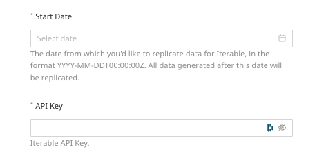
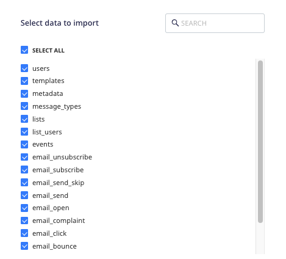

[Iterable](https://www.Iterable.com/) is a popular growth marketing platform that lets you maximize customer interaction and improve your customers' overall LTV (Life Time Value).

This document guides you in setting up Iterable as a source in RudderStack. Once configured, RudderStack automatically ingests your Iterable data and routes it to your specified data warehouse destination.

All the Cloud Extract sources support sending data only to a <Link to="/destinations/warehouse-destinations/">data warehouse destination</Link>.

## Getting started

To set up Iterable as a source in RudderStack, follow these steps:

1. Log into your [RudderStack dashboard](https://app.rudderstack.com/).
2. Go to **Sources** > **New source** > **Cloud Extract** and select **Iterable** from the list of sources.
3. Assign a name to your source and click **Next**.

### Connection settings

Next, configure the following dashboard settings:

- **Start Date**: Enter the date from which RudderStack should ingest the Iterable data. RudderStack will not replicate any data before this date.
- **API Key**: Enter your Iterable project's API key by going to **Integrations** > **API Keys**.

### Destination settings

The following settings specify how RudderStack sends the data ingested from Iterable to the connected warehouse destination:

- **Table prefix**: RudderStack uses this prefix to create a table in your data warehouse and loads all your Iterable data into it.
- **Schedule Settings**: RudderStack gives you three options to ingest the data from Iterable:
    - **Basic**: Runs the syncs at the specified time interval. 
    - **CRON**: Runs the syncs based on the user-defined CRON expression.
    - **Manual**: You are required to run the syncs manually.

For more information on the schedule types, refer to the <Link to="/sources/extract/common-settings/">Common Settings</Link> guide.

### Selecting the data to import

You can choose the Iterable data that you want to ingest by selecting the required resources.

The below table mentions the sync types supported by the Iterable resources while syncing data to your warehouse destination:

| Resource | Sync type | Endpoint | Primary key |
| :---| :--- | :----| :----|
| `campaigns` | Full Refresh |  |  |
| `campaigns_metrics` | Full Refresh |  |  |
| `channels` | Full Refresh |  |  |
| `email_bounce` | Incremental |  |  |
| `email_click` | Incremental |  |  |
| `email_complaint` |  Incremental |  |  |
| `email_open` | Incremental |  |  |
| `email_send` | Incremental |  |  |
| `email_send_skip` | Incremental |  |  |
| `email_subscribe` | Incremental |  |  |
| `email_unsubscribe` | Incremental |  |  |
| `events` | Full Refresh |  |  |
| `lists` | Full Refresh |  |  |
| `list_users` | Full Refresh |  |  |
| `message_types` | Full Refresh |  |  |
| `metadata` | Full Refresh |  |  |
| `templates` | Incremental |  |  | 
| `users` | Incremental |  |  |

For more information on the <strong>Full Refresh</strong> and <strong>Incremental</strong> sync modes, refer to the <Link to="/sources/extract/common-settings/#sync-modes">Common Settings</Link> guide.

Any resource that supports the <strong>Incremental</strong> sync type also supports <strong>Full Refresh</strong>, by default. However, to sync your data using the <strong>Full Refresh</strong> mode, you need to <a href="mailto:support@rudderstack.com">contact the RudderStack team</a>.

Iterable is now configured as a source. RudderStack will start ingesting data from Iterable as per your specified schedule and frequency.

You can further connect this source to your data warehouse by clicking the **Add Destination** button, as shown:

Use the <strong>Use Existing Destination</strong> option if you have an already-configured data warehouse destination in RudderStack. To configure a data warehouse destination from scratch, select the <strong>Create New Destination</strong> button.

## FAQ

### Is it possible to have multiple Cloud Extract sources writing to the same schema?

Yes, it is.

RudderStack associates a table prefix for every Cloud Extract source writing to a warehouse schema. This way, multiple Cloud Extract sources can write to the same schema with different table prefixes.

### Where can I find the Iterable API key?

You can get your Iterable project's API key by logging into your Iterable dashboard and navigating to **Integrations** > **API Keys**. For more information, refer to the <a href="https://support.iterable.com/hc/en-us/articles/360043464871-API-Keys">Iterable documentation</a>.