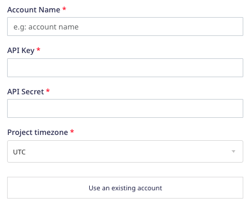

[Mixpanel](https://mixpanel.com/) is an analytics platform that provides specific tools for targeted business communication and customer engagement, in-app A/B testing, user survey forms, and custom reports to measure customer retention.

This document guides you in setting up Mixpanel as a source in RudderStack. Once configured, RudderStack automatically ingests your Mixpanel data and routes it to your specified data warehouse destination.

This source will be deprecated soon. Refer to the <Link to="/sources/extract/mixpanel-v2/">Mixpanel V2</Link> guide for the latest documentation.

All the Cloud Extract sources support sending data only to a <Link to="/destinations/warehouse-destinations/">data warehouse destination</Link>.

## Getting started

To set up Mixpanel as a source in RudderStack, follow these steps:

1. Log into your [RudderStack dashboard](https://app.rudderstack.com/).
2. Go to **Sources** > **New source** > **Cloud Extract** and select **Mixpanel** from the list of sources.
3. Assign a name to your source and click on **Next**.

### Connection settings

1. Click **Create Credentials from Scratch**. You will then see the following screen:

2. Enter the following connection settings:
  - **Account Name** : Enter your Mixpanel account name.
  - **API Key** : Enter your Mixpanel API Key. You can get it from the **Project Settings** option in your Mixpanel dashboard.
  - **API Secret** : Enter your Mixpanel API Secret.
  - **Project timezone** : Enter your Mixpanel project timezone. You can find this information in your Mixpanel **Project Settings**, within the **Project Details** section.

More information on how to obtain the above credentials can be found in the <a href="https://help.mixpanel.com/hc/en-us/articles/115004490503-Project-Settings">Mixpanel support guide</a>.

If you have already connected RudderStack to your Mixpanel account, your credentials should appear automatically under <strong>Use existing credentials</strong>.

### Destination settings

The following settings specify how RudderStack sends the data ingested from Mixpanel to the connected warehouse destination:

- **Table prefix**: RudderStack uses this prefix to create a table in your data warehouse and loads all your Mixpanel data into it.
- **Schedule Settings**: RudderStack gives you three options to ingest the data from Mixpanel:
    - **Basic**: Runs the syncs at the specified time interval. 
    - **CRON**: Runs the syncs based on the user-defined CRON expression.
    - **Manual**: You are required to run the syncs manually.

For more information on the schedule types, refer to the <Link to="/sources/extract/common-settings/">Common Settings</Link> guide.

Mixpanel is now configured as a source. RudderStack will start ingesting data from Mixpanel as per your specified schedule and frequency.

You can further connect this source to your data warehouse by clicking on **Add Destination**, as shown:

Use the <strong>Use Existing Destination</strong> option if you have an already-configured data warehouse destination in RudderStack. To configure a data warehouse destination from scratch, select the <strong>Create New Destination</strong> button.

## FAQ

### Can I connect my Mixpanel source to multiple data warehouse destinations?

You can connect <strong>only one data warehouse destination</strong> per Cloud Extract source. If you wish to send data to multiple warehouses, you can configure multiple Cloud Extract sources with the same settings and connect them to each data warehouse.

#### Is it possible to have multiple Cloud Extract sources writing to the same schema?

Yes, it is.

RudderStack associates a table prefix for every Cloud Extract source writing to a warehouse schema. This way, multiple Cloud Extract sources can write to the same schema with different table prefixes.