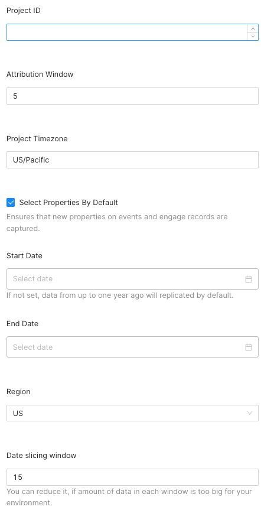

[Mixpanel](https://mixpanel.com/) is an analytics platform that provides specific tools for targeted business communication and customer engagement, in-app A/B testing, user survey forms, and custom reports to measure customer retention.

This document guides you in setting up Mixpanel as a source in RudderStack. Once configured, RudderStack automatically ingests your Mixpanel data and routes it to your specified data warehouse destination.

All the Cloud Extract sources support sending data only to a <Link to="/destinations/warehouse-destinations/">data warehouse destination</Link>.

This source works only with the <a href="https://mixpanel.com/pricing/">Mixpanel Growth and Enterprise</a> versions. It <strong>does not support</strong> the Free plan.

## Getting started

To set up Mixpanel as a source in RudderStack, follow these steps:

1. Log into your [RudderStack dashboard](https://app.rudderstack.com/).
2. Go to **Sources** > **New source** > **Cloud Extract** and select **Mixpanel** from the list of sources.
3. Assign a name to your source and click on **Next**.

### Connection settings

Enter the following connection settings to set up the Mixpanel source:

The connection settings are described below:

- **Project Token** : Enter your Mixpanel project token by going to your Mixpanel **Project Settings** > **Access Keys**.

For more information on obtaining the Mixpanel project token, refer to the <a href="https://help.mixpanel.com/hc/en-us/articles/115004502806-Find-Project-Token-">Mixpanel support guide</a>.

- **Attribution Window**: Specify the time period for attributing results to the ads and the lookback period during which the ads results are counted. By default, this value is set to **5 days**.
- **Project Timezone**: Specify your Mixpanel project timezone by going to your Mixpanel **Project Settings** > **Project Details**.

For more information on getting your Mixpanel project timezone, refer to the <a href="https://help.mixpanel.com/hc/en-us/articles/115004547203-Manage-Timezones-for-Projects-in-Mixpanel">Mixpanel support guide</a>.

- **Select Properties By Default**: Enable this setting to capture new event properties and engage records. If disabled, these properties will be ignored.
- **Start Date**: Select the date from when RudderStack ingests your Mixpanel data.

RudderStack will <strong>not replicate</strong> any data before this date. If you do not set this option, RudderStack will replicate the Mixpanel data up to one year from the current date by default.

- **End Date**: Specify the end date for the replication window.

RudderStack will not replicate any data <strong>after</strong> this date. Do not set this field if you want RudderStack to sync the most recent Mixpanel data.

- **Region**: Specify your Mixpanel domain instance from either **US** or **EU**.
- **Date Slicing Window**: Define the window size used to slice through the Mixpanel data. By default, RudderStack sets this field to **30 days**.

Reduce the value of this field if the amount of data in the slicing window is too large for your environment.

### Destination settings

The following settings specify how RudderStack sends the data ingested from Mixpanel to the connected warehouse destination:

- **Table prefix**: RudderStack uses this prefix to create a table in your data warehouse and loads all your Mixpanel data into it.
- **Schedule Settings**: RudderStack gives you three options to ingest the data from Mixpanel:
    - **Basic**: Runs the syncs at the specified time interval. 
    - **CRON**: Runs the syncs based on the user-defined CRON expression.
    - **Manual**: You are required to run the syncs manually.

For more information on the schedule types, refer to the <Link to="/sources/extract/common-settings/">Common Settings</Link> guide.

### Selecting the data to import

You can choose the Mixpanel data you want to ingest by selecting the required resources:

The below table mentions the syncs and API endpoints supported by these resources from Mixpanel to your warehouse destination:

| Resource | Full Refresh sync | Incremental sync | Mixpanel API endpoint |
| :---| :---- | :---- | :---- |
| `revenue` |  Yes | Yes | `/engage` |
| `funnels` | Yes | Yes |  `/funnels` |
| `export` | Yes | Yes |  `/export`|
| `engage` | Yes | No |  `/engage` |
| `cohorts` | Yes | Yes |  `/cohorts/list`|
| `cohort_members` | Yes | No | `/engage` |
| `annotations` | Yes | No |  `/annotations`|

For more information on the <strong>Full Refresh</strong> and <strong>Incremental</strong> sync modes, refer to the <Link to="/sources/extract/common-settings/#sync-modes">Common Settings</Link> guide.

Mixpanel is now configured as a source. RudderStack will start ingesting data from Mixpanel as per your specified schedule and frequency.

You can further connect this source to your data warehouse by clicking on **Add Destination**, as shown:

Use the <strong>Use Existing Destination</strong> option if you have an already-configured data warehouse destination in RudderStack. To configure a data warehouse destination from scratch, select the <strong>Create New Destination</strong> button.

## FAQ

### Can I connect my Mixpanel source to multiple data warehouse destinations?

You can connect <strong>only one data warehouse destination</strong> per Cloud Extract source. If you wish to send data to multiple warehouses, you can configure multiple Cloud Extract sources with the same settings and connect them to each data warehouse.

### Is it possible to have multiple Cloud Extract sources writing to the same schema?

Yes, it is.

RudderStack associates a table prefix for every Cloud Extract source writing to a warehouse schema. This way, multiple Cloud Extract sources can write to the same schema with different table prefixes.
