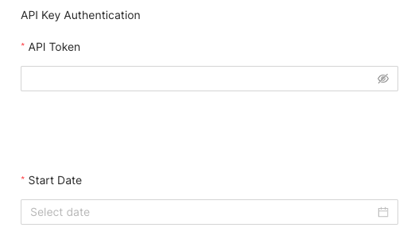
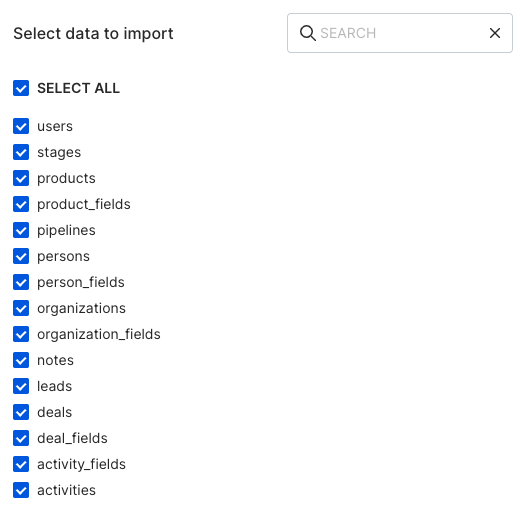

[Pipedrive](https://www.pipedrive.com/) is a popular sales CRM and pipeline management tool that lets you manage your leads, track all your customer communications, automate administrative tasks, and much more.

This document guides you in setting up Pipedrive as a source in RudderStack. Once configured, RudderStack automatically ingests your Pipedrive data and routes it to your specified data warehouse destination.

All the Cloud Extract sources support sending data only to a <Link to="/destinations/warehouse-destinations/">data warehouse destination</Link>.

## Getting Started

To set up Pipedrive as a source in RudderStack, follow these steps:

1. Log into your [RudderStack dashboard](https://app.rudderstack.com/).
2. Go to **Sources** > **New source** > **Cloud Extract** and select **Pipedrive V2** from the list of sources.
3. Assign a name to your source and click **Continue**.

### Connection settings

To set up Pipedrive as a Cloud Extract source, configure the following settings:

- **API Token**: Enter your Pipedrive API token by going to your Pipedrive dashboard and navigating to **Settings** > **API Keys**.
- **Start Date**: Select the date from when RudderStack ingests your Pipedrive data. RudderStack will **not replicate** any data before this date.

### Destination settings

The following settings specify how RudderStack sends the data ingested from Pipedrive to the connected warehouse destination:

- **Table prefix**: RudderStack uses this prefix to create a table in your data warehouse and loads all your Pipedrive data into it.
- **Schedule Settings**: RudderStack gives you three options to ingest the data from Pipedrive:
    - **Basic**: Runs the syncs at the specified time interval. 
    - **CRON**: Runs the syncs based on the user-defined CRON expression.
    - **Manual**: You are required to run the syncs manually.

For more information on the schedule types, refer to the <Link to="/sources/extract/common-settings/">Common Settings</Link> guide.

### Selecting the data to import

You can choose the Pipedrive data you want to ingest by selecting the required resources:

The below table mentions the syncs supported by these resources from Pipedrive to your warehouse destination where `id` is a common primary key for all:  

| Resource | Sync type | 
| :---| :--- | 
|`users`| Incremental | 
|`stages`| Incremental | 
|`products`| Incremental | 
|`product_fields`| Full Refresh |
|`pipelines`| Incremental | 
|`persons`| Incremental | 
|`person_fields`| Full Refresh |
|`organizations`| Incremental | 
|`organization_fields`|
|`notes`| Incremental | 
|`leads`| Full Refresh |
|`deals`| Incremental | 
|`deal_fields`| Full Refresh |
|`activity_fields`| Full Refresh |
|`activities`| Incremental | 

For more information on the <strong>Full Refresh</strong> and <strong>Incremental</strong> sync modes, refer to the <Link to="/sources/extract/common-settings/#sync-modes">Common Settings</Link> guide.

Pipedrive is now configured as a source. RudderStack will start ingesting data from Bing Ads as per your specified schedule and frequency.

You can further connect this source to your data warehouse by clicking on **Add Destination**, as shown:

Use the <strong>Use Existing Destination</strong> option if you have an already-configured data warehouse destination in RudderStack. To configure a data warehouse destination from scratch, select the <strong>Create New Destination</strong> button.

## FAQ

#### Is it possible to have multiple Cloud Extract sources writing to the same schema?

Yes, it is.

RudderStack implements a feature wherein it associates a table prefix for every Cloud Extract source writing to a warehouse schema. This way, multiple Cloud Extract sources can write to the same schema with different table prefixes.