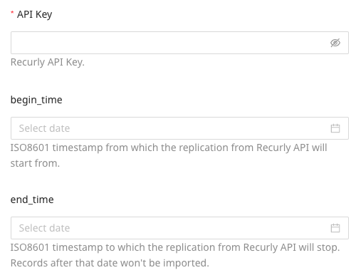
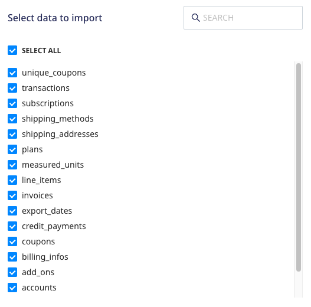

[Recurly](https://recurly.com/) is an email delivery and marketing tool that lets you build and deliver personalized experiences through their API and marketing automation flows.

This document guides you in setting up Sendgrid as a source in RudderStack. Once configured, RudderStack automatically ingests your specified Sendgrid data, which can then be routed to your RudderStack-supported data warehouse destination.

All the Cloud Extract sources support sending data only to a <Link to="/destinations/warehouse-destinations/">data warehouse destination</Link>.

## Getting started

To set up Recurly as a source in RudderStack, follow these steps:

1. Log into your [RudderStack dashboard](https://app.rudderstack.com/).
2. Go to **Sources** > **New source** > **Cloud Extract** and select **Recurly** from the list of sources.
3. Assign a name to your source and click on **Continue**.

### Connection settings

- **API Key**: Enter your Recurly API key by going to your Recurly dashboard and navigating to **Settings** > **API Keys**.
- **begin_time**: Enter the ISO8601 timestamp from where the replication from Recurly API should start. 
- **end_time**: Enter the ISO8601 timestamp at which the replication from Recurly API should stop. The data records after this date are not imported.

For more information on how to obtain the API key, refer to the <a href="#faq">FAQ</a> section below.

### Destination settings

The following settings specify how RudderStack sends the data ingested from Recurly to the connected warehouse destination:

- **Table prefix**: RudderStack uses this prefix to create a table in your data warehouse and loads all your Recurly data into it.
- **Schedule Settings**: RudderStack gives you three options to ingest the data from Recurly:
    - **Basic**: Runs the syncs at the specified time interval. 
    - **CRON**: Runs the syncs based on the user-defined CRON expression.
    - **Manual**: You are required to run the syncs manually.

For more information on the schedule types, refer to the <Link to="/sources/extract/common-settings/">Common Settings</Link> guide.

### Selecting the data to import

Choose the Recurly data that you wish to ingest via RudderStack. You can either select all the data or choose specific Recurly data attributes as per your requirement.

Recurly is now configured as a source. RudderStack will start ingesting data from Recurly as per your specified schedule and frequency.

You can further connect this source to your data warehouse by clicking on **Add Destination**, as shown:

Use the <strong>Use Existing Destination</strong> option if you have an already-configured data warehouse destination in RudderStack. To configure a data warehouse destination from scratch, select the <strong>Create New Destination</strong> button.

## FAQ

### How do I obtain the Recurly API key?

To obtain the API key for configuring the Recurly Cloud Extract source, follow these steps:

1. Log into your [Recurly dashboard](https://recurly.com/).
2. Go to **Integrations** > **API Credentials** to find the API key as shown:

### Is it possible to have multiple Cloud Extract sources writing to the same schema?

Yes, it is.

RudderStack associates a table prefix for every Cloud Extract source writing to a warehouse schema. This way, multiple Cloud Extract sources can write to the same schema with different table prefixes.