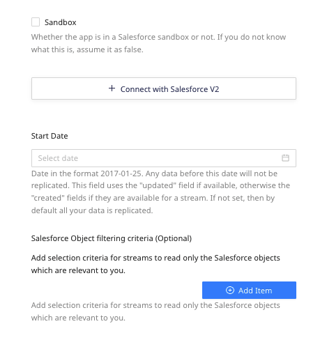
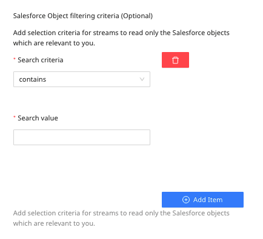
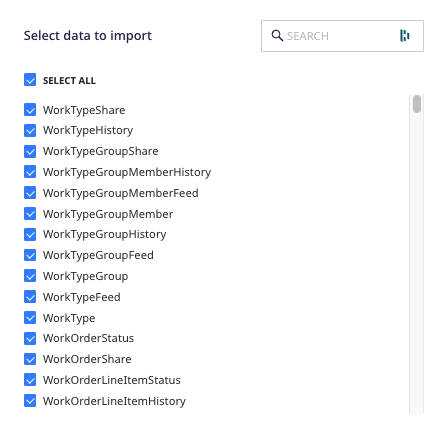

[Salesforce](https://salesforce.com/) is an industry leader in enterprise CRM. It offers a suite of enterprise applications revolving around marketing automation, customer support, application development, and analytics.

This document guides you in setting up Salesforce as a source in RudderStack. Once configured, RudderStack automatically ingests your specified Salesforce data, which can then be routed to your RudderStack-supported data warehouse destination.

<GhBadge
  label={'Stability'}
  message={'Beta'}
  color={'blueviolet'}
/>

All the Cloud Extract sources support sending data only to a <Link to="/destinations/warehouse-destinations/">data warehouse destination</Link>.

## Getting started

To set up Salesforce as a source in RudderStack, follow these steps:

1. Log into your [RudderStack dashboard](https://app.rudderstack.com/).
2. Go to **Sources** > **New source** > **Cloud Extract** and select **Salesforce** from the list of sources.
3. Assign a name to your source and click **Continue**.

### Connection settings

To set up Salesforce as a Cloud Extract source, you need to configure the following settings:

- Enable the **Sandbox** checkbox if your app is in the Salesforce [sandbox](https://help.salesforce.com/s/articleView?id=sf.create_test_instance.htm&type=5) mode.

It is highly recommended to keep the checkbox unchecked if you're unsure whether your app is in a Salesforce sandbox.

- Click **Connect with Salesforce V2** and connect your Salesforce account with RudderStack.
- **Start Date**: Choose the start date from which you want RudderStack to ingest the Salesforce data. RudderStack will not replicate any data before this date.

If you do not specify the start date, RudderStack will replicate all your data by default.

RudderStack replicates all the Salesforce data associated with the <code class="inline-code">updated</code> field. If not present, it picks the data associated with the <code class="inline-code">created</code> field.
  
<strong>RudderStack only reads your Salesforce data and does not write to it</strong>.

- **Salesforce Object filtering criteria**: This optional setting lets you add the filtering criteria to read and ingest only the Salesforce objects relevant to you.

### Destination settings

The following settings specify how RudderStack sends the data ingested from Salesforce to the connected warehouse destination:

- **Table prefix**: RudderStack uses this prefix to create a table in your data warehouse and loads all your Salesforce data into it.
- **Schedule Settings**: RudderStack gives you three options to ingest the data from Salesforce:
    - **Basic**: Runs the syncs at the specified time interval. 
    - **CRON**: Runs the syncs based on the user-defined CRON expression.
    - **Manual**: You are required to run the syncs manually.

For more information on the schedule types, refer to the <Link to="/sources/extract/common-settings/">Common Settings</Link> guide.

### Selecting the data to import

Choose the Salesforce data that you wish to ingest via RudderStack. You can either select all the data or choose specific Salesforce data attributes as per your requirement.

For more information on how RudderStack syncs your Salesforce data, refer to the <Link to="#faq">FAQ</Link> section below.

Salesforce is now configured as a source. RudderStack will start ingesting data from Salesforce as per your specified schedule and frequency.

You can further connect this source to your data warehouse by clicking on **Add Destination**, as shown:

Use the <strong>Use Existing Destination</strong> option if you have an already-configured data warehouse destination in RudderStack. To configure a data warehouse destination from scratch, select the <strong>Create New Destination</strong> button.

## FAQ

### Can I connect my Salesforce source to multiple data warehouse destinations?

You can connect <strong>only one data warehouse destination</strong> per Cloud Extract source. If you wish to send data to multiple warehouses, you can configure multiple Cloud Extract sources with the same settings and connect them to each data warehouse.

### How does RudderStack handle the Salesforce rate limits?

RudderStack automatically stops the sync process if the Salesforce [rate limits](https://developer.salesforce.com/docs/atlas.en-us.salesforce_app_limits_cheatsheet.meta/salesforce_app_limits_cheatsheet/salesforce_app_limits_platform_api.htm) are hit. Once the limits are lifted, RudderStack starts the next data sync from the point it last stopped.

### Is it possible to have multiple Cloud Extract sources writing to the same schema?

Yes, it is.

RudderStack associates a table prefix for every Cloud Extract source writing to a warehouse schema. This way, multiple Cloud Extract sources can write to the same schema with different table prefixes.

For more information on setting a table prefix, refer to the <Link to="#destination-settings">Destination settings</Link> section above.

