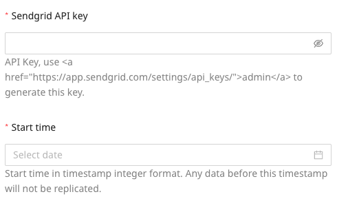
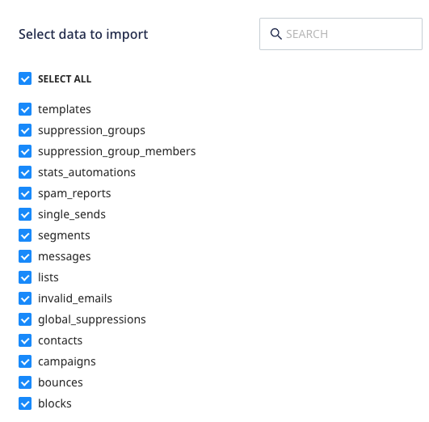
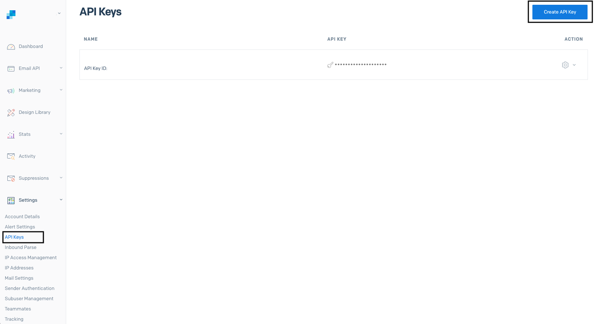
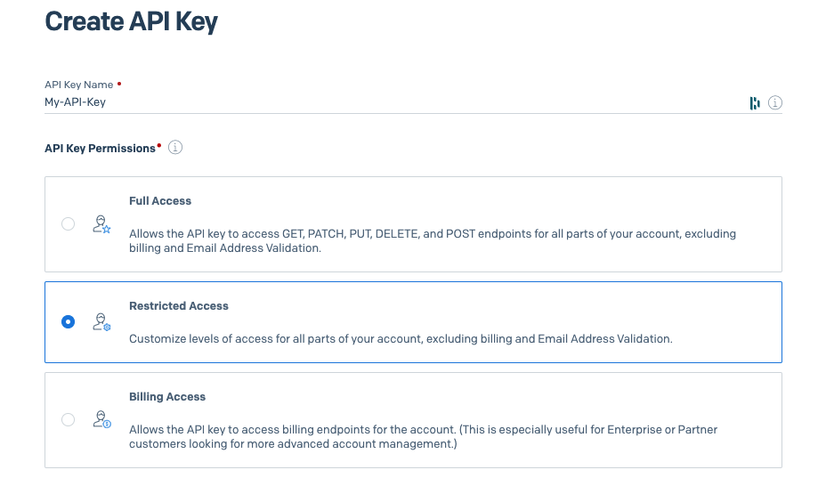
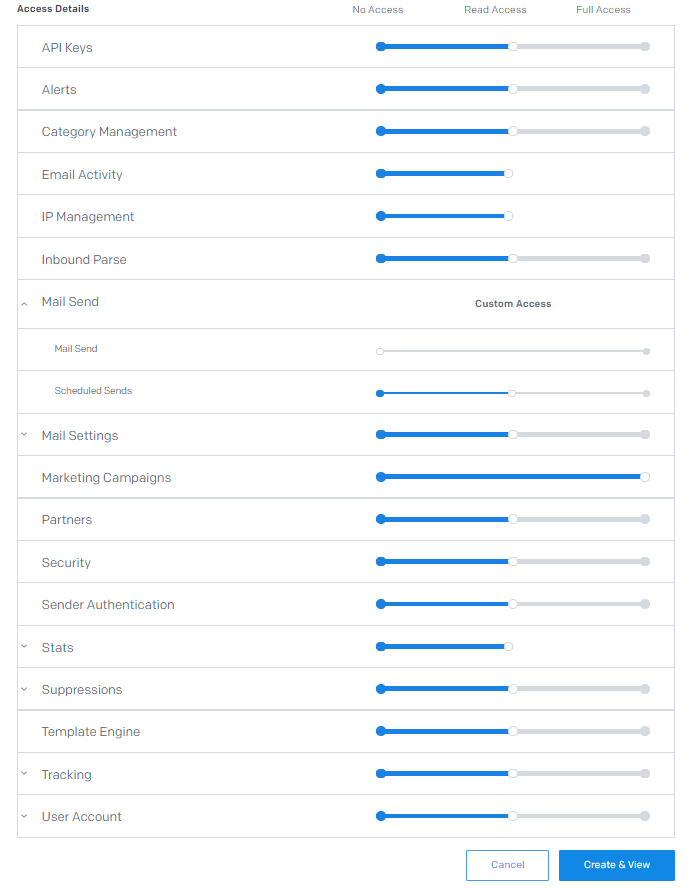
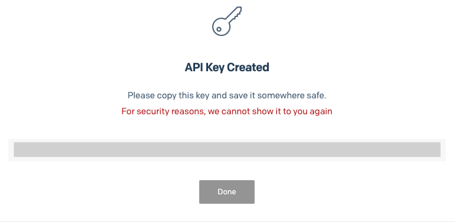

[SendGrid](https://www.sendgrid.com/) is an email delivery and marketing tool that lets you build and deliver personalized experiences through their API and marketing automation flows.

This document guides you in setting up SendGrid as a source in RudderStack. Once configured, RudderStack automatically ingests your SendGrid data and routes it to your specified data warehouse destination.

All the Cloud Extract sources support sending data only to a <Link to="/destinations/warehouse-destinations/">data warehouse destination</Link>.

## Getting started

To set up SendGrid as a source in RudderStack, follow these steps:

1. Log into your [RudderStack dashboard](https://app.rudderstack.com/).
2. Go to **Sources** > **New source** > **Cloud Extract** and select **SendGrid** from the list of sources.
3. Assign a name to your source and click **Next**.

### Connection settings

1. Enter the following connection credentials to authenticate your SendGrid account with RudderStack:

- **SendGrid API key**: Enter your SendGrid API key by going to your SendGrid dashboard and navigating to **Settings** > **API Keys**.
- **Start time**: Choose the start date from which you want RudderStack to ingest the SendGrid data. RudderStack will not replicate any data before this date.

For more information on the required permissions for the API key, refer to the <a href="#faq">FAQ</a> section below.

### Destination settings

The following settings specify how RudderStack sends the data ingested from SendGrid to the connected warehouse destination:

- **Table prefix**: RudderStack uses this prefix to create a table in your data warehouse and loads all your SendGrid data into it.
- **Schedule Settings**: RudderStack gives you three options to ingest the data from SendGrid:
    - **Basic**: Runs the syncs at the specified time interval. 
    - **CRON**: Runs the syncs based on the user-defined CRON expression.
    - **Manual**: You are required to run the syncs manually.

For more information on the schedule types, refer to the <Link to="/sources/extract/common-settings/">Common Settings</Link> guide.

### Selecting the data to import

You can choose the SendGrid data you want to ingest by selecting the required resources:

The below table mentions the syncs and API endpoints supported by these resources from SendGrid to your warehouse destination:

| Resource | Full Refresh sync | Incremental sync | SendGrid API endpoint |
| :---| :---- | :---- | :---- |
| `blocks` |  Yes | Yes | `/suppression/blocks` |
| `bounces` | Yes | Yes |  `/suppression/bounces` |
| `campaigns` | Yes | No |  `/marketing/campaigns`|
| `contacts` | Yes | No |  `/marketing/contacts` |
| `global_suppressions` | Yes | Yes |  `/suppression/unsubscribes`|
| `invalid_emails` | Yes | Yes | `/suppression/invalid_emails` |
| `lists` | Yes | No |  `/marketing/lists`|
| `messages` | Yes | Yes |  `/messages`|
| `segments` | Yes | No |  `/marketing/segments` |
| `single_sends` | Yes | No |  `/marketing/stats/singlesends`|
| `spam_reports` | Yes | Yes |  `/suppression/spam_reports` |
| `stats_automations` | Yes | No |  `/marketing/stats/automations` |
| `suppression_group_members` | Yes | No |  `/asm/suppressions`|
| `suppression_groups` | Yes | No |   `/asm/groups`|
| `templates` |  Yes | No |  `/templates`|

For more information on the <strong>Full Refresh</strong> and <strong>Incremental</strong> sync modes, refer to the <Link to="/sources/extract/common-settings/#sync-modes">Common Settings</Link> guide.

Note the following restrictions for the `campaigns`, `messages`, and `single_sends` resources:

- `campaigns`: SendGrid currently supports two kinds of marketing campaigns - **legacy** and **new** marketing campaigns. However, RudderStack only supports the new marketing campaigns. 

If your SendGrid account uses legacy marketing campaigns, you might get a <strong>403 Forbidden</strong> error while ingesting data from this resource.

- `messages`: To ingest data from this resource, you must have purchased access to the Email Activity Feed API. For more information, refer to the <a href="https://docs.sendgrid.com/api-reference/e-mail-activity/filter-all-messages">SendGrid API documentation</a>. 
- `single_sends`: RudderStack uses the [`stats`](https://docs.sendgrid.com/api-reference/marketing-campaign-stats/get-all-single-sends-stats) API instead of the `marketing` API to ingest the data from this resource.

SendGrid is now configured as a source. RudderStack will start ingesting data from SendGrid as per your specified schedule and frequency.

You can further connect this source to your data warehouse by clicking on **Add Destination**, as shown:

Use the <strong>Use Existing Destination</strong> option if you have an already-configured data warehouse destination in RudderStack. To configure a data warehouse destination from scratch, select the <strong>Create New Destination</strong> button.

## FAQ

### How do I obtain the SendGrid API key?

To obtain the API key for configuring the SendGrid Cloud Extract source, follow these steps:

1. Log into your SendGrid dashboard.
2. Go to **Settings** > **API keys**.
3. Click on the **Create API key** option, as shown:

4. Enter the name of the API key under the **API Key Name** field. In **API Key Permissions**, select **Restricted Access**.

5.  Set the permissions as shown below:

6. Finally, click **Create & View**. Use these credentials to configure the source.

Copy the API key and store it securely. SendGrid will not display the API key again once you click <strong>Done</strong>.

### How does RudderStack sync the SendGrid data?

Upon configuring the source, RudderStack first connects to your SendGrid instance and pulls all the historical data. Subsequently, RudderStack syncs the SendGrid data based on your specified sync schedule and frequency.

### Is it possible to have multiple Cloud Extract sources writing to the same schema?

Yes, it is.

RudderStack associates a table prefix for every Cloud Extract source writing to a warehouse schema. This way, multiple Cloud Extract sources can write to the same schema with different table prefixes.