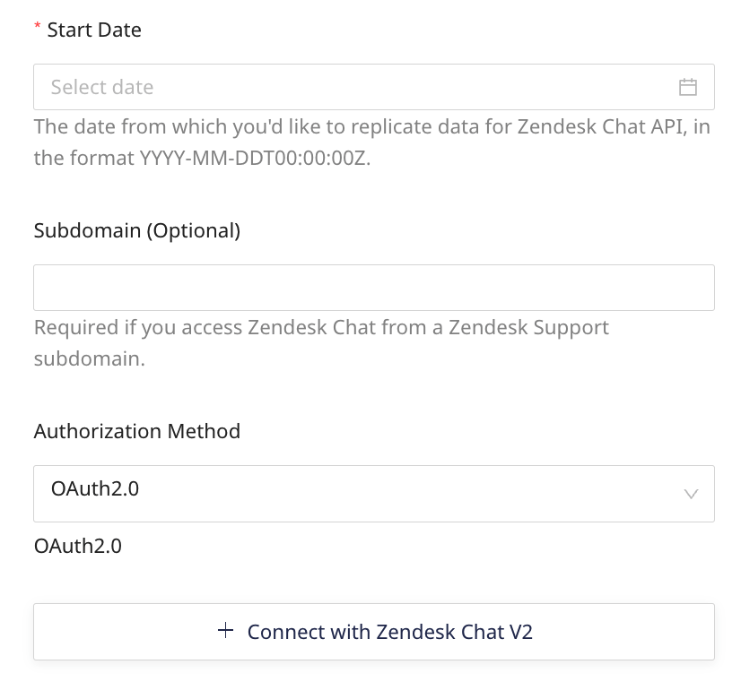
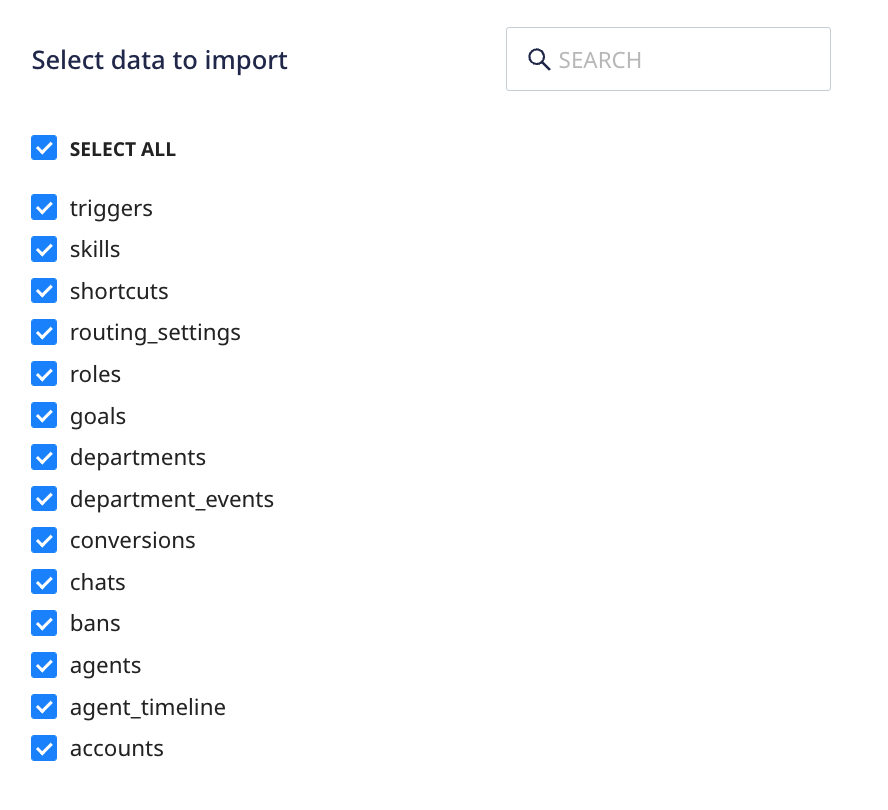

Zendesk Chat is a cross-platform live chat software. It lets you reach out to your customers in real-time via live chats and instant messaging.

This document guides you in setting up Zendesk Chat as a source in RudderStack. Once configured, RudderStack automatically ingests your Zendesk Chat data and routes it to your specified data warehouse destination.

All the Cloud Extract sources support sending data only to a <Link to="/destinations/warehouse-destinations/">data warehouse destination</Link>.

<GhBadge
  label={'Stability'}
  message={'Beta'}
  color={'blueviolet'}
  logo={'github'}
/>

## Getting started

To set up Zendesk Chat as a source in RudderStack, follow these steps:

1. Log into your [RudderStack dashboard](https://app.rudderstack.com/).
2. Go to **Sources** > **New source** > **Cloud Extract** and select **Zendesk Chat** from the list of sources.
3. Assign a name to your source and click **Continue**.

### Connection settings

To set up Zendesk Chat as a Cloud Extract source, you need to configure the following settings:

- **Start Date**: Choose the start date from which you want RudderStack to ingest the Zendesk Chat data. RudderStack will not replicate any data before this date.

You will not be able to proceed if you do not specify the start date.

- **Subdomain**: Enter the subdomain from your Zendesk account's URL. For example, if your Zendesk account URL is `sample.zendesk.com`, the subdomain would be `sample`.

It is <strong>mandatory</strong> to provide a subdomain if your Zendesk account URL is of the format <code class="inline-code">sample.zendesk.com</code>. However, if you only have a Zendesk Chat account and the URL does not follow this format, you can skip this field and set up your source without specifying a subdomain.

- **Authentication**: Select an authentication method from the dropdown:
    - **OAuth2.0**: Click **Connect with Zendesk Chat** to authenticate your account.
    - **Access token**: Enter your Zendesk Chat access token. Refer to the [Zendesk Chat documentation](https://support.zendesk.com/hc/en-us/articles/4408882184986-Getting-an-OAuth-access-token-for-testing-purposes) for more details on obtaining this token.

### Destination settings

The following settings specify how RudderStack sends the ingested data from Zendesk Chat to the warehouse destination:

- **Table prefix**: RudderStack uses this prefix to create a table in your data warehouse and loads all your Zendesk Chat data into it.
- **Schedule Settings**: RudderStack gives you three options to ingest the data from Zendesk Chat:
    - **Basic**: Runs the syncs at the specified time interval. 
    - **CRON**: Runs the syncs based on the user-defined CRON expression.
    - **Manual**: You are required to run the syncs manually.

For more information on the schedule types, refer to the <Link to="/sources/extract/common-settings/">Common Settings</Link> guide.

### Selecting the data to import

You can choose the Zendesk Chat data you want to ingest by selecting the required resources:

The below table lists the syncs supported by the Zendesk Chat resources to your warehouse destination:

| Resource | Full Refresh sync | Incremental sync | API endpoint |
| :---| :---- | :---- |  :---- |
| `accounts` |  Yes | No | `/account` |
| `agent_timeline` | Yes | Yes |  `/incremental/agent_timeline` |
| `agents` | Yes | Yes | `/agents`|
| `bans` | Yes | Yes |  `/bans`|
| `chats` | Yes | Yes | `/incremental/chats` |
| `conversions` | Yes | Yes | `/incremental/conversions`| 
| `department_events` | Yes | Yes |  `/incremental/department_events` |
| `departments` | Yes | No | `/departments`|
| `goals` | Yes | No | `/goals` | 
| `roles` | Yes | No | `/roles`|
| `routing_settings` | Yes | No |  `/routing_settings/account`|
| `shortcuts` | Yes | No | `/shortcuts` |
| `skills` | Yes | No | `/skills`|
| `triggers` | Yes | No | `/triggers`|

For more information on the <strong>Full Refresh</strong> and <strong>Incremental</strong> sync modes, refer to the <Link to="/sources/extract/common-settings/#sync-modes">Common Settings</Link> guide.

Zendesk Chat is now configured as a source. RudderStack will start ingesting data from Zendesk Chat as per your specified schedule and frequency.

You can further connect this source to your data warehouse by clicking on **Add Destination**, as shown:

Use the <strong>Use Existing Destination</strong> option if you have an already-configured data warehouse destination in RudderStack. To configure a data warehouse destination from scratch, select the <strong>Create New Destination</strong> button.

## FAQ

### Where can I find my Zendesk Chat subdomain?

You can easily identify the Zendesk Chat subdomain from your account URL. It is in the format `https://[YOUR_ZENDESK_SUBDOMAIN].zendesk.com`.

#### Is it possible to have multiple Cloud Extract sources writing to the same schema?

Yes, it is.

We have implemented a feature wherein RudderStack associates a table prefix for every Cloud Extract source writing to a warehouse schema. This way, multiple Cloud Extract sources can write to the same schema with different table prefixes.