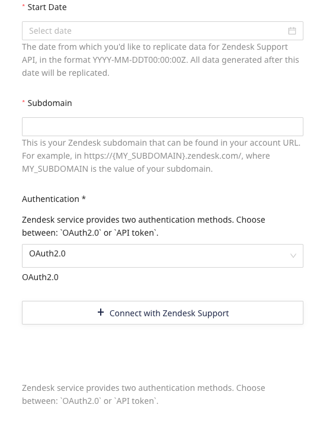
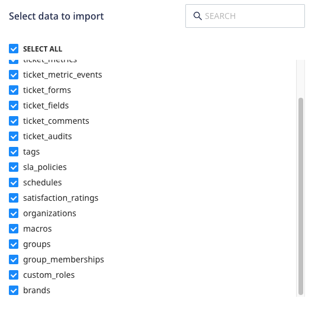

[Zendesk Support](https://support.zendesk.com/hc/en-us) is a popular ticketing system and support platform. It lets you offer customer support through various mediums such as email, mobile, social media, and voice.

This document guides you in setting up Zendesk Support as a source in RudderStack. Once configured, RudderStack automatically ingests your Zendesk Support data and routes it to your specified data warehouse destination.

All the Cloud Extract sources support sending data only to a <Link to="/destinations/warehouse-destinations/">data warehouse destination</Link>.

<GhBadge
  label={'Stability'}
  message={'Beta'}
  color={'blueviolet'}
  logo={'github'}
/>

## Getting started

To set up Zendesk Support as a source in RudderStack, follow these steps:

1. Log into your [RudderStack dashboard](https://app.rudderstack.com/).
2. Go to **Sources** > **New source** > **Cloud Extract** and select **Zendesk Support** from the list of sources.
3. Assign a name to your source and click **Continue**.

### Connection settings

To set up Zendesk Support as a Cloud Extract source, you need to configure the following settings:

- **Start Date**: Choose the start date from which you want RudderStack to ingest the Zendesk Support data. RudderStack will not replicate any data before this date.

If you do not specify the start date, RudderStack will replicate all your data by default.

- **Subdomain**: Enter the subdomain from your Zendesk account's URL. For example, if your Zendesk account URL is `sample.zendesk.com`, the subdomain would be `sample`.
- **Authentication**: Select an authentication method from the dropdown:
    - **OAuth2.0**: Click **Connect with Zendesk Support** to authenticate your account.
    - **API token**: Enter the **Email** used to log in to the Zendesk account and the **API token**. Refer to the [Zendesk documentation](https://support.zendesk.com/hc/en-us/articles/4408889192858-Generating-a-new-API-token) section for more details on obtaining the API Token. 

### Destination settings

The following settings specify how RudderStack sends the ingested data from Zendesk Support to the warehouse destination:

- **Table prefix**: RudderStack uses this prefix to create a table in your data warehouse and loads all your Zendesk Support data into it.
- **Schedule Settings**: RudderStack gives you three options to ingest the data from Zendesk Support:
    - **Basic**: Runs the syncs at the specified time interval. 
    - **CRON**: Runs the syncs based on the user-defined CRON expression.
    - **Manual**: You are required to run the syncs manually.

For more information on the schedule types, refer to the <Link to="/sources/extract/common-settings/">Common Settings</Link> guide.

### Selecting the data to import

You can choose the Zendesk Support data you want to ingest by selecting the required resources:

The below table lists the syncs supported by the Zendesk Support resources to your warehouse destination:

| Resource | Full Refresh sync | Incremental sync | 
| :---| :---- | :---- | 
| `brands` |  Yes | No | 
| `custom_roles` | Yes | No | 
| `group_memberships` | Yes | Yes | 
| `groups` | Yes | Yes | 
| `macros` | Yes | Yes | 
| `organizations` | Yes | Yes | 
| `satisfaction_ratings` | Yes | Yes | 
| `schedules` | Yes | No |
| `sla_policies` | Yes | No |
| `tags` | Yes | No |
| `ticket_audits` | Yes | Yes | 
| `ticket_comments` | Yes | Yes | 
| `ticket_fields` | Yes | Yes | 
| `ticket_forms` | Yes | Yes | 
| `ticket_metric_events` | Yes | Yes | 
| `ticket_metrics` | Yes | Yes | 
| `tickets` | Yes | Yes | 
| `users` | Yes | Yes | 

For more information on the <strong>Full Refresh</strong> and <strong>Incremental</strong> sync modes, refer to the <Link to="/sources/extract/common-settings/#sync-modes">Common Settings</Link> guide.

There are some rate limits while sending requests to the Zendesk Support API. Refer to the <a href="https://developer.zendesk.com/api-reference/introduction/rate-limits/">Zendesk documentation</a> for more details on these limits.

Zendesk Support is now configured as a source. RudderStack will start ingesting data from Zendesk Support as per your specified schedule and frequency.

You can further connect this source to your data warehouse by clicking on **Add Destination**, as shown:

Use the <strong>Use Existing Destination</strong> option if you have an already-configured data warehouse destination in RudderStack. To configure a data warehouse destination from scratch, select the <strong>Create New Destination</strong> button.

## FAQ

### Is it possible to have multiple Cloud Extract sources writing to the same schema?

Yes, it is.

RudderStack associates a table prefix for every Cloud Extract source writing to a warehouse schema. This way, multiple Cloud Extract sources can write to the same schema with different table prefixes.

