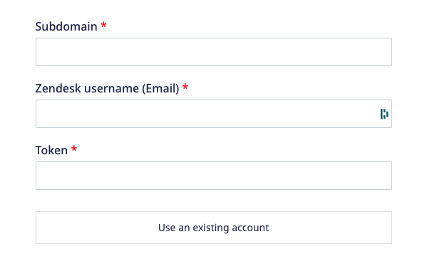
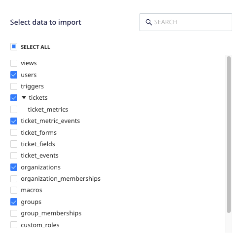
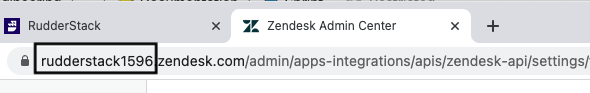
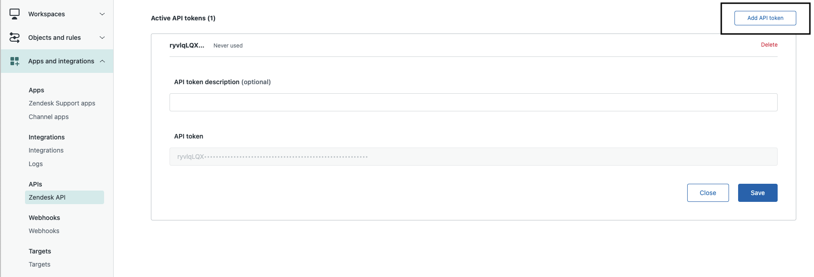

[Zendesk](https://www.zendesk.com/) is a popular customer support, sales and service platform that lets you serve and engage with your customers effectively. Zendesk offers integrated customer support, a modern sales CRM, as well as a smart, self-serve knowledge base.

This document guides you in setting up Zendesk as a source in RudderStack. Once configured, RudderStack automatically ingests your specified Zendesk data and routes it to your data warehouse.

All the Cloud Extract sources support sending data only to a <Link to="/destinations/warehouse-destinations/">data warehouse destination</Link>.

## Getting started

To set up Zendesk as a source in RudderStack, follow these steps:

1. Log into your [RudderStack dashboard](https://app.rudderstack.com/).
2. Go to **Sources** > **New source** > **Cloud Extract** and select **Zendesk** from the list of sources.
3. Assign a name to your source and click on **Continue**.

### Connection settings

1. Click **Create Credentials from Scratch** and enter your Zendesk credentials, as shown:

- **Subdomain**: Enter the prefix your Zendesk subdomain.

If your Zendesk subdomain is <code class="inline-code">example.zendesk.com</code>, enter <code class="inline-code">example</code> in this field.

- **Zendesk username (Email)**: Enter the email used to sign up for your Zendesk account.
- **Token**: Enter your Zendesk app token.

For more information on obtaining your Zendesk subdomain and API token, refer to the <Link to="#faq">FAQ</Link> section below.

Your Zendesk account and the related details will then automatically appear under <strong>Choose an account</strong> for future use.

### Destination settings

The following settings specify how RudderStack sends the ingested data from Zendesk to the warehouse destination:

- **Table prefix**: RudderStack uses this prefix to create a table in your data warehouse and loads all your Zendesk data into it.
- **Schedule Settings**: RudderStack gives you three options to ingest the data from Zendesk:
    - **Basic**: Runs the syncs at the specified time interval. 
    - **CRON**: Runs the syncs based on the user-defined CRON expression.
    - **Manual**: You are required to run the syncs manually.

For more information on the schedule types, refer to the <Link to="/sources/extract/common-settings/">Common Settings</Link> guide.

### Selecting the data to import

Choose the Zendesk data that you wish to ingest via RudderStack. You can either select all the data or choose specific Zendesk data attributes as per your requirement.

Zendesk is now configured as a source. RudderStack will start ingesting data from Zendesk as per your specified schedule and frequency.

You can further connect this source to your data warehouse by clicking on **Add Destination**, as shown:

Use the <strong>Use Existing Destination</strong> option if you have an already-configured data warehouse destination in RudderStack. To configure a data warehouse destination from scratch, select the <strong>Create New Destination</strong> button.

## FAQ

### Where do I find my Zendesk subdomain and API token?

Your Zendesk subdomain is a part of the URL once you sign into your Zendesk account. It is of the format `subdomain.zendesk.com`. An example is shown below:

To find your Zendesk API token, follow these steps:

1. Log into your Zendesk account.
2. In the left sidebar, go to **Apps and integrations** > **Zendesk API**.
3. You should be able to find all your Zendesk API tokens listed under **Active API tokens**. To create a new token, click **Add API token**, as shown:

### Can I connect my Zendesk source to multiple data warehouse destinations?

You can connect your Zendesk source to **only one** data warehouse destination. If you wish to send data to multiple warehouses, you can configure multiple Zendesk sources with the same settings and connect them to each data warehouse.

### Is it possible to have multiple Cloud Extract sources writing to the same schema?

Yes, it is.

RudderStack associates a table prefix for every Cloud Extract source writing to a warehouse schema. This way, multiple Cloud Extract sources can write to the same schema with different table prefixes.

