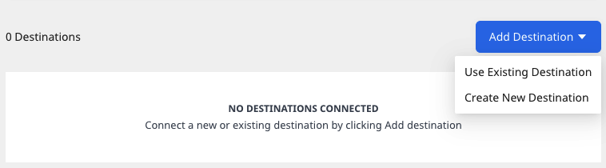
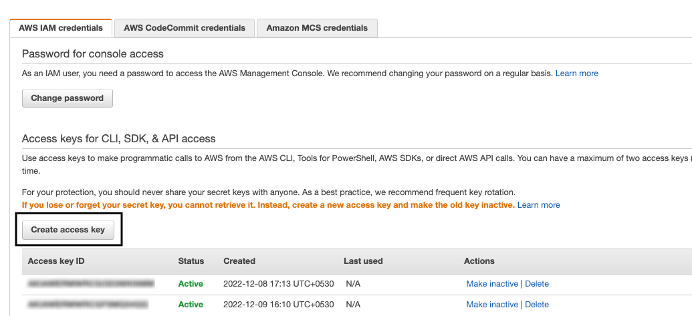

[Amazon S3](https://aws.amazon.com/s3/) is a cloud-based object storage service that lets businesses securely store their data at scale.

## Setting up the S3 source

1. Log into your [RudderStack dashboard](https://app.rudderstack.com).
2. From the left panel, go to **Directory** > **Sources** > **Reverse ETL**. Then, select **Amazon S3**.
3. Assign a name and click **Continue**.

### Connection credentials

Configure the following settings to authenticate RudderStack to access your S3 account: 

- **Connection Mode**: RudderStack provides the following options to connect to S3:
  - **Cross-Account Role (recommended)**: This option lets you connect to S3 through an <a href="https://docs.aws.amazon.com/IAM/latest/UserGuide/tutorial_cross-account-with-roles.html">IAM access role</a>. To do so, you need to first create an IAM role for RudderStack with the required permissions to access your S3 account. Refer to the <Link to="#creating-the-rudderstack-iam-role">Creating the RudderStack IAM Role for S3</Link> section below for the detailed steps.
  - **Access Key**: This option lets you connect to S3 using your AWS access key ID and secret access key.

<div class="warningBlock">
It is highly recommended to use the <strong>Cross-Account Role</strong> method for connecting to S3 as the <strong>Access Key</strong> method will be deprecated soon.
</div>

- **Account Name**: Specify a name that will be used to identify the connection account.
- **Role ARN**: If you select the **Cross-Account Role (recommended)** connection mode, specify the ARN after <Link to="#creating-the-rudderstack-iam-role">creating the RudderStack IAM role</Link>.
- **AWS Access Key ID**: If you select the **Access Key** connection mode for authenticating RudderStack, specify your AWS access key ID. For more information on obtaining your access key ID and secret access key, refer to the <Link to="#faq">FAQ</Link> section below.
- **AWS Secret Access Key**: Enter the corresponding secret access key.

### S3 permissions

The **minimum** S3 permissions that need to be attached to IAM role or the access keys (depending on your connection method) are listed below:

```json
"Action": [
  "s3:GetObject",
  "s3:ListBucket"
],
```

### Schedule settings

Specify the **Schedule Settings** to schedule the data syncs from your S3 source.

<div class="infoBlock">
RudderStack lets you schedule data syncs for your Reverse ETL sources and specify how and when the syncs will run. For more information on the <strong>Basic</strong>, <strong>CRON</strong>, and <strong>Manual</strong> schedule types, refer to the <a href="https://www.rudderstack.com/docs/sources/reverse-etl/common-settings/sync-schedule-settings/">Sync Schedule</a> guide.
</div>

### Connecting to a destination

Once you successfully set up your S3 source, you can connect it to your preferred destination by clicking the **Add Destination** button, as shown:



## Specifying the data to import

While configuring the destination, specify the following bucket configuration settings needed for RudderStack to import the data and sync it to the connected destination:

- **S3 Bucket Name**:  Enter the name of the S3 bucket.
- **Prefix**:  Prefix refers to the path within your S3 bucket from where RudderStack will import the data. For example, if **Prefix** is set to `RUDDER`, then RudderStack will import the data stored in the location `<your_s3_bucket>/RUDDER`.


<div class="warningBlock">
Your S3 bucket (with the prefix, if specified above) should only consist of Apache Parquet files as Rudderstack can extract only the Parquet files. Also, the first row of the Parquet file should not have a <code class="inline-code">null</code> value (empty strings are allowed) for any column. It helps RudderStack to determine the correct schema of the file.
</div>

- **Choose user identifier**: Choose a user identifier for `user_id` and/or `anonymous_id` from the dropdown.

Once you specify the above settings, you will be able to preview a snippet of your data, as shown below:


Here, you can select all or only specific columns of your choice, search the columns by a keyword, and also edit the **JSON Trait Key**. You can also preview the resulting JSON on the right.

- **Add Constant**: You can use this option to <a href="https://rudderstack.com/docs/sources/reverse-etl/common-settings/importing-data-using-tables#add-constant">add a constant key-value pair</a> which is always sent in the JSON payload, as shown:


<div class="infoBlock">
As an alternative to JSON mapping, you can send the data to the destination using the <Link to="/sources/reverse-etl/features/visual-data-mapper/">Visual Data Mapper</Link> feature. However, this feature is currently supported only for selective destinations.
</div>

## Updating an existing configuration

1. Go to the **Schema** tab of your configured source and click **Update**.
2. Update your column selection.

<div class="warningBlock">
When updating the configuration, you can only change the existing mappings. The <strong>S3 Bucket Name</strong>, <strong>Prefix</strong>, and <strong>User Identifier</strong> fields are not editable.
</div>

3. Finally, click the **Save** button.

<div class="infoBlock">
After updating the configuration, the next sync will be a full sync.
</div>

## Creating the RudderStack IAM role

Follow the steps in this section to create a RudderStack IAM role and obtain the role ARN.

### Creating the policy

To create a managed policy defining the permissions for the RudderStack IAM role, follow these steps:

1. Sign in to your AWS Management Console and open the <a href="https://console.aws.amazon.com/iam/">IAM console</a>.
2. In the left navigation pane, click **Policies** followed by **Create policy**.
3. In the **JSON** tab, paste the following policy:

```json
{
  "Version": "2012-10-17",
  "Statement": [{
      "Effect": "Allow",
      "Action": "s3:ListAllMyBuckets",
      "Resource": "*"
    },
    {
      "Effect": "Allow",
      "Action": [
        "s3:GetObject",
        "s3:ListBucket"
      ],
      "Resource": "*"
    }
  ]
}
```

4. Click **Review policy**. On the **Review** page, enter `read-write-app-bucket`.

### Creating the IAM role

1. In the left navigation pane, click **Roles** and go to **Create role**.
2. Under **Trusted entity type**, select **AWS account**, as shown:


3. Select **Another AWS account** and under **Account ID**, enter `422074288268`, the account ID associated with RudderStack.
4. Under **Options** check **Require external ID** and enter your <Link to="/resources/glossary/#workspace-id">workspace ID</Link> as the **External ID**.


5. Review all the settings carefully and click **Next** to proceed.
6. In the **Permissions** window, select the check box next to the policy you created in the <Link to="#creating-the-policy">Creating the policy</Link> section above.
7. Review all the settings carefully and click **Next** to proceed.
8. Enter a unique name for your role. Note that this name is **case-insensitive**. For example, you cannot create a role named `RUDDERSTACK` if `rudderstack` already exists.

<div class="warningBlock">
You cannot edit the name of the role after it has been created.
</div>

9. **Optional**: Enter the description for this role.
10. Click **Create role** to complete the setup.
11. Finally, copy the **ARN** of this newly created role and paste it in the **Role ARN** field in the dashboard settings.

<div class="infoBlock">
Refer to the <a href="https://docs.aws.amazon.com/IAM/latest/UserGuide/tutorial_cross-account-with-roles.html">AWS IAM tutorial</a> for more information on delegating access across AWS account using IAM roles.
</div>

## FAQ

### Where can I obtain the AWS Access Key ID and the AWS Secret Access Key?

1. Sign into your <a href="http://console.aws.amazon.com/">AWS Management Console</a> as the <a href="https://docs.aws.amazon.com/IAM/latest/UserGuide/console.html#root-user-sign-in-page">root user</a>. 
2. From the upper right corner, click your account and go to <strong>Security Credentials</strong>. You can find your access key ID listed here. You can also create a new access key by clicking the **Create access key** button, as shown:



For more information on these AWS credentials, refer to the <a href="https://docs.aws.amazon.com/general/latest/gr/aws-sec-cred-types.html">AWS documentation</a>.

<div class="warningBlock">
For setting up the S3 source, some S3 actions must be attached to your access keys. For more information on these actions, refer to the <Link to="#s3-permissions">S3 permissions</Link> section above.
</div>

<br />
