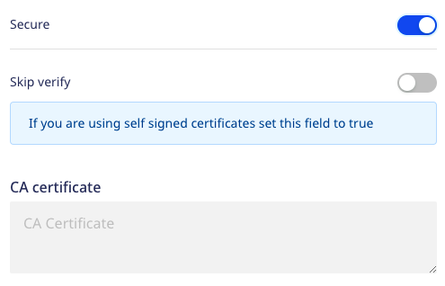

[ClickHouse](https://clickhouse.tech/) is an open-source, column-oriented database management system mainly used for online analytical processing \(OLAP\). It lets you generate analytical reports that are updated in real-time using SQL queries. ClickHouse is highly scalable, fast, and built for high performance.

## Setting up the ClickHouse source

1. Log into your [RudderStack dashboard](https://app.rudderstack.com).
2. From the left panel, go to **Directory** > **Sources** > **Reverse ETL**. Then, select **ClickHouse**.
3. Assign a name and click **Continue**.

### Connection credentials

- **Host** - Enter the host name of your ClickHouse service.
- **Port** - Enter the port number of your ClickHouse service.
- **Database** - Enter the database name in your ClickHouse instance from where the data is to be imported.
- **User** - Enter the name of the user having the required read/write access to the above database.
- **Password** - Enter the password for the above user.
- **Secure** - Enabling this setting establishes a secure connection and displays additional settings as shown below:

  - **Skip Verify** - Skips certificate verification. Enable this setting if you are using self-signed certificates.
  - **CA certificate** -  Certificate contents of the certificate which needs to be verified while establishing a secure connection.

If you've configured ClickHouse as a source before, you can select the existing credentials from <strong>Use existing credentials</strong> option.

2. Click **Continue** to proceed.

### Schedule settings

Specify the **Schedule Settings** to schedule the data syncs from your ClickHouse source.

RudderStack lets you schedule data syncs for your Reverse ETL sources and specify how and when the syncs will run. For more information on the <strong>Basic</strong>, <strong>CRON</strong>, and <strong>Manual</strong> schedule types, refer to the <a href="https://www.rudderstack.com/docs/sources/reverse-etl/common-settings/sync-schedule-settings/">Sync Schedule</a> guide.

### Connecting to a destination

Once you successfully set up your ClickHouse source, you can connect it to your preferred destination by clicking the **Add Destination** button, as shown:

## Mapping warehouse data to destination

After selecting a destination and configuring its connection settings, you can choose how to send the data to it using any one of the following methods:

- <Link to="/sources/reverse-etl/common-settings/importing-data-using-tables/">JSON mapping</Link>: This is the default method where you can map a warehouse column to a specific JSON trait key corresponding to a destination field. 

The below image shows the JSON mapping settings:

- <Link to="/sources/reverse-etl/features/visual-data-mapper/">Visual Data Mapper (VDM)</Link>: RudderStack supports this method only for <Link to="/sources/reverse-etl/features/visual-data-mapper/#supported-destinations">specific destinations</Link>. It offers an intuitive UI to map your warehouse columns to the specific destination fields. 

The below image shows the VDM settings:

The data sent to the destination is same in both the methods.

Further, refer to the <Link to="">JSON mapping</Link> or <Link to="/sources/reverse-etl/features/visual-data-mapper/">Visual Data Mapper</Link> guide for next steps on specifying the data to be imported (using Table or Model) and establishing a Reverse ETL connection successfully.

