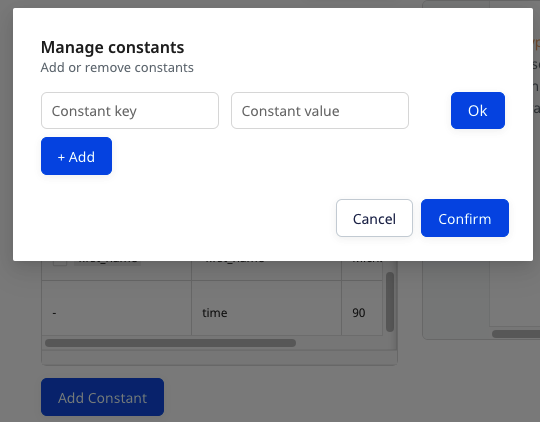

This guide is applicable for Reverse ETL sources configured using the <strong>Model</strong> option. If you have configured your Reverse ETL source using the <strong>Table</strong> option, refer to the <Link to="/sources/reverse-etl/common-settings/importing-data-using-tables/">Importing Data using Tables</Link> guide.

RudderStack's **Models** feature lets you define and run custom SQL queries on your warehouse data and send the results to your specified destinations. You can <Link to="/sources/reverse-etl/features/models/">create a model in the RudderStack dashboard</Link> and use it while connecting a Reverse ETL source to a destination.

RudderStack provides the following options to map your warehouse columns to specific destination fields while importing the data:

- Map with Visualizer (Refer to the <Link to="/sources/reverse-etl/features/visual-data-mapper/">Visual Data Mapper</Link> guide for the list of the supported destinations.)
- Map with JSON

This guide lists the JSON mapping settings required to import and sync data from your model to the specified destination.

## Data import settings

The settings to import and sync data from your model are listed below:

- **Model**: Select the required model from the dropdown. 

The dropdown will only display the list of models corresponding to the Reverse ETL source you have configured. For example, only the BigQuery models will be listed for a BigQuery warehouse source.

- **Sync mode**: Select the sync mode that RudderStack should use to sync your data. For more information on these modes, refer to the <Link to="/sources/reverse-etl/common-settings/sync-modes/">Sync Modes</Link> guide.
- **Primary Key**: Select a column from the data returned by the model (specified above) to uniquely identify your records in the warehouse.

RudderStack uses the primary key column for diffing in the case of incremental syncs. You can generate it while creating the model. The best combination for primary key is the <code class="inline-code">timestamp</code> and <code class="inline-code">user_id</code>.

- **Event Type**: Select from the `identify` or `track` event type depending on how you want to send the event data to the downstream destinations. If you select `track`, you also need to provide:
    - **Event Name**: Enter the event name which should be sent for all events sent to the downstream destinations, as shown:
    
    
    
     You can also send different event names by enabling the **lookup event name by column** setting and specifying the column name which should be sent as the event name in the **Event Name** field, as shown:

     

Refer to the <Link to="/sources/reverse-etl/features/syncing-events/">Syncing Events</Link> guide for more information on sending the event data using the <code class="inline-code">identify</code> or <code class="inline-code">track</code> call.

- **Choose user identifier**: Choose **atleast** one user identifier from `user_id` and `anonymous_id` from the dropdown. 

You can also preview the data snippet which RudderStack will send to the destination. All the resulting columns from running the model's query are selected by default. However, you can choose to retain specific columns by searching and selecting/deselecting them. Finally, preview the resulting JSON on the right, as shown:

The JSON payload carries the <code class="inline-code">user_id</code> and <code class="inline-code">anonymous_id</code> from the columns selected in the <strong>Choose user identifier</strong> section. Moreover, the traits are used from the columns selected in the <strong>Column</strong> section.

## Add Constant

You can also use the **Add Constant** option to add a constant key-value pair which is always sent in the JSON payload, as shown:

The new constant will appear in the table and also in the JSON preview inside the traits, as shown:

You can also use the dot notation to define a constant, as shown:

Once you have finalized the configuration, click on **Save**.

## Updating an existing configuration 

To update an existing configuration, follow these steps:

1. Go to the **Schema** tab of your configured source.
2. Click the **Update** button, as shown:

3. Update your column selection.

When updating an existing configuration, you can only change the existing mappings. The <strong>Model</strong>, <strong>Sync mode</strong>, and the <strong>User identifier</strong> fields are not editable. 

4. Finally, click the **Save** button.

After updating the configuration, the next sync will be a full sync.

