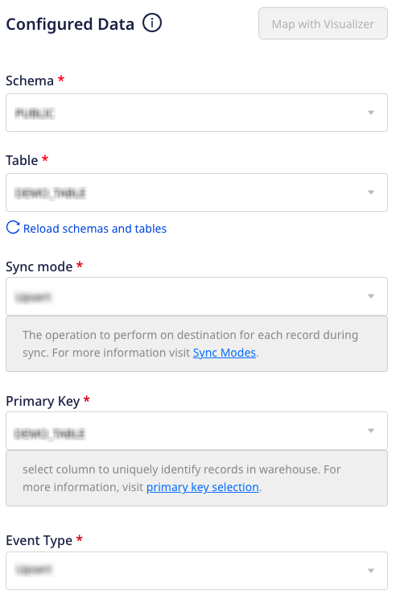
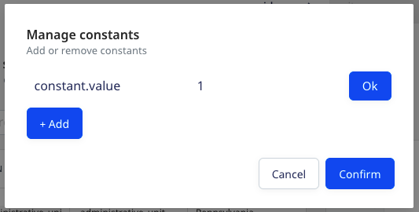
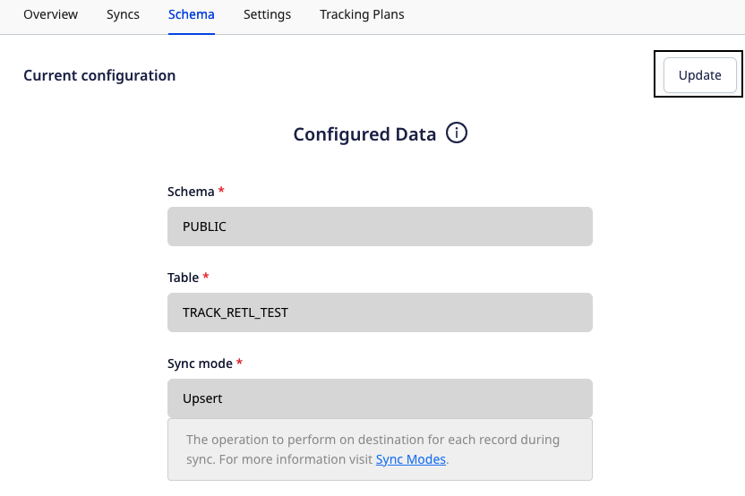

This guide is applicable for the Reverse ETL sources configured using the <strong>Table</strong> option. If you have configured your Reverse ETL source using the <strong>Model</strong> option, refer to the <Link to="/sources/reverse-etl/common-settings/importing-data-using-models/">Importing Data using Models</Link> guide.

RudderStack gives you two options to map your warehouse columns to specific destination fields while importing the data:

- Map with Visualizer (Refer to the <Link to="/sources/reverse-etl/features/visual-data-mapper/">Visual Data Mapper</Link> guide for the list of the supported destinations.)
- Map with JSON

This guide lists the JSON mapping settings required to import and sync data from your warehouse table to the specified destination.

## Data import settings

The settings to import and sync data from your warehouse table are as shown:

- **Schema**: Specify your warehouse schema.
- **Table**: Specify the table residing in the above schema from which you want RudderStack to import the data.
- **Sync mode**: Select the sync mode that RudderStack uses to sync your data.

RudderStack supports two modes for syncing your data - <strong>Upsert</strong> and <strong>Mirror</strong>. For more information on these modes, refer to the <Link to="/sources/reverse-etl/common-settings/sync-modes/">Sync Modes</Link> guide.

- **Primary Key**: Select a column from the table specified above to uniquely identify your records in the warehouse.

RudderStack uses this column for diffing in the case of incremental syncs.

- **Choose user identifier**: Choose **atleast** one user identifier from `user_id` and `anonymous_id` from the dropdown. 

You will also be able to preview a snippet of your data, as shown:

Here, you can select all or only specific columns of your choice, search the columns by a keyword, and also edit the **JSON Trait Key**. You can also preview the resulting JSON on the right.

The JSON payload carries the <code class="inline-code">user_id</code> and <code class="inline-code">anonymous_id</code> from the columns selected in the <strong>Choose user identifier</strong> section. Moreover, the traits are used from the columns selected in the <strong>Column</strong> section.

## Add Constant

You can also use the **Add Constant** option to add a constant key-value pair which is always sent in the JSON payload, as shown:

The new constant will appear in the table and also in the JSON preview inside the traits, as shown:

You can also use the dot notation to define a constant, as shown:

Once you have finalized the configuration, click **Save**.

## Updating an existing configuration

To update an existing configuration, follow these steps:

1. Go to the **Schema** tab of your configured source.
2. Click on the **Update** button on the top right, as shown:

3. Update your column selection.

When updating the configuration, you can only change the existing mappings. The <strong>Schema</strong>, <strong>Table</strong>, <strong>Sync mode</strong>, and the <strong>User identifier</strong> fields are not editable.

4. Finally, click the **Save** button.

After updating the configuration, the next sync will be a full sync.

