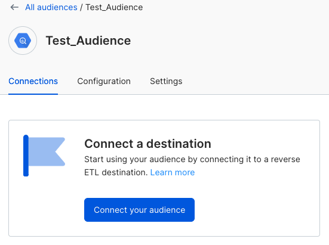

**Audiences** are customer lists that satisfy a specific set of criteria out of all the users of a product. RudderStack's **Audiences** feature lets you create these target customer lists with easy-to-use filters on your warehouse tables. Once created, you can activate them in any RudderStack-supported destination connected to the warehouse. 

For example, you can create audiences and send that data to the downstream digital advertising destinations to:

- Retarget all users from California in order to improve repeat sales.
- Prompt active customers on your sports website to buy the season tickets.
- Run campaigns to grow usage of the product as well as retain users.

<GhBadge
  url={'https://rudderstack.com/enterprise-quote'}
  label={'Plan'}
  message={'Enterprise'}
  color={'blueviolet'}
/>

## Key features

RudderStack provides much value by providing the audience-building capabilities in its Reverse ETL pipeline where you can: 
- Create and sync single audience to multiple downstream systems which is very time consuming to do manually.
- Analyze the results of multichannel campaigns in a single place at the data warehouse. 
- Trust the audience data as a single source of truth and have full control over the ecosystem.
- Fastrack the process for Marketing teams who would otherwise need to work with SQL and warehouses or rely on Data engineers to help with querying and syncing audiences.
- Stop worrying about keeping the audiences updated or debugging issues while building audiences in proprietary tools.

## Create audience

RudderStack provides a visual **Audience builder tool** in its [dashboard](https://app.rudderstack.com/audiences) which can be used to build audiences easily without any prior knowledge of SQL or how to store the data.

Follow the below steps to build an audience on your warehouse source:

1. Log in to the [RudderStack dashboard](https://app.rudderstack.com).
2. From the left navigation bar, navigate to **Enhance** > **Audiences** and click the **New audience** button.
3. Enter the relevant details in the following sections:

### Name your audience

- **Audience name**: Enter a unique name for your audience.
- **Description**: Enter a decription for your audience.

Click **Save and Continue** to move to the next step.

### Audience setup

- **Warehouse**: Select your warehouse database from the dropdown.
- **Schema**: Select the desired schema from the dropdown.
- **Table**: Select the desired table from the dropdown.

Click **Save and Continue** to move to the next step.

### Set conditions

You can set the required filtering conditions, view the corresponding SQL query and preview the resultant data from your data filters, as shown:

As can be seen above, you can add multiple filters within a condition by clicking **Add condition** or add multiple group filters by clicking **Add group condition**. Also, you can select **All** or **Any** to implement the AND or OR operator respectively between different filtering conditions.

Click **Save and Continue** to complete building your audience.

## Connect audience

Once you have created an audience, you can connect it to the required destination by clicking the **Connect your audience** button in the audience's **Connections** tab, as shown:

RudderStack supports a limited number of destinations which can be connected to an audience. If you are not able to see your required destination, it is because RudderStack does not support it currently.

Further, you can choose a destination, enter the destination-specific connection settings, <Link to="/sources/reverse-etl/common-settings/importing-data-using-tables/">map your data columns</Link>, and <Link to="/sources/reverse-etl/common-settings/sync-schedule-settings/">schedule the jobs</Link> to sync data to the destination.

## FAQ

Custom SQL filter
JSON object support