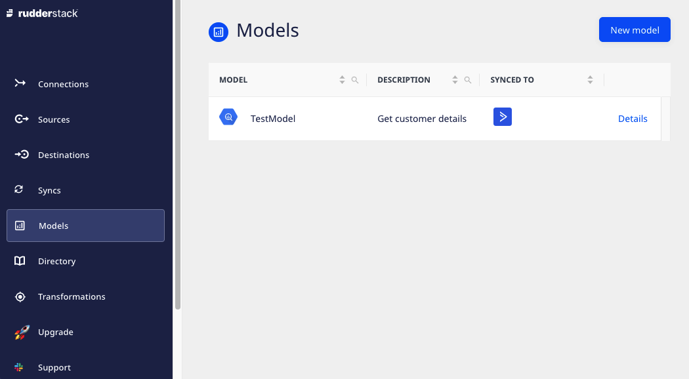

## Models

RudderStack's **Models** feature lets you create models by defining custom SQL queries. You can then run these queries on your warehouse and send the resulting data to specific destinations. You can create as many models and reuse them with their corresponding Reverse ETL sources.

With this feature, you can:

* Build models with complex SQL queries via an intuitive UI.
* Manage the views of all the models synced to different destinations in one place.
* Reuse the existing models in multiple connections.

  
Models is a <a href="https://www.rudderstack.com/docs/sources/reverse-etl/">Reverse ETL</a> feature. For more information on setting up your Reverse ETL sources using models, refer to the <Link to="/sources/reverse-etl/common-settings/importing-data-using-models/">Importing Data using Models</Link> guide.

Currently, RudderStack supports this feature for the following Reverse ETL sources:
<ul>
<li><Link to="/sources/reverse-etl/amazon-redshift/">Amazon Redshift</Link></li> 
<li><Link to="/sources/reverse-etl/google-bigquery/">Google BigQuery</Link></li>
<li><Link to="/sources/reverse-etl/postgresql/">PostgreSQL</Link></li>
<li><Link to="/sources/reverse-etl/snowflake/">Snowflake</Link></li>
</ul>

You can find the **Models** option in the left navigation bar of the RudderStack dashboard that lets you view all the existing models, as shown:

## Syncing events

RudderStack supports syncing data from the <Link to="/sources/reverse-etl/#supported-reverse-etl-sources">supported  Reverse ETL sources</Link> to the downstream destinations as <Link to="/event-spec/standard-events/identify/">`identify`</Link> and <Link to="/event-spec/standard-events/track/">`track`</Link> calls.

You can send your data as <code class="inline-code">track</code> calls only while mapping your warehouse columns to the destination fields using the JSON builder. <Link to="/sources/reverse-etl/features/visual-data-mapper/">Visual Data Mapper</Link> is not supported currently.

### Key features

Some key features of syncing events from Reverse ETL sources are listed below:

- **Ensure the reliability of your events**: Sometimes, your critical events(such as purchases) may get blocked by things outside your control, such as adblockers. In such cases, if you have all your users' activity in the database, you can send it to the downstream systems as a guaranteed source of truth.
- **Simulate historical tracking of events**: You can replay the historical data from other data sources to your sales, support, and marketing systems to maintain business continuity.
- **Fix bad data and replay it**: There is a possibility that your destination ends up with some bad data due to a bug in the tracking code or any other reason.
In such cases, you can clear the bad data and replay a clean version by syncing the events.
- **Test your transformations and integrations**: You can use a sample dataset to test an event stream for a new version of your transformation or a new integration using the `track` call. 

### Use cases for sending `track` events

Some examples where you can use the `track` call to send events from your warehouse into the downstream destinations are listed below:

- Sending event data to engagement platforms such as Braze, Iterable, Customer.io, or Salesforce Marketing Cloud to trigger behavior or populate user actions.
- Sending event data to the downstream systems that are configured to handle `track` calls, like Apache Kafka or Amazon Kinesis.
- Replaying the fact table that might be the source of truth for user behavior to the downstream tools such as Statsig, Optimizely, etc.

Refer to the <Link to="">JSON mapping</Link> guide for deatiled steps on choosing the event type to sync event data to a downstream destination.

## Visual Data Mapper

The **Visual Data Mapper** (VDM) offers an intuitive UI to map your warehouse columns to specific destination fields. This is useful especially when mapping your warehouse data to custom fields defined in your destination.

Visual Data Mapper is currently available for the following destinations:
<ul>
 <li><a href="https://rudderstack.com/docs/destinations/streaming-destinations/amplitude/">Amplitude</a></li>
 <li><a href="https://rudderstack.com/docs/destinations/streaming-destinations/braze/">Braze</a></li>
 <li><a href="https://rudderstack.com/docs/destinations/streaming-destinations/customer.io/">Customer.io</a></li>
 <li><a href="https://rudderstack.com/docs/destinations/streaming-destinations/google-analytics-ga/">Google Analytics</a></li>
 <li><a href="https://www.rudderstack.com/docs/destinations/streaming-destinations/google-adwords-remarketing-list/">Google Adwords Remarketing Lists (Customer Match)</a></li>
 <li><a href="https://rudderstack.com/docs/destinations/streaming-destinations/hubspot/">HubSpot</a></li>
 <li><a href="https://rudderstack.com/docs/destinations/streaming-destinations/intercom/">Intercom</a></li>
 <li><a href="https://rudderstack.com/docs/destinations/streaming-destinations/iterable/">Iterable</a></li>
 <li><a href="https://rudderstack.com/docs/destinations/streaming-destinations/klaviyo/">Klaviyo</a></li>
 <li><a href="https://rudderstack.com/docs/destinations/streaming-destinations/mailchimp/">Mailchimp</a></li>
 <li><a href="https://www.rudderstack.com/docs/destinations/streaming-destinations/marketo/">Marketo</a></li>
 <li><a href="https://rudderstack.com/docs/destinations/streaming-destinations/salesforce/">Salesforce</a></li>
</ul>

To use this feature, you can use a <a href="https://rudderstack.com/docs/sources/reverse-etl/">Reverse ETL source</a> and then connect it to a VDM-supported destination.

## Airflow Provider

RudderStack's Airflow Provider lets you programmatically schedule and trigger your [Reverse ETL](https://rudderstack.com/docs/sources/reverse-etl/) syncs from outside RudderStack and integrate them with your existing Airflow workflows.