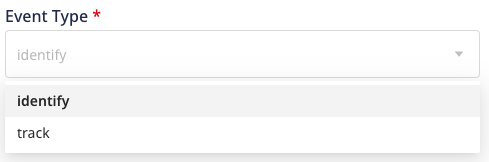

RudderStack supports syncing event data from Reverse ETL sources to the downstream destinations using the <Link to="/event-spec/standard-events/identify/">`identify`</Link> and <Link to="/event-spec/standard-events/track/">`track`</Link> calls.

<code class="inline-code">track</code> call can be used only while mapping your warehouse columns using the JSON builder and not the <Link to="/sources/reverse-etl/features/visual-data-mapper/">Visual Data Mapper</Link>.

## Usage of `track` call

Some examples where you can use the `track` call to simulate events from your warehouse into the downstream destinations are listed below:

- Sending event data to various engagement platforms such as Braze, Iterable, CustomerIO, or Salesforce Marketing Cloud to trigger behavior or populate user actions.
- If you have a fact table that is a source of truth for user behavior, you can easily replay it into the downstream tools such as StatSig, Optimizely, etc. 
- Sending event data to the downstream systems that are configured to handle `track` calls like Kafka or Kinesis.

## Benefits of using `track` call

- **Ensures that your events are reliable**: It might be possible that some of your critical events (such as purchases) are blocked by things outside your control, such as adblock. In such cases, if you have all your users' activity in your database, you can send this to the downstream systems as a guaranteed source of truth.
- **Simulate historical tracking of events**: You can replay the historical data from other data sources to your sales, support, and marketing systems to maintain business continuity.
- **Fix bad data and replay it**: It might be possible that there is bad data in your destinations owing to a bug in the tracking code. In such cases, you can clear the bad data and replay a clean version by using the `track` call.
- **Test your integrations and transformations**: You can simulate events using `track` calls to test your integrations and transformations. You can test a stream of events for your new versions of transformations or new integrations with a sample dataset.

## Steps to send event data

1. Configure yiour Reverse ETL source using the source specific settings.
2. Connect the source to the required downstream destination and configure the settings mentioned in the <Link to="/sources/reverse-etl/common-settings/importing-data-using-tables/">Importing Data using Tables</Link> or <Link to="/sources/reverse-etl/common-settings/importing-data-using-models/">Importing Data using Models</Link> guide based on your choice to import data.

These calls can be used while importing data from a table or model using the JSON builder.

