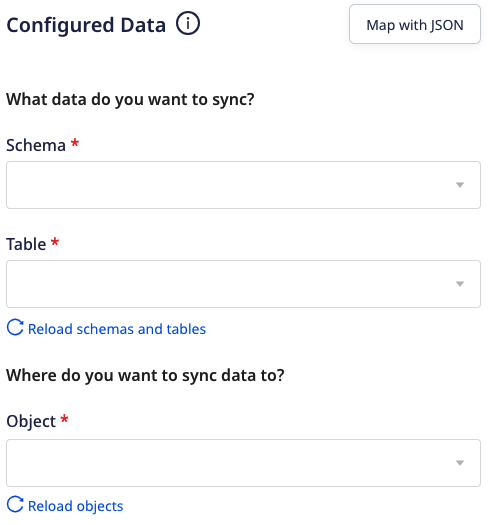
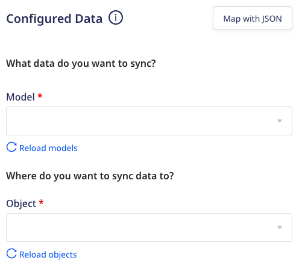
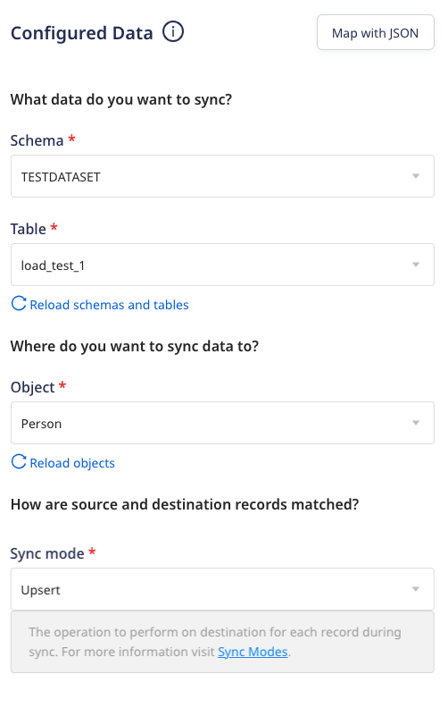
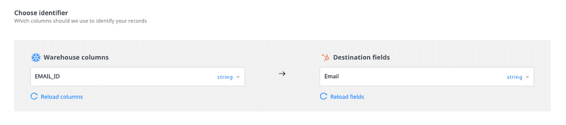
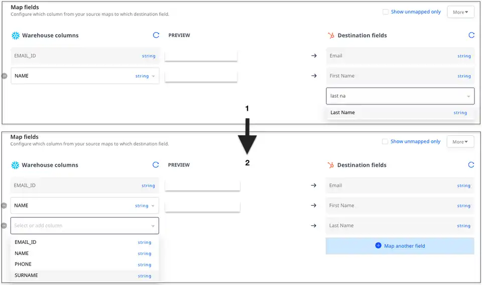
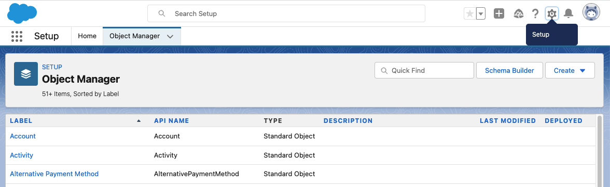
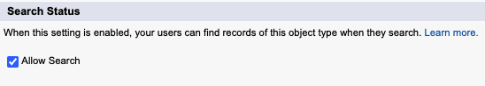
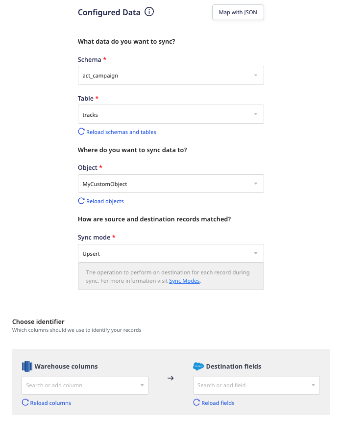

The **Visual Data Mapper** (VDM) offers an intuitive UI to map your warehouse columns to specific destination fields. This is useful especially when mapping your warehouse data to custom fields defined in your destination.

Visual Data Mapper is currently available for the following destinations:
<ul>
 <li><a href="https://rudderstack.com/docs/destinations/streaming-destinations/amplitude/">Amplitude</a></li>
 <li><a href="https://rudderstack.com/docs/destinations/streaming-destinations/braze/">Braze</a></li>
 <li><a href="https://rudderstack.com/docs/destinations/streaming-destinations/customer.io/">Customer.io</a></li>
 <li><a href="https://rudderstack.com/docs/destinations/streaming-destinations/google-analytics-ga/">Google Analytics</a></li>
 <li><a href="https://www.rudderstack.com/docs/destinations/streaming-destinations/google-adwords-remarketing-list/">Google Adwords Remarketing Lists (Customer Match)</a></li>
 <li><a href="https://rudderstack.com/docs/destinations/streaming-destinations/hubspot/">HubSpot</a></li>
 <li><a href="https://rudderstack.com/docs/destinations/streaming-destinations/intercom/">Intercom</a></li>
 <li><a href="https://rudderstack.com/docs/destinations/streaming-destinations/iterable/">Iterable</a></li>
 <li><a href="https://rudderstack.com/docs/destinations/streaming-destinations/klaviyo/">Klaviyo</a></li>
 <li><a href="https://rudderstack.com/docs/destinations/streaming-destinations/mailchimp/">Mailchimp</a></li>
 <li><a href="https://www.rudderstack.com/docs/destinations/streaming-destinations/marketo/">Marketo</a></li>
 <li><a href="https://rudderstack.com/docs/destinations/streaming-destinations/salesforce/">Salesforce</a></li>
</ul>

To use this feature, you can use a <a href="https://rudderstack.com/docs/sources/reverse-etl/">Reverse ETL source</a> and then connect it to a VDM-supported destination.

## Using the Visual Data Mapper

To use the Visual Data Mapper, follow these steps:

1. Set up a [Reverse ETL](https://rudderstack.com/docs/sources/reverse-etl/) source and connect it to a destination. You should then see the following screen:
  

If you have set up the source using the <strong>Model</strong> option, the <strong>Schema</strong> and <strong>Table</strong> fields are replaced by the <strong>Model</strong> field, as shown:  

By default, Visual Data Mapping is enabled for all the VDM-supported destinations. To configure the data via JSON, click on the <strong>Map with JSON</strong> button.

3. Choose the source **Model** or **Schema** + **Table** from where you want RudderStack to import and sync the data.

Upon selection, RudderStack automatically loads the relevant resources. If you have added a new model or warehouse table during this configuration process, click on <strong>Reload models</strong>/<strong>Reload schemas and tables</strong> to fetch the latest resources.

4. Then, select the destination **Object** where you want to sync the data. An example in case of [Customer.io](https://www.rudderstack.com/docs/sources/event-streams/cloud-apps/customerio/#customerio) destination is shown below:

RudderStack automatically loads all the relevant destination objects. If you have added a new destination object during this configuration process, click on <strong>Reload objects</strong> to get all the latest objects.

<strong>RudderStack does not support objects that do not have any fields or a unique user identifier.</strong>

5. Next, select the sync mode that RudderStack uses to sync your data.

RudderStack supports two modes for syncing your data - <strong>Upsert</strong> and <strong>Mirror</strong>. For more information on these modes, refer to the <Link to="/sources/reverse-etl/common-settings/sync-modes/">Sync Modes</Link> guide.

### Choosing the identifier

In the **Choose Identifier** section, choose a warehouse column and destination field to map your records from the source to the destination. You can choose any column from the dropdown which will act as a unique identifier. An example is shown below:

The <strong>identifier</strong> (Map with Visualizer) or <strong>user_id/anonymous_id</strong> (Map with JSON) fields must have unique values in order to successfully sync the data to the destination. The records containing duplicate identifier values will fail to sync. For example, if you have chosen <code class="inline-code">name</code> as the <strong>identifier</strong> and it contains more than one values as 'Alex', the duplicate record will fail to sync.

### Mapping the fields

In the **Map Fields** section, you can configure the source-destination field mappings by following these steps:

1. Click on the **Map another field** option. Select the **Destination field** from the dropdown. Then, select the **Warehouse column** to map this field.

RudderStack gives you full visibility into the name and type of the fields that you are mapping. 

#### Mandatory mappings

When sending events to some objects, there are some required fields that need to be mapped. These fields cannot be removed from the mappings. For example, in case of the Salesforce **Account** object, **Account Name** is a required field, as seen in the following image:

#### Mapping fields of different type/format

In case you are mapping fields with different data types or formats, you can use the <Link to="/features/transformations/">Transformations</Link> feature to do type conversion before sending the events data. 

For example, RudderStack lets you map the warehouse column `Phone` of type `string` to a destination field `Company ID` of type `float` . You can then add a transformation at the destination end to do this type conversion to ensure there is no mismatch.

### Creating a custom destination field

RudderStack lets you create a custom destination field and map it to a warehouse column by following the below steps:

1. Click on the **Map another field** option. 
2. Type the name of the custom destination field that you want to create, as shown:

3. Finally, click on **Create**.

This feature is currently available for the following  destinations:
<ul>
 <li><a href="https://rudderstack.com/docs/destinations/streaming-destinations/amplitude/">Amplitude</a></li>
 <li><a href="https://rudderstack.com/docs/destinations/streaming-destinations/braze/">Braze</a></li>
 <li><a href="https://rudderstack.com/docs/destinations/streaming-destinations/customer.io/">Customer.io</a></li>
 <li><a href="https://rudderstack.com/docs/destinations/streaming-destinations/google-analytics-ga/">Google Analytics</a></li>
 <li><a href="https://rudderstack.com/docs/destinations/streaming-destinations/iterable/">Iterable</a></li>
  <li><a href="https://rudderstack.com/docs/destinations/streaming-destinations/klaviyo/">Klaviyo</a></li>
</ul>

Once you have mapped all the source columns to the destination fields, click on **Next** to complete the destination configuration.

#### Syncing data to custom Salesforce objects

RudderStack **does not support** creating new custom fields for the <Link to="/destinations/streaming-destinations/salesforce/">Salesforce</Link> destination using the above-mentioned steps. 

However, you can still use the Visual Data Mapping feature to sync your data to the custom Salesforce objects by following the below steps:

1. Log into your <a href="https://login.salesforce.com/?locale=in">Salesforce dashboard</a>.
2. In the top navigation bar, click the **Setup** icon and go to **Object Manager**.

3. Then, go to **Create** > **Custom Object**.
4. Enter the relevant details and click **Save** to finish the configuration.

Make sure you select the <strong>Allow Search</strong> setting under the <strong>Search Status</strong> section, as shown below. Otherwise, the custom object will <strong>not</strong> be visible in the RudderStack dashboard.  

5. In your RudderStack dashboard, click **Reload objects** under the **Object** field. Your newly created custom object should now be visible in this list. Select the object and map the relevant fields to sync your data.

