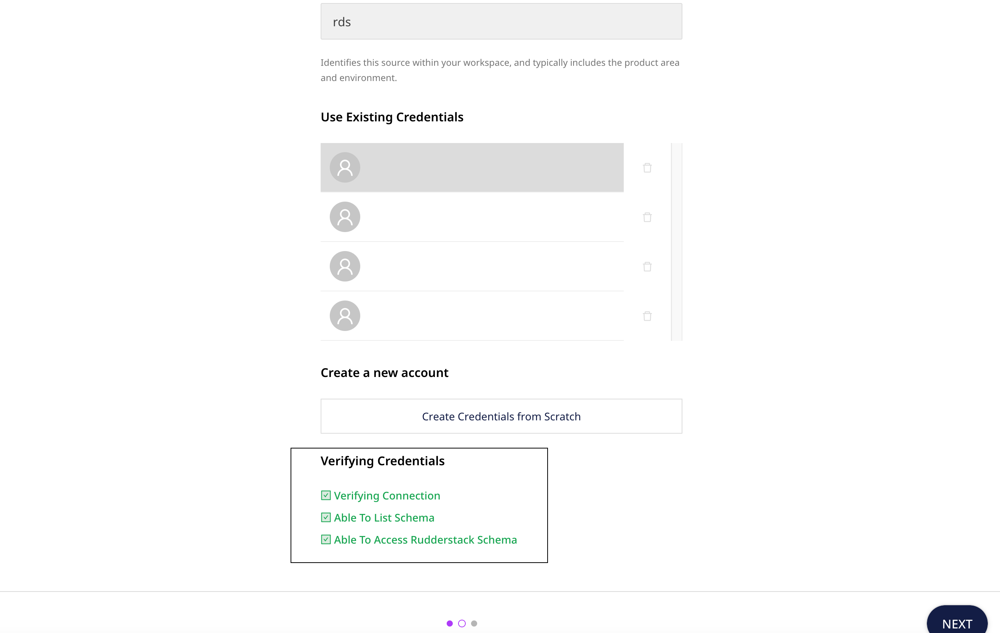

[Google BigQuery](https://cloud.google.com/bigquery) is an industry-leading, fully-managed cloud data warehouse that lets you store and analyze petabytes of data in no time.

## Granting permissions

RudderStack requires you to grant certain user permissions on your BigQuery warehouse to successfully access data from it.

Perform the following steps in the **exact** order to grant these permissions:

### Step 1: Creating a role and granting permissions

1. Go to the [Roles](https://console.cloud.google.com/iam-admin/roles) section of Google Cloud Platform dashboard and click on **CREATE ROLE**.


2. Fill in the details as shown:


3. Click on **ADD PERMISSIONS** and add the following permissions:

```
bigquery.datasets.get
bigquery.jobs.create
bigquery.jobs.list
bigquery.tables.create
bigquery.tables.get
bigquery.tables.getData
bigquery.tables.list
bigquery.tables.update
bigquery.tables.updateData
```

4. Finally, click **CREATE**.

### Step 2: Creating a service account and attaching the role to it

1. Go to [Service Accounts](https://console.cloud.google.com/iam-admin/serviceaccounts) and select the project which has the dataset or the table that you want to use.
2. Click on **CREATE SERVICE ACCOUNT**.


3. Fill in the **Service Account details** as shown below, and click on **CREATE AND CONTINUE**:


<div class="infoBlock">

Note down the <strong>Service account ID</strong>. This ID is required while creating the RudderStack schema and granting the required permissions to it.
</div>

4. Fill in the **Role** details as shown below, and click on **CONTINUE**:


5. Click on **DONE** to move to the list of service accounts.

### Step 3: Creating and downloading the JSON key

1. Click on the three dots icon under **Actions** in the service account that you just created and select **Manage keys**, as shown:


2. Click on **ADD KEY**, followed by **Create new key**, as shown:


3. Select **JSON** and click on **CREATE**.


A JSON file will be downloaded on your system. This file is required while creating a BigQuery warehouse source in RudderStack, explained further in this document.

### Step 4: Creating the RudderStack schema and granting permissions

1. From your [BigQuery SQL workspace](https://console.cloud.google.com/bigquery), run the following command to create a dedicated schema `rudderstack_`.

```sql
create schema rudderstack_;
```

<div class="warningBlock">

The <code class="inline-code">rudderstack_</code> schema is used by RudderStack for storing the state of each data sync. <strong>This name should not be changed</strong>.
</div>

2. Grant full access to the `rudderstack_` schema for the RudderStack service account you created above. Replace `<SERVICE_ACCOUNT_ID>` with the service account ID you specified in [Step 2: Creating a service account and attaching role to it](#step-2-creating-a-service-account-and-attaching-the-role-to-it).

```sql
GRANT `roles/bigquery.dataOwner`
     ON SCHEMA rudderstack_
     TO "serviceAccount:<SERVICE_ACCOUNT_ID>";
```
## Setting up the BigQuery source

1. Log into your [RudderStack dashboard](https://app.rudderstack.com).
2. From the left panel, go to **Directory** > **Sources** > **Reverse ETL**. Then, select **BigQuery**.
3. Assign a name and click **Continue**.

### Connection credentials

1. Choose the relevant option from **Table** or **Model** to use the source to sync data from either a warehouse table or a model.

<div class="infoBlock">
For more information on the difference between the <strong>Table</strong> and <strong>Model</strong> options when creating a Reverse ETL source, refer to the <a href="#faq">FAQ</a> section below.
</div>

<div class="infoBlock">
If you have chosen the <strong>Model</strong> option, skip the next steps and refer to the <a href="#schedule-settings">Schedule settings</a> section directly.
</div>

2. Enter the relevant settings in the **Connection Credentials** section as listed below:

- **Credentials** - Enter the GCP Service Account credentials JSON.
- **Project ID** - Enter the `project_id` from the GCP Service Account credentials JSON.
- **Service account** - Enter the `client_email` from the GCP Service Account credentials JSON.

<div class="successBlock">
If you've configured BigQuery as a source before, you can select the existing credentials under the <strong>Use existing credentials</strong> option.
</div>

3. Click **Continue** to verify your credentials. RudderStack will then verify and validate your credentials. For more information on these validation steps, refer to the <a href="#faq">FAQ</a> section. 

4. Once verified, click **Continue** to proceed.

### Schedule settings

Specify the **Schedule Settings** to schedule the data syncs from your BigQuery source.

<div class="infoBlock">
RudderStack lets you schedule data syncs for your Reverse ETL sources and specify how and when the syncs will run. For more information on the <strong>Basic</strong>, <strong>CRON</strong>, and <strong>Manual</strong> schedule types, refer to the <a href="https://www.rudderstack.com/docs/sources/reverse-etl/common-settings/sync-schedule-settings/">Sync Schedule</a> guide.
</div>

### Connecting to a destination

Once you successfully set up your BigQuery source, you can connect it to your preferred destination by clicking the **Add Destination** button, as shown:


## Mapping warehouse data to destination

After selecting a destination and configuring its connection settings, you can choose how to send the data to it using any one of the following methods:

- <Link to="/sources/reverse-etl/common-settings/importing-data-using-tables/">JSON mapping</Link>: This is the default method where you can map a warehouse column to a specific JSON trait key corresponding to a destination field. 

The below image shows the JSON mapping settings to sync data via the **Table** option:


- <Link to="/sources/reverse-etl/features/visual-data-mapper/">Visual Data Mapper (VDM)</Link>: RudderStack supports this method only for <Link to="/sources/reverse-etl/features/visual-data-mapper/#supported-destinations">specific destinations</Link>. It offers an intuitive UI to map your warehouse columns to the specific destination fields. 

The below image shows the VDM settings to sync data via the **Table** option:


<div class="successBlock">
The data sent to the destination is same in both the methods.
</div>

<div class="infoBlock">
Further, refer to the <Link to="">JSON mapping</Link> or <Link to="/sources/reverse-etl/features/visual-data-mapper/">Visual Data Mapper</Link> guide for next steps on specifying the data to be imported (using Table or Model) and establishing a Reverse ETL connection successfully.
</div>

## FAQ

### What is the difference between the Table and Model options when creating a Reverse ETL source?

When creating a new Reverse ETL source, you are presented with the following two options from which RudderStack will sync the data:


- When you choose **Table**, RudderStack imports all the data associated with the specified table during the sync.
- When you choose **Model**, RudderStack imports the data by running the query specified in the connected model, during the sync.

### What do the three validations under Verifying Credentials imply?

When setting up a Reverse ETL source, once you proceed after entering the connection credentials, you will see the following three validations under the **Verifying Credentials** option:



These options are explained below:

* **Verifying Connection**: This option indicates that RudderStack is trying to connect to the warehouse with the information specified in the connection credentials. 

<div class="warningBlock">
If this option gives an error, it means that one or more fields specified in the connection credentials are incorrect. Verify your credentials in this case.
</div>

* **Able to List Schema**: This option checks if RudderStack is able to fetch all the schema details using the provided credentials. 
* **Able to Access RudderStack Schema**: This option implies that RudderStack is able to access the `rudderstack_` schema that you have created by successfully running all the commands in the [**Creating the RudderStack schema and granting permissions**](#step-4-creating-the-rudderstack-schema-and-granting-permissions) section. 

<div class="warningBlock">
If this option gives an error, verify if you have successfully created the <code class="inline-code">rudderstack_</code> schema and given RudderStack the required permissions to access it. For more information, refer to <a href="#step-4-creating-the-rudderstack-schema-and-granting-permissions">Creating the RudderStack schema and granting permissions</a> section.
</div>


