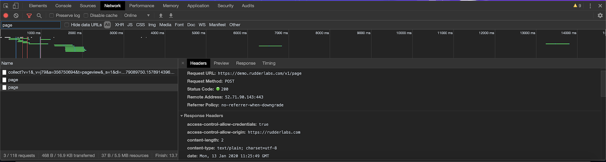
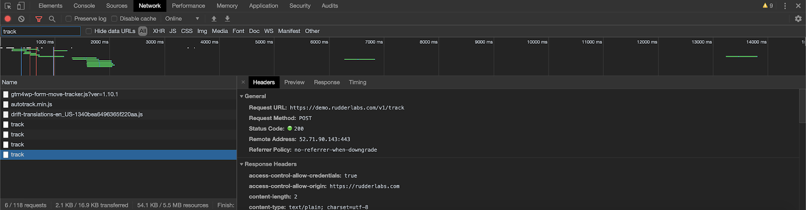

This guide contains the answers to some of the commonly-asked questions around setting up, using, and troubleshooting the JavaScript SDK.

### Should I disable ad-blockers on my browser?

Yes, it is important to ensure that no ad blockers are running on your browser, as they restrict the JavaScript SDK script from executing and storing user information in the browser.

### Can I load multiple instances of RudderStack JavaScript SDK ?

No, it is not possible to load multiple instances of the JavaScript SDK, as it is bound to exceed the maximum stack call size and give you an error.

### How to check if the data is being transmitted to the desired destinations?

To check if data is being transmitted to the specified destinations, go to the **Network** tab of the JavaScript console in your browser.




If the outbound request is not shown, check if you have installed and set up the JavaScript SDK correctly. Also, check if any ad blockers are enabled in your browser.

### What is the size limit on the requests?

The size limit on requests is 32KB per message and 4MB per batch request.


### What is an anonymous ID? How do I retrieve it?

Anonymous ID is an auto-generated **UUID** \(Universally Unique Identifier\) that gets assigned to each unique, unidentified visitor to your website.

To retrieve the anonymous ID of any visitor, run the following:

```javascript
rudderanalytics.getAnonymousId();
```

<div class="infoBlock">
If the <code class="inline-code">anonymousId</code> is null in the SDK and you call the above function, RudderStack will automatically set a new <code class="inline-code">anonymousId</code>.
</div>

### What is the "Reserved Keyword" error?

When using the JavaScript SDK, you may run into the following error: 

```Text
Warning! : Reserved keyword used in traits -->  id with track call.
```

This is because one or more keys in your `traits` and/or `properties` object has the same value as a reserved keyword.

RudderStack reserves the following keywords as keys for a standard event payload and you should avoid using these while naming your event traits and properties:

```javascript
"anonymous_id";
"id";
"sent_at";
"received_at";
"timestamp";
"original_timestamp";
"event_text";
"event";
```

## Contact us

For queries on any of the sections in this guide, you can [contact us](mailto:%20docs@rudderstack.com) or start a conversation in our [Slack](https://rudderstack.com/join-rudderstack-slack-community) community.
