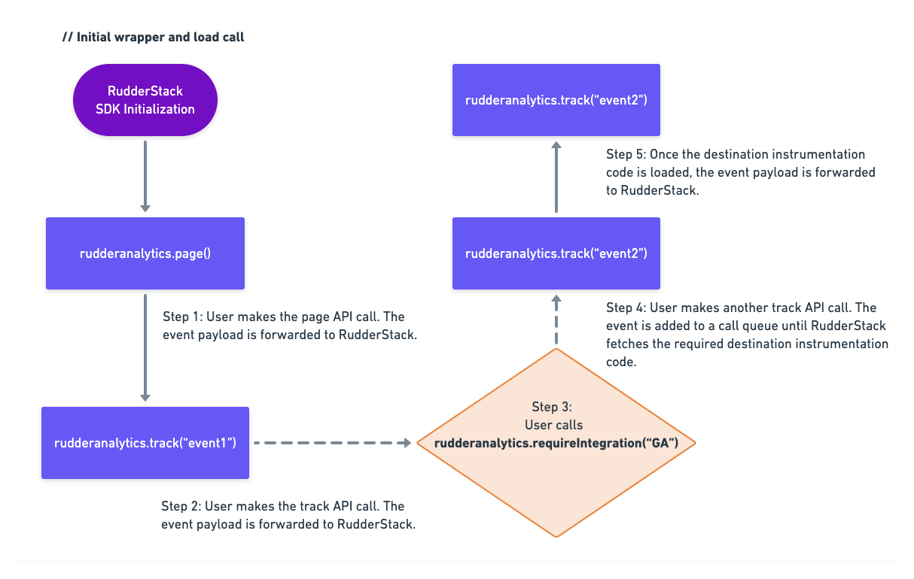

The following sections cover the finer technical details of the improvements in the JavaScript SDK v1.1 that make it more efficient and easier to use.

## Sending events using Beacon

The [JavaScript SDK v1.1](https://cdn.rudderlabs.com/v1.1/rudder-analytics.min.js) lets you send the event payloads using the **XHR** (XMLHttpRequest) API (default) or [Beacon](https://developer.mozilla.org/en-US/docs/Web/API/Navigator/sendBeacon) browser utility.

The **Beacon** browser utility asynchronously sends a small amount of data over HTTP to the RudderStack server. To send the SDK events using this utility, set the `useBeacon` field in the <Link to="/sources/sdks/rudderstack-javascript-sdk/load-js-sdk/#loading-options">`load()`</Link> call options to `true`.

<div class="dangerBlock">
The <code class="inline-code">sendBeacon</code> version of the JavaScript SDK located <a href="https://cdn.rudderlabs.com/v2/rudder-analytics.min.js?transport=beacon">here</a> and its XMLHTTP version located <a href="https://cdn.rudderlabs.com/v2/rudder-analytics.min.js">here</a> are <strong>no longer supported</strong>. 
</div>

The JavaScript SDK internally uses a separate queue (`BeaconQueueOpts`) to hold the data and send it through the Beacon utility in batches. The structure of `BeaconQueueOpts` is shown below:

```javascript
{
  maxItems: 10 
  flushQueueInterval: 600000
}
```
The following table describes the above `integer` type parameters in detail:

| Parameter        | Description             | Default Value    |
| :-------------------- |  :-------------| :----------------|
| `maxItems`            | The SDK flushes the queue when the default number of payloads is reached.    | `10`             |
| `flushQueueInterval`  | The SDK flushes the queue after the default time interval (in milliseconds) is reached. | `600000`         |


<div class="infoBlock">
The JavaScript SDK flushes the Beacon queue if the total size of the payload exceeds 64 KB before even reaching the default <code class="inline-code">maxItems</code> or <code class="inline-code">flushQueueInterval</code> values.
</div>

### Advantages

There are two key advantages of using the [Beacon](https://developer.mozilla.org/en-US/docs/Web/API/Navigator/sendBeacon) utility to send your event payload:

- Pushing events to the Beacon queue is faster than the XHR instrumentation, so there are some performance improvements in the JavaScript SDK.
- The Beacon requests are optimized so that the browser waits until the CPU load is lower or until the network is free before making the actual requests, leading to better website performance.

<div class="infoBlock">
The Beacon queue maintained by the browsers limits the total size of the elements present in the queue at any point and <strong>peaks at 64 KB</strong>.
</div>

### Event delivery and retry mechanism

This section highlights some important points which will help you choose whether to use Beacon for sending your event payloads:

- The requests sent from the SDK using the Beacon utility only push the events to the browser's Beacon queue. Further, it depends on the browser's engine to send these events from the queue. Hence, RudderStack **does not guarantee** if any events get discarded due to any 5xx or other network-related errors (request timed out, end resource unavailable, etc.).

<div class="warningBlock">
If event delivery and retry is an important requirement for your website, using the XHR API of the JavaScript SDK is highly recommended. RudderStack retries event delivery based on the status codes and other errors.
</div>

- The Beacon queue maintained by the browsers limits the total size of the elements present in the queue at any point and <strong>peaks at 64 KB</strong>. Therefore, you cannot send high-frequency hits from the main thread in one go, as the Beacon queue cannot take up cycles to dequeue itself. The JavaScript SDK handles this by maintaining a separate queue that retries pushing events to the Beacon queue if they are not successfully pushed in the first attempt. 

<div class="successBlock">
The RudderStack queue handles approximately 500 hits per 30ms and ensures the eventual successful delivery of events after retries to Beacon.
</div>


## Reduced core SDK size

<div class="dangerBlock">
<strong>This feature is deprecated and no longer supported by RudderStack</strong>.
</div>

As RudderStack supports more native destinations through the JavaScript SDK, more instrumentation code is likely to be added to it. This increases the SDK size and requires the browser to evaluate and parse more unused JavaScript.

Therefore, these instrumentation codes will not be bundled for the end destinations in the core JavaScript SDK. Instead, the SDK will only fetch the destination configuration settings from the RudderStack dashboard, such as track ID, API key, secret, etc., using the `requireIntegration` method.

### `requireIntegration` call definition

The `requireIntegration` method contains the following two parameters:

- The first parameter is a **string** or an **array of strings** containing the destination names.

<div class="infoBlock">
You can also pass <code class="inline-code">rudderanalytics.requireIntegration(“All”)</code>. This will fetch the plugins for <strong>all</strong> the native destinations connected to your source in the RudderStack dashboard.
</div>

- The second parameter is a **callback** that accepts an object containing the names of the destinations successfully or unsuccessfully loaded on the page.

An example is shown below:

```javascript
rudderanalytics.requireIntegration(
    ["GoogleAnalytics", "Hotjar", "Hubspot"],
    function(object) {
        console.log(JSON.stringify(object));
    }
);
```

<div class="infoBlock">
Currently, RudderStack support plugins only for Google Analytics, Hotjar, and HubSpot. Support for more destinations will be added very soon.
</div>

### How it works

Once the JavaScript SDK receives a `requireIntegration` call, for example, `rudderanalytics.requireIntegration("GA")`, it automatically fetches the Google Analytics instrumentation code (GAPlugin.js).

The SDK maintains a call queue, and the API calls are processed one after the other. The SDK blocks the processing of this call queue once you call the `requireIntegration` method.

### Use-case

Suppose the user makes a call `rudderanalytics.requireIntegration("GA")`. All the subsequent calls made to the SDK \(such as `page`, `track`, `alias`, `group`, etc.\) will get enqueued until the `GAPlugin.js` and Google Analytics' `analytics.js` is loaded on the web page. Once the plugin and the end destination snippet is loaded, the calls in the queue will be processed, and the corresponding calls to `analytics.js` will start flowing.

<div class="infoBlock">
For the above example, Google Analytics' <code class="inline-code">trackingId</code> and other configuration settings are fetched from the RudderStack dashboard and the SDK is configured using these settings.
</div>

### Sample call flow

The following workflow sums up the flow of the event payload when the user calls `requireIntegration()`:


