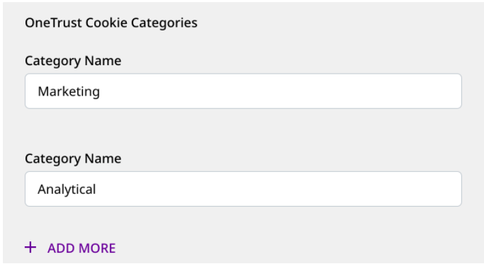

Consent managers offer various cookie consent solutions that allow the customers to determine what personal data they want to share with a business.

<div class="infoBlock">
Data protection laws such as GDPR, CCPA, etc. require the websites to get user consent for collecting their data through cookies.
</div>

[OneTrust](https://www.onetrust.com/) is a popular consent management platform that provides data governance, privacy management, and security solutions to thousands of businesses around the world. 

The JavaScript SDK seamlessly integrates with the OneTrust SDK and lets you map the OneTrust cookie/consent groups to RudderStack's consent purposes. RudderStack, in turn, uses this consent information to enable/disable the tracking and sending of data.

<div class="warningBlock">
The OneTrust integration with the JavaScript SDK is applicable only for the <a href="https://www.rudderstack.com/docs/rudderstack-cloud/rudderstack-connection-modes/#device-mode">device mode</a> connections.
</div>

## How does it work

Whenever a user starts browsing a website, OneTrust pops up a modal to take consent from the user. This modal contains a list of cookie groups representing the GDPR consent purposes that the user needs to decline or accept.

The JavaScript SDK fetches these consented groups as well as the destination (OneTrust category) mappings specified in the RudderStack dashboard. Depending on these settings, the SDK filters the destinations.

## Setting up the integration

The following sections highlight the steps required to set up the JavaScript SDK integration with OneTrust.

### Step 1: Configuring OneTrust

Follow these steps to configure OneTrust for your web app:

1. Create a OneTrust account and ensure that it has access to the **Cookie Compliance** app.
2. Add your website and scan it.
3. Go to the **Categorizations** section and define the new categories or modify the existing ones, as required.

<div class="infoBlock">
The categories should be associated with/attached to at least one cookie for them to be displayed in the OneTrust modal on your web app. You can use one of the RudderStack cookies as a workaround.
</div>

4. Go to the **Scripts** section and publish this script.

### Step 2: Specifying the OneTrust Cookie Categories

You need to enable OneTrust for a given JavaScript source. To do so, specify the consent category names as defined in OneTrust (**Step 1**) for each destination that is connected to that JavaScript source.



### Step 3: Setting up your web site/app

1. Load the OneTrust script that you published in your web app in <Link to="#step-1-configuring-onetrust">Step 1</Link>. A sample script is shown below:

```javascript

<!-- OneTrust Cookies Consent Notice start for samplewebsite.com -->
<script
        src="https://cdn.cookielaw.org/scripttemplates/otSDKStub.js"
        type="text/javascript"
        charset="UTF-8"
        data-domain-script="xxxxxxxx-xxxx-xxxx-xxxx-xxxxxxxxxxxx" >
</script>
<script type="text/javascript">
        // Required OneTrust callback
        function OptanonWrapper() { }
</script>
<!-- OneTrust Cookies Consent Notice end for samplewebsite.com -->
```

2. **Important**: **Load the JavaScript SDK only after the user provides the consent.** 

One way to load the JavaScript SDK after the user provides the consent is to modify the `OptanonWrapper()` callback function provided by OneTrust, as shown:

```javascript
function OptanonWrapper() {
  if (window.OneTrust.IsAlertBoxClosed()) {
    // Load the SDK
    rudderanalytics.load( 
     <WRITE_KEY>, 
     <DATA_PLANE_URL>, {
        ...otherOptions //optional
      }
    );
  }
}
```

<div class="infoBlock">
 
If the consent is updated, you need to refresh the page to load the SDK.
</div>

3. Add the `cookieConsentManager` option in the `load()` call as shown:

```javascript
rudderanalytics.load(
  <WRITE_KEY>,
  <DATA_PLANE_URL>, {
    cookieConsentManager: {
      oneTrust: {
        enabled: true
      }
    },
    ...otherOptions //optional
  }
);
```

Once completed, RudderStack reads the consented categories and filters the destinations accordingly.

<div class="infoBlock">
Replace the <Link to="/resources/glossary/#write-key">Write key</Link> and <Link to="/dashboard-guides/overview/#data-plane-url">Data plane URL</Link> in the above snippets with actual values.
</div>

## Contact us

For queries on any of the sections in this guide, you can [contact us](mailto:%20docs@rudderstack.com) or start a conversation in our [Slack](https://rudderstack.com/join-rudderstack-slack-community) community.
