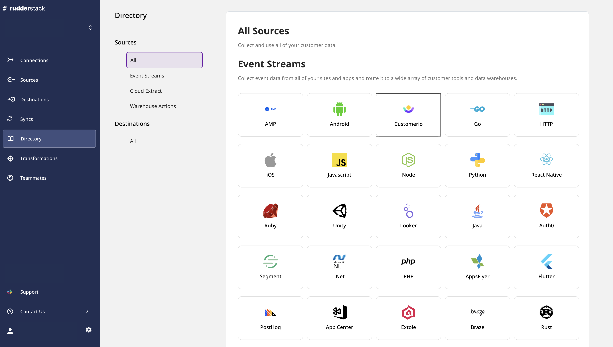
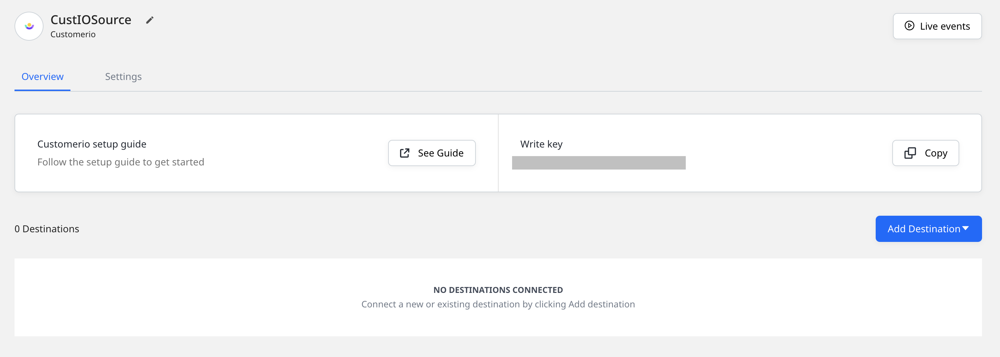
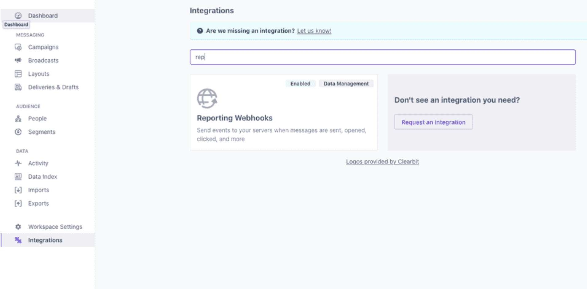
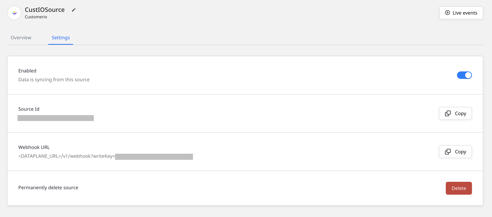
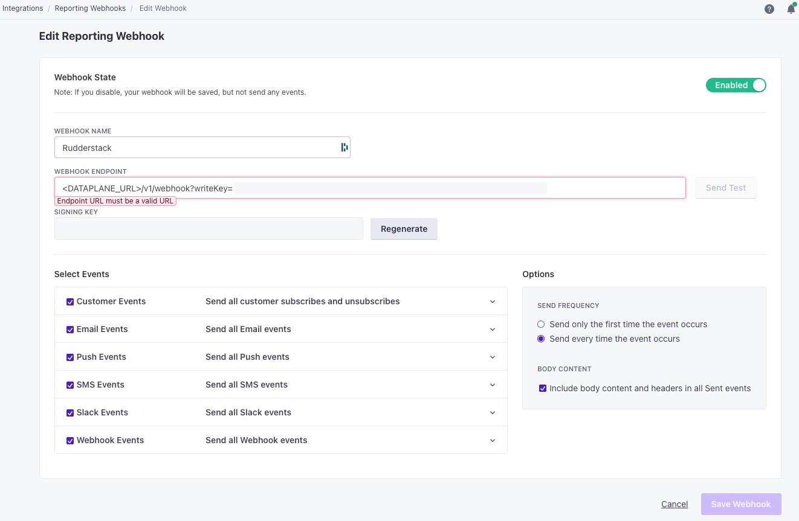

# Customer.io

[**Customer.io**](https://customer.io/) is a popular marketing platform for sending targeted emails and push and SMS notifications to improve customer engagement and thereby the overall conversion rate. It leverages real-time behavioral data and advanced segmentation techniques across the web and mobile platforms to improve your customers' overall experience.

By adding a reporting webhook in Customer.io, you can send your Customer.io email events to RudderStack. These include events such as email delivered, opened, bounced, and more.

This guide will help you set up Customer.io as a source in RudderStack.

## Getting started

Follow these steps to set up your Customer.io source in the RudderStack dashboard:

- Go to your [**RudderStack dashboard**](https://app.rudderstack.com/) and click on **Add Source**. Then, select **CustomerIO** from the list of **Event Stream** sources, as shown:



- Assign a source name and click on **Next**.

<div class="warningBlock">

To connect this source to a RudderStack warehouse destination, the source name should match the name of your warehouse schema.
</div>

- Your Customer.io source is now configured. Note the source **Write key** - this will be required to configure the endpoint URL in the following steps.



- Head over to your Customer.io account and navigate to the **Integrations** page from the sidebar. Then, look for the integration **Reporting Webhooks**, as shown:



- Click on **Add Webhook** and add the webhook URL as shown on the source settings page in your RudderStack dashboard.



The webhook URL is of the format:

```
<DATA_PLANE_URL>/v1/webhook?writeKey=<WRITE_KEY>
```

A sample webhook URL is shown below:

```
https://hosted.rudderlabs.com/v1/webhook?writeKey=1bCenS7ynqHh8ETX8s5Crjh22J
```

<div class="infoBlock">
 
 Refer to the <a href="https://rudderstack.com/docs/rudderstack-open-source/installing-and-setting-up-rudderstack/#what-is-a-data-plane-url-where-do-i-get-it">data plane URL</a> section for more information.
</div>

<div class="warningBlock">

Make sure you add the source write key as query parameter to the URL. This is required to prevent the webhook from failing because of an invalid write key.
</div>

- Finally, save the webhook.

## Supported events

The following sections list the Customer.io event types supported by RudderStack.

### Common data mappings

The common data mappings for each of the supported event types is listed in the following table:

| Customer.io property | RudderStack property |
| :--------------------| :--------------------|
| `data.customer_id`   | `userId`             |
| `data.event_id`      | `properties.eventId` |
| `data.identifiers.id`| `userId`             |

### Email events

RudderStack supports the following Customer.io email events:

| **Email Event**  | **Description**                                                                             |
| :--------------- | :-------------------------------------------------------------------------------------------|
| `Delivered`      | The delivery provider's report that the email was delivered to the inbox of the recipient.  |
| `Opened`         | An email was opened by the recipient.                                                       |
| `Clicked`        | A tracked link in an email was clicked by the recipient/customer.                           |
| `Bounced`        | The delivery provider's report that it was unable to deliver the email to the recipient.    |
| `Spammed`        | An email was marked as spam by the recipient.                                               |
| `Unsubscribed`   | The customer unsubscribed via a particular email.                                           |
| `Failed`         |  The email was not successfully delivered to the recipient.                                 |
| `Dropped`        | The email was not sent as the recipient was suppressed.                                     |
| `Attempted`      | Customer.io retried sending the email to the email provider.                                |
| `Converted`      | The conversion goal attributed to the email was matched.                                    |
| `Sent`           | The email was successfully sent to the recipient.                                           |
| `Drafted`        | The sender created an email draft.                                                          |

The supported property mappings in addition to the [common mappings](#common-data-mappings) listed above are as follows:

| Customer.io property    | RudderStack property        |
| :-----------------------| :---------------------------|
| `data.action_id`        | `properties.actionId`       |
| `data.broadcast_id`     | `properties.broadcastId`    |
| `data.delivery_id`      | `properties.deliveryId`     |
| `data.href`             | `properties.link.url`       |
| `data.link_id`          | `properties.link.id`        |
| `data.recipient`        | `context.traits.email`      |
| `data.subject`          | `properties.emailSubject`   |
| `data.failure_message`  | `properties.reason`         |
| `data.campaign_id`      | `properties.campaignId`     |
| `data.content_id`       | `properties.contentId`      |
| `data.newsletter_id`    | `properties.newsletterId`   |

### Customer events

RudderStack supports the following Customer.io customer events:

|  **Customer Event**       | **Description**                                     |
| :-------------------------| :-------------------------------------------------- |
| `Subscribed`              |  The customer was subscribed to a campaign.         |
| `Unsubscribed`            |  The customer was unsubscribed from a campaign.     |

The supported property mappings in addition to the [common mappings](#common-data-mappings) listed above is shown:

| Customer.io property | RudderStack property    |
| :--------------------| :-----------------------|
| `data.email_address` | `context.traits.email`  |

### SMS events

RudderStack supports the following Customer.io SMS events:

| **SMS Event**     | **Description**                                                                          |
| :---------------- | :--------------------------------------------------------------------------------------- |
| `Failed`          | The SMS could not be sent to the delivery provider.                                      |
| `Click`           | The recipient tapped the link present in the SMS notification.                           |
| `Sent`            | The SMS notification was sent successfully.                                              |
| `Attempted`       | The SMS was attempted for delivery.                                                      |
| `Drafted`         | The SMS notification was drafted.                                                        |
| `Delivered`       | The SMS notification was delivered to the recipient.                                     |
| `Converted`       | The conversion goal attributed to the SMS was matched.                                   |
| `Bounced`         | The delivery provider's report that it was unable to deliver the SMS to the recipient.   |

The supported property mappings in addition to the [common mappings](#common-data-mappings) listed above are as follows:

| Customer.io property   | RudderStack property      |
| :----------------------| :-------------------------|
| `data.action_id`       | `properties.actionId`     |
| `data.broadcast_id`    | `properties.broadcastId`  |
| `data.delivery_id`     | `properties.deliveryId`   |
| `data.href`            | `properties.link.url`     |
| `data.recipient`       | `context.traits.email`    |
| `data.failure_message` | `properties.reason`       |
| `data.campaign_id`     | `properties.campaignId`   |
| `data.link_id`         | `properties.link.id`      |

### Push notification events

RudderStack supports the following Customer.io push notification events:

| **Push Event**   | **Description**                                                                     |
| :--------------- | :---------------------------------------------------------------------------------- |
| `Failed`         | The push notification could not be sent to the delivery provider.                   |
| `Click`          | The recipient tapped the link present in the push notification.                     |
| `Sent`           |  A push notification was sent.                                                      |
| `Attempted`      | A push notification was attempted unsuccessfully.                                   |
| `Drafted`        | A push notification was drafted.                                                    |
| `Opened`         | A push notification was opened by the recipient.                                    |
| `Converted`      | The conversion goal attributed to the push notification was matched.                |
| `Bounced`        | An invalid device token was reported by the delivery provider.                      |
| `Dropped`        | The push notification was not sent to the recipient as the device token bounced.    |

The supported property mappings in addition to the [common mappings](#common-data-mappings) listed above are as follows:

| Customer.io property              | RudderStack property            |
| :---------------------------------| :-------------------------------|
| `data.action_id`                  | `properties.actionId`           |
| `data.broadcast_id`               | `properties.broadcastId`        |
| `data.delivery_id`                | `properties.deliveryId`         |
| `data.href`                       | `properties.link.url`           |
| `data.link_id`                    | `properties.link.id`            |
| `data.recipient`                  | `context.traits.email`          |
| `data.device_id`                  | `properties.deviceId`           |
| `data.failure_message`            | `properties.reason`             |
| `data.recipients`                 | `properties.recipients`         |
| `data.campaign_id`                | `properties.campaignId`         |
| `data.device_platform`            | `properties.devicePlatform`     |

### Webhook events

RudderStack supports the following Customer.io webhook events:

| **Webhook Event**  | **Description**                                                    |
| :----------------- | :----------------------------------------------------------------  |
| `Failed`           | The webhook payload failed and was not sent to the recipient.      | 
| `Click`            | The link in the webhook payload was clicked by the recipient.      |
| `Sent`             | A webhook payload was sent from Customer.io.                       |
| `Attempted`        | A webhook event was attempted unsuccessfully and would be retried. |
| `Drafted`          | A webhook draft was created by the sender.                         |

The supported property mappings in addition to the [common mappings](#common-data-mappings) listed above are as follows:

| Customer.io property    | RudderStack property     |
| :-----------------------| :------------------------|
| `data.action_id`        | `properties.actionId`    |
| `data.broadcast_id`     | `properties.broadcastId` |
| `data.delivery_id`      | `properties.deliveryId`  |
| `data.href`             | `properties.link.url`    |
| `data.link_id`          | `properties.link.id`     |
| `data.recipient`        | `context.traits.email`   |
| `data.failure_message`  | `properties.reason`      |

 ### Slack events

RudderStack supports the following Customer.io Slack events:

| **Slack Event**   | **Description**                                                     |
| :---------------- | :------------------------------------------------------------------ |
| `Failed`          |  The Slack message failed and was not delivered to the recipient.   |
| `Click`           |  The recipient clicked the link in the Slack message.               |
| `Sent`            |  A Slack message was successfully sent to the recipient.            |
| `Attempted`       |  A Slack message was attempted unsuccessfully and would be retried. |
| `Drafted`         |  A Slack message was drafted by the sender.                         |

The supported property mappings in addition to the [common mappings](#common-data-mappings) listed above are as follows:

| Customer.io property    | RudderStack property     |
| :-----------------------| :------------------------|
| `data.action_id`        | `properties.actionId`    |
| `data.broadcast_id`     | `properties.broadcastId` |
| `data.delivery_id`      | `properties.deliveryId`  |
| `data.href`             | `properties.link.url`    |
| `data.link_id`          | `properties.link.id`     |
| `data.recipient`        | `context.traits.email`   |
| `data.failure_message`  | `properties.reason`      |
| `data.campaign_id`      | `properties.campaignId`  |

The following image highlights the setup in the Customer.io dashboard:



## Event transformation

The Customer.io webhook events are ingested into RudderStack after converting them into the RudderStack event format. The `customer_id` set by Customer.io is set as `userId`. In cases where Customer.io does not send the `customer_id`, the email address of the user is set as `anonymousId`.

## Contact us

For queries on any of the sections covered in this guide, you can [**contact us**](mailto:%20docs@rudderstack.com) or start a conversation in our [**Slack**](https://rudderstack.com/join-rudderstack-slack-community) community.
