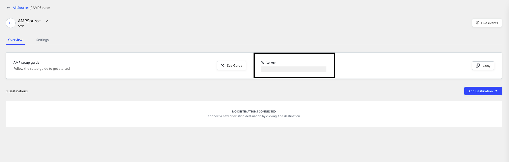

# AMP Analytics

The RudderStack AMP component makes it easy to send the event data from your AMP page to your specified destinations via RudderStack. Now you don't need to implement or test multiple components for different destinations for your event data. This component collects the default properties and sends a `page` event to RudderStack.

<div class="infoBlock">

Since the AMP source sends the data directly to the RudderStack backend, it supports only the cloud mode destinations. For more information on the cloud mode, refer to the <a href="https://rudderstack.com/docs/rudderstack-cloud/rudderstack-connection-modes/">RudderStack Connection Modes</a> guide.
</div>

## Setup requirements

To use the AMP component, the following prerequisites must be met:

* You must have signed up for a [**RudderStack account**](https://app.rudderstack.com/signup).
* You need a data plane URL. Follow [**this section**](https://rudderstack.com/docs/rudderstack-open-source/installing-and-setting-up-rudderstack/#what-is-a-data-plane-url-where-do-i-get-it) for more information on the data plane URL and where to get it.

## Getting started

<div class="infoBlock">

Learn more about the AMP project from their <a href="https://amp.dev/">official website</a>. To get started and set up your AMP project, check out their <a href="https://amp.dev/documentation/guides-and-tutorials/start/create/">Quick Start Guide</a>.
</div>

After completing the initial setup of your AMP project, follow these steps to start sending your event data to RudderStack:

- Add an AMP source in your RudderStack [**dashboard**](https://app.rudderstack.com).
- Note the **Write Key**. This will be required later when using the AMP Analytics component.



- Include the RudderStack AMP component before the closing `</head>` tag, as shown:

```markup
<script async custom-element="amp-analytics"
src="https://cdn.ampproject.org/v0/amp-analytics-0.1.js"></script>
```

- Start sending the event data to RudderStack by adding the following script inside of your `<body>` tag.
- You can fetch the AMP config JSON from our [**CDN**](https://cdn.rudderlabs.com/amp/rudderstack.json). The following snippet shows you how to do this:

```markup
<amp-analytics config="https://cdn.rudderlabs.com/amp/rudderstack.json">
  <script type="application/json">
    {
      "vars": {
        "writeKey": WRITE_KEY,
        "dataPlaneUrl": DATA_PLANE_URL,
        "pageName": "Your Page Name"
      }
    }
  </script>
</amp-analytics>
```

## Page

You can record the page views on your website using the `page` request. To add custom properties to your page request, you can use the `extraUrlParams` object. 

<div class="infoBlock">

Refer to the section on <a href="https://rudderstack.com/docs/stream-sources/rudderstack-sdk-integration-guides/amp-analytics/#custom-properties">adding custom properties</a> for more details.
</div>

RudderStack's AMP analytics component includes an automatic page view. You can set the name of the automatic page view through `pageName`, as shown in the following snippet:

```markup
<amp-analytics config="https://cdn.rudderlabs.com/amp/rudderstack.json">
<script type="application/json">
  {
    "vars": {
      "writeKey": WRITE_KEY,
      "dataPlaneUrl": DATA_PLANE_URL,
      "pageName": "Your Page Name"
    }
  }
</script>
</amp-analytics>
```

<div class="warningBlock">

If you fail to provide the value for the <code class="inline-code">pageName</code> variable, RudderStack automatically sets the page name to <code class="inline-code">Unknown Page</code>.
</div>

## Track

You can record any user event on your website using the `track` request, or create a [**trigger**](https://amp.dev/documentation/components/amp-analytics/#triggers) to do so. You need to set the event's name in the trigger's variables, as shown in the code snippet below:

```markup
<body>
<amp-analytics config="https://cdn.rudderlabs.com/amp/rudderstack.json">
  <script type="application/json">
  {
    "vars": {
      "writeKey": WRITE_KEY,
      "dataPlaneUrl": DATA_PLANE_URL,
      "pageName": "My AMP Page"
    },
    "triggers": {
      "clickEvent": {
        "on": "click",
        "selector":"#clickTrigger",
        "request": "track",
        "vars": {
          "eventName": "new click event"
        },
        "extraUrlParams": {
          "properties.clickType": "href"
        }
      }
    }
  }
  </script>
</amp-analytics>
Track - Click <a href="#" id="clickTrigger">here</a> to send
</body>
```

## Properties

You can send extra properties for your `page` or `track` events to add more information along with the event request. Once you mention the properties as `extraUrlParams` in the `amp-analytics` tag of your implementation, they will be passed to RudderStack for further processing.

<div class="warningBlock">

Prepend <code class="inline-code">properties.</code> to the property name within the <code class="inline-code">extraUrlParams</code> object so that it can be parsed as the property value in RudderStack. For more information, refer to the <a href="https://rudderstack.com/docs/stream-sources/rudderstack-sdk-integration-guides/rudderstack-amp-analytics/#custom-properties">Custom properties</a> section below.
</div>

### Default properties

RudderStack collects the following properties with each `track` and `page` view:

```javascript
{
  "anonymousId": "amp-<unique-id>",
  "context.locale": "en-US",
  "context.page.path": "/article",
  "context.page.url": "http://example.com/article",
  "context.page.referrer": "referrer",
  "context.page.title": "My Article",
  "context.screen.width": 600,
  "context.screen.height": 800
}
```

### Custom properties

You can choose to send custom properties by adding the `extraUrlParams` object. Every property name should be prefixed with `properties.`.

A sample call with the custom properties is shown below:

```markup
<amp-analytics config="https://cdn.rudderlabs.com/amp/rudderstack.json">
<script type="application/json">
  {
    "vars": {
      "writeKey": WRITE_KEY,
      "dataPlaneUrl": DATA_PLANE_URL,
      "pageName": "Your Page Name"
    },
    "extraUrlParams": {
      "properties.type": "article",
      "properties.published_at": "2016-06-28",
      "properties.author": "John Doe",
      "properties.button_type": "read-more",
      "properties.article_id": "my-article-id"
    }
  }
</script>
</amp-analytics>
```

Any property set at the top-level `extraUrlParams` object will be sent with each request. For example, the property `article_id` will be sent for all the requests triggered by this snippet. 

If you want to add custom properties to a specific event or a `page` call, you need to add an `extraUrlParams` object within your trigger configuration. The following code snippet shows how to do so:

```markup
<body>
  <amp-analytics config="https://cdn.rudderlabs.com/amp/rudderstack.json">
    <script type="application/json">
    {
      "vars": {
        "writeKey": WRITE_KEY,
        "dataPlaneUrl": DATA_PLANE_URL,
        "pageName": "My AMP Page"
      },
      "triggers": {
        "clickEvent": {
          "on": "click",
          "selector":"#clickTrigger",
          "request": "track",
          "vars": {
            "eventName": "new click event"
          },
          "extraUrlParams": {
            "properties.clickType":"href"
          }
        }
      },
      "extraUrlParams": {
        "properties.type": "article",
        "properties.published_at": "2016-06-28",
        "properties.author": "John Doe",
        "properties.button_type": "read-more",
        "properties.article_id": "my-article-id"
      }
    }
    </script>
  </amp-analytics>
  Track - Click <a href="#" id="clickTrigger">here</a> to send
</body>
```

The property `clickType` will be sent only for the `track` request, whereas the property `article_id` will be sent for both the requests \(the automatic `page` and `track` call\).

### UTM parameters

RudderStack does not collect the UTM information from the SDK. Instead, we encourage you to send the properties as `extraUrlParams`.

An example of using `extraUrlParams` is as shown:

```markup
<amp-analytics config="https://cdn.rudderlabs.com/amp/rudderstack.json">
  <script type="application/json">
    {
    "vars": {
      "writeKey": WRITE_KEY,
      "dataPlaneUrl": DATA_PLANE_URL,
      "pageName": "Your Page Name"
    },
    "extraUrlParams": {
      "properties.utm_source": "google",
      "properties.utm_campaign": "2016-06-28",
      "properties.utm_medium": "email"
    }
  }
  </script>
</amp-analytics>
```

## AMP Linker

You can use the [**AMP Linker**](https://amp.dev/documentation/examples/advertising-analytics/joining_analytics_sessions/) feature to ensure a merged session for users navigating from cached AMP pages (on an AMP cache) to AMP pages on your domain. When a user navigates from a cached AMP page to an AMP page on your domain, the linker sends the current `AMP ClientID` by adding a URL parameter to the outgoing link. The AMP page on your domain receives this parameter and uses it to set a first-party cookie.

Once this cookie is set, both AMP and Non-AMP pages on your domain use this cookie to identify the user uniquely. This way, the same AMP Client ID \(set by the cached AMP page\) can be used to identify the user in all contexts.

The following code snippet demonstrates how to enable this feature:

```markup
<body>
  <amp-analytics config="https://cdn.rudderlabs.com/amp/rudderstack.json">
    <script type="application/json">
      {
        "vars": {
          "writeKey": WRITE_KEY,
          "dataPlaneUrl": DATA_PLANE_URL,
          "pageName": "Your Page Name"
        },
        "linkers": {
          "enabled": true
        }
      }
    </script>
  </amp-analytics>
</body>
```

You can also use the query parameter from the decorated outgoing link from an AMP cache page to a non-AMP page on your domain by using the [**RudderStack JavaScript SDK**](https://rudderstack.com/docs/stream-sources/rudderstack-sdk-integration-guides/rudderstack-javascript-sdk/#using-amp-analytics).

## Contact us

For queries on any of the sections covered in this guide, you can [**contact us**](mailto:%20docs@rudderstack.com) or start a conversation in our [**Slack**](https://rudderstack.com/join-rudderstack-slack-community) community.
