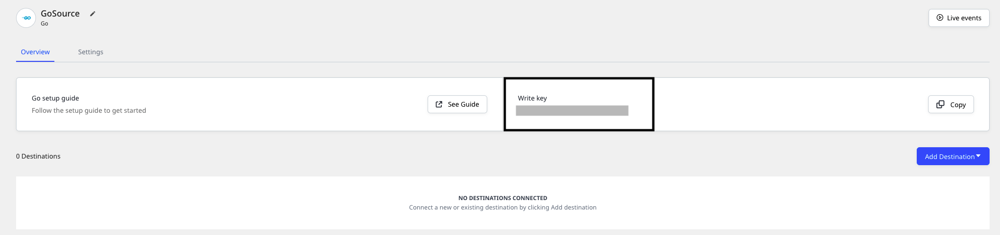

# Go

The **RudderStack Go SDK** lets you track your customer event data from your Go applications and send it to your specified destinations via RudderStack.

Check out the [**GitHub codebase**](https://github.com/rudderlabs/analytics-go) to get a more hands-on understanding of the SDK.

<a href="https://github.com/rudderlabs/analytics-go" target="_blank" align="left">

</a>

## SDK setup requirements

To set up the RudderStack Go SDK, the following prerequisites must be met:

- You will need to set up a [**RudderStack account**](https://app.rudderstack.com).
- Once signed up, set up a Go source in the dashboard. For more information, follow [**this guide**](https://www.rudderstack.com/docs/rudderstack-cloud/sources/#adding-a-source). You should then see a **Write Key** for this source, as shown below:



- You will also need a data plane URL. Follow [**this section**](https://rudderstack.com/docs/rudderstack-open-source/installing-and-setting-up-rudderstack/#what-is-a-data-plane-url-where-do-i-get-it) for more information on the data plane URL and where to get it.

## Installing the Go SDK

You can install the RudderStack Go SDK via the `go get` command. We highly recommend that you use a tool like **Godep** to avoid the issues related to any breaking API changes introduced between major versions of the library.

To install it in the `GOPATH`, run the following:

```go
go get github.com/rudderlabs/analytics-go
```

## Using the Go SDK

To use the SDK, run the following code snippet:

```go
package main

import (
    "github.com/rudderlabs/analytics-go"
)

func main() {
    // Instantiates a client to use send messages to the Rudder API.
    client := analytics.New(WRITE_KEY, DATA_PLANE_URL)

    // Enqueues a track event that will be sent asynchronously.
    client.Enqueue(analytics.Track{
        UserId: "test-user",
        Event:  "test-snippet",
    })

    // Flushes any queued messages and closes the client.
    client.Close()
}
```

Alternatively, you can run the following snippet:

```go
package main

import (
    "github.com/rudderlabs/analytics-go"
)

func main() {
    // Instantiates a client to use send messages to the Rudder API.
    client, _ := analytics.NewWithConfig(WRITE_KEY, DATA_PLANE_URL,
        analytics.Config{
            Interval:  30 * time.Second,
            BatchSize: 100,
            Verbose:   true,
        })

    // Enqueues a track event that will be sent asynchronously.
    client.Enqueue(analytics.Track{
        UserId: "test-user",
        Event:  "test-snippet",
    })

    // Flushes any queued messages and closes the client.
    client.Close()
}
```

The `Config` object parameters are described in the following table:

| **Field**               | **Type**      | **Presence** | **Description**                                                                          |
| :---------------------- | :------------ | :----------- | :--------------------------------------------------------------------------------------- |
| `Interval`              | time.Duration | Optional     | Messages will be sent when this flushing interval time triggers                          |
| `BatchSize`             | int           | Optional     | Total number of messages to be sent in a single batch                                    |
| `Verbose`               | bool          | Optional     | When set to true, the client will send more frequent and detailed messages to its logger |
| `RetryAfter`            | time.Duration | Optional     | This can be used to set up how long the failed messages can be retried                   |
| `maxConcurrentRequests` | int           | Optional     | The maximum number of parallel goroutines which will be spawned                          |
| `NoProxySupport`        | bool          | Optional     | Setting this variable to true will disable making calls to cluster-info end point        |

Users who do not use a proxy should set the `NoProxySupport` parameter to `true` while initializing the config.

```go
    // Instantiates a client to use send messages to the Rudder API.
    client, _ := analytics.NewWithConfig(WRITE_KEY, DATA_PLANE_URL,
        analytics.Config{
            Interval:  30 * time.Second,
            BatchSize: 100,
            NoProxySupport:   true,
        })
```

<div class="infoBlock">

Setting <code class="inline-code">NoProxySupport</code> to <code class="inline-code">true</code> will avoid RudderStack making calls to the proxy for fetching the total number of nodes, in case of multi-node setup.
</div>

## Identify

The `identify` call lets you identify a visiting user and capture any related information such as their name, email address, etc.

<div class="warningBlock">

RudderStack does not store the user state in any of the server-side SDKs. Unlike the client-side SDKs that deal with only a single user at a given time, the server-side SDKs deal with multiple users at the same time. Therefore, for any of the calls supported by the Node.js SDK, you need to specify either `userId` or `anonymousId` every time.
</div>

A sample `identify` call is as shown:

```go
client.Enqueue(analytics.Identify{
  UserId: "123",
  Traits: analytics.NewTraits().
    SetName("Name Surname").
    SetEmail("name@example.com").
    Set("plan", "Free").
    Set("manager", 12),
})
```

The `identify` method parameters are as described below:

| **Field**      | **Type** | **Presence**                              | **Description**                                                                                                            |
| :------------- | :------- | :---------------------------------------- | :------------------------------------------------------------------------------------------------------------------------- |
| `anonymousId`  | String   | Optional                                  | Sets the user ID for cases where there is no unique identifier for the user. Either `userId` or `anonymousId` is required. |
| `userId`       | String   | Optional, if `anonymousId` is already set | Unique identifier for a particular user in your database.                                                                  |
| `context`      | Object   | Optional                                  | Dictionary of information that provides context about a message. However, it is not directly related to the API call.      |
| `integrations` | Object   | Optional                                  | A dictionary containing the destinations to be either enabled or disabled.                                                 |
| `timestamp`    | Date     | Optional                                  | The timestamp of the message's arrival.                                                                                    |
| `traits`       | Object   | Optional                                  | Dictionary of the traits associated with the user, such as `name`or `email`                                                |

## Track

The `track` call lets you record the user actions along with their associated properties. Each user action is called an **event**.

A sample `track` call is shown below:

```go
client.Enqueue(analytics.Track{
  UserId: "123",
  Event:  "Signed Up",
  Properties: analytics.NewProperties().
    Set("plan", "Free"),
})
```

The `track` method parameters are as described below:

| Name           | Type   | Presence | Description                                                                                                                |
| :------------- | :----- | :------- | :------------------------------------------------------------------------------------------------------------------------- |
| `user_id`      | String | Required | The developer identification for your user                                                                                 |
| `event`        | String | Required | Name of the event being performed by the user                                                                              |
| `properties`   | Object | Optional | Dictionary of the properties associated with a particular event.                                                           |
| `context`      | Object | Optional | Dictionary of information that provides context about a message. However, it is not directly related to the API call.      |
| `timestamp`    | Date   | Optional | The timestamp of the message's arrival.                                                                                    |
| `anonymous_id` | String | Optional | Sets the user ID for cases where there is no unique identifier for the user. Either `userId` or `anonymousId` is required. |
| `integrations` | Object | Optional | A dictionary containing the destinations to be either enabled or disabled.                                                 |

## Page

The `page` call allows you to record the page views on your website along with the other relevant information about the viewed page.

A sample `page` call is as shown:

```go
client.Enqueue(analytics.Page{
  UserId: "12345",
  Name:   "Pizza",
  Properties: analytics.NewProperties().
    SetURL("https://dominos.com"),
})
```

The `page` method parameters are as described below:

| **Field**      | **Type** | **Presence**                              | **Description**                                                                                                            |
| :------------- | :------- | :---------------------------------------- | :------------------------------------------------------------------------------------------------------------------------- |
| `anonymousId`  | String   | Optional                                  | Sets the user ID for cases where there is no unique identifier for the user. Either `userId` or `anonymousId` is required. |
| `userId`       | String   | Optional, if `anonymousId` is already set | Unique identifier for a particular user in your database.                                                                  |
| `context`      | Object   | Optional                                  | Dictionary of information that provides context about a message. However, it is not directly related to the API call.      |
| `integrations` | Object   | Optional                                  | A dictionary containing the destinations to be either enabled or disabled.                                                 |
| `name`         | String   | Required                                  | Name of the page being viewed.                                                                                             |
| `properties`   | Object   | Optional                                  | Dictionary of the properties associated with the page being viewed, such as `url` and `referrer`                           |
| `timestamp`    | Date     | Optional                                  | The timestamp of the message's arrival.                                                                                    |

## Group

The `group` call lets you associate an identified user to a group - either a company, project or a team and record any custom traits or properties associated with that group.

A sample `group` call is as shown:

```go
client.Enqueue(analytics.Group{
  UserId:  "12345",
  GroupId: "1",
  Traits: map[string]interface{}{
    "name": "Company",
    "description": "Facebook",
  },
})
```

The `group` method parameters are as follows:

| **Field**      | **Type** | **Presence**                              | **Description**                                                                                                            |
| :------------- | :------- | :---------------------------------------- | :------------------------------------------------------------------------------------------------------------------------- |
| `anonymousId`  | String   | Optional                                  | Sets the user ID for cases where there is no unique identifier for the user. Either `userId` or `anonymousId` is required. |
| `userId`       | String   | Optional, if `anonymousId` is already set | Unique identifier for a particular user in your database.                                                                  |
| `context`      | Object   | Optional                                  | Dictionary of information that provides context about a message. However, it is not directly related to the API call.      |
| `integrations` | Object   | Optional                                  | A dictionary containing the destinations to be either enabled or disabled.                                                 |
| `groupId`      | String   | Required                                  | Unique identifier of the group, as present in your database.                                                               |
| `traits`       | Object   | Optional                                  | Dictionary of the properties or traits associated with the group, such as `email` or `name`.                               |
| `timestamp`    | Date     | Optional                                  | The timestamp of the message's arrival.                                                                                    |

## Alias

The `alias` call lets you merge different identities of a known user.

<div class="infoBlock">

<code class="inline-code">alias</code> is an advanced method that lets you change the tracked user's ID explicitly. This method is useful when managing identities for some of the downstream destinations.
</div>

A sample `alias` call is as shown:

```go
client.Enqueue(analytics.Alias{
  PreviousId: "12345",
  UserId:     "45678",
})
```

The `alias` method parameters are as mentioned below:

| **Field**      | **Type** | **Presence**                              | **Description**                                                                                                       |
| :------------- | :------- | :---------------------------------------- | :-------------------------------------------------------------------------------------------------------------------- |
| `userId`       | String   | Optional, if `anonymousId` is already set | Unique identifier for a particular user in your database.                                                             |
| `context`      | Object   | Optional                                  | Dictionary of information that provides context about a message. However, it is not directly related to the API call. |
| `integrations` | Object   | Optional                                  | A dictionary containing the destinations to be either enabled or disabled.                                            |
| `previousId`   | String   | Required                                  | The previous unique identifier of the user.                                                                           |
| `traits`       | Object   | Optional                                  | Dictionary of the properties or traits associated with the group, such as `email` or `name`.                          |
| `timestamp`    | Date     | Optional                                  | The timestamp of the message's arrival.                                                                               |

<div class="infoBlock">

For a detailed explanation of the <code class="inline-code">alias</code> call, refer to the <a href="https://rudderstack.com/docs/rudderstack-api/api-specification/rudderstack-spec/alias/">RudderStack API Specification</a> guide.
</div>

## Contact us

For queries on any of the sections covered in this guide, you can [**contact us**](mailto:%20docs@rudderstack.com) or start a conversation in our [**Slack**](https://rudderstack.com/join-rudderstack-slack-community) community.
