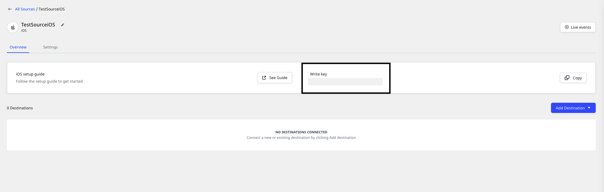

# iOS v2

The **RudderStack iOS SDK** lets you track the customer event data from your iOS, macOS, tvOS, and watchOS applications and send it to the specified destinations via RudderStack.

<div class="infoBlock">

<ul>
  <li>tvOS is supported in version <strong>1.1.0 and above</strong></li>
  <li>watchOS is supported from <strong>v1.3.1</strong></li>
  <li>macOS is supported in version <strong>2.0.0 and above</strong></li>
</ul>
</div>

<div class="infoBlock">

Refer to the <a href="https://github.com/rudderlabs/rudder-sdk-swift">GitHub codebase</a> to get a more hands-on understanding of the SDK.
</div>

<a href="https://cocoapods.org/pods/Rudder"> </a>


## SDK setup requirements

To set up the RudderStack iOS SDK, the following prerequisites must be met:

- Set up a [RudderStack account](https://app.rudderstack.com).
- Set up an iOS source in the dashboard. For more information, refer to the <Link to="/rudderstack-cloud/sources/">Sources</Link> guide.  You should then see a **Write Key** for this source, as shown:



- You also need a data plane URL. Follow <Link to="/rudderstack-cloud/dashboard-overview/#data-plane-url">Data plane URL</Link> section for more information on the data plane URL and where to get it.
- Finally, you will need a Mac with the latest version of [Xcode](https://developer.apple.com/xcode/).

## Installing the RudderStack iOS SDK

The RudderStack iOS SDK is distributed through [Cocoapods](https://cocoapods.org/pods/Rudder) and [Carthage](https://github.com/Carthage/Carthage).

<div class="successBlock">

The recommended and easiest way to add the SDK to your project is through <code class="inline-code">Podfile</code>.
</div>

Follow these steps to install the SDK depending on your preferred method:

<Tabs>
  <TabList>
    <Tab>CocoaPods</Tab>
    <Tab>Carthage</Tab>
  </TabList>
  <TabPanels>
    <TabPanel>
      <ol>
      <li>Add the SDK to your <code class="inline-code">Podfile</code>, as shown:
<span>

```ruby
pod 'Rudder', '~> 2.0.0'
```
</span>
      </li>
      <li>Then, run the following command:
<span>

```bash
pod install
```
</span>
      </li>
      </ol>
    </TabPanel>
    <TabPanel>
      <ol>
      <li>Add the SDK to your <code class="inline-code">Cartfile</code>, as shown:
<span>

```ruby
github "rudderlabs/rudder-sdk-ios"
```
</span>
      </li>
      <li>Then, run the following command:
<span>

```bash
carthage update
```
</span>
      </li>
      </ol>
    </TabPanel>
  </TabPanels>
</Tabs>

Remember to include the following code in all the `.m` and `.h` files (Objective-C) or the `.swift` files where you want to refer to or use the RudderStack SDK classes:

<Tabs>
  <TabList>
    <Tab>Objective-C</Tab>
    <Tab>Swift</Tab>
  </TabList>
    <TabPanels>
      <TabPanel>
<span>

```objectivec
@import Rudder;
```
</span>
      </TabPanel>
      <TabPanel>
<span>

```swift
import Rudder
```
</span>
      </TabPanel>
    </TabPanels>
</Tabs>

<div class="dangerBlock">

RudderStack uses <a href="https://sqlite.org/index.html">SQLite</a> to temporarily store the events before sending them to the data plane. Making calls which are not thread-safe, like <code class="inline-code">SQLite.shutdown()</code>, might lead to unexpected crashes.
</div>

## Initializing the RudderStack client

To initialize the RudderStack client, place the following code in your `AppDelegate.m` file under the `didFinishLaunchingWithOptions` method:

<Tabs>
  <TabList>
    <Tab>Objective-C</Tab>
    <Tab>Swift</Tab>
  </TabList>
    <TabPanels>
      <TabPanel>
<span>

```objectivec
RSConfig *config = [[RSConfig alloc] initWithWriteKey:WRITE_KEY];
[config dataPlaneURL:DATA_PLANE_URL];
[config trackLifecycleEvents:YES];
[config recordScreenViews:YES];

[[RSClient sharedInstance] configureWith:config];
```
</span>
A shared instance of <code class="inline-code">RSClient</code> is accessible after the initialization via <code class="inline-code">[RSClient sharedInstance]</code>.
      </TabPanel>
      <TabPanel>
<span>

```swift
let config: RSConfig = RSConfig(writeKey: WRITE_KEY)
                  .dataPlaneURL(DATA_PLANE_URL)
                  .trackLifecycleEvents(true)
                  .recordScreenViews(true)
        
RSClient.sharedInstance().configure(with: config)
```
</span>
A shared instance of <code class="inline-code">RSClient</code> is accesible after the initialization via <code class="inline-code">RSClient.sharedInstance()</code>
      </TabPanel>
    </TabPanels>
</Tabs>

<div class="infoBlock">

RudderStack automatically tracks the following <Link to="/rudderstack-api/api-specification/application-lifecycle-events-spec">application lifecycle events</Link>:
<ul>
<li><code class="inline-code">Application Installed</code></li>
<li><code class="inline-code">Application Updated</code></li>
<li><code class="inline-code">Application Opened</code></li>
<li><code class="inline-code">Application Backgrounded</code></li>
</ul>
You can disable these events using the <code class="inline-code">trackLifecycleEvents</code> method of <code class="inline-code">RSConfig</code> by passing <code class="inline-code">false</code>. However, it is highly recommended to keep them enabled.
</div>

## Configuring the RudderStack client

You can configure your client based on the following parameters using `RSConfig`:

| Parameter               | Type      | Description    | Default value      |
| :---------------------- | :-------- | :-------------- | :------- |
| `logLevel`     | `RSLogLevel`     | Controls how much of the log you want to see from the SDK.                | `RSLogLevel.none`                                                           |
| `dataPlaneUrl`          | String  | Your data plane URL.    | `https://hosted.rudderlabs.com` |
| `flushQueueSize`        | Integer     | Number of events in a batch request sent to the server.  | `30`   |
| `dbCountThreshold`      | Integer     | Number of events to be saved in the SQLite database. Once the limit is reached, older events are deleted from the database.    | `10000`                                                                    |
| `sleepTimeout`          | Integer     | Minimum waiting time to flush the events to the server.  | `10 seconds`    |
| `configRefreshInterval` | Integer     | The SDK fetches the config from dashboard after this specified time.    | `2 hours`  |
| `trackLifecycleEvents`  | Boolean | Determines if the SDK will capture application life cycle events automatically.    | `true`    |
| `recordScreenViews`     | Boolean | Determines if the SDK will capture will capture screen view events automatically.   | `false`   |
| `controlPlaneUrl`       | String  | This parameter should be changed **only if** you are self-hosting the control plane. Refer to the <Link to="/stream-sources/rudderstack-sdk-integration-guides/rudderstack-swift-sdk/#self-hosted-control-plane">Self-hosted control plane</Link> section below for more information. The SDK will add `/sourceConfig` along with this URL to fetch the required configuration. | `https://api.rudderlabs.com`   |

### Self-hosted control plane

If you are using a device mode destination like Adjust, Firebase, etc., the SDK needs to fetch the required configuration from the control plane. If you are using the <Link to="/rudderstack-open-source/control-plane-lite">Control Plane Lite</Link> utility to host your own control plane, then follow <Link to="/rudderstack-open-source/control-plane-lite/#control-plane-url">this section</Link> to specify `controlPlaneUrl` in `RSConfig` that points to your hosted source configuration file.

<div class="warningBlock">

You should not pass the <code class="inline-code">controlPlaneUrl</code> parameter during the SDK initialization if you are using <a href="https://app.rudderstack.com">RudderStack Cloud</a>. This parameter is supported only if you are self-hosting the control plane using the <Link to="/rudderstack-open-source/control-plane-lite">Control Plane Lite</Link> utility.
</div>

## Supported API calls

The iOS SDK supports all the API calls specified in the <Link to="/rudderstack-api/api-specification/rudderstack-spec/">RudderStack Events Spec</Link> guide. These include `identify`, `track`, `screen`,  `group`, `alias`, and `reset` calls.

## Identify

The <Link to="/rudderstack-api/api-specification/rudderstack-spec/identify"><code class="inline-code">identify</code></Link> call lets you identify a visiting user and associate them to their actions. It also lets you record the traits about them like their name, email address, etc. Once you identify the user, the SDK persists all the user information and passes it on to the subsequent `track` or `screen` calls. To reset the user identification, you can use the `reset` method.

<div class="infoBlock">

RudderStack captures <code class="inline-code">deviceId</code> and uses that as <code class="inline-code">anonymousId</code> for identifying unknown users. This helps in tracking the users across the application installation.
</div>

<div class="infoBlock">

According to the <a href="https://developer.apple.com/documentation/uikit/uidevice/1620059-identifierforvendor">Apple documentation</a>, if a device has multiple apps from the same vendor, all the apps will be assigned the same <code class="inline-code">deviceId</code>. If all the applications from the vendor are uninstalled, then a new <code class="inline-code">deviceId</code> will be assigned to the apps on the next install.
</div>

An sample `identify` call is shown below:

<Tabs>
  <TabList>
    <Tab>Objective-C</Tab>
    <Tab>Swift</Tab>
  </TabList>
    <TabPanels>
      <TabPanel>
<span>

```objectivec
[[RSClient sharedInstance] identify:@"user_id" traits:@{@"email": @"alex@example.com"}];
```
</span>
      </TabPanel>
      <TabPanel>
<span>

```swift
RSClient.sharedInstance().identify("user_id", traits: ["email": "alex@example.com"])
```
</span>
      </TabPanel>
    </TabPanels>
</Tabs>

The `identify` method accepts the following parameters:

| Name      | Data type      | Presence | Description         |
| :-------- | :------------- | :------- | :--------------------------- |
| `userId`  | `NSString`     | Required      | Uniquely identifies the visiting user.   |
| `traits`  | `NSDictionary` | Optional       | Information on the user traits. Use the `dict` method of `RudderTraits` to convert to `NSDictionary` easily. |
| `option` | `RSOption` | Optional       | Extra options for the `identify` event.      |

### Setting your own `anonymousId`

By default, RudderStack uses the `deviceId` as `anonymousId`. To set your own `anonymousId`, you can use the `setAnonymousId` method as shown:

<Tabs>
  <TabList>
    <Tab>Objective-C</Tab>
    <Tab>Swift</Tab>
  </TabList>
    <TabPanels>
      <TabPanel>
<span>

```objectivec
[client setAnonymousId:@"new_anonymous_id"];
```
</span>
      </TabPanel>
      <TabPanel>
<span>

```swift
RSClient.sharedInstance().setAnonymousId("new_anonymous_id")
```
</span>
      </TabPanel>
    </TabPanels>
</Tabs>

### Setting an external ID

You can pass your custom `userId` along with the standard `userId` in your `identify` calls. RudderStack adds these values under `context.externalId`. 

The following code snippet highlights how you can add `externalId` to your `identify` requests:

<Tabs>
  <TabList>
    <Tab>Objective-C</Tab>
    <Tab>Swift</Tab>
  </TabList>
    <TabPanels>
      <TabPanel>
<span>

```objectivec
RSOption *eventOption = [[RSOption alloc] init];
[eventOption putExternalId:@"brazeExternalId" withId:@"some_external_id_1"];
    
[[RSClient sharedInstance] identify:@"user_id" traits:@{@"email": @"alex@example.com"} option:eventOption];
```
</span>
      </TabPanel>
      <TabPanel>
<span>

```swift
let messageOption = RSOption()
messageOption.putExternalId("brazeExternalId", withId: "some_external_id_1")

RSClient.sharedInstance().identify("user_id", traits: ["email": "alex@example.com"], option: messageOption)
```
</span>
      </TabPanel>
    </TabPanels>
</Tabs>

## Track

The <Link to="/rudderstack-api/api-specification/rudderstack-spec/track"><code class="inline-code">track</code></Link> call lets you record the user events along with any properties associated with them.

A sample `track` event is shown below:

<Tabs>
  <TabList>
    <Tab>Objective-C</Tab>
    <Tab>Swift</Tab>
  </TabList>
    <TabPanels>
      <TabPanel>
<span>

```objectivec
[[RSClient sharedInstance] track:@"sample_track_event" properties:@{
    @"key_1": @"value_1",
    @"key_2": @"value_2"
}];
```
</span>
      </TabPanel>
      <TabPanel>
<span>

```swift
RSClient.sharedInstance().track("sample_track_event", properties: [
    "key_1": "value_1",
    "key_2": "value_2"
])
```
</span>
      </TabPanel>
    </TabPanels>
</Tabs>


The `track` method accepts the following parameters:

| Name         | Data type      | Presence | Description                                                 |
| :----------- | :------------- | :------- | :---------------------------------------------------------- |
| `eventName`  | `NSString`     | Required      | Name of the tracked event.                         |
| `properties` | `NSDictionary` | Optional       | Extra data properties to be sent along with the event. |
| `option`    | `RSOption` | Optional       | Extra event options.                                         |

## Screen

The <Link to="/rudderstack-api/api-specification/rudderstack-spec/screen"><code class="inline-code">screen</code></Link> call lets you record whenever a user views their mobile screen, with any additional relevant information about the screen.

A sample `screen` event is as shown:

<Tabs>
  <TabList>
    <Tab>Objective-C</Tab>
    <Tab>Swift</Tab>
  </TabList>
    <TabPanels>
      <TabPanel>
<span>

```objectivec
[[RSClient sharedInstance] screen:@"ViewController" category:NULL properties:@{
  @"key_1": @"value_1",
  @"key_2": @"value_2"
} 
options:NULL];
```
</span>
      </TabPanel>
      <TabPanel>
<span>

```swift
RSClient.sharedInstance().screen("ViewController", properties: [
    "key_1": "value_1",
    "key_2": "value_2"
])
```
</span>
      </TabPanel>
    </TabPanels>
</Tabs>

The `screen` method accepts the following parameters:

| Name         | Data type      | Presence | Description                                                              |
| :----------- | :------------- | :------- | :--------------------------------------------- |
| `screenName` | `NSString`     | Required      | Name of the screen viewed by the user.     |
| `properties` | `NSDictionary` | Optional       | Extra property object to be passed along with the `screen` call. |
| `option`    | `RSOption` | Optional       | Extra options to be passed along with the `screen` call.     |

## Group

The <Link to="/rudderstack-api/api-specification/rudderstack-spec/group"><code class="inline-code">group</code></Link> call lets you link an identified user with a group like a company, organization, or an account. It also lets you record any traits associated with that group, like the name of the company, number of employees, etc.

A sample `group` call is shown below:

<Tabs>
  <TabList>
    <Tab>Objective-C</Tab>
    <Tab>Swift</Tab>
  </TabList>
    <TabPanels>
      <TabPanel>
<span>

```objectivec
[[RSClient sharedInstance] group:@"sample_group_id" traits:@{
  @"key_1": @"value_1",
  @"key_2": @"value_2"
} 
options:NULL];
```
</span>
      </TabPanel>
      <TabPanel>
<span>

```swift
RSClient.sharedInstance().group("sample_group_id", traits: [
  "key_1": "value_1",
  "key_2": "value_2"
])
```
</span>
      </TabPanel>
    </TabPanels>
</Tabs>

The `group` method accepts the following parameters:

| Name      | Data type      | Presence | Description                |
| :-------- | :------------- | :------- | :------------------------------------ |
| `groupId` | `String`       | Required      | The unique identifier of the group with which you want to associate your user.        |
| `traits`  | `NSDictionary` | Optional       | Any other property of the organization you want to pass along with the call. |
| `option` | `RSOption` | Optional       | Extra event-level options to be passed along with the `group` call.              |

<div class="warningBlock">

The iOS SDK does not persist the group traits across the sessions.
</div>

## Alias

The <Link to="/rudderstack-api/api-specification/rudderstack-spec/alias"><code class="inline-code">alias</code></Link> call associates the user with a new identification. A sample `alias` call is shown below:

<Tabs>
  <TabList>
    <Tab>Objective-C</Tab>
    <Tab>Swift</Tab>
  </TabList>
    <TabPanels>
      <TabPanel>
<span>

```objectivec
[[RSClient sharedInstance] alias:@"new_user_id" options:NULL];
```
</span>
      </TabPanel>
      <TabPanel>
<span>

```swift
RSClient.sharedInstance().alias("new_user_id")
```
</span>
      </TabPanel>
    </TabPanels>
</Tabs>

Alternatively, you can use the following method signature:

| Name      | Data type      | Presence | Description                                     |
| :-------- | :------------- | :------- | :---------------------------------------------- |
| `newId`   | `String`       | Required      | The new `userId` you want to assign to the user. |
| `option` | `RSOption` | Optional       | Event-level options.                              |

<div class="infoBlock">

RudderStack replaces the old <code class="inline-code">userId</code> with the <code class="inline-code">newUserId</code> and persists that identification across the sessions.
</div>

## Reset

You can use the `reset` method to clear the persisted user traits from the `identify` call. This is required for the user logout operation.

<Tabs>
  <TabList>
    <Tab>Objective-C</Tab>
    <Tab>Swift</Tab>
  </TabList>
    <TabPanels>
      <TabPanel>
<span>

```objectivec
[[RSClient sharedInstance] reset];
```
</span>
      </TabPanel>
      <TabPanel>
<span>

```swift
RSClient.sharedInstance().reset()
```
</span>
      </TabPanel>
    </TabPanels>
</Tabs>

## Enabling/disabling user tracking via the `setOptOutStatus` API (GDPR support)

RudderStack gives the users (for example, an EU user) the ability to opt out of tracking any user activity until they give their consent. You can do this by leveraging RudderStack's `setOptOutStatus` API.

The `setOptOutStatus` API takes `YES`/`NO` (Objective-C) or `true`/`false` (Swift) as a Boolean value to enable or disable the user tracking activities. This flag persists across device reboots.

<div class="infoBlock">

You need to call the <code class="inline-code">setoptOutStatus</code> API with the relevant parameter only once, as the information persists within the device even if you reboot it.
</div>

The following snippet highlights the use of the `setoptOutStatus` API to disable user tracking:

<Tabs>
  <TabList>
    <Tab>Objective-C</Tab>
    <Tab>Swift</Tab>
  </TabList>
    <TabPanels>
      <TabPanel>
<span>

```objectivec
[[RSClient sharedInstance] setOptOutStatus:YES];
```
</span>
      </TabPanel>
      <TabPanel>
<span>

```swift
RSClient.sharedInstance().setOptOutStatus(true)
```
</span>
      </TabPanel>
    </TabPanels>
</Tabs>

Once the user grants their consent, you can enable user tracking once again using the `setOptOutStatus` API by passing `NO` or `false`, as shown:

<Tabs>
  <TabList>
    <Tab>Objective-C</Tab>
    <Tab>Swift</Tab>
  </TabList>
    <TabPanels>
      <TabPanel>
<span>

```objectivec
[[RSClient sharedInstance] setOptOutStatus:NO];
```
</span>
      </TabPanel>
      <TabPanel>
<span>

```swift
RSClient.sharedInstance().setOptOutStatus(false)
```
</span>
      </TabPanel>
    </TabPanels>
</Tabs>

## Setting the device token for push notifications

To pass push notifications to the destinations that support it, you can pass your device token using the `setDeviceToken` method, as shown:

<Tabs>
  <TabList>
    <Tab>Objective-C</Tab>
    <Tab>Swift</Tab>
  </TabList>
    <TabPanels>
      <TabPanel>
<span>

```objectivec
[[RSClient sharedInstance] setDeviceToken:@"example_device_token"];
```
</span>
      </TabPanel>
      <TabPanel>
<span>

```swift
RSClient.sharedInstance().setDeviceToken("example_device_token")
```
</span>
      </TabPanel>
    </TabPanels>
</Tabs>

<div class="infoBlock">

RudderStack sets the device token under <code class="inline-code">context.device.token</code>.
</div>

## Setting the advertisement ID

RudderStack separates the IDFA collection from the core library so that you have better control over it. 

You can pass the IDFA to the `setAdvertisementId` method to set it under `context.device.advertisingId`, as shown:

<Tabs>
  <TabList>
    <Tab>Objective-C</Tab>
    <Tab>Swift</Tab>
  </TabList>
    <TabPanels>
      <TabPanel>
<span>

```objectivec
[[RSClient sharedInstance] setAdvertisingId:[self getIDFA]];

- (NSString*)getIDFA {
    return [[[ASIdentifierManager sharedManager] advertisingIdentifier] UUIDString];
}
```
</span>
      </TabPanel>
      <TabPanel>
<span>

```swift
RSClient.sharedInstance().setAdvertisingId(getIDFA())

func getIDFA() -> String {
		return ASIdentifierManager.shared().advertisingIdentifier.uuidString
}
```
</span>
      </TabPanel>
    </TabPanels>
</Tabs>

## `ATTrackingManager` authorization consent

You can pass [`ATTrackingManager.trackingAuthorizationStatus`](https://developer.apple.com/documentation/apptrackingtransparency/attrackingmanager/3547038-trackingauthorizationstatus) to RudderStack and it is passed along to the relevant destinations as configured. 

For example, AppsFlyer accepts this parameter for the attribution to work in their [server-to-server events flow](https://support.appsflyer.com/hc/en-us/articles/207034486-Server-to-server-events-API-for-mobile-S2S-mobile-#att-3).

<Tabs>
  <TabList>
    <Tab>Objective-C</Tab>
    <Tab>Swift</Tab>
  </TabList>
    <TabPanels>
      <TabPanel>
<span>

```objectivec
[[RSClient sharedInstance] setAppTrackingConsent:RSAppTrackingConsentAuthorize];
```
</span>
      </TabPanel>
      <TabPanel>
<span>

```swift
RSClient.sharedInstance().setAppTrackingConsent(.authorize)
```
</span>
      </TabPanel>
    </TabPanels>
</Tabs>

You can pass the following options to the `setAppTrackingConsent` method to set the relevant authorization consent:

- `RSATTNotDetermined`
- `RSATTRestricted`
- `RSATTDenied`
- `RSATTAuthorize`

## Filtering device mode events

When sending events to a destination via the <Link to="/rudderstack-cloud/rudderstack-connection-modes/#device-mode">device mode</Link>, you can explicitly specify which events should be discarded or allowed to flow through - by whitelisting or blacklisting them.

<div class="infoBlock">

Refer to the <Link to="stream-sources/rudderstack-sdk-integration-guides/event-filtering/">Client-side Event Filtering</Link> guide for more information on this feature.
</div>

## Enabling/disabling events for specific destinations

The RudderStack iOS SDK lets you enable or disable event flow to a specific destination or all the destinations to which the source is connected. You can specify these destinations by creating a `RSOption` object as shown:

<Tabs>
  <TabList>
    <Tab>Objective-C</Tab>
    <Tab>Swift</Tab>
  </TabList>
    <TabPanels>
      <TabPanel>
<span>

```objectivec
RSOption *option = [[RSOption alloc]init];
//default value for `All` is true
[option putIntegration:@"All" isEnabled:YES];
// specifying destination by its display name
[option putIntegration:@"Amplitude" isEnabled:YES];
[option putIntegration:@"<DESTINATION_DISPLAY_NAME>" isEnabled:<BOOLEAN>];
```
</span>
      </TabPanel>
      <TabPanel>
<span>

```swift
let option:RSOption = RSOption();
//default value for `All` is true
option.putIntegration("All", isEnabled:true)
// specifying destination by its display name
option.putIntegration("Amplitude", isEnabled:true)
option.putIntegration(<DESTINATION_DISPLAY_NAME>, isEnabled:<BOOLEAN>)
```
</span>
      </TabPanel>
    </TabPanels>
</Tabs>

<div class="infoBlock">

The keyword <code class="inline-code">All</code> in the above snippet represents all the destinations the source is connected to. The SDK sets its value to <code class="inline-code">true</code> by default.
</div>

<div class="infoBlock">

Make sure the <code class="inline-code">DESTINATION_DISPLAY_NAME</code> you specify above should exactly match the destination name as shown in the <a href="https://app.rudderstack.com/directory">RudderStack dashboard</a>.
</div>

You can pass the destinations specified to the SDK in the following two ways:

### Method 1: Passing destinations while initializing the SDK

This approach is helpful when you want to enable/disable sending the events to the destinations **across all the event calls** made using the SDK.

<Tabs>
  <TabList>
    <Tab>Objective-C</Tab>
    <Tab>Swift</Tab>
  </TabList>
    <TabPanels>
      <TabPanel>
<span>

```objectivec
RSOption *defaultOption = [[RSOption alloc] init];
[defaultOption putIntegration:@"Amplitude" isEnabled:YES];

[[RSClient sharedInstance] setOption:defaultOption];
```
</span>
      </TabPanel>
      <TabPanel>
<span>

```swift
let defaultOption = RSOption()
defaultOption.putIntegration("Amplitude", isEnabled: true)

RSClient.sharedInstance().setOption(defaultOption)
```
</span>
      </TabPanel>
    </TabPanels>
</Tabs>

### Method 2. Passing destinations while making event calls

This approach is helpful when you want to enable/disable sending only specific events to the destinations.

<Tabs>
  <TabList>
    <Tab>Objective-C</Tab>
    <Tab>Swift</Tab>
  </TabList>
    <TabPanels>
      <TabPanel>
<span>

```objectivec
RSOption *eventOption = [[RSOption alloc] init];
[eventOption putIntegration:@"Amplitude" isEnabled:YES];

[[RSClient sharedInstance] track:@"sample_track" properties:@{@"key_1": @"value_1", @"key_2": @"value_2"} option:eventOption];
```
</span>
      </TabPanel>
      <TabPanel>
<span>

```swift
let eventOption = RSOption()
eventOption.putIntegration("MoEngage", isEnabled: true)

RSClient.sharedInstance().track("sample_track", option: eventOption)
```
</span>
      </TabPanel>
    </TabPanels>
</Tabs>

<div class="warningBlock">

If you use the <code class="inline-code">RSOption</code> object to specify the destinations both while initializing the SDK as well as making an event call, then RudderStack will consider only the destinations specified at the event level.
</div>

## Debugging

If you run into any issues regarding the RudderStack iOS SDK, you can enable `VERBOSE` or `DEBUG` logging to determine the issue. 

To enable the logging, change your `RSClient` initialization as shown:

<Tabs>
  <TabList>
    <Tab>Objective-C</Tab>
    <Tab>Swift</Tab>
  </TabList>
    <TabPanels>
      <TabPanel>
<span>

```objectivec
RSConfig *config = [[RSConfig alloc] initWithWriteKey:WRITE_KEY];
[config dataPlaneURL:DATA_PLANE_URL];
[config loglevel:RSLogLevelDebug];

[[RSClient sharedInstance] configureWith:config];
```
</span>
      </TabPanel>
      <TabPanel>
<span>

```swift
let config: RSConfig = RSConfig(writeKey: WRITE_KEY)
            .dataPlaneURL(DATA_PLANE_URL)
            .loglevel(.debug)
        
RSClient.sharedInstance().configure(with: config)
```
</span>
      </TabPanel>
    </TabPanels>
</Tabs>

## Adding Chromecast support

[Google Chromecast](https://store.google.com/in/product/chromecast?hl=en-GB) is a device that plugs into your TV or monitor with an HDMI port, and can be used to stream content from your phone or computer.

<div class="successBlock">

RudderStack supports integrating the iOS SDK with your Cast app. Follow <a href="https://developers.google.com/cast/docs/ios_sender">these instructions</a> to build your iOS sender app. Then, add the iOS SDK to it.
</div>

<div class="infoBlock">

  Follow the <a href="https://developers.google.com/cast/docs/developers">Google Cast developer guide</a> for more details.
</div>

## Developing a device mode destination

This section details the steps required to develop a device mode destination in case RudderStack doesn't support it already.

<div class="infoBlock">

More information on the RudderStack device mode can be found in the <Link to="/rudderstack-cloud/rudderstack-connection-modes">Connection Modes</Link> guide.
</div>

1. Create a `RSCustomDestination.swift` file by extending `RSDestinationPlugin`, as shown:

```swift
class RSCustomDestination: RSDestinationPlugin {
    var key: String = "Custom"
    var controller = RSController()
    var type: PluginType = .destination
    var RSClient.sharedInstance(): RSClient?
    
    func update(serverConfig: RSServerConfig, type: UpdateType) {
        guard type == .initial else { return }
        // Some code
    }
    
    func track(message: TrackMessage) -> TrackMessage? {
        // Some code
        return message
    }
    
    func identify(message: IdentifyMessage) -> IdentifyMessage? {
        // Some code
        return message
    }
    
    func screen(message: ScreenMessage) -> ScreenMessage? {
        // Some code
        return message
    }
    
    func group(message: GroupMessage) -> GroupMessage? {
        // Some code
        return message
    }
    
    func alias(message: AliasMessage) -> AliasMessage? {
        // Some code
        return message
    }
    
    func flush() {
        // Some code
    }
    
    func reset() {
        // Some code
    }
}
```

2. Then, create a `CustomDestination` class file by extending `RudderDestination` and initialize `RSCustomDestination` inside `init()`, as shown:

```swift
@objc
class CustomDestination: RudderDestination {
    override init() {
        super.init()
        plugin = RSCustomDestination()
    }
}
```

3. For Objective-C projects, a dialog box will appear while creating the Swift file - asking you to create a bridging header if it does not exist already. In this case, choose **Create Bridging Header**. This creates a `<PROJECT_MODULE_NAME>-Bridging-Header.h` file. 

4. After creating the Bridging Header, search **Objective-C Generated Interface Header Name** in **Build Settings** and keep the header name handy. This should be something like `<PROJECT_MODULE_NAME>-Swift.h`. 

5. Finally, add the `CustomDestination` with the RudderStack iOS SDK after its initialization, as shown:

<Tabs>
  <TabList>
    <Tab>Swift</Tab>
    <Tab>Objective-C</Tab>
  </TabList>
    <TabPanels>
      <TabPanel>
<span>

```swift
RSClient.sharedInstance().addDestination(CustomDestination())
```
</span>
      </TabPanel>
      <TabPanel>
<span>

```objectivec
#import "<PROJECT_MODULE_NAME>-Swift.h"

[client addDestination:[[CustomDestination alloc] init]];
```
</span>
      </TabPanel>
    </TabPanels>
</Tabs>

## FAQ

### I'm facing issues building with Carthage on XCode 12. What should I do?

If you're facing an issue with Carthage and XCode 12, you can follow [this workaround](https://github.com/Carthage/Carthage/blob/master/Documentation/Xcode12Workaround.md) suggested by the Carthage team.

### Does the iOS SDK support the tvOS, macOS, and watchOS platforms?

Yes, the iOS SDK supports tvOS and watchOS platforms. Refer to the table below for the version details:

| Platform | Supported SDK version  |
| :--------| :----------------|
| [tvOS](https://developer.apple.com/tvos/) | 1.1.0 and above|
| [watchOS](https://developer.apple.com/watchos/) | 1.3.0 and above|
| [macOS](https://developer.apple.com/macos/) | 2.0.0 and above |

### How do I migrate from an older SDK version (v1.x) to the current version?

To migrate from the older SDK versions, update the usage of the following classes:

| Previous Name | Updated Name |
| :---------------| :---------------|
| `RudderClient` | `RSClient`       |
| `RudderConfig`| `RSConfig`     |
| `RudderLogLevelDebug` | `RSLogLevelDebug` |

### How can I get the user `traits` after making the `identify` call?

You can get the user traits after making an `identify` call in the following way:

<Tabs>
  <TabList>
    <Tab>Swift</Tab>
    <Tab>Objective-C</Tab>
  </TabList>
    <TabPanels>
      <TabPanel>
<span>

```swift
let traits = RSClient.sharedInstance().traits
```
</span>
      </TabPanel>
      <TabPanel>
<span>

```objectivec
NSDictionary *traits = client.traits;
// or
NSDictionary *traits = [client traits];
```
</span>
      </TabPanel>
    </TabPanels>
</Tabs>

### How does the SDK handle different client/server errors?

In case of client-side errors, for example, if the source write key passed to the SDK is incorrect, RudderStack gives a **400 Bad Request** response and aborts the operation immediately. For other types of network errors, for example, invalid data plane URL, the SDK tries to flush the events to RudderStack in an incremental manner (every 1 second, 2 seconds, 3 seconds, and so on).

### Why is there a difference between `timestamp` and `received_at` for iOS events vs. Android events sent at the same time?

This scenario is most likely caused by the default behavior of iOS apps staying open in the background for a short period of time after a user closes them.

When a user closes an iOS or Android app, the events will still continue to be sent from the queue until the app closes in the background. Any events still in the queue will be retained until the user reopens the app. Due to this lag, there are some scenarios where there can be significant differences between `timestamp` (when the event was created) and `received_at` (when RudderStack actually receives the event).

For Android apps, events can be sent from the background after apps close for a longer period of time than iOS apps, therefore, more of the events coming from the Android SDK have closer `timestamp` and `received_at` times.

### Does RudderStack integrate with SKAdNetwork?

RudderStack does not integrate with SKAdNetwork. However, SKAdNetwork can be directly integrated into an iOS application alongside RudderStack.

### Can I disable event tracking until the user gives their consent?

Yes, you can. Refer to the <Link to="#enablingdisabling-user-tracking-via-the-setoptoutstatus-api-gdpr-support">Enabling/disabling user tracking via the `setOptOutStatus` API</Link> section for more information.

## Contact us

For queries on any of the sections covered in this guide, you can [contact us](mailto:%20docs@rudderstack.com), or start a conversation in our [Slack](https://rudderstack.com/join-rudderstack-slack-community/) community. You can also open a new issue on the SDK's [GitHub page](https://github.com/rudderlabs/rudder-sdk-ios/issues/new).
